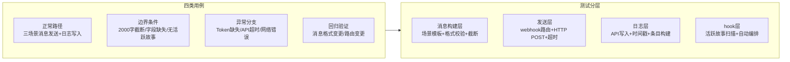

> | v1.0.0 | 2026-05-26 | deepseek-v4-pro | 🌿 feat/rui-bot | 📎 [CLAUDE.md](../../../CLAUDE.md) |

> **导航**: [← 技术评审](./技术评审.md) · [安全审计 →](./安全审计.md)

> **来源引用**: 由 `/rui doc rui-bot` 触发，基于故事任务 §5 AC + 使用场景 + 技术评审 §2 消息格式生成。证据 Level B + 规约路径。

[§0 基线溯源](#sec0-baseline) · [§1 测试策略](#sec1-strategy) · [§2 测试范围](#sec2-scope) · [§3 测试用例](#sec3-cases) · [§4 Gate A 交接信号](#sec4-gate-a) · [§5 测试环境](#sec5-env)

---

### 主要价值

- 🎯 AC 全覆盖 — 每条 AC 至少 1 个测试用例，覆盖正常/边界/异常/回归四类
- 🔒 Gate A 交接信号完整 — P0 用例 ID + 验证命令明确，确保测试先行门禁可执行
- ⚡ 三场景消息覆盖 — 完成/阻断/门禁失败三种消息格式独立验证
- 📊 降级路径全覆盖 — Token 缺失、API 不可用、无活跃故事等降级场景逐条验证

---

## §0 基线溯源

| TC# | 覆盖 AC# | 覆盖场景 | 覆盖类型 | 状态 |
|-----|---------|---------|---------|------|
| TC-N1, TC-N2 | AC1 | 场景 1: 管线完成通知 | 正常 | 待验证 |
| TC-N3, TC-N4 | AC2 | 场景 2: 管线阻断通知 | 正常 | 待验证 |
| TC-N5 | AC3 | 场景 3: 门禁失败通知 | 正常 | 待验证 |
| TC-N6 | AC8 | 场景 4: 空输入诊断 | 正常 | 待验证 |
| TC-B1 | AC5 | 场景 1, 2, 3 | 边界 | 待验证 |
| TC-B2, TC-B3 | AC6, AC7 | 场景 1, 2, 3 | 边界 | 待验证 |
| TC-E1, TC-E2 | AC4 | 场景 1, 2, 3 | 异常 | 待验证 |
| TC-E3 | AC1 | 场景 1 | 异常 | 待验证 |

---

## §1 测试策略

| 测试目标 | 方法 | 关键验证点 |
|---------|------|-----------|
| 消息格式正确性 | 构建后检查消息字符串 | emoji:value 格式、字段齐全、长度 ≤2000 |
| 企微发送可达性 | POST 后检查 HTTP 状态码 | 200-299 成功、超时处理、错误不传播 |
| 日志持久化 | API 写入后查询 sessions 集合 | 条目存在、时间戳格式正确、内容完整 |
| 降级不阻断 | Mock Token 缺失/API 不可用 | 退出码 0、管线不中断 |
| hook 自动触发 | 模拟管线完成/阻断信号 | hook-log 和 hook-notify 按序执行 |

---

## §2 测试范围

| 模块 | 测试重点 | 用例数 | 门禁 |
|------|---------|--------|------|
| 消息构建 | 三场景模板 + 格式校验 + 长度截断 + 字段默认值 | 5 | Gate A |
| 企微发送 | webhook 路由 + HTTP POST + 超时 + 错误报告 | 4 | Gate A |
| 通知日志 | API create_document 调用 + 条目格式 | 3 | Gate A |
| hook 触发器 | 活跃故事扫描 + 自动编排 + 降级处理 | 4 | Gate B |
| 空输入诊断 | 三态检测 + 推荐任务生成 | 2 | Gate A |

---

## §3 测试用例

### §3.1 消息构建模块 — 正常路径

| ID | Given | When | Then | 关联 FP | 优先级 |
|----|-------|------|------|---------|--------|
| TC-N1 | 管线完成，有完整的管线状态数据（技能名、命令、结论、描述、范围、影响、证据、会话时长） | 调用 message.build("complete", state) | 返回消息字符串，首行为 `【项目名】`，含全部必填字段（🤖技能 📋命令 🎯结论 📝描述 📌范围 👉下一步 🌐影响 📎证据 ⏱️会话），总长度 ≤ 2000 | FP3 | P0 |
| TC-N2 | 管线完成，有文件变更列表（≤10 个文件） | 调用 message.build("complete", state, files) | 消息明细段列出全部文件，格式为"变更文件: path1 (操作, 行数), path2 (操作, 行数)..." | FP3 | P0 |
| TC-N3 | 管线阻断，state.blocked = true，含 block_reason 和 current_stage | 调用 message.build("block", state) | 消息含 ❌原因 和 🧭恢复点 字段，结论字段含"阻断"关键词 | FP3 | P0 |
| TC-N4 | 管线阻断，block_reason 为空 | 调用 message.build("block", state) | ❌原因 字段值为"见 rui-state.json"，不抛异常 | FP3 | P1 |
| TC-N5 | Gate A 失败，门禁名称为"skip-gate-a" | 调用 message.build("gate-fail", state) | 消息含 🔍门禁 字段（值为 Gate A）和 📊结果 字段（含失败原因） | FP3 | P0 |

### §3.2 消息构建模块 — 边界条件

| ID | Given | When | Then | 关联 FP | 优先级 |
|----|-------|------|------|---------|--------|
| TC-B1 | 消息内容原始长度 2500 字符，明细段含 50 个文件 + 完整错误日志 | 调用 message.build("complete", state) | 返回消息 ≤ 2000 字符；错误日志截取前 20 行；文件列表显示为"变更文件: 50 个文件（新增: N, 修改: M, 删除: K）" | FP3 | P0 |
| TC-B2 | name 参数为空字符串 | 调用 hook-log 扫描 | 跳过日志写入，exit 0，不报错 | FP7, FP2 | P1 |
| TC-B3 | docs/故事任务面板/ 下无 rui-state.json 在最近 1h 内更新 | 调用 hook-log 扫描 | 输出"无活跃故事"，exit 0，静默跳过 | FP7, FP8 | P1 |
| TC-B4 | 消息字段列表缺少可选字段（如 👉下一步） | 调用 message.build("complete", state) | 该字段不出现在消息中，不抛异常，其他字段正常输出 | FP3 | P1 |

### §3.3 企微发送模块 — 异常分支

| ID | Given | When | Then | 关联 FP | 优先级 |
|----|-------|------|------|---------|--------|
| TC-E1 | API_X_TOKEN 环境变量不存在 | 调用 send(content, { noSend: false }) | 输出"API_X_TOKEN 未配置，跳过发送"，exit 0，不阻断 | FP6, FP8 | P0 |
| TC-E2 | webhook URL 解析结果为空字符串 | 调用 send(content) | 输出"webhook URL 未配置，跳过发送"，exit 0，不阻断 | FP4 | P0 |
| TC-E3 | 企微 API 返回 HTTP 500 | 调用 send(content) | 等待 ≤30s，收到 500 后输出错误到 stderr，exit 0，不阻断管线 | FP1 | P1 |
| TC-E4 | 企微 API 连接超时（超过 30s） | 调用 send(content) | 30s 后超时，输出超时错误到 stderr，exit 0，不阻断管线 | FP1 | P1 |

### §3.4 通知日志模块 — 正常/异常

| ID | Given | When | Then | 关联 FP | 优先级 |
|----|-------|------|------|---------|--------|
| TC-N6 | name 参数为 "rui-bot"，content 非空 | 调用 log.append(name, content) | POST create_document API，sessions 集合新增一条记录，时间戳格式为 `【YYYY-MM-DD HH:mm:ss】`，正文含首行 `【YrY】` | FP2 | P1 |
| TC-E5 | 通知日志 API 返回 HTTP 503 | 调用 log.append(name, content) | 输出错误到 stderr，exit 0，不阻断管线 | FP2 | P1 |
| TC-E6 | name 参数为 "rui-bot"，content 为空字符串 | 调用 log.append(name, content) | 跳过日志写入（空内容无意义），不报错 | FP2 | P2 |

### §3.5 hook 触发器模块

| ID | Given | When | Then | 关联 FP | 优先级 |
|----|-------|------|------|---------|--------|
| TC-N7 | 管线完成信号，活跃故事存在，API_X_TOKEN 和 webhook URL 已配置 | 管线末端触发 hook | hook-log 先执行（日志写入），rui-import 中间执行（同步），hook-notify 后执行（企微发送），三步按序不跳序 | FP7, FP8 | P0 |
| TC-N8 | 管线完成信号，活跃故事存在，API_X_TOKEN 缺失 | 管线末端触发 hook | hook-log 成功写入日志，hook-notify 静默跳过，两步均 exit 0 | FP7, FP8 | P0 |
| TC-B5 | 管线完成信号，多个故事在最近 1h 内活跃 | hook-log 扫描 | 仅取 timestamp 最新的一条，不重复处理 | FP7 | P1 |

### §3.6 空输入诊断模块

| ID | Given | When | Then | 关联 FP | 优先级 |
|----|-------|------|------|---------|--------|
| TC-N9 | 执行空命令，API_X_TOKEN 已配置，内置配置就绪 | 调用 diag.run() | 输出三态检测摘要：token 存在、内置配置就绪、日志状态，推荐定期巡检 | FP5 | P2 |
| TC-N10 | 执行空命令，API_X_TOKEN 缺失 | 调用 diag.run() | 输出 token 缺失警告，推荐检查环境变量配置 | FP5 | P2 |

---

## §4 Gate A 交接信号

| P0 用例 ID | 验证命令 | 预期结果 | 阻断条件 |
|-----------|---------|---------|---------|
| TC-N1 | 模拟管线完成状态，调用 message.build("complete", state) | 返回含全部必填字段的有效消息字符串 | 消息为空或缺少必填字段 |
| TC-N3 | 模拟管线阻断状态，调用 message.build("block", state) | 消息含 ❌原因 和 🧭恢复点 字段 | 阻断消息缺少原因或恢复点字段 |
| TC-B1 | 构造 2500 字符消息，调用 message.build | 返回消息 ≤ 2000 字符，明细段正确截断 | 返回消息超过 2000 字符 |
| TC-E1 | 取消设置 API_X_TOKEN，调用 send | exit 0，输出 token 缺失信息 | exit ≠ 0 或抛异常 |

---

## §5 测试环境

| 需求 | 说明 |
|------|------|
| Node.js | 运行 send.mjs/log.mjs/message.mjs/hook.mjs/diag.mjs |
| API_X_TOKEN | 可选（缺失测试降级路径），设置时用测试 token |
| WEWORK_BOT_API_URL | 可选（覆盖默认 apiUrl） |
| 企微 webhook URL | 可选（缺失测试降级路径），设置时用测试 webhook |
| 通知日志 API | 远端 API 可访问，用于验证日志写入 |
| 活跃故事 | docs/故事任务面板/ 下放置含最近时间戳的 rui-state.json |
| 隔离分支 | feat/rui-bot |

---

> **变更记录**
> | 日期 | 变更 | 触发 | 证据 |
> |------|------|------|------|
> | 2026-05-26 | 初始生成 | /rui doc rui-bot | 故事任务 §5 AC + 使用场景 §2 |
