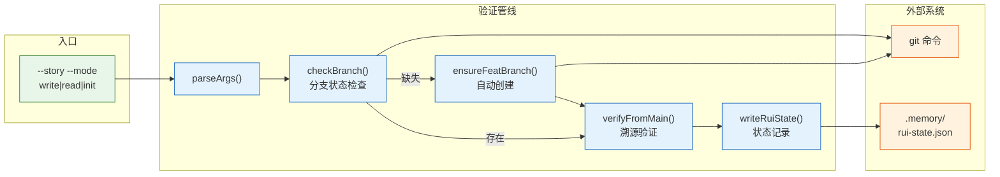

> | v1.0.0 | 2026-05-22 | deepseek-v4-pro | ⏱️ — | 📎 [CLAUDE.md](../../../CLAUDE.md) |

> **导航**: [← YrY-使用场景](./YrY-使用场景.md) · [→ YrY-测试设计](./YrY-测试设计.md) · [→ YrY-安全审计](./YrY-安全审计.md)

# YrY-技术评审 · rui-branch-check

## §0 设计决策

### 效果示意



### 基线溯源

| 来源 | 覆盖 |
|------|------|
| 故事任务 §2 FP1 | 分支存在检查 |
| 故事任务 §2 FP3 | 分支溯源 |
| 故事任务 §2 FP4 | 嵌套防护 |

---

## §1 验证项

| # | 验证项 | 阻断标识 | 证据 |
|---|--------|---------|------|
| ① | `git branch --show-current` = `feat/<name>` | `no-branch-isolation` | branch-check.mjs |
| ② | feat 从 main 创建（`git merge-base` 检查） | `bad-branch` | branch-check.mjs |
| ③ | 不在已有 feat 上创建新 feat | `no-nested-branch` | branch-check.mjs |

---

## §2 三种模式

| 模式 | 当前分支 | 行为 | exit code |
|------|---------|------|:--:|
| write | `feat/<name>` | 通过 | 0 |
| write | main | 创建 `feat/<name>` 并切换 | 0 |
| write | `feat/other` | 阻断 `no-nested-branch` | 1 |
| read | 任意 | 仅报告状态 | 0 |
| init | 任意 | 允许 main，警告 feat | 0 |

---

## §3 状态记录

通过后写入 `.memory/rui-state.json`：
```json
{ "branch": "feat/<name>", "created_from": "main", "verified_at": "<timestamp>" }
```

---

## §4 P0 检查清单

| # | 检查项 | 状态 |
|---|--------|:--:|
| 1 | 效果示意 mermaid 图 | ✅ |
| 2 | 基线溯源表 | ✅ |
| 3 | 回溯链完整 | ✅ |

---

> | 日期 | 变更 | 触发 | 证据 |
> |------|------|------|------|
> | 2026-05-22 | 初始生成 | /rui doc --from-code | skills/rui/branch-check.mjs |
