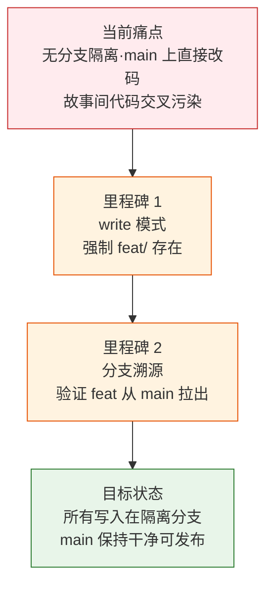

> | v1.0.0 | 2026-05-22 | deepseek-v4-pro | ⏱️ — | 📎 [CLAUDE.md](../../../CLAUDE.md) |

> **导航**: [→ YrY-使用场景](./YrY-使用场景.md)

> **来源引用**: `/rui doc --from-code rui-branch-check-doc` · `skills/rui/branch-check.mjs`

# YrY-故事任务 · rui-branch-check

## §0 基线声明

> **问题空间基线**

### 需求概述

分支隔离强制脚本是 rui 管线的安全门禁。在任何写入操作（Edit/Write）前验证当前分支为 `feat/<name>`，从 main 创建，阻止在主分支上直接修改代码或文档。三种模式：write（强制隔离）、read（只检查）、init（项目初始化允许 main）。

### 效果示意

### 主要价值

- 🔒 强制隔离：任何写入操作前验证分支，阻断 main 上直接修改
- 🌿 自动创建：write 模式自动从 main 创建 `feat/<name>`
- 📋 状态记录：写入 `rui-state.json` 的 branch 字段
- 🛡️ 嵌套防护：禁止在已有 feat 分支上创建新故事分支

---

## §1 Story

### Story 1: 分支隔离门禁

| 字段 | 内容 |
|------|------|
| 作为 | 管线 |
| 我想要 | 写操作前验证当前分支为 `feat/<name>` |
| 以便 | 防止未隔离的变更污染 main |
| 优先级 | P0 |

##### §1.1 User Operations

| # | 操作 | 触发条件 | 操作步骤 | 预期结果 |
|---|------|---------|---------|---------|
| 1 | write 模式 | rui doc/code 写操作前 | 检查分支→不存在则从 main 创建→验证从 main 拉出→写状态 | 分支就绪或阻断 |
| 2 | read 模式 | 只读操作 | 仅报告分支状态，不阻断 | 状态报告 |
| 3 | init 模式 | 项目初始化 | 允许在 main，警告已有 feat 分支 | 通过或警告 |

---

## §2 Requirements

### 功能点

| FP# | 描述 | 优先级 |
|-----|------|:--:|
| FP1 | 分支存在检查 — `git branch --show-current` | P0 |
| FP2 | 自动创建 — 从 main 创建 `feat/<name>` | P0 |
| FP3 | 分支溯源 — 验证 feat 从 main 拉出 | P0 |
| FP4 | 嵌套防护 — 禁止在 feat 上创建新 feat | P0 |
| FP5 | 状态写入 — rui-state.json 记录 branch | P1 |

### 业务规则

| R# | 描述 |
|----|------|
| R1 | write 模式：`git branch --show-current` 必须为 `feat/<name>` |
| R2 | feat 分支必须从 main 创建，否则 `bad-branch` 阻断 |
| R3 | 当前已在 feat 上时不可创建新 feat，`no-nested-branch` 阻断 |

---

## §3 成功标准

| SC# | 描述 | 优先级 | 关联 FP# |
|-----|------|:--:|---------|
| SC1 | 非 feat 分支上写操作被阻断 | P0 | FP1 |
| SC2 | 缺失分支时自动从 main 创建 | P0 | FP2 |
| SC3 | 嵌套分支创建被拦截 | P0 | FP4 |

---

## §4 范围边界

**范围内**: 分支验证、自动创建、溯源检查、状态记录
**范围外**: git merge/rebase/push（属于 version --up）

---

## §5 AC

| AC# | Given | When | Then | 门禁 |
|-----|-------|------|------|------|
| AC1 | 当前在 main | write 模式 | 自动创建 `feat/<name>` 并切换 | Gate A |
| AC2 | 当前在 `feat/other` | write 模式 story=new | 阻断 `no-nested-branch` | Gate A |
| AC3 | 当前在 `feat/<name>` | write 模式 | 通过验证 | Gate A |

---

## §6 风险

| # | 风险 | 可能性 | 影响 | 缓解 |
|---|------|:--:|:--:|------|
| 1 | main 分支被 force push 导致溯源失败 | L | H | `git merge-base` 检查 |
| 2 | 手动在 main 上创建的分支被误判为安全 | L | M | 严格溯源 |

---

## §7 跨文档索引

| 基线内容 | 下游文档 | 状态 |
|---------|---------|:--:|
| §2 FP1-FP5 | 03 技术评审 | 待生成 |
| §5 AC1-AC3 | 04 测试设计 | 待生成 |

---

> | 日期 | 变更 | 触发 | 证据 |
> |------|------|------|------|
> | 2026-05-22 | 初始生成 | /rui doc --from-code | skills/rui/branch-check.mjs |
