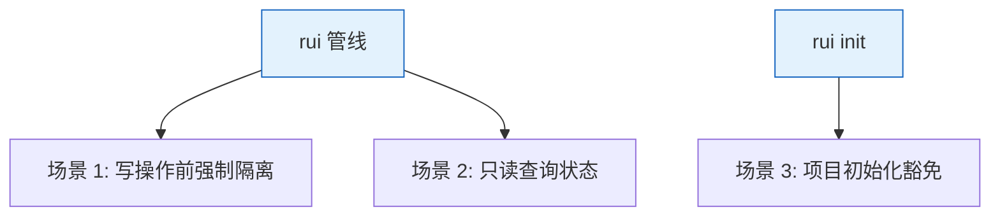
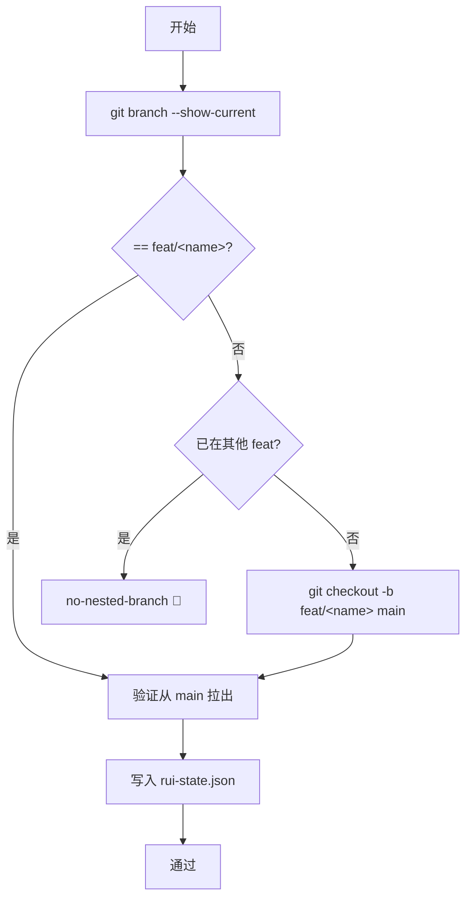

> | v1.0.0 | 2026-05-22 | deepseek-v4-pro | ⏱️ — | 📎 [CLAUDE.md](../../../CLAUDE.md) |

> **导航**: [← YrY-故事任务](./YrY-故事任务.md) · [→ YrY-技术评审](./YrY-技术评审.md)

[§0 基线声明](#sec0-baseline) · [§1 场景全景](#sec1-scenarios) · [§2 场景详述](#sec2-details) · [§3 场景覆盖矩阵](#sec3-matrix) · [§4 评审清单](#sec4-checklist) · [§5 体验基线](#sec5-experience)

# YrY-使用场景 · rui-branch-check

## §0 基线声明

> **用户空间基线**

### 主要价值

- 🔒 写操作前自动门禁检查
- 🌿 缺失分支时自动创建
- 🛡️ 嵌套分支创建被拦截

---

## §1 场景全景

## §2 场景详述

### 场景 1: 写操作前强制隔离

| 角色 | 触发条件 | 核心目标 |
|------|---------|---------|
| rui 管线 | doc/code 写操作前 | 确保在 `feat/<name>` 分支上 |

| # | 步骤 | 异常分支 |
|---|------|---------|
| 1 | 检查当前分支 | 不在 git 仓库：阻断 |
| 2 | 匹配 feat/`<name>` | 不匹配→检查是否嵌套 |
| 3 | 不存在→从 main 创建 | main 不存在或无权限：阻断 |
| 4 | 验证从 main 拉出 | `git merge-base` 失败：bad-branch |
| 5 | 写入状态 | — |

### 场景 2: 只读查询状态

执行 `--mode=read`，仅报告当前分支和状态，不阻断。

### 场景 3: 项目初始化豁免

执行 `--mode=init`，允许在 main 上操作，但警告已有 feat 分支。

---

## §3 场景覆盖矩阵

| 场景 | FP# | AC# | 状态 |
|------|-----|------|:--:|
| 场景 1 | FP1-FP5 | AC1-AC3 | 待生成 |
| 场景 2 | FP1 | — | 待生成 |
| 场景 3 | — | — | 待生成 |

---

## §4 评审清单

| # | 检查项 | 状态 |
|---|--------|:--:|
| 1 | 场景 ≥ 2 | ✅ (3) |
| 2 | 异常分支明确 | ✅ |

---

## §5 体验基线

| 角色 | 核心旅程 | 成功感知 | 关联场景 |
|------|---------|---------|---------|
| 管线 | 写操作→门禁自动检查→通过 | 看到 `feat/<name>` 就绪 | 场景 1 |
| 管线 | 写操作→缺失分支→自动创建→通过 | 看到分支自动创建并切换 | 场景 1 |

---

> | 日期 | 变更 | 触发 | 证据 |
> |------|------|------|------|
> | 2026-05-22 | 初始生成 | /rui doc --from-code | skills/rui/branch-check.mjs |
