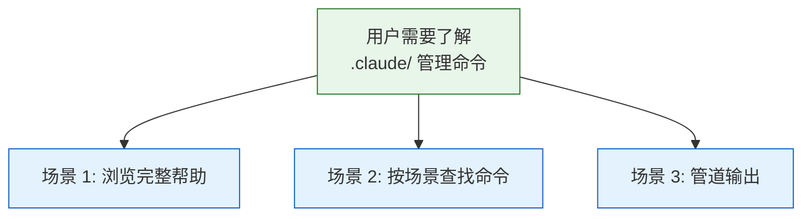

> | v1.0.0 | 2026-05-23 | deepseek-v4-pro | 🌿 feat/rui-claude-help-doc | 📎 [CLAUDE.md](../../../CLAUDE.md) |

> **导航**: [← YrY-故事任务](./YrY-故事任务.md) · [YrY-技术评审 →](./YrY-技术评审.md)

> **来源引用**: 基于 `YrY-故事任务.md` §1 + §1.1 反推。证据 Level A + 文档路径。

### 主要价值

- 👤 定义 rui-claude 帮助系统的用户空间基线
- 🔄 覆盖浏览帮助、按场景查找、管道输出三类核心旅程
- 🛡 非 TTY 降级路径确保管道兼容性
- 📋 场景覆盖矩阵对齐故事任务 FP# 和 AC#

---

## §0 基线声明

> **用户空间基线**: 本文档定义"谁使用(WHO)"和"如何体验(HOW EXPERIENCE)"。

---

## §1 场景全景

---

## §2 场景详述

### 场景 1: 浏览完整帮助

| 角色 | 开发者 |
|------|--------|
| 触发条件 | 首次使用或不确定可用命令 |
| 核心目标 | 获得配置管理的命令全景 |

| # | 步骤 | 输入 | 系统响应 |
|---|------|------|---------|
| 1 | 执行帮助 | 无参数 | 格式化帮助文本 |
| 2 | 阅读快速入门 | — | sync/retro/推荐 |
| 3 | 浏览场景 | — | 10 个场景示例 |

### 场景 2: 按场景查找命令

| 角色 | 开发者 |
|------|--------|
| 触发条件 | 有具体需求如"如何同步配置" |
| 核心目标 | 快速找到匹配的命令 |

### 场景 3: 管道输出

同 rui-story-help-doc — TTY 检测降级为纯文本。

---

## §3 场景覆盖矩阵

| 场景 | FP# | AC# | 覆盖状态 |
|------|-----|-----|---------|
| 场景 1: 完整帮助 | FP1, FP2 | AC1 | 待覆盖 |
| 场景 2: 按场景查找 | FP3 | AC1 | 待覆盖 |
| 场景 3: 管道输出 | FP4 | AC2 | 待覆盖 |

---

## §4 评审清单

| # | 检查项 | 状态 |
|---|--------|:--:|
| 1 | 场景 ≥ 2 | ✅ |
| 2 | 每场景有图 | ✅ |
| 3 | 无技术术语 | ✅ |

---

## §5 体验基线

| 角色 | 核心旅程 | 情感目标 | 成功感知 | 关联场景 |
|------|---------|---------|---------|---------|
| 开发者 | 首次查看全景 | 清晰有结构 | 四类命令分组清晰 | 场景 1 |
| 开发者 | 按需定位命令 | 快速匹配 | 找到可复制示例 | 场景 2 |

---

> **变更记录**
> | 日期 | 变更 | 触发 | 证据 |
> |------|------|------|------|
> | 2026-05-23 | 初始生成 | /rui doc --from-code rui-claude-help-doc | 故事任务 §1 + 源码 |
