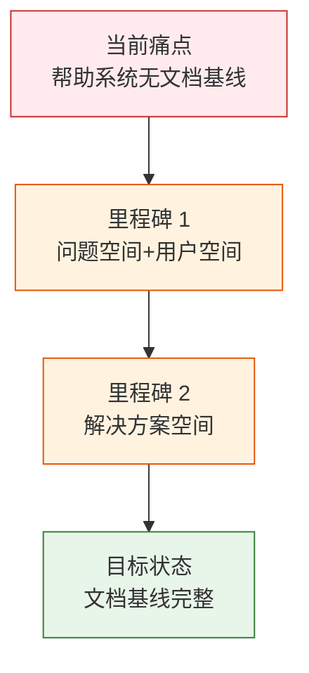
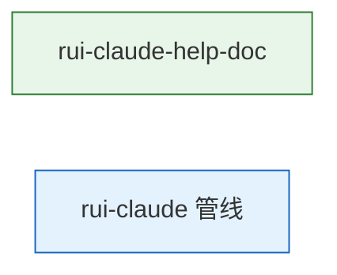

> | v1.0.0 | 2026-05-23 | deepseek-v4-pro | 🌿 feat/rui-claude-help-doc | 📎 [CLAUDE.md](../../../CLAUDE.md) |

> **导航**: [YrY-使用场景 →](./YrY-使用场景.md)

> **来源引用**: 由 `/rui doc --from-code rui-claude-help-doc` 触发，从 `skills/rui-claude/help.mjs` 源码反推。证据 Level B + 源码路径。

### 需求概述

`.claude/` 配置管理技能的入口需要统一的帮助系统，让用户了解配置同步、健康度分析、操作历史等命令的用法。帮助文本覆盖 3 个只读命令、2 个写入命令、10 个使用场景。但帮助系统本身缺少文档基线。

### 效果示意

### 主要价值

- 📋 为 rui-claude 帮助系统建立问题空间基线
- 🔗 覆盖同步/复盘/历史/需求 4 个功能域的命令分类
- 🎯 10 个使用场景对应可执行命令示例
- 🛡 定义 TTY 降级和列对齐格式约定

---

## §1 Story

### Story 1: rui-claude 帮助系统 — 问题空间基线

| 字段 | 内容 |
|------|------|
| 作为 | 开发者/用户 |
| 我想要 | 通过命令行查看 .claude/ 配置管理的完整帮助 |
| 以便 | 理解配置同步、健康度分析、操作历史等命令的用法 |
| 优先级 | P0 |
| 范围边界 | 仅建立文档基线，不涉及源码修改 |
| 依赖 | 源码文件可读 |

#### 范围外

- 不修改源码或命令行为

#### §1.1 User Operations

| # | 操作 | 触发条件 | 操作步骤 | 预期结果 |
|---|------|---------|---------|---------|
| 1 | 查看完整帮助 | 执行帮助命令 | 输出格式化帮助 | 快速入门+子命令+使用场景三段 |
| 2 | 按场景学习 | 有具体需求如"如何同步配置" | 定位到使用场景段 | 找到可复制执行的命令 |

---

### §2 Requirements

#### 功能点

| FP# | 描述 | 输入 | 输出 | 优先级 |
|-----|------|------|------|--------|
| FP1 | 帮助文本生成 — 完整格式化帮助 | 无 | 带颜色的结构化文本 | P0 |
| FP2 | 命令分类 — 只读/写入两类 | 无 | 分组标题+命令列表 | P0 |
| FP3 | 使用场景 — 10 个典型场景 | 无 | 场景标题+命令示例 | P1 |
| FP4 | TTY 颜色适配 | 无 | 终端彩色/管道纯文本 | P1 |

#### 业务规则

| R# | 描述 | 校验方式 | 证据级别 |
|----|------|---------|---------|
| R1 | 帮助覆盖所有已实现命令 | grep vs 源码 | A |
| R2 | TTY 非交互时降级纯文本 | isTTY 逻辑 | A |

---

### §3 成功标准

| SC# | 描述 | 度量方式 | 目标值 | 优先级 |
|-----|------|---------|--------|--------|
| SC1 | 用户可看到完整命令列表 | 输出行数 | ≥ 100 行 | P0 |
| SC2 | 所有命令在帮助中有条目 | 命令覆盖 | 100% | P0 |
| SC3 | 管道中无 ANSI 乱码 | `\| cat` 验证 | 0 转义字符 | P0 |

---

### §5 AC

| AC# | Given | When | Then | 门禁 |
|-----|-------|------|------|------|
| AC1 | 帮助脚本存在 | 执行帮助命令 | 输出含"快速入门""子命令""使用场景" | Gate A |
| AC2 | 管道到非 TTY | `help \| cat` | 纯文本无 ANSI | Gate A |

---

### §6 风险与假设

| # | 风险/假设 | 类型 | 可能性 | 影响 | 缓解 |
|---|----------|------|--------|------|------|
| 1 | 新命令后帮助未同步 | 风险 | M | M | 规约保证同步 |
| 2 | 命令名变更后帮助过时 | 风险 | M | M | version --up §4a 扫描修正 |

---

### §7 跨文档索引

| 本文档章节 | 基线内容 | 下游文档 | 预期覆盖 | 状态 |
|-----------|---------|---------|---------|------|
| §2 FP1–FP4 | 功能点 | 技术评审 | 架构方案 | 待生成 |
| §5 AC1–AC2 | 验收标准 | 测试设计 | 用例覆盖 | 待生成 |

---

### §R 关联故事

---

> **变更记录**
> | 日期 | 变更 | 触发 | 证据 |
> |------|------|------|------|
> | 2026-05-23 | 初始生成 | /rui doc --from-code rui-claude-help-doc | skills/rui-claude/help.mjs |
