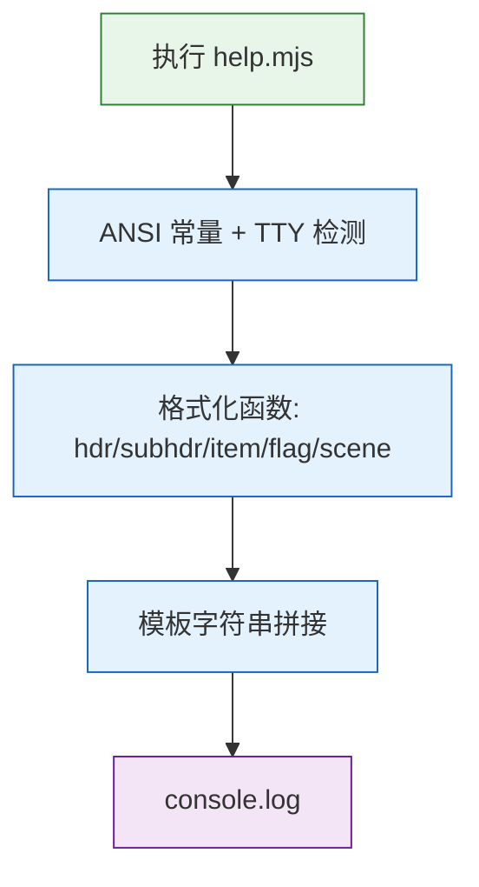

> | v1.0.0 | 2026-05-23 | deepseek-v4-pro | 🌿 feat/rui-claude-help-doc | 📎 [CLAUDE.md](../../../CLAUDE.md) |

> **导航**: [← YrY-使用场景](./YrY-使用场景.md) · [YrY-测试设计 →](./YrY-测试设计.md) · [YrY-安全审计 →](./YrY-安全审计.md)

> **来源引用**: 基于双基线 + 源码反推。证据 Level B + 源码路径。

[§0 设计决策与任务规划](#sec0-design) · [§1 系统架构](#sec1-architecture) · [§9 评审清单](#sec9-checklist)

### 主要价值

- 🏗 定义帮助系统技术架构：模板字符串 + ANSI 颜色 + TTY 检测降级
- 🔗 明确 5 个格式化函数的职责边界
- 🛡 TTY 检测防御确保管道兼容性
- ⚡ 为测试和安全审计提供技术基线

---

## §0 设计决策与任务规划

### §0.0 基线溯源

| 本设计章节 | 实现故事任务 | 服务使用场景 | 覆盖状态 |
|-----------|------------|------------|---------|
| §1 系统架构 | FP1–FP4 | 场景 1–3 | 已覆盖 |
| §0.1 设计决策 | FP4 | 场景 3 | 已覆盖 |

### §0.1 设计决策

| 决策领域 | 选定方案 | 选择理由 | 实现 FP# |
|---------|---------|---------|---------|
| 输出构建 | 模板字符串拼接 | 静态文本，可读性最优 | FP1 |
| 颜色模型 | 5 色 ANSI | 足够区分元素，无依赖 | FP4 |
| TTY 降级 | isTTY + 函数替换 | 零开销透传 | FP4 |
| 列对齐 | 44 字符命令列 | 适配 rui-claude 命令长度 | FP1 |

---

## §1 系统架构

### 效果示意

### 1.1 模块清单

| 变更类型 | 模块/文件 | 职责 |
|---------|----------|------|
| 现有 | skills/rui-claude/help.mjs | 纯输出：格式化函数 + 帮助字符串 |

---

## §9 评审清单

| # | 检查项 | 状态 |
|---|--------|:--:|
| 1 | 基线溯源完备 | ✅ |
| 2 | 效果示意完整 | ✅ |
| 3 | TTY 降级路径存在 | ✅ |
| 4 | 无外部依赖 | ✅ |

---

> **变更记录**
> | 日期 | 变更 | 触发 | 证据 |
> |------|------|------|------|
> | 2026-05-23 | 初始生成 | /rui doc --from-code rui-claude-help-doc | skills/rui-claude/help.mjs |
