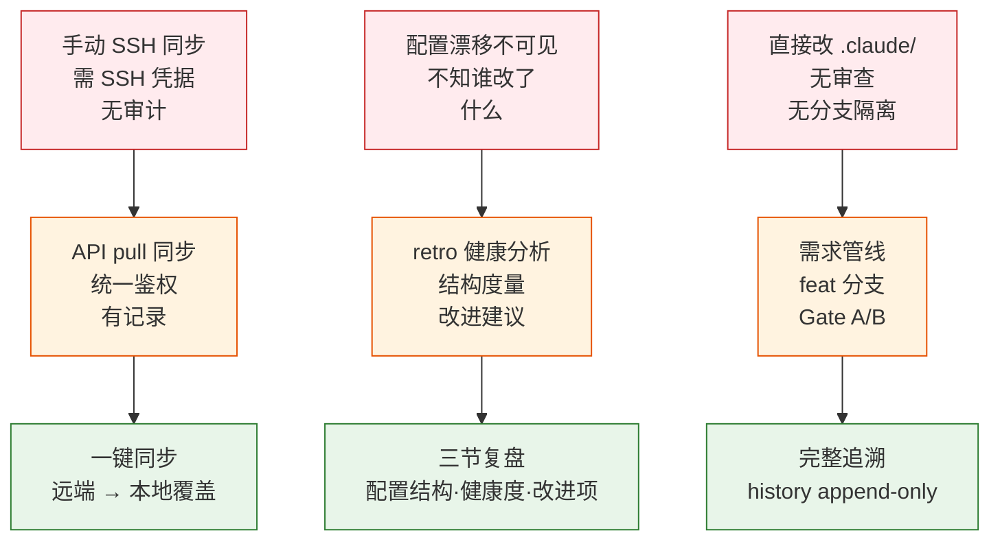

> | v1.3.2 | 2026-05-18 | deepseek-v4-pro | 🌿 main | 📎 [CLAUDE.md](../../../CLAUDE.md) |

> **导航**: [YrY-02-用户使用场景 →](./YrY-02-用户使用场景.md)

> **来源**: `/rui doc --from-code rui-claude` — 从 `skills/rui-claude/SKILL.md` · `rules/rui-claude.md` · `skills/import-docs/sync.mjs` 反推

### §0 基线声明

> **问题空间基线 (Problem Space Baseline)**: 本文档定义 rui-claude 的 WHAT（做什么）与 WHY（为什么做）。所有下游文档的设计、实现、验证、改进决策均必须可追溯至本文档的具体章节。

### 需求概述

`/rui-claude` 是 `.claude/` 配置目录的全生命周期管理命令族。开发者通过它从远端 API 同步团队基线配置、分析本地配置健康度、追溯操作历史、以及走完整管线修改 `.claude/` 内容。它解决了「每人手配 Claude Code 技能」「配置变更缺乏审计」「团队基线漂移不可见」三个核心痛点。

### 效果示意

### 主要价值

- 🔄 远端 API 驱动的一键团队配置同步，替代 SSH 文件传输
- 📊 retro 三节复盘：配置结构 · 健康度 · 改进项，漂移可视化
- 📝 append-only 操作历史，本地不入库，审计可追溯
- 🛡️ 配置变更走完整 rui code 管线（feat 分支 · Gate A · 逐模块审查 · Gate B）
- 🎯 空输入智能推荐 5–10 条维护任务，5 层管线评分排序

---

### §1 Story

| # | 作为 | 我想要 | 以便 | 优先级 | 范围边界 | 依赖 |
|---|------|--------|------|--------|---------|------|
| Story-1 | 开发者 | 从远端 API 同步 `.claude/` 配置到本地 | 获得团队最新的 skills/agents/rules 基线 | P0 | 仅 `.claude/` 目录，委托 import-docs | API_X_TOKEN |
| Story-2 | 团队负责人 | 分析本地 `.claude/` 结构健康度 | 识别配置漂移和缺失项，输出改进清单 | P1 | 纯本地分析，不连远端 | — |
| Story-3 | 开发者 | 查看 `/rui-claude` 操作历史 | 追溯谁在何时执行了 sync/retro/需求 | P2 | 仅本地 `.claude/.history/` | — |
| Story-4 | 开发者 | 提交 `.claude/` 修改需求走管线 | 配置变更经过审查、测试、分支隔离 | P1 | 仅 `.claude/` 内，走 rui code 管线 | feat 分支 |
| Story-5 | 开发者 | 空输入获得推荐任务列表 | 不知道该做什么时得到 5 层评分排序的建议 | P2 | 只读，不执行任何变更 | — |

#### §1.1 User Operations

| # | 操作 | 触发条件 | 操作步骤 | 预期结果 |
|---|------|---------|---------|---------|
| OP-1 | 同步配置 | 新人入职 / 团队基线更新 | 执行 `/rui-claude sync` → 确认意图 → 等待完成 | 本地 `.claude/` 与远端一致，操作记录写入 history |
| OP-2 | 健康分析 | 定期巡检 / 变更后检查 | 执行 `/rui-claude retro` → 等待分析完成 → 查看复盘文档 | `docs/自改进故事面板/<date>.md` 生成三节报告 |
| OP-3 | 查看历史 | 追溯变更 | 执行 `/rui-claude history list` | 显示最近操作记录（时间、命令、结果） |
| OP-4 | 需求变更 | 新增 skill/agent/rule 或修改现有 | 执行 `/rui-claude "需求描述"` → 自动走 doc+code 管线 | `.claude/` 内变更经 Gate A/B 后合入 |
| OP-5 | 获取推荐 | 不确定下一步 | 执行 `/rui-claude` | 输出 5–10 条按优先级排序的维护任务 |

---

### §2 Requirements

| FP# | 描述 | 输入 | 输出 | 错误行为 | 优先级 |
|-----|------|------|------|---------|--------|
| FP-1 | 远端同步：查询 API → 逐文件 pull 覆盖本地 `.claude/` | `/rui-claude sync` + 用户确认 | `.claude/` 全量覆盖 + history 记录 | token 缺失静默降级；网络失败记录错误 | P0 |
| FP-2 | 健康分析：采集 agents/rules/skills 统计 → 三节复盘 | `/rui-claude retro [--name] [--json]` | `docs/自改进故事面板/<date>.md` | 目录不存在则跳过 | P1 |
| FP-3 | 历史记录：list 子命令 + stats 子命令 | `/rui-claude history list [--limit]` / `stats [--json]` | 终端表格输出 | 历史文件不存在显示空 | P2 |
| FP-4 | 需求管线：需求解析 → pm 拆分 → doc → code → 交付 | `/rui-claude "需求"` | `.claude/` 内文件变更，走完整管线 | 需求无法解析 → no-parse 阻断 | P1 |
| FP-5 | 任务推荐：空输入 → 5 层评分排序 5–10 条 | `/rui-claude` | 推荐列表（终端输出） | — | P2 |

| R# | 描述 | 校验方式 | 证据级别 |
|----|------|---------|---------|
| R-1 | 操作范围仅限 `.claude/`，不得触及业务源码或外部配置 | 检查变更文件路径是否全部在 `.claude/` 内 | A — `rules/rui-claude.md` |
| R-2 | 需求变更必须走 rui code 管线（feat 分支 + Gate A/B） | 检查是否在 `feat/<name>` 分支执行 | A — `rules/rui-claude.md` |
| R-3 | sync 为覆盖式操作，执行前必须确认用户意图 | 检查确认提示是否展示并等待响应 | A — `skills/rui-claude/SKILL.md` |
| R-4 | 禁止自动 commit/push，所有 git 操作由开发者手动执行 | 管线末端不执行 `git commit` / `git push` | A — `rules/rui-claude.md` |
| R-5 | API_X_TOKEN 由环境变量传入，skill 不配置/存储/传递 | grep 扫描源码无硬编码 token | A — `skills/import-docs/sync.mjs` |
| R-6 | retro 纯本地分析，不连接远端 | 检查 retro 流程中无网络请求 | A — `rules/rui-claude.md` |
| R-7 | history 仅本地不入库不同步 | 检查 `.gitignore` 包含 `.claude/.history/` | B — 约定 |

| 约束 | 类型 | 范围/格式 | 来源 |
|------|------|---------|------|
| 故事名 | kebab-case | `[a-z][a-z0-9-]*` | `skills/rui-claude/SKILL.md` |
| workspace 名 | 项目根目录名 | basename($PWD) | `skills/import-docs/sync.mjs` |
| API 地址 | URL | `https://api.effiy.cn`（默认） | `IMPORT_DOCS_API_URL` 环境变量 |
| 并发度 | number | 4 | `CONCURRENCY` in sync.mjs |
| HTTP 超时 | ms | 30000 | `HTTP_TIMEOUT` in sync.mjs |

---

### §3 成功标准

| SC# | 描述 | 度量方式 | 目标值 | 优先级 | 关联 FP# |
|-----|------|---------|--------|--------|---------|
| SC-1 | 开发者可在 1 个命令内完成 `.claude/` 全量同步 | 统计从输入命令到全部文件写入完成的耗时 | ≤ 30 秒（40 文件以内） | P0 | FP-1 |
| SC-2 | 健康分析报告包含三节且可读 | 检查产出文档含 §1 配置结构 · §2 健康度 · §3 改进项 | 3/3 节齐全 | P1 | FP-2 |
| SC-3 | 操作历史可追溯最近 N 次操作 | 执行 list 后输出行数 | 与执行次数一致 | P2 | FP-3 |
| SC-4 | 需求变更走完整管线不跳过 Gate A | 检查是否在 feat 分支且有 05 文档 | Gate A 通过率 100% | P1 | FP-4 |

---

### §4 范围边界

| # | 条目 | 关联 FP# | 边界说明 |
|---|------|---------|---------|
| IN-1 | `.claude/` 目录内所有文件（skills/agents/rules/formulas） | FP-1, FP-4 | 递归全部子目录 |
| IN-2 | `docs/自改进故事面板/` 下的复盘文档 | FP-2 | retro 产出 |
| IN-3 | `.claude/.history/rui-claude-history.jsonl` | FP-3 | 仅本地 |

| # | 条目 | 排除原因 | 替代方案 |
|---|------|---------|---------|
| OUT-1 | 业务源码（`src/` 等） | 操作边界约束 | 使用 `/rui` 管理业务代码 |
| OUT-2 | 外部系统配置 | 超出 `.claude/` 范围 | 各自系统的管理工具 |
| OUT-3 | 自动 git commit/push | 开发者手动控制原则 | 开发者手动 `git add -p` |
| OUT-4 | `.claude/.history/` 入库 | 历史仅本地 | `.gitignore` 排除 |

| # | 条目 | 触发条件 | 决策人 |
|---|------|---------|--------|
| GRAY-1 | sync 是否也删除本地多余文件 | 远端删除文件时 | 团队负责人 |
| GRAY-2 | retro 是否对接远端比较 | 需要团队基线对比时 | 团队负责人 |

---

### §5 AC

| AC# | Given | When | Then | 门禁 |
|-----|-------|------|------|------|
| AC-1 | API_X_TOKEN 已配置，远端有 `.claude/` sessions | 执行 `/rui-claude sync` 并确认 | 本地 `.claude/` 被远端文件覆盖，控制台显示 written/failed 统计 | — |
| AC-2 | API_X_TOKEN 缺失 | 执行 `/rui-claude sync` | 静默降级，提示 token 缺失，不阻断 | — |
| AC-3 | 本地 `.claude/` 存在 | 执行 `/rui-claude retro` | 生成 `docs/自改进故事面板/<project>-<date>.md`，含三节 | — |
| AC-4 | 已有操作历史 | 执行 `/rui-claude history list --limit 5` | 显示最近 5 条记录 | — |
| AC-5 | 输入有效需求描述 | 执行 `/rui-claude "需求"` | 创建 feat 分支 → pm 拆分 → doc → code → 交付 | Gate A |
| AC-6 | 空输入 | 执行 `/rui-claude` | 输出 5–10 条推荐任务，不执行任何变更 | — |
| AC-7 | 未确认意图 | 执行 `/rui-claude sync` → 回答 No | 中止操作，`.claude/` 不变 | — |

---

### §6 风险与假设

| # | 风险/假设 | 类型 | 可能性 | 影响 | 缓解/验证策略 | 关联 FP# |
|---|----------|------|--------|------|-------------|---------|
| RSK-1 | 远端 API 不可达导致 sync 失败 | 风险 | M | H | 网络超时 30s；不阻断管线；记录错误日志 | FP-1 |
| RSK-2 | API_X_TOKEN 泄露 | 风险 | L | H | token 仅从环境变量读取；源码无硬编码；grep 扫描验证 | FP-1, FP-4 |
| RSK-3 | sync 覆盖本地未提交修改 | 风险 | M | M | sync 前确认意图；开发者应先 commit | FP-1 |
| RSK-4 | `.claude/` 结构与远端 API tags 不一致 | 风险 | L | M | `resolvePullFilter` 按 tags[0]==workspace && tags[1]==.claude 过滤 | FP-1 |
| ASM-1 | 远端 API 的 sessions 已由 import-docs 正确上传 | 假设 | H | H | `import-docs workspace=true` 验证上传成功 | FP-1 |
| ASM-2 | 开发者理解 kebab-case 命名约定 | 假设 | H | L | help.mjs 展示示例 | FP-4 |

---

### §7 跨文档索引

| 本文档章节 | 基线内容 | 下游文档编号 | 预期覆盖 | 状态 |
|-----------|---------|------------|---------|------|
| §1 Story-1 | sync 同步命令 | 02 §2 场景1 · 03 §2 API 契约 · 05 §2 TC-N1 | 同步操作完整用户旅程 · 技术设计 · 测试覆盖 | 已对齐 |
| §1 Story-2 | retro 健康分析 | 02 §2 场景2 · 05 §2 TC-N2 | 分析操作完整用户旅程 · 测试覆盖 | 已对齐 |
| §1 Story-3 | history 历史查看 | 02 §2 场景3 · 05 §2 TC-N3 | 历史查看完整用户旅程 · 测试覆盖 | 已对齐 |
| §1 Story-4 | 需求管线 | 02 §2 场景4 · 03 §1 技能架构 · 05 §2 TC-N4 | 需求变更完整用户旅程 · 技术设计 · 测试覆盖 | 已对齐 |
| §1 Story-5 | 空输入推荐 | 02 §2 场景5 · 05 §2 TC-N5 | 推荐查看完整用户旅程 · 测试覆盖 | 已对齐 |
| §2 FP-1~FP-5 | 全部功能点 | 03 §0.1 设计决策 · 06 §1 实施总结 | 技术方案覆盖 · 实施交付物 | 已对齐 |
| §5 AC-1~AC-7 | 全部 AC | 05 §2 · 08 §2 冒烟 | 全部 AC 有测试用例 + 冒烟执行结果 | 已对齐 |
| §6 RSK-1~ASM-2 | 风险与假设 | 03 §4 安全约束 · 09 §2 诊断 · 09 §3 改进 | 风险缓解验证 · 安全设计 · 改进提案 | 已对齐 |

---

### 变更记录

| 日期 | 变更 | 触发 | 证据 |
|------|------|------|------|
| 2026-05-18 | 初始反推生成 | `/rui doc --from-code rui-claude` | `skills/rui-claude/SKILL.md` · `rules/rui-claude.md` · `skills/import-docs/sync.mjs` |
