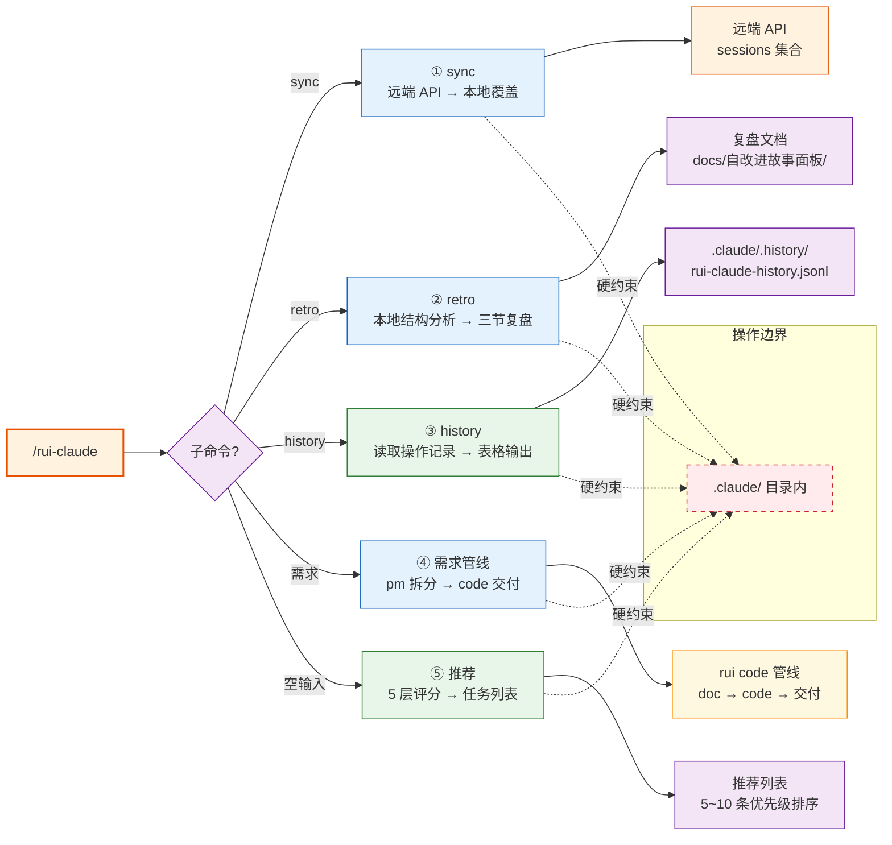
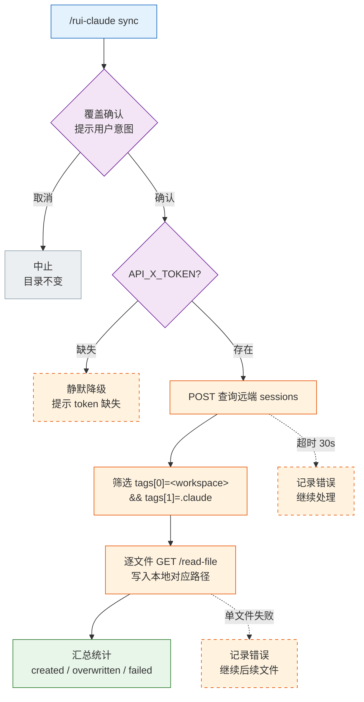
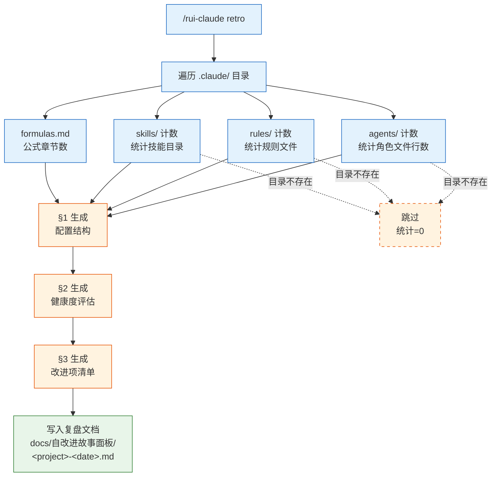
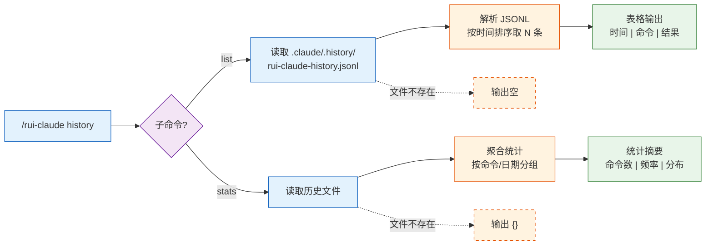
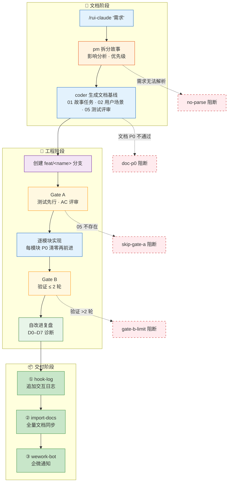
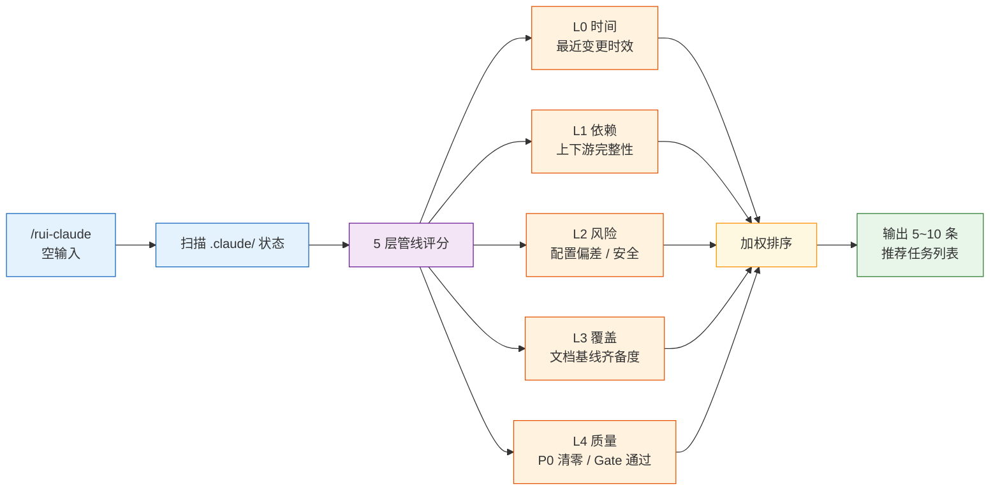

> | v1.3.2 | 2026-05-18 | deepseek-v4-pro | 🌿 main | 📎 [CLAUDE.md](../../../CLAUDE.md) |

> **导航**: [← YrY-01-故事任务](./YrY-01-故事任务.md) · [YrY-03-技术评审 →](./YrY-03-技术评审.md)

> **来源**: `/rui doc --from-code rui-claude` — 从 `skills/rui-claude/SKILL.md` · `skills/rui-claude/help.mjs` 反推

### 主要价值

- 👤 覆盖 5 类核心用户旅程：同步 · 分析 · 追溯 · 变更 · 推荐
- 🔄 每场景含完整操作流（mermaid flowchart）+ 步骤表 + 异常分支
- 🛡️ 明确空状态与错误恢复路径（token 降级、网络失败、阻断标识）
- 📊 场景覆盖矩阵与 FP# / AC# 双对齐，确保下游可追溯
- 🎯 体验基线定义每角色的情感目标与成功感知

### §0 基线声明

> **用户空间基线 (User Space Baseline)**: 本文档定义 rui-claude 的 WHO（谁使用）与 HOW EXPERIENCE（如何体验）。所有测试用例（05）必须覆盖本文档定义的每个场景及其异常分支。

---

### §1 场景全景

---

### §2 场景详述

#### 场景 1 — 同步团队 `.claude/` 配置

| 角色 | 触发条件 | 核心目标 |
|------|---------|---------|
| 开发者 | 新人入职、团队宣布基线更新、发现本地技能行为与团队不一致 | 一键将本地 `.claude/` 与远端团队基线对齐 |

| # | 步骤 | 输入 | 系统响应 | 异常分支 |
|---|------|------|---------|---------|
| 1 | 执行同步命令 | `/rui-claude sync` | 显示确认提示：「该操作将覆盖本地 .claude/，确认？」 | — |
| 2 | 确认操作 | 用户回复确认 | 开始连接远端 API，查询 sessions | 用户取消 → 中止，显示「已取消」 |
| 3 | 拉取文件列表 | — | 从 sessions 筛选 `tags[0]=<workspace> && tags[1]=.claude` 的记录 | token 缺失 → 静默降级提示 |
| 4 | 逐文件下载 | — | 显示进度：`pulled: <remote> → <local>` | 单文件失败 → 记录错误，继续处理 |
| 5 | 完成 | — | 显示汇总：「created: N, overwritten: M, failed: K」+ 自动记录 history | 全部失败 → 退出码 1 |

#### 场景 2 — 分析 `.claude/` 健康度

| 角色 | 触发条件 | 核心目标 |
|------|---------|---------|
| 开发者 / 团队负责人 | 定期巡检、变更后验证、怀疑配置漂移 | 生成三节复盘报告，了解配置结构、健康度、改进方向 |

| # | 步骤 | 输入 | 系统响应 | 异常分支 |
|---|------|------|---------|---------|
| 1 | 执行分析命令 | `/rui-claude retro` | 开始采集 agents/ · rules/ · skills/ · formulas.md 等统计 | 目录为空 → 对应统计显示 0 |
| 2 | 分析完成 | — | 生成三节：§1 配置结构 · §2 健康度 · §3 改进项 | — |
| 3 | 写入文档 | — | 保存到 `docs/自改进故事面板/<project>-<date>.md` | 目录不存在 → 递归创建 |
| 4 | 完成 | — | 显示文档路径 | — |

#### 场景 3 — 查看操作历史

| 角色 | 触发条件 | 核心目标 |
|------|---------|---------|
| 开发者 | 追溯「谁在何时做了什么」、排查配置问题 | 查看 `/rui-claude` 的操作历史记录 |

| # | 步骤 | 输入 | 系统响应 | 异常分支 |
|---|------|------|---------|---------|
| 1 | 查看列表 | `/rui-claude history list --limit 10` | 显示最近 10 条记录（时间、命令、结果） | 历史文件不存在 → 显示空 |
| 2 | 查看统计 | `/rui-claude history stats --json` | JSON 格式统计摘要 | 历史文件不存在 → `{}` |

#### 场景 4 — 提交 `.claude/` 配置变更

| 角色 | 触发条件 | 核心目标 |
|------|---------|---------|
| 开发者 | 需要新增/修改 skill、agent、rule 或公式 | 通过完整管线安全地变更 `.claude/` 配置 |

| # | 步骤 | 输入 | 系统响应 | 异常分支 |
|---|------|------|---------|---------|
| 1 | 提交需求 | `/rui-claude "新增一个 security check hook"` | 解析需求 → pm 评估范围 | 需求无法解析 → no-parse 阻断 |
| 2 | 文档生成 | — | pm 拆故事 + coder 生成 01/02/05 | 文档 P0 不通过 → doc-p0 阻断 |
| 3 | 分支隔离 | — | 创建 `feat/<name>` 分支 | 已在 main → no-checkout 阻断 |
| 4 | Gate A | — | 检查 05 存在 → 用例评审通过 | 05 不存在 → skip-gate-a |
| 5 | 逐模块实现 | — | 每模块 P0 清零再前进 | P0 未清 → 不能前进 |
| 6 | Gate B | — | 验证通过 ≤ 2 轮 | > 2 轮 → gate-b-limit |
| 7 | 交付 | — | hook-log → import-docs → wework-bot | token 缺失 → 降级 |

#### 场景 5 — 获取推荐任务

| 角色 | 触发条件 | 核心目标 |
|------|---------|---------|
| 开发者 | 不确定下一步该做什么 `.claude/` 维护工作 | 获得 5–10 条按优先级排序的建议任务 |

| # | 步骤 | 输入 | 系统响应 | 异常分支 |
|---|------|------|---------|---------|
| 1 | 空输入 | `/rui-claude` | 展示 5 层评分排序的推荐任务列表（5–10 条） | — |
| 2 | 选择执行 | 用户按推荐执行对应命令 | 进入对应流程 | — |

---

### §3 场景覆盖矩阵

| 场景 | FP# | AC# | 实现文档 | 测试文档 | 覆盖状态 | 备注 |
|------|-----|------|---------|---------|---------|------|
| 场景1 — 同步配置 | FP-1 | AC-1, AC-2, AC-7 | 03 §2 · 06 §4 | 05 · 08 | 已对齐 | import-docs 委托 |
| 场景2 — 健康分析 | FP-2 | AC-3 | 03 §1 | 05 · 08 | 已对齐 | 纯本地操作 |
| 场景3 — 操作历史 | FP-3 | AC-4 | 03 §3 | 05 · 08 | 已对齐 | 本地文件读取 |
| 场景4 — 需求变更 | FP-4 | AC-5 | 03 §1 · 03 §0 | 05 · 08 · 09 | 已对齐 | rui code 管线 |
| 场景5 — 任务推荐 | FP-5 | AC-6 | 03 §1 | 05 · 08 | 已对齐 | 只读，不执行 |

---

### §4 评审清单

- [x] 场景 ≥ 2（实际 5 个场景）
- [x] 每场景有流程图（6 个 mermaid — §1 全景 + 场景×5）
- [x] FP 全覆盖（FP-1 ~ FP-5 均匹配）
- [x] 异常分支明确（token 降级、网络失败、P0 阻断、目录不存在）
- [x] 无技术术语（无 API 路由、组件名、文件路径、数据库概念、框架名）
- [x] 每场景含空状态与错误恢复
- [x] 覆盖矩阵下游文档齐全（05 已包含）

---

### §5 体验基线

| 角色 | 核心旅程 | 情感目标 | 痛点解决 | 成功感知 | 关联场景 |
|------|---------|---------|---------|---------|---------|
| 新人开发者 | 入职第一天同步团队配置 | 感到被支持、快速融入 | 不再手动找同事要配置、自行摸索 | 执行完 sync 后 `.claude/` 可用，命令列表与团队一致 | 场景1 |
| 团队负责人 | 定期巡检配置健康度 | 感到掌控、有洞察 | 配置漂移不可见、不知从何改进 | 看到三节复盘报告，改进项可执行 | 场景2 |
| 日常开发者 | 修改配置并安全交付 | 感到安全、有流程保障 | 直接改文件担心破坏、无审查机制 | Gate A/B 通过，变更进入交付三步 | 场景4 |
| 运维开发者 | 追溯历史操作 | 感到有迹可循 | 不知道谁改了什么、何时改的 | history list 显示完整记录 | 场景3 |

---

### 变更记录

| 日期 | 变更 | 触发 | 证据 |
|------|------|------|------|
| 2026-05-18 | 初始反推生成 | `/rui doc --from-code rui-claude` | `skills/rui-claude/SKILL.md` · `skills/rui-claude/help.mjs` |
| 2026-05-18 | 全图重写 + 场景 5 补图 | `/rui update rui-claude` | 6 图：§1 全景（决策节点+边界）· 场景 1（TB 决策树+API 细节）· 场景 2（四路采集+三节生成）· 场景 3（子命令分支统一）· 场景 4（三阶段 subgraph）· 场景 5（5 层评分补图）|
