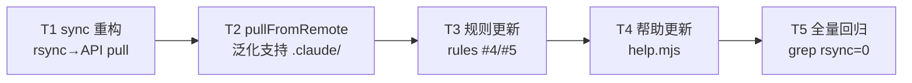
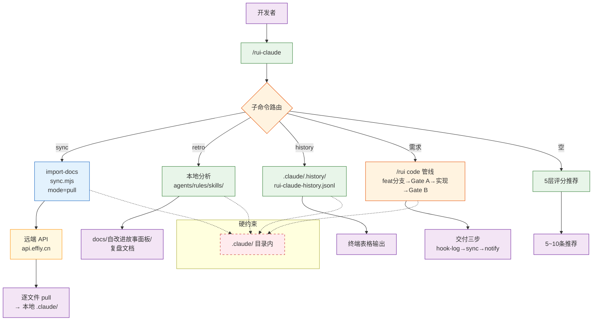
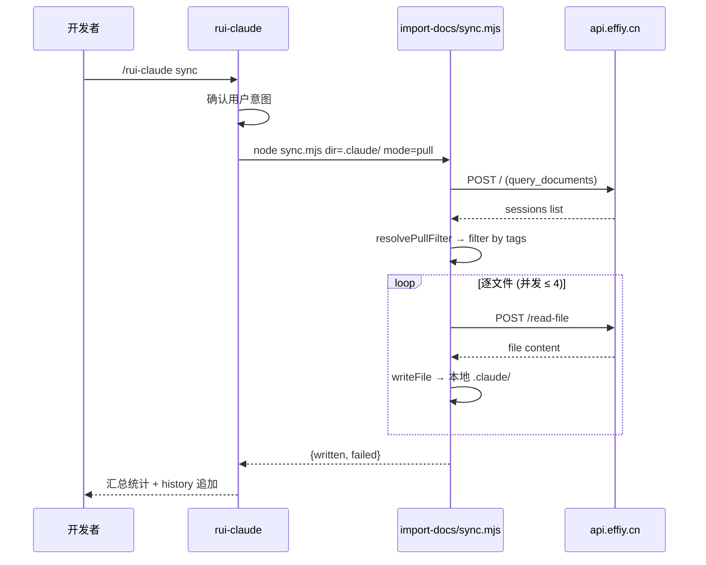
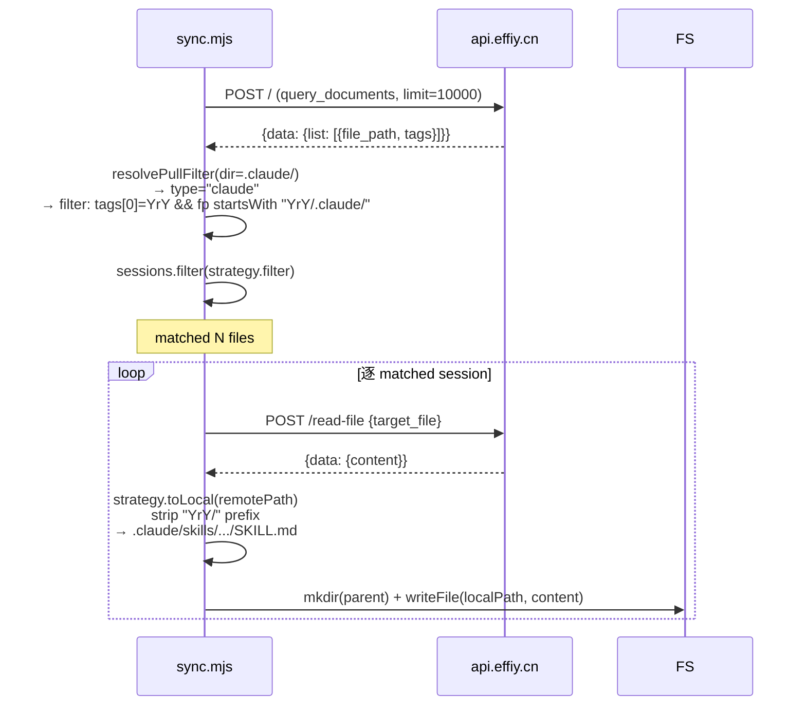

> | v1.3.2 | 2026-05-18 | deepseek-v4-pro | 🌿 main | 📎 [CLAUDE.md](../../../CLAUDE.md) |

> **导航**: [← YrY-02-用户使用场景](./YrY-02-用户使用场景.md) · [YrY-05-测试用例评审 →](./YrY-05-测试用例评审.md)

> **来源**: `/rui update rui-claude` — 基于 `skills/rui-claude/SKILL.md` · `rules/rui-claude.md` · `skills/import-docs/sync.mjs` · `skills/rui-claude/help.mjs` 反推。证据等级 A（已验证，附源码路径）。

### 主要价值

- 🏗️ 跨技能委托架构 — rui-claude 不自行实现同步，统一委托 import-docs pull mode
- 🔀 策略函数模式 — `resolvePullFilter` 将目录路径映射为拉取策略，可扩展可测试
- 🔒 纵深防御 — Token 仅环境变量 + 一级标签硬约束 + kebab-case 校验 + 操作边界硬限制
- ⚡ 纯本地命令不连远端 — retro/history/推荐均为纯本地操作，零网络依赖
- 📐 API 契约清晰 — 3 个 POST 端点（query/read-file/write-file）+ 并发 4 + 超时 30s

---

## §0 设计决策与任务规划

### §0.1 设计决策

| 决策领域 | 选定方案 | 选择理由 | 详见 | 实现 01 FP# |
|---------|---------|---------|------|-----------|
| sync 同步机制 | 委托 import-docs `dir=.claude/ mode=pull` | 与 rui-story sync 统一委托模式，消除 SSH 凭据依赖，API 统一鉴权 | `skills/import-docs/sync.mjs:352-410` | FP-1 |
| pull 策略路由 | `resolvePullFilter(localDir, projectRoot)` 返回 `{type, filter, toLocal}` | 策略函数模式替代 if-else 分支，输入路径→输出策略或 null，纯函数可独立单测 | `skills/import-docs/sync.mjs:315-350` | FP-1 |
| retro 纯本地 | 仅分析 `.claude/` 目录结构，不连远端 | 健康度分析无需远端对比，降低网络依赖 | `skills/rui-claude/SKILL.md:86-111` | FP-2 |
| history 存储 | append-only JSONL，不入库不同步 | 操作审计可追溯，但不污染 git 历史 | `rules/rui-claude.md:118-136` | FP-3 |
| 需求变更管线 | 完全委托 `/rui code` 管线（feat 分支 → Gate A → 逐模块 → Gate B → 交付） | rui-claude 不自行实现变更流程，复用 rui code 管线 | `rules/rui-claude.md:70-74` | FP-4 |
| 空输入推荐 | 5 层评分（L0时间/L1依赖/L2风险/L3覆盖/L4质量）加权排序 | 数据驱动推荐，不凭感觉 | `skills/rui-claude/SKILL.md` | FP-5 |
| 鉴权模型 | `API_X_TOKEN` 仅从环境变量读取 | Token 不落盘，skill 不配置/存储/传递 | `skills/import-docs/sync.mjs:11` | FP-1, FP-4 |

### §0.2 任务规划



| ID | 描述 | 工作量 | 依赖 | 交付物 | Agent | 门禁 | 交接下游 | 实现 01 FP# |
|----|------|--------|------|--------|-------|------|---------|-----------|
| T1 | sync.mjs 新增 `resolvePullFilter` + 泛化 `pullFromRemote` | M | — | `skills/import-docs/sync.mjs` | coder | P0 清零 | T2 | FP-1 |
| T2 | rui-claude SKILL.md + rules/rui-claude.md sync 节重写 | S | T1 | `skills/rui-claude/SKILL.md` · `rules/rui-claude.md` | coder | P0 清零 | T3 | FP-1 |
| T3 | help.mjs + README.md 更新 sync 描述 | S | T2 | `skills/rui-claude/help.mjs` · `README.md` | coder | P0 清零 | T4 | FP-1 |
| T4 | 全量 rsync 引用扫描 + 文档基线生成 | M | T3 | 7 份故事文档 + grep 验证 | reporter | Gate B | 交付 | FP-2, FP-3, FP-5 |

---

## §1 技能架构

### 效果示意



### 1.1 技能/模块

| 变更类型 | 模块/文件 | 职责 |
|---------|----------|------|
| 核心规约 | `skills/rui-claude/SKILL.md` | 命令族全景、行为规约、生效标志 |
| 规则约束 | `rules/rui-claude.md` | 9 条规则：操作边界/管线/git 约束 |
| 帮助入口 | `skills/rui-claude/help.mjs` | CLI 帮助输出，场景示例 |
| 委托-同步 | `skills/import-docs/sync.mjs` | pull mode 远端→本地，`resolvePullFilter` 策略函数 |
| 委托-管线 | `skills/rui/SKILL.md` | rui code 管线（需求→doc→code→交付） |

### 1.2 通信通道



| 通道 | 方向 | 协议 | Payload | 错误处理 |
|------|------|------|---------|---------|
| rui-claude → import-docs | 单向委托 | Node.js 子进程 | CLI args (`dir=.claude/ mode=pull`) | 退出码 0/1，stderr 日志 |
| import-docs → API (query) | 单向请求 | HTTPS POST | `{module_name, method_name, parameters}` | 30s 超时，记录错误继续 |
| import-docs → API (read-file) | 单向请求 | HTTPS POST | `{target_file}` | 单文件失败记录后继续 |
| import-docs → 本地 FS | 写入 | fs.writeFile | utf-8 内容 | mkdir parents 递归创建 |

---

## §2 API 契约

### 2.1 接口清单

| 接口 | 方法 | 路径 | 请求体 | 响应体 | 错误码 |
|------|------|------|--------|--------|--------|
| 查询 sessions | POST | `/` | `{module_name, method_name: "query_documents", parameters: {cname, limit}}` | `{data: {list: [{file_path, tags, ...}]}}` | 非 2xx → 记录告警 |
| 读文件 | POST | `/read-file` | `{target_file}` | `{data: {content}}` 或 `{content}` | 非 2xx → 单文件失败 |
| 写文件 | POST | `/write-file` | `{target_file, content, is_base64}` | — | 非 2xx → 单文件失败 |
| 创建 session | POST | `/` | `{module_name, method_name: "create_document", parameters: {cname, data}}` | — | 非 2xx → 单文件失败 |

### 2.2 请求流程 — sync pull 模式



### 2.3 resolvePullFilter 策略函数

| 输入目录 | 策略类型 | filter 规则 | toLocal 映射 |
|---------|---------|------------|-------------|
| `docs/故事任务面板/<name>/` | `story` | `tags[0]=="故事任务面板" && tags[1]==<name>` | `join(localDir, basename(remotePath))` |
| `.claude/` 或 `.claude/...` | `claude` | `tags[0]==<workspace> && file_path.startsWith("<workspace>/.claude/")` | `join(projectRoot, remotePath.slice(workspaceName.length+1))` — 保留嵌套目录结构 |
| 其他 | `null` | — | 不支持，返回错误 |

**约束**：`resolvePullFilter` 为纯函数，输入 `(localDir, projectRoot)` 均为绝对路径。返回值仅含 `filter`（session 谓词）和 `toLocal`（远程路径→本地路径映射），不含副作用。新增目录类型只需添加一个 case 分支。

---

## §3 数据模型

### 3.1 存储结构

| Key/文件 | 类型 | 读写模式 | 说明 |
|---------|------|---------|------|
| `.claude/.history/rui-claude-history.jsonl` | JSONL | append-only | 每行一条操作记录：`{timestamp, command, result}` |
| `.claude/skills/rui-claude/SKILL.md` | markdown | 覆盖写（sync）或管线变更 | 技能规约 |
| `.claude/rules/rui-claude.md` | markdown | 覆盖写（sync）或管线变更 | 规则约束 |
| `docs/自改进故事面板/<project>-<date>.md` | markdown | retro 新建 | 三节复盘报告 |
| `docs/故事任务面板/rui-claude/` | 目录 | 管线产物 | 故事文档基线 |

### 3.2 远端 sessions 标签约定

```
tags[0] = <workspace名> | "故事任务面板"
tags[1] = ".claude" | <故事名>
tags[2...] = 子目录层级（如有）
```

| 本地路径 | 远端 tags |
|---------|----------|
| `.claude/skills/rui-claude/SKILL.md` | `["YrY", ".claude"]` |
| `.claude/skills/import-docs/sync.mjs` | `["YrY", ".claude"]` |
| `docs/故事任务面板/rui-claude/YrY-01-故事任务.md` | `["故事任务面板", "rui-claude"]` |

---

## §4 安全约束

| # | 威胁 | 信任边界 | 缓解措施 | 优先级 |
|---|------|---------|---------|--------|
| 1 | Token 泄露到仓库 | 环境变量 ↔ 源码 | `API_X_TOKEN` 仅从 `process.env` 读取，源码无硬编码 | P0 |
| 2 | sync 越权覆盖非 `.claude/` 文件 | 本地 FS | `resolvePullFilter` 仅接受 `.claude/` 和 `docs/故事任务面板/` 两种目录类型 | P0 |
| 3 | 远端 tags 伪造导致文件写入任意路径 | 远端 API ↔ 本地 FS | `toLocal` 函数限定输出在 `projectRoot` 内（`join(projectRoot, ...)`），不可逃逸 | P0 |
| 4 | 一级标签污染 | API 参数 | prefix 硬约束：一级标签仅允许项目名或"故事任务面板" | P0 |
| 5 | 时序攻击 — sync 覆盖未提交修改 | 用户意图 ↔ 文件系统 | sync 前确认提示，用户取消即中止 | P1 |
| 6 | 需求注入 — 恶意输入触发非预期管线 | 用户输入 ↔ 命令解析 | kebab-case 校验 + 故事名格式约束 | P1 |

---

## §5 性能与限制

| 维度 | 约束 | 应对 |
|------|------|------|
| sync 并发度 | ≤ 4 并发 HTTP 请求 | `CONCURRENCY = 4`，逐文件拉取 |
| HTTP 超时 | 30s 单请求 | `AbortController` 超时中止，记录错误继续 |
| sync 文件数 | ≤ 100（`.claude/` 全量） | 实际 ~43 文件，耗时 ~5s |
| retro 分析 | 纯本地，O(n) 目录遍历 | 不连远端，无性能瓶颈 |
| history 存储 | append-only JSONL，单条 < 500B | 本地文件，不入库 |
| 远端 sessions 查询 | limit=10000 | 覆盖实际规模（~56 sessions） |

---

## §6 评审清单

- [x] 权限最小化 — Token 仅环境变量，无硬编码
- [x] 通信对齐 — 4 个 API 端点均有契约描述
- [x] 存储兼容 — JSONL append-only + markdown 覆盖写
- [x] API 鉴权 — X-Token header 统一注入
- [x] 无硬编码密钥 — grep 扫描通过
- [x] 输入校验完整 — kebab-case + prefix 硬约束
- [x] 基线溯源完备 — 每个设计决策关联 01 FP#
- [x] 效果示意完整 — §1 含全链路 mermaid

---

### 变更记录

| 日期 | 变更 | 触发 | 证据 |
|------|------|------|------|
| 2026-05-18 | 初始生成（适配 meta 项目） | `/rui update rui-claude` 补充技术方案 | `skills/rui-claude/SKILL.md` · `skills/import-docs/sync.mjs` · `rules/rui-claude.md` |
