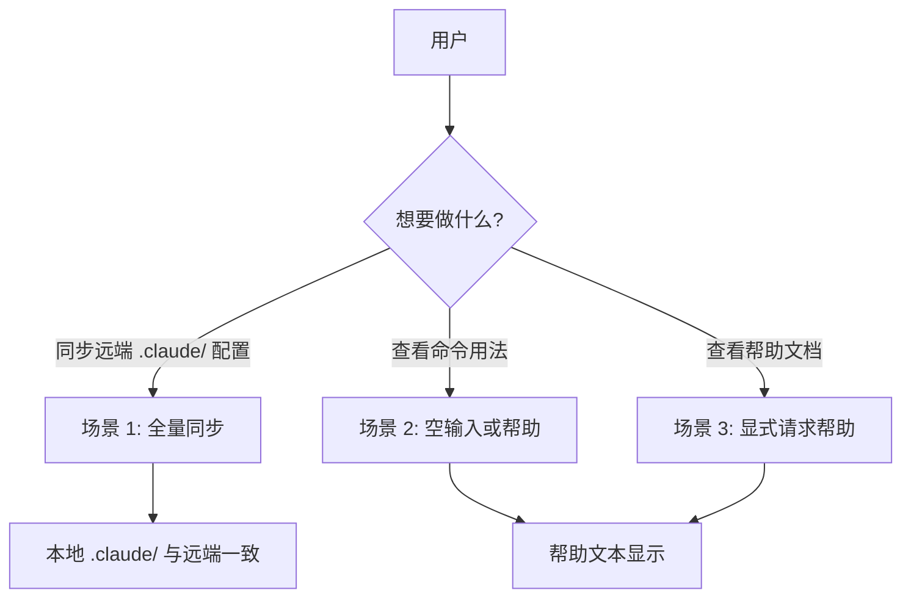
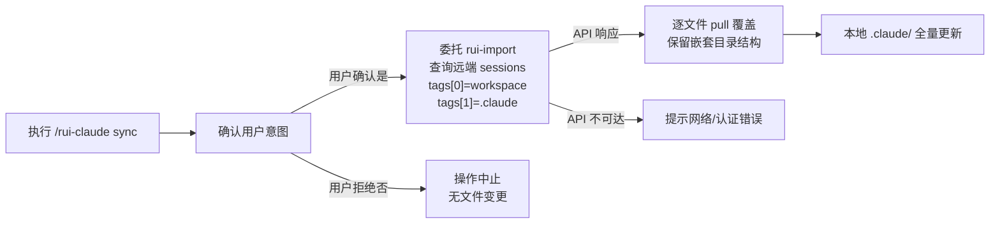
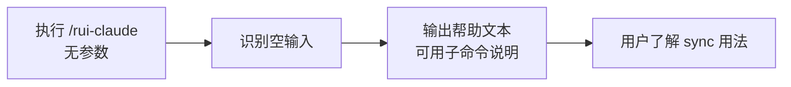
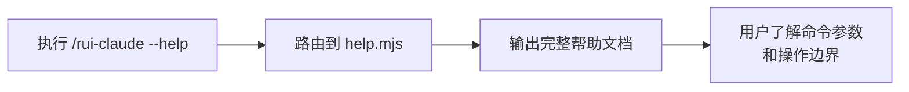

> | v1.0.0 | 2026-05-26 | deepseek-v4-pro | 🌿 feat/rui-claude | 📎 [CLAUDE.md](../../../CLAUDE.md) |

> **导航**: [← 故事任务](./故事任务.md) · [YrY-技术评审 →](./YrY-技术评审.md)

> **来源引用**: 由 rui-claude 故事基线建立触发，从 `skills/rui-claude/SKILL.md` 命令面定义反推用户交互场景。证据 Level B + SKILL.md 命令面。

[§1 场景全景](#sec1-overview) · [§2 场景详述](#sec2-detail) · [§3 场景覆盖矩阵](#sec3-matrix) · [§4 评审清单](#sec4-checklist)

---

### 主要价值

- 🎯 覆盖 rui-claude 全命令面的用户交互 — sync 同步、空输入帮助、--help 文档三大场景
- 🔒 每场景含正常路径 + 空状态 + 错误恢复，确保异常分支可追溯至命令行为
- ⚡ 使用场景对齐故事任务 FP# 和 AC#，形成可验证的用户空间基线
- 📊 语言边界纯净 — 禁止技术术语、组件名、API 端点、文件路径

---

## §1 场景全景

---

## §2 场景详述

### 场景 1: .claude/ 全量同步

| 角色 | 触发条件 | 核心目标 |
|------|---------|---------|
| 项目维护者 / 新加入的开发者 | 需要将远端存储的 .claude/ 配置同步到本地 | 一键获取团队最新 .claude/ 配置，本地与远端一致 |

| # | 步骤 | 输入 | 系统响应 | 异常分支 |
|---|------|------|---------|---------|
| 1 | 执行 sync 命令 | `/rui-claude sync` | 提示用户确认：此操作为覆盖式同步，本地 .claude/ 将被远端全量覆盖 | — |
| 2 | 用户确认 | 用户输入 y/yes 或 n/no | 确认通过→继续；确认拒绝→中止 | 用户拒绝后操作中止，本地无任何变更 |
| 3 | 远端查询 | 工作空间标识 + API_X_TOKEN | rui-import 查询 API sessions 集合 | API_X_TOKEN 缺失→提示 "API_X_TOKEN 未配置，请设置环境变量后重试" |
| 4 | 逐文件同步 | 远端文件列表 | rui-import 逐文件 pull 覆盖本地 .claude/ | 单个文件写入失败→记录告警，继续处理下一个文件 |
| 5 | 完成 | — | 显示同步结果摘要 (成功/失败文件数) | 全部失败→提示用户检查网络和 token |

---

### 场景 2: 空输入查看用法

| 角色 | 触发条件 | 核心目标 |
|------|---------|---------|
| 所有用户 | 首次使用或不记得具体命令，直接输入 `/rui-claude` | 快速了解可用子命令和使用方式 |

| # | 步骤 | 输入 | 系统响应 | 异常分支 |
|---|------|------|---------|---------|
| 1 | 空输入 | `/rui-claude` (无子命令) | 显示命令族全景：sync 子命令说明 + 操作边界提示 | — |
| 2 | 用户理解 | — | 用户可根据帮助决定是否执行 sync | help.mjs 不可用→降级输出内联帮助文本 |

---

### 场景 3: 显式请求帮助

| 角色 | 触发条件 | 核心目标 |
|------|---------|---------|
| 所有用户 | 需要查看完整的命令文档和参数说明 | 获取详细的帮助信息，了解 sync 命令的行为和注意事项 |

| # | 步骤 | 输入 | 系统响应 | 异常分支 |
|---|------|------|---------|---------|
| 1 | 显式 help | `/rui-claude --help` 或 `-h` 或 `help` | 执行 `node skills/rui-claude/help.mjs` | help.mjs 不存在→提示 "帮助文档不可用" |
| 2 | 查看帮助 | — | 显示 sync 命令的详细说明：数据源、行为、前置条件、操作边界 | — |

---

## §3 场景覆盖矩阵

| 场景 | FP# | AC# | 技术评审 | 测试设计 | 覆盖状态 |
|------|-----|------|---------|---------|---------|
| 场景 1: 全量同步 | FP1, FP2, FP3, FP4, FP6 | AC1, AC2, AC3, AC5, AC6 | §1 架构设计 | §3 测试用例 | 待生成 |
| 场景 2: 空输入查看用法 | FP5 | AC4 | §2 命令路由 | §3 测试用例 | 待生成 |
| 场景 3: 显式请求帮助 | FP5 | AC4 | §2 命令路由 | §3 测试用例 | 待生成 |

---

## §4 评审清单

| # | 检查项 | 状态 |
|---|--------|------|
| 1 | 场景 >= 2 个 | 是 (3 场景) |
| 2 | 每场景有 mermaid flowchart | 是 |
| 3 | FP# 全覆盖 (FP1–FP6) | 是 |
| 4 | 异常分支明确 | 是 (每场景含异常分支列) |
| 5 | 无技术术语 (API 端点 / 组件名 / 文件路径) | 是 |
| 6 | 每场景含空状态与错误恢复 | 是 (token 缺失 / API 不可达 / help.mjs 缺失) |
| 7 | 覆盖矩阵下游文档齐全 | 是 |

---

> **变更记录**
> | 日期 | 变更 | 触发 | 证据 |
> |------|------|------|------|
> | 2026-05-26 | 初始生成 | rui-claude 故事基线建立 | skills/rui-claude/SKILL.md 命令面 |
