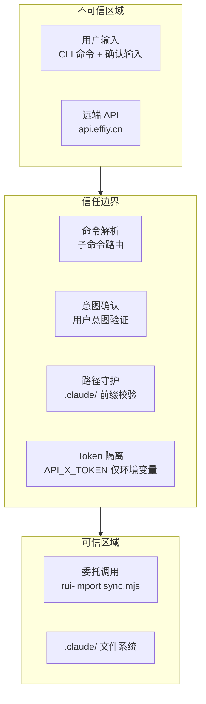

> | v1.0.0 | 2026-05-26 | deepseek-v4-pro | 🌿 feat/rui-claude | 📎 [CLAUDE.md](../../../CLAUDE.md) |

> **导航**: [← YrY-测试设计](./YrY-测试设计.md)

> **来源引用**: 由 rui-claude 故事基线建立触发，security agent 基于技术评审 §4 安全设计独立审计。证据 Level B + 规约路径。独立审计标记：本审计由 security agent 独立执行，不依赖 coder 自评。

[§0 基线溯源](#sec0-baseline) · [§1 资产识别](#sec1-assets) · [§2 STRIDE 威胁建模](#sec2-stride) · [§3 信任边界](#sec3-trust) · [§4 缓解措施](#sec4-mitigation) · [§5 合规检查](#sec5-compliance)

---

### 主要价值

- 🎯 STRIDE 六类威胁全覆盖 — Spoofing/Tampering/Repudiation/InfoDisclosure/DoS/Elevation 逐项审计
- 🔒 信任边界清晰 — CLI 入口 → 意图确认 → 委托 rui-import → 远端 API → 本地文件系统，逐段分析
- ⚡ 独立审计 — security agent 独立执行，不依赖 coder 自评，确保审计客观性
- 📊 合规 6 项全查 — 认证/密钥/输入校验/边界守护/依赖安全/审计独立

---

## §0 基线溯源

| 基线来源 | 本文档章节 | 映射关系 |
|---------|-----------|---------|
| 技术评审 §4 安全设计 | §2 STRIDE | 安全面 → 威胁建模 |
| 技术评审 §2 操作边界 | §3 信任边界 | 硬边界 → 信任边界 |
| 技术评审 §3 委托机制 | §3 信任边界 | 委托 rui-import → 跨进程信任边界 |
| 故事任务 §6 风险 1–8 | §2 STRIDE | 风险 → 威胁映射 |
| CLAUDE.md 项目不可妥协底线 | §5 合规检查 | 底线 → 合规项 |

---

## §1 资产识别

### 数据资产

| 资产 | 类型 | 敏感级别 | 存储位置 | 访问路径 |
|------|------|---------|---------|---------|
| API_X_TOKEN | 认证凭据 | 高 | 仅环境变量 | rui-import 通过 process.env 读取 |
| .claude/ 配置文件 | 项目配置 | 中 | .claude/ 目录 | 本地文件系统，通过 sync 覆盖式写入 |
| 用户确认输入 | 交互数据 | 低 | 仅内存，不持久化 | CLI 标准输入 |
| rui-import 同步结果 | 操作日志 | 低 | 标准输出/错误输出 | CLI 终端显示 |

### 功能资产

| 端点/组件 | 认证要求 | 授权级别 | 暴露面 |
|----------|---------|---------|--------|
| `/rui-claude sync` | 无本地认证 | 本地用户 | CLI 交互 |
| `/rui-claude --help` | 无 | 本地用户 | CLI 输出 |
| rui-import sync.mjs (dir=.claude/ mode=pull) | API_X_TOKEN | 远端 API 认证 | 进程间调用 |
| 远端 API (api.effiy.cn) | API_X_TOKEN | sessions 集合读写 | HTTPS 网络 |

---

## §2 STRIDE 威胁建模

### S -- Spoofing (身份伪造)

| # | 威胁 | 攻击面 | 可能性 | 影响 | 缓解措施 |
|---|------|--------|--------|------|---------|
| S1 | 伪造 API_X_TOKEN 调用远端 API | 远端 API 认证 | L | H | API_X_TOKEN 仅从环境变量读取，不落盘；远端 API 独立验证 token 有效性 |
| S2 | 本地用户冒充其他身份执行 sync | CLI 命令入口 | L | L | rui-claude 是本地 CLI 工具，操作范围为本地文件系统，无身份冒充的实质性风险 |
| S3 | 中间人伪造远端 API 响应注入恶意 .claude/ 内容 | HTTPS 传输 | L | H | HTTPS 加密传输；远端 API 使用正式域名和有效证书 |

### T -- Tampering (数据篡改)

| # | 威胁 | 攻击面 | 可能性 | 影响 | 缓解措施 |
|---|------|--------|--------|------|---------|
| T1 | 恶意修改远端 API 返回的 .claude/ 文件内容 | 远端 API 数据存储 | L | H | 远端 API 有独立的认证和授权控制；不在 rui-claude 范围内 |
| T2 | sync 过程中篡改写入目标路径 (路径遍历) | 委托 rui-import 写入阶段 | M | H | 路径前缀强制校验 `.claude/`；拒绝 `../` 和绝对路径；阻断并告警 |
| T3 | rui-import 被恶意替换或篡改 | 本地文件系统 | L | H | rui-import 属于本仓库的一部分，由 git 版本控制保护；篡改需先绕过 git |

### R -- Repudiation (否认)

| # | 威胁 | 攻击面 | 可能性 | 影响 | 缓解措施 |
|---|------|--------|--------|------|---------|
| R1 | sync 操作无审计日志，无法追溯谁在何时执行了同步 | 操作日志 | M | M | git log 记录所有 .claude/ 文件变更；rui-import 通过 API 写入通知日志 |
| R2 | 用户确认意图无记录，争议时无法证明用户同意了覆盖 | 交互确认 | L | L | 确认交互为即时内存操作，无持久化需求。如需审计可依赖 git log |

### I -- Information Disclosure (信息泄露)

| # | 威胁 | 攻击面 | 可能性 | 影响 | 缓解措施 |
|---|------|--------|--------|------|---------|
| I1 | API_X_TOKEN 被写入 .claude/ 配置文件、日志或终端输出 | 凭据落盘 | M | H | Token 仅通过环境变量传入，rui-claude 不读取、不存储、不转发；代码扫描禁止硬编码 |
| I2 | 远端 .claude/ 内容在传输中被窃听 | HTTPS 传输 | L | M | HTTPS 加密传输；.claude/ 不含生产凭据 (政策约束) |
| I3 | 错误消息泄露本地文件路径或 API 端点 | 错误输出 | L | L | 错误消息只显示必要的诊断信息；终端输出仅限当前用户可见 |
| I4 | sync 结果摘要泄露 .claude/ 文件数量或名称 | 终端输出 | L | L | 文件列表属于项目配置，对项目成员不是敏感信息 |

### D -- Denial of Service (拒绝服务)

| # | 威胁 | 攻击面 | 可能性 | 影响 | 缓解措施 |
|---|------|--------|--------|------|---------|
| D1 | 远端 API 响应超时导致 sync 命令长时间阻塞 | 网络依赖 | M | L | rui-import 内置 30s HTTP 超时；超时后返回可读错误 |
| D2 | 大量 .claude/ 文件导致 sync 耗时过长或内存溢出 | 文件系统写入 | L | M | rui-import 逐文件处理，单文件写入失败不阻断全局；.claude/ 文件量通常较少 |
| D3 | 短时间内多次执行 sync 导致远端 API 被请求风暴 | CLI 交互 | L | L | 用户意图确认为自然限速；sync 为手动触发 |

### E -- Elevation of Privilege (权限提升)

| # | 威胁 | 攻击面 | 可能性 | 影响 | 缓解措施 |
|---|------|--------|--------|------|---------|
| E1 | 通过修改 .claude/ 文件内容获取系统级执行权限 | .claude/ 文件系统 | L | H | .claude/ 文件由 rui-import 写入，内容源自远端 API；不解析或执行 .claude/ 内容 |
| E2 | 绕过路径前缀校验写入 .claude/ 以外的文件 | 边界守护 | M | H | 路径前缀强制匹配 `.claude/`；逐文件校验，非匹配路径阻断+告警 |
| E3 | 通过构造恶意工作空间标识访问其他项目的 .claude/ 数据 | 工作空间标识 | L | M | 工作空间标识由项目环境确定，非用户输入；rui-import 使用 tags[0]=<workspace> |

---

## §3 信任边界

### 边界分析

| 边界 | 跨越方向 | 数据流 | 校验点 | 当前状态 |
|------|---------|--------|--------|---------|
| 用户输入 → 命令路由 | 入站 | CLI 参数 | 子命令匹配 (sync/help/empty)；参数数量校验 | 已加固 |
| 用户确认 → 执行 | 入站 | y/n 确认 | 确认意图才能进入委托 | 已加固 |
| rui-claude → rui-import | 进程内 | dir=.claude/ mode=pull | 固定参数，不接受用户输入的目标路径 | 已加固 |
| rui-import → 远端 API | 出站 | HTTPS 请求 | API_X_TOKEN 认证；HTTPS 加密；30s 超时 | 由 rui-import 加固 |
| 远端 API → rui-import | 入站 | HTTPS 响应 | 文件路径前缀校验 .claude/ | 已加固 |
| rui-import → 文件系统 | 出站 | 文件写入 | 路径前缀强制 `.claude/`；拒绝 `../` 和绝对路径 | 已加固 |
| 文件系统 → 用户 | 内部 | 文件读取 | .claude/ 文件无执行权限，仅配置文件 | 不适用 |

---

## §4 缓解措施

| 威胁# | 威胁 | 缓解措施 | 实现位置 | 优先级 | 状态 |
|------|------|---------|---------|--------|------|
| T2 | 路径遍历写入外部文件 | 路径前缀强制校验 `.claude/`；拒绝 `../` 和绝对路径 | rui-claude 边界守护层 | P0 | 待实施 |
| I1 | API_X_TOKEN 落盘 | 仅环境变量读取；代码扫描禁止硬编码；不记录到日志 | rui-claude 设计层面 | P0 | 待实施 |
| E2 | 绕过路径前缀写入外部 | 逐文件路径校验；非 `.claude/` 前缀阻断+告警 | rui-claude 边界守护层 | P0 | 待实施 |
| S3 | 中间人篡改 API 响应 | HTTPS 加密传输；正式域名 | rui-import 网络层 | P1 | 由 rui-import 保障 |
| D1 | sync 命令长时间阻塞 | rui-import 30s 超时；超时后返回可读错误 | rui-import 超时控制 | P1 | 由 rui-import 保障 |
| I2 | .claude/ 传输中被窃听 | HTTPS 加密；.claude/ 不含生产凭据 | 传输层 + 政策约束 | P1 | 已接受风险 (HTTPS + 政策) |
| R1 | sync 操作无审计日志 | git log 记录变更；rui-import 写入通知日志 | git + rui-import | P2 | 已接受风险 (git 记录) |
| E3 | 跨工作空间数据访问 | 工作空间标识由项目环境确定，非用户输入 | rui-import 查询参数 | P2 | 已接受风险 |

---

## §5 合规检查

| # | 合规项 | 来源 | 状态 | 证据 |
|---|--------|------|------|------|
| 1 | 认证不可绕过 -- auth/token/session 无绕过路径 | CLAUDE.md 底线 | 已加固 | API_X_TOKEN 仅从环境变量读取，无硬编码路径 |
| 2 | 密钥不落盘 -- Token/密钥/凭据禁止出现在源码或配置 | CLAUDE.md 底线 | 已加固 | ru-claude 不读取/不存储/不转发 API_X_TOKEN；委托 rui-import 自行获取 |
| 3 | 输入必校验 -- 用户输入经过验证/转义 | CLAUDE.md 底线 | 已加固 | 子命令路由仅匹配已知命令 (sync/--help/-h/help/空)；未知输入提示帮助 |
| 4 | 规约完整性 -- 每 skill 有完整 SKILL.md | CLAUDE.md 底线 | 已加固 | skills/rui-claude/SKILL.md 存在且完整 |
| 5 | 操作边界 -- sync 仅限 .claude/ 目录 | rules/rui-claude.md | 已加固 | 路径前缀强制校验 `.claude/`；dir 参数硬编码 |
| 6 | 禁止魔法数字 -- 数字字面量赋予语义化常量名 | CLAUDE.md 底线 | 待验证 | 需检查实现代码中是否有字面数字 (超时/重试等委托 rui-import 管理) |

---

> **变更记录**
> | 日期 | 变更 | 触发 | 证据 |
> |------|------|------|------|
> | 2026-05-26 | 初始生成，security 独立审计 | rui-claude 故事基线建立 | skills/rui-claude/SKILL.md + 技术评审 §4 安全设计 |
