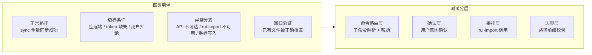

> | v1.0.0 | 2026-05-26 | deepseek-v4-pro | 🌿 feat/rui-claude | 📎 [CLAUDE.md](../../../CLAUDE.md) |

> **导航**: [← YrY-技术评审](./YrY-技术评审.md) · [YrY-安全审计 →](./YrY-安全审计.md)

> **来源引用**: 由 rui-claude 故事基线建立触发，基于故事任务 §5 AC + 使用场景 + 技术评审 §1 架构设计生成。证据 Level B + 规约路径。

[§0 基线溯源](#sec0-baseline) · [§1 测试策略](#sec1-strategy) · [§2 测试范围](#sec2-scope) · [§3 测试用例](#sec3-cases) · [§4 Gate A 交接信号](#sec4-gate-a) · [§5 测试环境](#sec5-env)

---

### 主要价值

- 🎯 AC 全覆盖 — 每条 AC 至少 1 个测试用例，覆盖正常/边界/异常/回归四类
- 🔒 Gate A 交接信号完整 — P0 用例 ID + 验证命令明确，确保测试先行门禁可执行
- ⚡ sync 操作全路径覆盖 — 正常同步、token 缺失、用户拒绝、文件失败、边界外写入
- 📊 环境需求最小化 — 仅需 Node.js + git 仓库，测试成本低

---

## §0 基线溯源

| 基线来源 | 本文档章节 | 映射关系 |
|---------|-----------|---------|
| 故事任务 §5 AC1 | §3.1 用例 1–2 | sync 正常验收 |
| 故事任务 §5 AC2 | §3.2 用例 3 | token 缺失降级验收 |
| 故事任务 §5 AC3 | §3.1 用例 4 | 用户拒绝中止验收 |
| 故事任务 §5 AC4 | §3.3 用例 5–6 | 帮助命令验收 |
| 故事任务 §5 AC5 | §3.4 用例 7 | 边界外写入阻断验收 |
| 故事任务 §5 AC6 | §3.1 用例 8 | rui-import 不可用验收 |
| 使用场景 场景 1 | §3.1 | 全量同步用户操作流 |
| 使用场景 场景 2–3 | §3.3 | 帮助命令用户操作流 |

---

## §1 测试策略

---

## §2 测试范围

| 模块 | 测试重点 | 用例数 | 门禁 |
|------|---------|--------|------|
| sync | 全量同步正常路径 + 用户确认 + rui-import 委托 | 5 | Gate A |
| token | API_X_TOKEN 缺失 / 无效时的降级行为 | 2 | Gate A |
| 帮助 | 空输入 / --help / help 命令输出 | 3 | Gate A |
| 边界守护 | 路径前缀校验 + 越界写入阻断 | 2 | Gate A |

---

## §3 测试用例

### §3.1 sync 命令

| # | 类型 | Given | When | Then | 关联 AC |
|---|------|-------|------|------|---------|
| 1 | 正常 | API_X_TOKEN 已配置，远端有对应工作空间的 .claude/ 数据，本地 .claude/ 有旧文件 | 执行 `/rui-claude sync`，用户确认 y | 本地 .claude/ 被远端内容全量覆盖，嵌套目录结构保留，旧文件被替换或删除 | AC1 |
| 2 | 正常 | 本地 .claude/ 目录不存在 | 执行 `/rui-claude sync`，用户确认 y | rui-import 创建 .claude/ 目录并写入远端文件 | AC1 |
| 3 | 边界 | 远端无匹配 session (空结果) | 执行 `/rui-claude sync`，用户确认 y | rui-import 处理空结果，本地 .claude/ 无变更或清空（取决于 rui-import 行为） | AC1 |
| 4 | 边界 | 用户在确认环节输入 n | 执行 `/rui-claude sync`，用户确认 n | 操作中止，提示已取消，本地 .claude/ 无任何文件变更 | AC3 |
| 5 | 异常 | rui-import 不可用或调用失败 | 执行 `/rui-claude sync`，用户确认 y | 输出依赖缺失错误信息，提示用户检查 rui-import skill 是否安装 | AC6 |

### §3.2 token 降级

| # | 类型 | Given | When | Then | 关联 AC |
|---|------|-------|------|------|---------|
| 6 | 边界 | API_X_TOKEN 环境变量未设置 | 执行 `/rui-claude sync`，用户确认 y | 提示 "API_X_TOKEN 未配置，请设置环境变量后重试"，操作安全退出，不崩溃 | AC2 |
| 7 | 边界 | API_X_TOKEN 已设置但无效 (过期/错误) | 执行 `/rui-claude sync`，用户确认 y | rui-import 返回认证失败错误，rui-claude 向用户展示可读错误信息 | AC2 |

### §3.3 帮助命令

| # | 类型 | Given | When | Then | 关联 AC |
|---|------|-------|------|------|---------|
| 8 | 正常 | help.mjs 存在 | 执行 `/rui-claude --help` | 输出完整帮助文档，包含 sync 命令说明、操作边界提示 | AC4 |
| 9 | 正常 | 用户不记得具体命令 | 执行 `/rui-claude` (无参数) | 输出命令用法提示，列出可用子命令 (sync) | AC4 |
| 10 | 边界 | help.mjs 不存在或不可执行 | 执行 `/rui-claude --help` | 降级输出内联帮助文本，至少包含 sync 命令的简要说明 | AC4 |

### §3.4 边界守护

| # | 类型 | Given | When | Then | 关联 AC |
|---|------|-------|------|------|---------|
| 11 | 异常 | rui-import 返回的文件路径包含 `../` 或非 `.claude/` 前缀 | sync 写入阶段处理该文件 | 阻断该文件写入，记录告警日志，继续处理下一个合规文件 | AC5 |
| 12 | 异常 | rui-import 返回绝对路径文件 (如 `/etc/passwd`) | sync 写入阶段处理该文件 | 阻断写入，记录告警，不执行 | AC5 |

---

## §4 Gate A 交接信号

| P0 用例 ID | 验证命令 | 预期结果 | 阻断条件 |
|-----------|---------|---------|---------|
| 1 | `/rui-claude sync` (API_X_TOKEN 已配置，用户确认 y) | 本地 .claude/ 与远端一致 | sync 失败或写入外部路径 |
| 4 | `/rui-claude sync` (用户确认 n) | 操作中止，无文件变更 | 拒绝后仍执行写入 |
| 6 | `unset API_X_TOKEN; /rui-claude sync` | 提示 token 缺失，安全退出 | 崩溃或产生错误文件 |
| 11 | (模拟) rui-import 返回 `../outside/file` 路径 | 阻断写入并告警 | 外部文件被写入 |

### Gate A 检查清单

| # | 检查项 | 通过标准 |
|---|--------|---------|
| 1 | sync 正常路径执行成功 | .claude/ 内容与远端一致，目录结构保留 |
| 2 | token 缺失安全降级 | 不崩溃，提示可读错误信息 |
| 3 | 用户拒绝操作中止 | git status 无变更 |
| 4 | 边界外写入被阻断 | 外部文件路径写入被拦截 |
| 5 | 帮助命令正常输出 | help.mjs 或内联帮助文本正确显示 |

---

## §5 测试环境

| 需求 | 说明 |
|------|------|
| git 仓库 | 已初始化的 git 仓库，用于验证 sync 前后的文件变更 |
| Node.js | 运行 rui-claude help.mjs 和 rui-import sync.mjs |
| API_X_TOKEN | 有效 token (正常路径测试) / 缺失 (降级测试) |
| 远端 API | api.effiy.cn 可访问 (正常路径测试) |
| rui-import skill | 已安装并可用 |
| 文件系统 | 可读写 .claude/ 目录 |

---

> **变更记录**
> | 日期 | 变更 | 触发 | 证据 |
> |------|------|------|------|
> | 2026-05-26 | 初始生成 | rui-claude 故事基线建立 | 故事任务 §5 AC + 使用场景 §2 |
