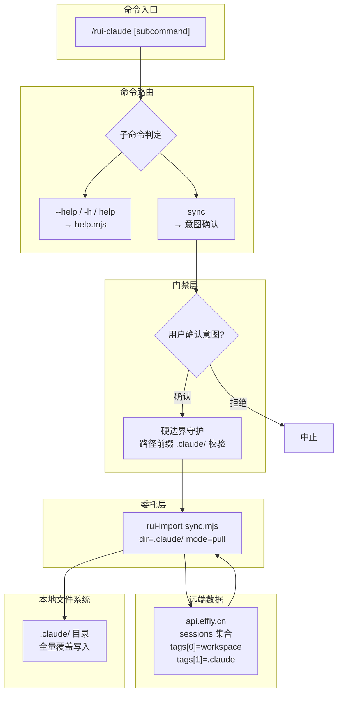
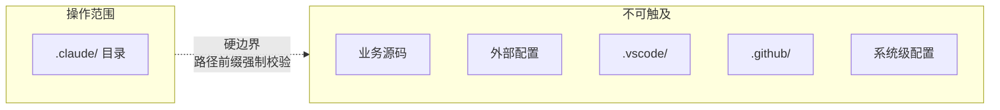
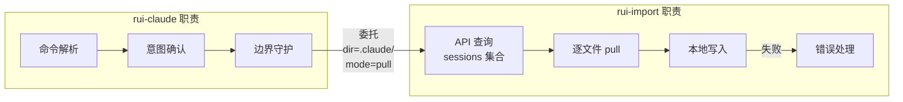

> | v1.0.0 | 2026-05-26 | deepseek-v4-pro | 🌿 feat/rui-claude | 📎 [CLAUDE.md](../../../CLAUDE.md) |

> **导航**: [← 使用场景](./使用场景.md) · [测试设计 →](./测试设计.md) · [安全审计 →](./安全审计.md)

> **来源引用**: 由 rui-claude 故事基线建立触发，从 `skills/rui-claude/SKILL.md` + `rules/rui-claude.md` 反推技术方案。证据 Level A + 规约路径。

[§0 基线溯源](#sec0-baseline) · [§1 架构设计](#sec1-arch) · [§2 操作边界](#sec2-boundary) · [§3 委托机制](#sec3-delegate) · [§4 安全设计](#sec4-security)

---

### 主要价值

- 🎯 极简架构 — 单一命令的委托模型，零同步逻辑自实现，职责单一明确
- 🔒 硬边界锁定 — 路径前缀强制校验 .claude/，任何外部写入均阻断
- ⚡ 完全委托 rui-import — dir=.claude/ mode=pull 语义由 rui-import 保证，rui-claude 不做同步
- 📊 意图确认门禁 — 覆盖式操作前的用户确认机制，防止误操作导致本地配置丢失

---

## §0 基线溯源

| 基线来源 | 本文档章节 | 映射关系 |
|---------|-----------|---------|
| 故事任务 §1 Story 1 | §1 架构设计 | .claude/ 同步 → 系统架构 |
| 故事任务 §2 FP1 | §3 委托机制 | sync 触发 → 委托 rui-import |
| 故事任务 §2 FP2 | §1 架构设计 | 意图确认 → 命令路由中的确认步骤 |
| 故事任务 §2 FP6 | §2 操作边界 | 硬边界 → 路径前缀校验 |
| 使用场景 场景 1–3 | §1 架构设计 | 用户交互流 → 命令路由 |

---

## §1 架构设计

### 效果示意

### 项目类型: meta (自托管编排系统)

### 命令族

| 命令 | 类型 | 行为 | 产出 |
|------|------|------|------|
| `/rui-claude sync` | 写入 | 委托 rui-import 覆盖式同步 | 本地 .claude/ 全量更新 |
| `/rui-claude` (空输入) | 只读 | 输出帮助信息 | 命令用法提示 |
| `/rui-claude --help` | 只读 | 执行 help.mjs | 完整帮助文档 |
| `/rui-claude help` | 只读 | 等同 --help | 完整帮助文档 |

---

## §2 操作边界

### 边界实现

| 层级 | 机制 | 说明 |
|------|------|------|
| 规约层 | SKILL.md + rules/rui-claude.md | 明确声明操作范围仅限 .claude/ |
| 命令层 | 委托 rui-import 时 dir 参数固定为 .claude/ | 不接收外部 dir 参数，不可配置 |
| 验证层 | 路径前缀校验 | 写入前逐文件校验路径前缀为 .claude/ |
| 阻断层 | 非 .claude/ 路径阻断 | 外部路径写入被拦截，记录告警，不执行 |

### 边界约束

| # | 约束 | 实现 |
|---|------|------|
| 1 | 写入路径必须以 `.claude/` 开头 | 路径前缀匹配校验 |
| 2 | 不接受用户指定的目标目录 | dir 参数硬编码为 `.claude/` |
| 3 | 不读取 .claude/ 以外的文件 | 只写不读，无路径遍历风险 |
| 4 | 不转发/不传递 API_X_TOKEN | 仅 rui-import 内部通过环境变量获取 |

---

## §3 委托机制

### 委托模型

### 委托参数

| 参数 | 值 | 说明 |
|------|-----|------|
| dir | `.claude/` | 固定值，不可配置。限定操作目标目录 |
| mode | `pull` | 覆盖式同步模式。远端内容覆盖本地对应文件 |
| 数据源 | API sessions 集合 | tags[0]=<workspace> && tags[1]=.claude |
| 认证 | API_X_TOKEN | 从环境变量读取，rui-claude 不持有/不传递 |

### 委托边界

| rui-claude 做什么 | rui-import 做什么 |
|-------------------|-------------------|
| 解析 `/rui-claude sync` 命令 | 连接远端 API |
| 确认用户意图 | 查询 sessions 集合 |
| 验证路径前缀为 `.claude/` | 逐文件 pull 内容 |
| 传递委托参数 (dir, mode) | 写入本地文件系统 |
| 监控委托结果 | 处理网络/认证/写入错误 |
| 汇总并展示同步结果 | 返回结果摘要给 rui-claude |

---

## §4 安全设计

| 安全面 | 设计决策 | 关联风险 | 优先级 |
|--------|---------|---------|--------|
| 认证凭据 | API_X_TOKEN 仅从环境变量读取，rui-claude 不存储、不传递、不记录 | 密钥泄露 | P0 |
| 路径遍历 | 写入路径固定为 `.claude/` 前缀，拒绝 `../` 和绝对路径 | 路径遍历攻击 | P0 |
| 操作边界 | 硬边界锁定 .claude/，不接收用户输入的目标目录 | 误操作 / 越权写入 | P0 |
| 意图确认 | 覆盖式操作前强制用户确认，不可绕过 | 误操作导致数据丢失 | P0 |
| 依赖安全 | 委托 rui-import 执行同步，不直接操作文件 I/O | 文件权限 / 竞态 | P1 |
| 错误处理 | 单文件失败不阻断整体流程，告警后继续 | 部分同步失败未被感知 | P1 |

### 安全约束落地

| # | 约束 | 来源 | 实现验证 |
|---|------|------|---------|
| 1 | 密钥不落盘 | CLAUDE.md 底线 | grep API_X_TOKEN 无硬编码 |
| 2 | 操作边界不可绕过 | rules/rui-claude.md | 逐文件路径前缀校验 |
| 3 | 用户意图必确认 | rules/rui-claude.md | sync 执行前交互确认 |
| 4 | 无外部文件写入 | SKILL.md 操作边界 | 路径白名单 `.claude/**` |

---

> **变更记录**
> | 日期 | 变更 | 触发 | 证据 |
> |------|------|------|------|
> | 2026-05-26 | 初始生成 | rui-claude 故事基线建立 | skills/rui-claude/SKILL.md + rules/rui-claude.md |
