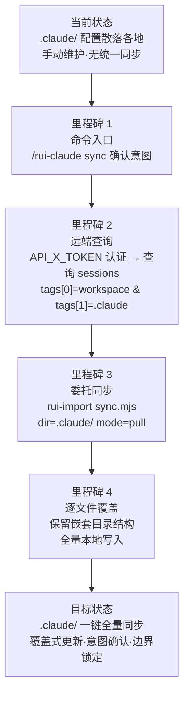

> | v1.0.0 | 2026-05-26 | deepseek-v4-pro | 🌿 feat/rui-claude | 📎 [CLAUDE.md](../../../CLAUDE.md) |

> **导航**: [使用场景 →](./使用场景.md)

> **来源引用**: 由 rui-claude story 基线建立触发，从 `skills/rui-claude/SKILL.md` + `rules/rui-claude.md` 反推。证据 Level A + SKILL.md 路径。

[§1 Story](#sec1-story) · [§2 Requirements](#sec2-requirements) · [§3 成功标准](#sec3-success) · [§4 范围边界](#sec4-scope) · [§5 AC](#sec5-ac) · [§6 风险与假设](#sec6-risks) · [§7 跨文档索引](#sec7-index)

---

### §0 基线声明

> **问题空间基线 (Problem Space Baseline)**: 本文档定义"做什么(WHAT)"和"为什么(WHY)"。所有后续文档的设计、实现、验证、改进决策均必须可追溯至本文档的具体章节。

---

### 需求概述

rui-claude 是 `.claude/` 目录的全量同步管理技能。它提供唯一命令 `/rui-claude sync`，从远端 API 查询指定工作空间的 `.claude/` 配置会话记录，逐文件覆盖到本地 `.claude/` 目录。操作边界强制限于 `.claude/`，不触及业务源码或外部配置。同步逻辑完全委托 rui-import 执行，rui-claude 自身不实现同步细节。

### 效果示意

### 主要价值

- 🎯 一键全量同步 — `/rui-claude sync` 将远端 .claude/ 配置全量覆盖到本地，消除手动维护
- 🔒 操作边界锁定 — 硬边界仅限 .claude/ 目录，不得触及业务源码和外部配置
- ⚡ 意图确认保护 — 覆盖式操作执行前强制确认用户意图，不可逆操作前防误触
- 📊 完全委托复用 — 同步逻辑完全委托 rui-import，rui-claude 自身零同步逻辑，单一职责清晰

---

## §1 Story

### Story 1: .claude/ 全量同步

| 字段 | 内容 |
|------|------|
| 作为 | 项目维护者/开发者 |
| 我想要 | 通过一条命令将远端 API 中存储的 .claude/ 配置同步到本地 |
| 以便 | 团队 .claude/ 配置保持一致，新成员或新环境可一键获取最新配置，无需手动复制 |
| 优先级 | P0 |
| 范围边界 | 仅操作 `.claude/` 目录，覆盖式写入。不读取、不修改、不创建 .claude/ 以外的任何文件 |
| 依赖 | `API_X_TOKEN` 环境变量已配置，远端 API (api.effiy.cn) 可访问，rui-import skill 可用 |

#### 范围外

- 不管理 .claude/ 以外的配置目录（如 .vscode/、.github/）
- 不实现增量/差异同步（始终全量覆盖）
- 不自行实现同步逻辑（委托 rui-import）
- 不处理 .claude/ 文件的语义内容（如合并冲突、冲突解决）
- 不创建或修改业务源码或外部系统配置

#### §1.1 User Operations

| # | 操作 | 触发条件 | 操作步骤 | 预期结果 |
|---|------|---------|---------|---------|
| 1 | 全量同步 .claude/ | 执行 `/rui-claude sync` | 确认用户意图 → rui-import 查询远端 API (tags[0]=<workspace> & tags[1]=.claude) → 逐文件 pull 覆盖本地 .claude/ → 保留嵌套目录结构 | 本地 .claude/ 与远端完全一致 |
| 2 | 查看帮助 | 执行 `/rui-claude` (无参数) 或 `/rui-claude --help` | 输出命令用法提示 | 显示可用子命令和简要说明 |

---

## §2 Requirements

#### 功能点

| FP# | 描述 | 输入 | 输出 | 错误行为 | 优先级 |
|-----|------|------|------|---------|--------|
| FP1 | 同步触发 — 接收 `/rui-claude sync` 命令并委托 rui-import 执行 | `/rui-claude sync` 命令 | rui-import sync.mjs 调用 (dir=.claude/ mode=pull) | 委托失败阻断，输出错误原因 | P0 |
| FP2 | 用户意图确认 — 覆盖式操作前向用户确认，防止误操作 | 用户输入 (y/n 或确认) | 通过 / 中止 | 用户拒绝后中止，不执行任何写入 | P0 |
| FP3 | 远端查询 — 通过 rui-import 查询 API sessions 集合中 tags[0]=<workspace> && tags[1]=.claude 的记录 | workspace 标识 + API_X_TOKEN | sessions 记录列表 | API 不可达或 token 无效→降级 no-token | P0 |
| FP4 | 逐文件覆盖 — 从远端 pull 每个 .claude/ 文件覆盖本地对应路径，保留嵌套目录结构 | sessions 记录中的文件列表 | 本地 .claude/ 目录全量覆盖 | 单个文件写入失败 → 记录告警，继续下一个 | P0 |
| FP5 | 帮助提示 — 无参数或 --help/-h 时显示命令用法 | 空输入 / --help / -h | 帮助文本 (通过 help.mjs 输出) | — | P1 |
| FP6 | 硬边界守护 — 任何操作不得触及 .claude/ 以外的文件系统路径 | 所有写入操作 | 仅 .claude/ 内文件变更 | 触及外部路径 → 阻断+撤销 | P0 |

#### 业务规则

| R# | 描述 | 校验方式 | 证据级别 |
|----|------|---------|---------|
| R1 | 操作边界仅限 .claude/ — 不得触及外部文件 | 逐文件路径前缀校验 `.claude/` | B |
| R2 | sync 覆盖式更新 — 执行前必须确认用户意图 | 交互日志检查确认步骤 | A |
| R3 | 完全委托 rui-import — 不自行实现同步逻辑 | 代码审查：sync 仅调用 rui-import | A |
| R4 | API_X_TOKEN 从环境变量读取 — 不配置/存储/传递凭据 | 代码扫描无 token 硬编码 | B |

#### 数据约束

| 约束 | 类型 | 范围/格式 | 来源 |
|------|------|----------|------|
| 操作目录 | path | `.claude/` (含嵌套子目录) | .claude/ 规范 |
| 工作空间标识 | string | tags[0] 值 (项目名) | 远端 API session tags |
| API_X_TOKEN | string | 仅环境变量，禁止落盘 | CLAUDE.md 底线 |
| 同步模式 | enum | pull (覆盖式) | rui-import mode 参数 |

---

## §3 成功标准

| SC# | 描述 | 度量方式 | 目标值 | 优先级 | 关联 FP# |
|-----|------|---------|--------|--------|---------|
| SC1 | 用户执行 `/rui-claude sync` 后，本地 `.claude/` 与远端完全一致 | diff -r 本地 .claude/ 与远端返回内容 | 100% 一致 | P0 | FP1, FP3, FP4 |
| SC2 | sync 操作不触及 .claude/ 以外的任何文件 | 操作前后 `git diff --stat` 仅含 .claude/ 路径 | 0 外部文件变更 | P0 | FP6 |
| SC3 | 无 API_X_TOKEN 时 sync 操作安全降级，不阻断用户工作流 | 缺失 token 时的行为 | 提示缺失 token，不崩溃 | P0 | FP3 |
| SC4 | 用户可在确认环节中止 sync，不产生任何文件变更 | 中止后 git status | clean (无变更) | P0 | FP2 |
| SC5 | 帮助命令在无网络的环境下仍可正常输出 | `/rui-claude --help` 输出 | 帮助文本正常显示 | P1 | FP5 |

---

## §4 范围边界

#### 范围内

| # | 条目 | 关联 FP# | 边界说明 |
|---|------|---------|---------|
| 1 | .claude/ 目录同步 | FP1, FP3, FP4 | 覆盖式更新，全量同步 |
| 2 | 用户意图确认 | FP2 | sync 前强制确认 |
| 3 | 帮助提示 | FP5 | 无参数或 --help/-h 输出帮助 |
| 4 | 硬边界守护 | FP6 | 所有路径前缀必须为 .claude/ |

#### 范围外

| # | 条目 | 排除原因 | 替代方案 |
|---|------|---------|---------|
| 1 | 业务源码同步 | 边界外 — 不属于 .claude/ 范畴 | 使用 `/rui import` 或 rui-import 直接调用 |
| 2 | .claude/ 增量同步/差异合并 | 设计决策：仅支持覆盖式，保持简单 | 远端 API 管理版本，用户自行在远端维护 |
| 3 | 同步逻辑实现 | 委托 rui-import，rui-claude 不实现 | rui-import sync.mjs dir=.claude/ mode=pull |
| 4 | .claude/ 内容语义校验 | 同步为文件级传输，不解析语义 | 文件质量由远端维护者保证 |
| 5 | 多工作空间批量同步 | 每次调用仅同步当前项目工作空间 | 为每个项目单独执行 sync |
| 6 | 同步回滚 | 覆盖式操作不可逆 | 通过 git 回退变更 |

#### 灰色区域

| # | 条目 | 触发条件 | 决策人 |
|---|------|---------|--------|
| 1 | .claude/ 目录不存在时是否自动创建 | sync 前目录缺失 | pm (当前决策：委托 rui-import 处理) |
| 2 | 远端无匹配 session 时的行为 | tags 查询返回空 | pm (当前决策：rui-import 处理空结果) |

---

## §5 AC

| AC# | Given | When | Then | 门禁 |
|-----|-------|------|------|------|
| AC1 | API_X_TOKEN 已配置，远端有对应工作空间的 .claude/ 数据 | 用户执行 `/rui-claude sync` 并确认 | 本地 .claude/ 被远端内容全量覆盖，嵌套目录结构保留 | Gate A |
| AC2 | API_X_TOKEN 未配置或无效 | 用户执行 `/rui-claude sync` | 提示 token 缺失，操作降级不崩溃 | Gate A |
| AC3 | 用户在确认环节拒绝 | `/rui-claude sync` 确认提示时用户输入 n/no | 操作中止，本地无任何文件变更 | Gate A |
| AC4 | 用户执行 `/rui-claude` 无参数 | 系统接收空输入 | 显示可用子命令 (sync/help) 和简要用法 | Gate A |
| AC5 | sync 写入过程中尝试写入 .claude/ 以外的文件 | rui-import 返回非 .claude/ 路径的文件 | 阻断该文件写入，记录告警，继续处理 .claude/ 内的文件 | Gate A |
| AC6 | rui-import 不可用或调用失败 | `/rui-claude sync` 委托 rui-import 失败 | 输出依赖缺失错误，提示用户检查 rui-import skill | Gate A |

---

## §6 风险与假设

| # | 风险/假设 | 类型 | 可能性 | 影响 | 缓解/验证策略 | 关联 FP# |
|---|----------|------|--------|------|-------------|---------|
| 1 | 覆盖式同步导致本地未提交的 .claude/ 修改丢失 | 风险 | M | H | sync 前强制用户意图确认；建议用户先 git commit 或 stash | FP2 |
| 2 | 远端 API 不可达导致 sync 无法执行 | 风险 | M | M | rui-import 超时 30s + 重试；失败时明确提示网络错误 | FP3 |
| 3 | 远端 .claude/ 内容被污染导致本地配置损毁 | 风险 | L | H | 远端数据管理不属于本 skill 范围；用户可通过 git 回退 | FP4 |
| 4 | API_X_TOKEN 过期导致认证失败 | 风险 | M | M | rui-import 处理认证失败并返回可读错误 | FP3 |
| 5 | 多个 agent 同时 sync 导致文件竞态 | 风险 | L | M | rui-import 逐文件覆盖，最后一次写入生效 | FP4 |
| 6 | API_X_TOKEN 已由环境变量配置且有效 | 假设 | — | — | 启动时 rui-import 验证 token 可达性 | FP3 |
| 7 | rui-import skill 正确实现了 dir=.claude/ mode=pull 语义 | 假设 | — | — | rui-import 独立验证，rui-claude 仅做委托 | FP1 |
| 8 | 用户理解覆盖式同步的含义并做好本地备份 | 假设 | — | — | 确认提示明确说明 "覆盖式" 操作 | FP2 |

---

## §7 跨文档索引

| 本文档章节 | 下游文档 | 状态 |
|-----------|---------|------|
| §1 Story 1 | 使用场景 | 待生成 |
| §2 FP1–FP6 | 技术评审 | 待生成 |
| §5 AC1–AC6 | 测试设计 | 待生成 |
| §6 风险 1–8 | 安全审计 | 待生成 |

---

> **变更记录**
> | 日期 | 变更 | 触发 | 证据 |
> |------|------|------|------|
> | 2026-05-26 | 初始生成 | rui-claude 故事基线建立 | skills/rui-claude/SKILL.md |
