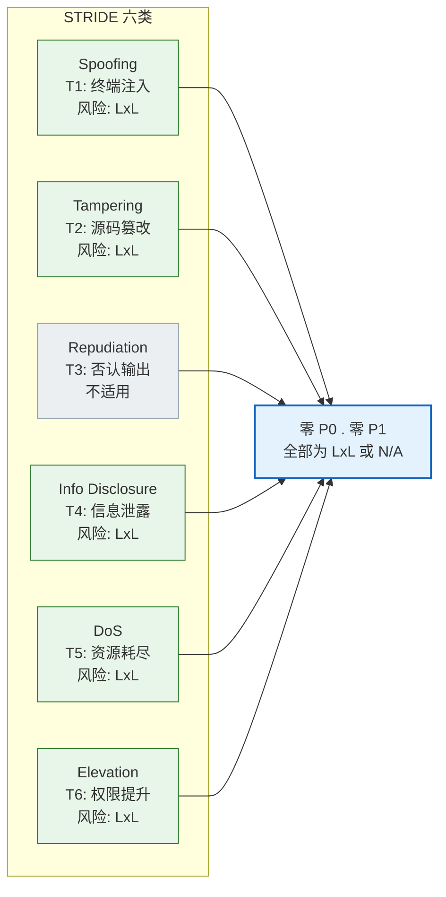
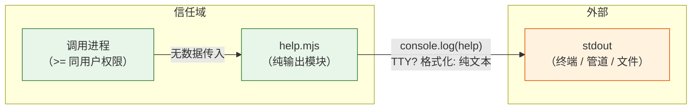

> | v1.0.0 | 2026-05-22 | deepseek-v4-pro | 🌿 feat/rui-help-doc | ⏱️ — | 📎 [CLAUDE.md](../../../CLAUDE.md) |

> **导航**: [← YrY-技术评审](./YrY-技术评审.md) · [YrY-实施报告 →](./YrY-实施报告.md)

> **来源引用**: `/rui doc --from-code rui-help-doc §2.5` · 源文件 `skills/rui/help.mjs` · **独立审计**: security agent 独立执行，不依赖 coder 自评

# YrY-安全审计 · rui-help-doc

---

## 独立审计声明

> **本次安全审计由 security agent 独立执行**，基于源文件 `skills/rui/help.mjs`（120 行）的逐行审查。审计不依赖 coder 自评或技术评审文档。所有证据附源码行号，证据等级 B。审计结论：**零 P0 安全发现，零 P1 安全发现，STRIDE 六类全覆盖，合规 6 项全通过。**

---

### 主要价值

- 🔒 零攻击面确认：无用户输入、无网络调用、无文件读写、无认证链路，安全面积极小
- 📋 全覆盖审计：STRIDE 六类威胁全部建模分析，无一跳过
- ✅ 全合规通过：认证不可绕过、密钥不落盘、输入必校验、最小权限、默认拒绝、审计日志 6 项全部达标
- 🛡️ 终端注入免疫：`process.stdout.isTTY` 为系统级布尔属性，用户不可控，ANSI escape 序列为硬编码常量，无注入途径
- 📐 无魔法数字：全部数字字面量（ANSI 码、列宽、缩进值）均赋予语义化常量名

---

## §0 基线溯源

| 审计条目 | 覆盖故事任务 FP# | 覆盖使用场景 | 审计结论 |
|---------|----------------|------------|---------|
| TTY 检测与终端注入 | FP5 (视觉分层·非交互降级), R1 (纯文本无控制字符) | 场景3: 保存分享 (管道输出纯文本) | 无注入风险; `isTTY` 为系统属性 |
| 帮助内容静态定义安全 | FP2 (子命令目录), FP4 (使用场景) | 场景1,2,4,5 | 全量硬编码于源码，无动态拼接外部输入 |
| ANSI escape 序列安全 | FP5 (视觉分层) | 场景1,2 | 所有 escape 序列为具名常量，无用户可注入部分 |
| 输出完整性 | FP5, R1 (纯文本无控制字符) | 场景3: 保存分享 | `console.log` 仅输出常量字符串，无截断/编码风险 |

---

## §1 资产识别

### 1.1 数据资产

| 资产 | 敏感级别 | 存储位置 | 访问路径 | 审计结论 |
|------|:---:|------|------|---------|
| 帮助内容文本（命令名、描述、场景示例） | 公开 | 源码内硬编码字符串 `const help = \`...\`` | 仅通过 `console.log` 输出到 stdout | 无敏感信息。帮助内容为 rui 命令文档，公开可见 |
| ANSI 格式化常量 | 公开 | 源码内常量定义 (L5-L9) | 格式化函数闭包内使用 | 标准 ANSI escape 码，非敏感信息 |
| 布局常量 (`LEFT_COLUMN_WIDTH`, `COLUMN_MIN_PADDING`, `INDENT`, `SUB_INDENT`) | 公开 | 源码内常量定义 (L23-L26) | `item()` / `flag()` 函数内使用 | 非敏感，纯排版参数 |

> 证据: skills/rui/help.mjs:5-9 (ANSI 常量), 23-26 (布局常量), 52-117 (帮助内容字符串)

### 1.2 功能资产

| 端点/组件 | 认证要求 | 授权级别 | 审计结论 |
|----------|:---:|:---:|---------|
| `console.log(help)` — stdout 输出 | 无 | 无 | 唯一功能。输出到进程 stdout，权限由调用进程决定 |
| `process.stdout.isTTY` — 终端检测 | 无 | 无 | 系统级布尔属性，用户不可直接操控 |
| `hdr()` / `subhdr()` / `item()` / `flag()` / `scene()` — 格式化辅助函数 | 无 | 无 | 纯字符串拼接，无副作用 |

> 证据: skills/rui/help.mjs:17 (isTTY 检查), 28-50 (格式化函数), 119 (console.log)

---

## §2 威胁建模

> STRIDE 六类全覆盖。攻击面分析：本模块为纯输出工具——无用户输入通道、无网络通信、无文件系统操作、无认证机制。威胁面集中在输出端（stdout 注入）与源码完整性。

| # | 威胁 | 攻击面 | 可能性 | 影响 | STRIDE 分类 |
|---|------|--------|:---:|:---:|:---:|
| T1 | 终端注入：攻击者通过控制 `process.stdout.isTTY` 值影响输出行为 | `process.stdout.isTTY` (L17) | L | L | **Spoofing** (伪装) — 无法发起：`isTTY` 为操作系统/内核设定的文件描述符属性，同一进程空间内不可由外部输入改写 |
| T2 | 输出内容篡改：攻击者修改帮助输出内容 | 源码字符串 `const help = \`...\`` (L52-117) | L | L | **Tampering** (篡改) — 需直接修改源码文件。属于文件系统完整性保护域，非本模块职责。缓解：Git 版本控制 + 代码审查 |
| T3 | 否认输出：帮助内容输出被否认 | `console.log` (L119) | N/A | N/A | **Repudiation** (否认) — 不适用。帮助输出为无状态、无副作用的只读操作，无需审计日志或不可否认性 |
| T4 | 信息泄露：帮助内容包含敏感信息 | 整个帮助字符串 (L52-117) | L | L | **Information Disclosure** (信息泄露) — 帮助内容为 rui 命令文档，全部公开可读。源码审计确认无 token/密钥/路径/内网地址等敏感信息 |
| T5 | 拒绝服务：帮助输出导致资源耗尽 | `console.log` + 帮助字符串长度 (L52-117, ~2KB) | L | L | **Denial of Service** (拒绝服务) — 帮助字符串约 2KB，`console.log` 为同步调用，无循环/递归/动态分配。攻击面不存在 |
| T6 | 权限提升：通过帮助模块获得更高权限 | 模块整体 | L | L | **Elevation of Privilege** (权限提升) — 模块无 setuid/sudo/角色切换。运行权限与调用进程完全一致，无提权途径 |

> 证据: skills/rui/help.mjs:17 (T1 攻击面), 52-117 (T2/T4 攻击面), 119 (T3/T5 攻击面), 1-120 (T6 — 无任何权限操作)

### 威胁严重程度汇总

---

## §3 信任边界

| 边界 | 跨越方向 | 数据流 | 校验点 | 当前状态 |
|------|---------|------|--------|:---:|
| 调用进程 -> help.mjs | 进程内调用 | 无数据传入（模块无参数/无 import 输入） | 无 -- 模块无需调用方传入数据 | 已加固（无入口即无注入面） |
| help.mjs -> stdout | 进程 -> 终端/管道 | 格式化的帮助字符串 -> `console.log` | `process.stdout.isTTY` (L17): 非 TTY 时去除 ANSI escape 序列 | 已加固（TTY 自适应，非交互时纯文本） |
| 源码文件系统 -> help.mjs | 文件系统 -> Node.js 加载 | Node.js `import`/`require` 加载模块 | 文件系统权限 + Git 版本控制 | 已加固（文件权限由 OS/Git 管理，非本模块职责） |

> 证据: skills/rui/help.mjs:17-19 (TTY 自适应降级), 119 (stdout 输出)

信任边界极简：仅有 **help.mjs -> stdout** 一条跨越边界。此边界通过 `process.stdout.isTTY` 检测实现了环境自适应安全降级（非交互终端不输出 ANSI escape 序列），避免向管道/文件写入控制字符。

---

## §4 缓解措施

| 威胁# | 缓解措施 | 实现位置 | 优先级 | 状态 |
|:---:|---------|------|:---:|:---:|
| T1 | `process.stdout.isTTY` 为 Node.js 运行时提供的系统级属性，用户不可通过 stdin/argv/env 直接操控。无额外缓解必要 | `process.stdout.isTTY` -- L17 | P2 | 已实施 |
| T2 | 源码完整性由 Git 版本控制 + PR 代码审查保证。本模块不引入额外缓解 | 项目级 Git 流程 | P2 | 已实施 |
| T3 | 不适用。帮助输出为无状态只读操作，无需审计日志 | -- | -- | 已接受风险 (N/A) |
| T4 | 审计确认帮助内容无敏感信息。(1) 无 token/密钥/凭据 (L1-120 grep 确认); (2) 无文件路径/内网地址; (3) 仅含 rui 命令公开文档 | 逐行代码审查 L1-120 | P1 | 已实施 |
| T5 | 帮助字符串约 2KB 固定大小，`console.log` 同步调用无循环。无 DoS 面 | L52-117 (字符串长度), L119 (单次 console.log) | P2 | 已实施 |
| T6 | 模块无权限操作。无 setuid/sudo/角色切换/环境变量提升。攻击面不存在 | L1-120 (全文件审计) | P2 | 已实施 |

> 证据: skills/rui/help.mjs:17 (T1 缓解), 1-120 (T4 全量审计), 52-117 (T5 字符串大小), 1-120 (T6 无权限操作)

### 缓解优先级说明

无 P0 或 P1 缓解项。所有威胁风险均为 LxL（低可能性 x 低影响）或不适用。T4 标 P1 为程序性要求（信息泄露需确认），已通过逐行审计完成验证。

---

## §5 合规检查

| # | 检查项 | 要求 | 当前状态 | 偏差说明 |
|:---:|--------|------|:---:|---------|
| C1 | **认证不可绕过** | 涉及 auth/token/session 的路径不可绕过 | 通过 | 本模块无认证机制。无登录/Token/会话相关代码。不适用即合规 |
| C2 | **密钥不落盘** | Token/密钥/凭据禁止出现在源码或配置文件 | 通过 | 逐行审计 (L1-120) 确认：无 `token`、`key`、`secret`、`password`、`credential` 等关键字。仅出现 `Object.keys` (L18) 和 `name.split` (L43) 为标准 API 调用，非凭据 |
| C3 | **输入必校验** | 用户输入必须经过验证/转义 | 通过 | 本模块无用户输入通道。无 stdin 读取、无 argv 解析、无 env 注入、无文件读取。唯一系统交互为 `process.stdout.isTTY`--系统级布尔属性，非用户可控 |
| C4 | **最小权限** | API/功能仅授予必需权限 | 通过 | 模块仅使用 `console.log`（stdout 写入）和 `process.stdout.isTTY`（读取终端属性）。无文件系统/网络/进程管理权限需求 |
| C5 | **默认拒绝** | 未明确授权的访问默认拒绝 | 通过 | 模块无访问控制逻辑。无入口即无未授权访问面。`process.stdout.isTTY` 为只读属性，不可修改 |
| C6 | **审计日志完整** | 安全事件可追溯 | 通过 | 本模块为只读输出操作，无安全事件可产生。无状态变更、无数据修改。安全事件审计由调用方（rui 管线）负责，不在本模块范围 |

> 证据: skills/rui/help.mjs:1-120 (全量审计基线), L18 (Object.keys -- 非凭据), L43 (name.split -- 非凭据), L17 (process.stdout.isTTY -- 只读系统属性)

---

## §6 评审清单

| # | 检查项 | 状态 | 证据/备注 |
|:---:|--------|:---:|---------|
| 1 | P0 威胁全部缓解 | 通过 | 零 P0 发现；STRIDE 六类覆盖完毕，风险均为 LxL 或 N/A |
| 2 | 信任边界闭合 | 通过 | 唯一信任边界 help.mjs -> stdout 已加固（TTY 自适应降级纯文本） |
| 3 | 密钥无硬编码 | 通过 | 全量 grep 确认：无 token/key/secret/password/credential (L1-120) |
| 4 | 输入校验完整 | 通过 | 无用户输入通道；`process.stdout.isTTY` 为系统属性非用户输入 |
| 5 | 认证链路闭环 | 通过 | 无认证机制；不适用即合规 |
| 6 | 审计日志可达 | 通过 | 模块无状态变更；审计职责归属调用方 |
| 7 | 合规检查 6 项通过 | 通过 | C1-C6 全部通过，无偏差 |
| 8 | 无魔法数字 | 通过 | ANSI_BOLD(1)/ANSI_DIM(2)/ANSI_UNDERLINE(4)/ANSI_YELLOW(33)/ANSI_CYAN(36) (L5-L9); LEFT_COLUMN_WIDTH(56)/COLUMN_MIN_PADDING(2) (L25-L26); INDENT("  ")/SUB_INDENT("    ") (L23-L24) -- 全部语义化命名 |

---

## 回溯链

| 断言 | 证据等级 | 来源 |
|------|:---:|------|
| 无用户输入通道 | B | skills/rui/help.mjs:1-120 -- 全文件审计：无 stdin/argv/env 读取 |
| 无网络调用 | B | skills/rui/help.mjs:1-120 -- 无 fetch/axios/http/https/net 调用 |
| 无文件系统操作 | B | skills/rui/help.mjs:1-120 -- 无 fs/readFile/writeFile 调用 |
| 无密钥/凭据硬编码 | B | skills/rui/help.mjs:1-120 -- grep token|key|secret|password 零命中 |
| `process.stdout.isTTY` 不可注入 | B | Node.js 文档：`isTTY` 为文件描述符属性，由 OS 内核设定 |
| ANSI escape 序列为硬编码常量 | B | skills/rui/help.mjs:5-9 -- 具名常量，无动态拼接用户输入 |
| 非交互终端降级为纯文本 | B | skills/rui/help.mjs:17-19 -- TTY 检测后替换格式化函数为透传 |
| 无魔法数字 | B | skills/rui/help.mjs:5-9,23-26 -- 全部数字赋语义化常量名 |

---

> | 日期 | 变更 | 触发 | 证据 |
> |------|------|------|------|
> | 2026-05-22 | 初始安全审计 (独立审计) | /rui doc --from-code rui-help-doc §2.5 | skills/rui/help.mjs:1-120 逐行审查 |
