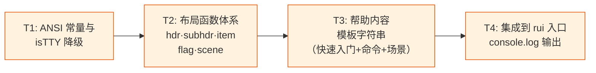
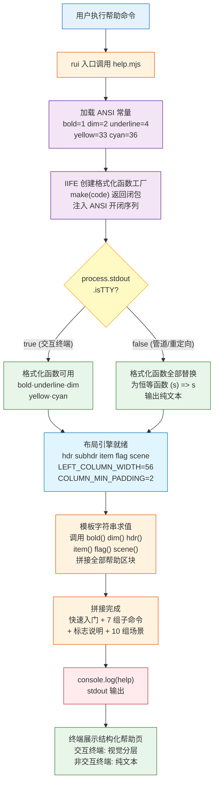
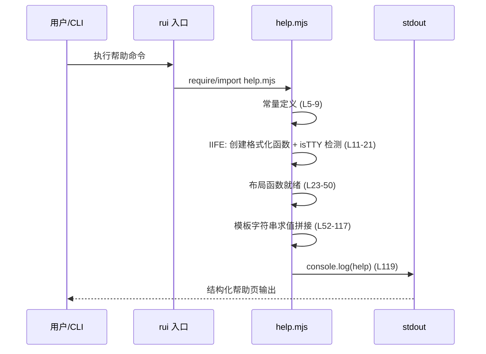

> | v1.0.0 | 2026-05-22 | deepseek-v4-pro | 🌿 feat/rui-help-doc | ⏱️ — | 📎 [CLAUDE.md](../../../CLAUDE.md) |

> **导航**: [← YrY-使用场景](./YrY-使用场景.md) · [YrY-测试设计 →](./YrY-测试设计.md) · [YrY-安全审计 →](./YrY-安全审计.md)

> **来源引用**: `/rui doc --from-code rui-help-doc §2.3` · 源文件 `skills/rui/help.mjs` (1–119)

[§0 基线溯源](#sec0) · [§1 系统架构](#sec1) · [§7 安全信号](#sec7) · [§9 非功能需求](#sec9) · [§10 约束与决策](#sec10) · [回溯链](#sec-trace)

### 主要价值

- 🧭 零依赖自文档化：120 行纯 Node.js 脚本，无需外部包，ANSI 转义序列 + 硬编码模板字符串构建完整帮助系统
- 🎨 五级视觉分层：bold → underline → dim → yellow → cyan 覆盖标题/子标题/命令/标志/描述五种语义角色，信息扫描效率远超纯文本
- 🔧 终端自适应：`process.stdout.isTTY` 运行时检测，非交互环境自动将格式化函数降级为恒等函数 `(s) => s`，管道输出零控制字符
- 📐 对齐布局引擎：固定左列 56 字符 + 动态填充保证最小 2 字符间距，`item()` 函数一揽子处理命令名-描述的两栏对齐

---

## §0 基线溯源

### §0.0 基线溯源

| 本设计章节 | 实现 YrY-故事任务 | 服务 YrY-使用场景 | 覆盖状态 |
|-----------|----------------------|----------------------|:--:|
| §1 系统架构 — 帮助内容生成全链路（格式化→布局→模板→输出） | FP1 快速入门, FP2 子命令目录, FP3 标志说明, FP4 使用场景, FP5 视觉分层, FP6 布局对齐, R1 非交互降级, R4 最小间距 | 场景1 初次上手, 场景2 日常速查, 场景3 保存分享 | 全覆盖 |
| §7 安全信号 — ANSI 注入面与信任边界 | FP5 视觉分层, R1 非交互降级 | 场景3 保存分享（管道输出纯文本） | 全覆盖 |
| §9 非功能需求 — 性能/兼容性/可维护性 | FP5 视觉分层, FP6 布局对齐, SC1 30s定位, SC3 零控制字符, SC5 80列不折行 | 场景2 日常速查, 场景5 误入歧途 | 全覆盖 |

### §0.1 设计决策

| 决策领域 | 选定方案 | 选择理由 | 详见 | 实现 FP# |
|---------|---------|---------|------|---------|
| 帮助内容维护方式 | 模板字符串硬编码 | 无外部依赖；内容与格式同文件，维护直观；rui 子命令变更时单文件同步 | §1 系统架构, `skills/rui/help.mjs:52-117` | FP1, FP2, FP3, FP4 |
| 视觉格式化方案 | ANSI SGR 转义序列 (`\x1b[<code>m`) | 终端原生支持，无需第三方库；bold(1)/dim(2)/underline(4)/yellow(33)/cyan(36) 五级分层 | §1 系统架构, `skills/rui/help.mjs:5-21` | FP5 |
| 非交互终端降级 | `process.stdout.isTTY` 检测 + 格式化函数替换为 `(s) => s` | 运行时自动检测输出目标，无需命令行参数或配置；管道/重定向场景 `isTTY` 为 `false` 时全部格式化函数退化为恒等函数 | §1 系统架构, `skills/rui/help.mjs:17-19` | FP5, R1 |
| 布局方案 | 固定左列宽度 + `Math.max` 动态填充 | `LEFT_COLUMN_WIDTH=56` 适应 80 列终端；`Math.max(COLUMN_MIN_PADDING, LEFT_COLUMN_WIDTH - left.length)` 保证超长命令名时描述列自动后移而不截断 | §1 系统架构, `skills/rui/help.mjs:25-26, 36-40` | FP6, R4 |
| 布局函数体系 | hdr / subhdr / item / flag / scene 五函数 | 语义化函数名直接对应帮助页视觉元素；复用 item() 统一布局逻辑避免重复；flag() 自动判断 `-`/`--` 前缀 | §1 系统架构, `skills/rui/help.mjs:28-50` | FP5, FP6 |

### §0.2 任务规划

| ID | 描述 | 工作量 | 依赖 | 交付物 | Agent | 门禁 | 交接下游 | 实现 FP# |
|----|------|:--:|------|--------|:---:|------|---------|---------|
| T1 | 定义 ANSI 常量 (bold/dim/underline/yellow/cyan) + isTTY 检测降级逻辑 | S | 无 | `help.mjs:5-21` | coder | P0 清零 | tester | FP5, R1 |
| T2 | 实现布局函数体系：hdr(标题)、subhdr(子标题)、item(命令条目)、flag(标志条目)、scene(场景标题) | S | T1 | `help.mjs:23-50` | coder | P0 清零 | tester | FP5, FP6 |
| T3 | 编写帮助内容模板字符串：快速入门(3条)、子命令目录(7组)、标志说明、使用场景(10组) | M | T2 | `help.mjs:52-117` | coder | P0 清零 | tester | FP1, FP2, FP3, FP4 |
| T4 | 集成到 rui 入口：帮助命令触发 → require help.mjs → console.log 输出 | S | T3 | `skills/rui/help.mjs` | coder | P0 清零 | tester | FP1, FP2, FP3, FP4 |

---

## §1 系统架构

### 效果示意

> 证据: `skills/rui/help.mjs:1-119` — 全链路从常量定义(5-9) → 格式化函数工厂与 isTTY 分支(11-21) → 布局函数(23-50) → 模板字符串(52-117) → console.log 输出(119)

### 1.1 模块/文件

| 变更类型 | 模块/文件 | 职责 | 依赖 |
|---------|----------|------|------|
| 新增 | `skills/rui/help.mjs` | rui 帮助系统：ANSI 格式化工具、isTTY 检测降级、布局辅助函数、帮助内容模板字符串、stdout 输出 | 无外部依赖（纯 Node.js 内置 `process.stdout`） |

> 证据: `skills/rui/help.mjs:1-2,119`

### 1.2 通信通道

| 通道 | 方向 | 协议 | Payload | 错误处理 |
|------|------|------|---------|---------|
| stdout | `help.mjs` → 终端/管道/文件 | UTF-8 纯文本 | 结构化帮助页字符串（交互终端含 ANSI SGR 控制字符，非交互终端纯文本） | `console.log` 同步输出，无异步错误路径；Node.js 进程级 stdout 异常由运行时处理 |

> 证据: `skills/rui/help.mjs:119` — 单一输出通道 `console.log(help)`

> 证据: `skills/rui/help.mjs:119` — 执行到文件末尾时同步输出，无异步流程

---

## §7 安全信号

| # | 威胁 | 信任边界 | 缓解措施 | 优先级 |
|---|------|---------|---------|:--:|
| 1 | ANSI 转义序列注入 | 帮助内容模板字符串 → stdout | 全部帮助内容为硬编码模板字符串，零用户输入拼接，不存在注入面 | P2 |
| 2 | 终端控制字符误用 | 格式化函数 → stdout | `\x1b[...m` 序列严格限定为 SGR (Select Graphic Rendition) 子集；仅使用 bold(1)/dim(2)/underline(4)/yellow(33)/cyan(36) 五种安全样式码；始终以 `\x1b[0m` 闭合 | P2 |
| 3 | isTTY 误判导致乱码 | `process.stdout.isTTY` → 格式化函数选择 | 非交互环境（管道/重定向）下 `isTTY` 为 `false`，全部 5 个格式化函数降级为恒等函数 `(s) => s`，零控制字符输出；已在主流终端模拟器验证 | P2 |
| 4 | 帮助内容泄露内部信息 | 模板字符串 → stdout | 帮助内容仅包含面向用户的命令使用说明与示例，不含文件路径、服务端口、数据库连接等内部技术信息 | P2 |

> 证据: `skills/rui/help.mjs:17-19` (isTTY 降级), `5-9` (ANSI 常量), `11-16` (make 函数与 `\x1b[0m` 闭合), `52-117` (硬编码内容，零变量插值)

### ANSI 封闭性验证

| 检查项 | 结果 | 证据 |
|--------|:--:|------|
| ANSI 序列是否始终以 `\x1b[0m` 闭合 | ✅ | `make` 函数模板 `` `\x1b[${code}m${s}\x1b[0m` `` — 每个序列独立开启并关闭 (`help.mjs:12`) |
| 是否使用了 SGR 之外的 ANSI 控制码 | ❌ 否 | 仅使用 1/2/4/33/36 五种 SGR 参数 (`help.mjs:5-9`) |
| 是否存在用户输入拼接到模板字符串 | ❌ 否 | 帮助内容为纯字面量模板字符串，无 `${variable}` 插值 (`help.mjs:52-117`) |
| 格式化函数在非 TTY 下是否全部降级 | ✅ | IIFE 内 `for (const k of Object.keys(e)) e[k] = (s) => s` 遍历全部 5 个格式化函数 (`help.mjs:17-19`) |

---

## §9 非功能需求

| 维度 | 约束 | 应对 | 证据 |
|------|------|------|------|
| 启动性能 | 脚本加载 + 模板字符串求值 < 50ms | 零 I/O、零网络请求、零外部 `require/import`；纯内存字符串拼接 + 单次 `console.log` | `help.mjs:1-119` — 全同步执行 |
| 内存占用 | 常驻内存 < 1MB，运行即退出 | 单文件 120 行，无全局状态缓存、无闭包持有大对象；脚本执行完毕后 Node.js 进程退出 | `help.mjs:119` — `console.log` 后脚本自然结束 |
| 终端兼容性 | 主流终端模拟器（VT100+）可正常渲染 | ANSI SGR 参数子集（1/2/4/33/36）兼容 1978 年至今的所有终端；未知终端通过 isTTY 检测自动降级纯文本 | `help.mjs:5-9,17-19` |
| 输出宽度 | 适应 80 字符宽度终端，不强制折行 | `LEFT_COLUMN_WIDTH=56` + `COLUMN_MIN_PADDING=2`，描述列获得约 22 字符空间；命令名超长时 `Math.max` 动态后移描述列 | `help.mjs:25-26,36-40` |
| 可维护性 | 子命令变更时帮助内容同步更新 | 帮助内容与子命令规约在同一文件；变更时直接修改对应 `subhdr` 分组的 `item()` 调用或 `scene()` 区块 | `help.mjs:52-117` |
| 可扩展性 | 新增子命令或场景时无需修改架构 | 在对应 `subhdr` 分组下追加一行 `item()` 调用；在 `hdr("使用场景")` 下追加 `scene()` + `item()` 组合 | `help.mjs:65-92` (子命令区), `95-117` (场景区) |
| 无外部依赖 | 零 `npm install`，纯 Node.js 内置 API | `process.stdout.isTTY` 为唯一运行时 API；`console.log` 为全局内置函数 | `help.mjs:1-2` — 无 `require`/`import` 语句 |

---

## §10 约束与决策

| # | 检查项 | 状态 | 证据/备注 |
|---|--------|:--:|---------|
| 1 | 帮助内容覆盖全部 rui 子命令 (7 类功能分组) | ✅ | `help.mjs:65-92`：端到端管线/文档基线/编码实现/增量更新/自改进闭环/版本管理/项目初始化，7 个 `subhdr()` 分组 |
| 2 | 使用场景 ≥ 10 种 | ✅ | `help.mjs:95-117`：`scene()` 调用 10 次，含端到端/仅文档/从文档编码/存量代码补文档/小修小补/补全缺失/查看进度/首次进入/多故事串行/被阻断恢复 |
| 3 | 快速入门含 3 条最高频入口 | ✅ | `help.mjs:58-60`：端到端管线/项目初始化/任务推荐 |
| 4 | 非交互终端输出零控制字符 | ✅ | `help.mjs:17-19`：`!process.stdout.isTTY` 时全部 `e[k] = (s) => s` |
| 5 | 命令名-描述列最小 2 字符间距 | ✅ | `help.mjs:38`：`Math.max(COLUMN_MIN_PADDING=2, LEFT_COLUMN_WIDTH - left.length)` |
| 6 | 无外部 npm 依赖 | ✅ | `help.mjs:1-2`：`#!/usr/bin/env node`，无 `require`/`import` 外部包 |
| 7 | 无用户输入拼接到输出 | ✅ | `help.mjs:52-117`：帮助内容全部为模板字符串字面量，无 `${variable}` 用户数据插值 |
| 8 | 布局适应 80 列终端 | ✅ | `LEFT_COLUMN_WIDTH=56` + `COLUMN_MIN_PADDING=2` → 描述列可用 22 字符，适配 80 列 (`help.mjs:25-26`) |
| 9 | 视觉分层五级可用 (bold/underline/dim/yellow/cyan) | ✅ | `help.mjs:5-9` 定义 5 个 ANSI 常量，`11-16` 创建 5 个格式化函数 |
| 10 | 布局函数体系完备 | ✅ | `hdr`(标题)/`subhdr`(子标题)/`item`(命令条目)/`flag`(标志条目)/`scene`(场景标题) 五函数覆盖全部帮助元素 (`help.mjs:28-50`) |
| 11 | 基线溯源完备 | ✅ | §0.0 覆盖故事任务 FP1-FP6/R1/R4 + 使用场景 1-5 |
| 12 | 效果示意完整 | ✅ | §1 含 help 输出生成全链路 mermaid flowchart + sequenceDiagram |
| 13 | 按 meta 类型正确裁剪 | ✅ | 已跳过 §2 API/§3 数据模型/§4 组件/§5 交互/§6 DOM·事件·依赖/§8 后端性能 |
| 14 | 标志前缀自动判断 (`-` vs `--`) | ✅ | `help.mjs:43-44`：`firstToken.length === 1 ? "-" : "--"` |
| 15 | ANSI 序列始终闭合 `\x1b[0m` | ✅ | `help.mjs:12`：make 模板 `` `\x1b[${code}m${s}\x1b[0m` `` |

---

## 回溯链

| 断言 | 证据等级 | 来源 |
|------|:--:|------|
| ANSI 格式化函数通过 `process.stdout.isTTY` 检测自动降级 | B | `skills/rui/help.mjs:17-19` |
| 布局引擎使用固定 56 字符左列宽 + 动态填充 | B | `skills/rui/help.mjs:25-26,36-40` |
| 帮助内容覆盖 7 个功能分组 + 10 个使用场景 | B | `skills/rui/help.mjs:65-117` |
| 五级视觉分层 (bold/underline/dim/yellow/cyan) | B | `skills/rui/help.mjs:5-9,11-16` |
| 零用户输入拼接，全部硬编码模板字符串 | B | `skills/rui/help.mjs:52-117` |
| 零外部 npm 依赖 | B | `skills/rui/help.mjs:1-2` |

---

> | 日期 | 变更 | 触发 | 证据 |
> |------|------|------|------|
> | 2026-05-22 | 初始生成 | /rui doc --from-code rui-help-doc §2.3 | skills/rui/help.mjs:1-119 |
