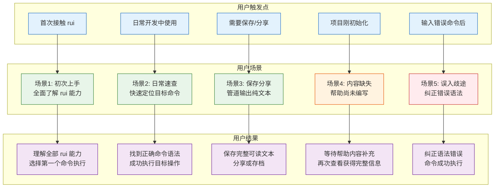
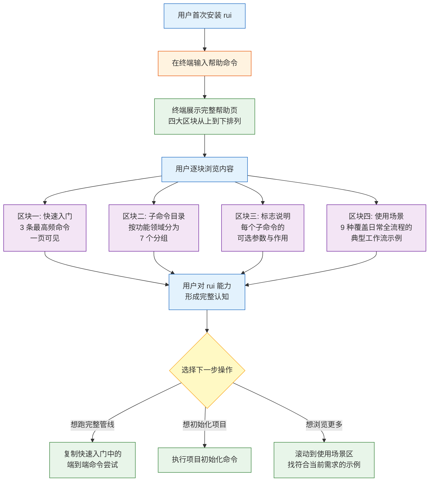
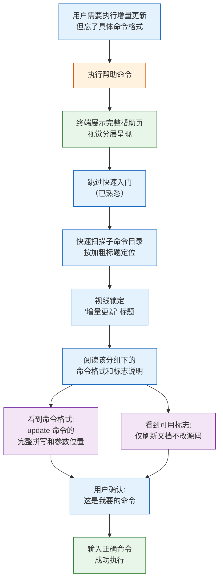
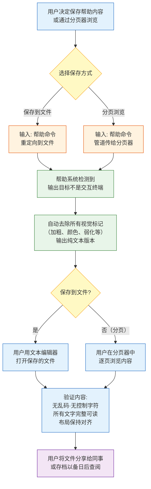
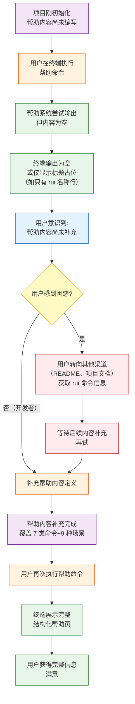
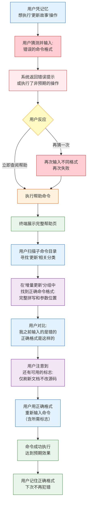
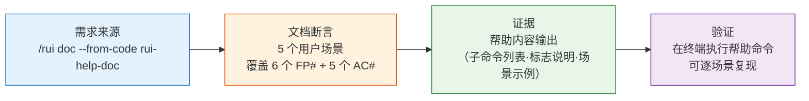

> | v1.0.0 | 2026-05-22 | deepseek-v4-pro | 🌿 feat/rui-help-doc | ⏱️ — | 📎 [CLAUDE.md](../../../CLAUDE.md) |

> **导航**: [← YrY-故事任务](./YrY-故事任务.md) · [YrY-技术评审 →](./YrY-技术评审.md)

> **来源引用**: `/rui doc --from-code rui-help-doc` · 从帮助命令的终端输出内容反推用户旅程

[主要价值](#main-value) · [§0 基线声明](#sec0-baseline) · [§1 场景全景](#sec1-scenarios) · [§2 场景详述](#sec2-details) · [§3 场景覆盖矩阵](#sec3-matrix) · [§4 评审清单](#sec4-checklist) · [§5 体验基线](#sec5-experience) · [回溯链](#traceability)

# YrY-使用场景 · rui-help-doc

## 主要价值

- 🧭 自助发现：用户无需离开终端即可完整了解 rui 全部能力，从入门到专家一条命令全覆盖
- 🎯 快速定位：视觉分层（标题突出、命令高亮、描述弱化）让目标命令即时可辨，扫描效率远超纯文本
- 📋 全景覆盖：快速入门、子命令目录、标志说明、使用场景四大模块一站式呈现，消除"还有什么命令"的不确定性
- 🔧 环境自适应：非交互终端自动输出纯文本，确保帮助内容在任何环境下完整可读
- 🧩 零学习成本：用户不需要理解 rui 内部结构，即可通过帮助页自主发现和尝试 rui 功能

---

## §0 基线声明

> **用户空间基线 (User Space Baseline)**: 本文档定义"谁使用(WHO)"和"如何体验(HOW EXPERIENCE)"。所有交互设计(技术评审)、测试用例(测试设计)、验收标准(故事任务 §5)均必须覆盖本文档定义的每个场景。

| 约束 | 规则 |
|------|------|
| 语言边界 | 仅使用目标用户能理解的语言。**禁止**包含：技术术语、命令执行细节的代码级描述、文件路径、系统内部组件名称 |
| 完整遍历 | 每个用户旅程必须覆盖：触发器 → 正常路径 → 空状态 → 错误恢复 → 目标达成 |
| 可追溯 | 测试设计必须覆盖本文档 §2 的每个场景及其异常分支 |
| 评审门禁 | 文档审查时检查禁止内容：含技术实现细节 = P0 阻断 |

> 证据级别：Level B — 从帮助命令的终端输出内容（子命令列表、标志说明、使用示例）反推用户旅程。帮助内容定义中的 7 个子命令分组、多组标志说明和 9 组使用场景示例构成用户旅程的事实基础。

---

## §1 场景全景

| 场景 | 路径类型 | 触发条件 | 核心价值 | 涉及 FP# |
|------|---------|---------|---------|---------|
| 场景1: 初次上手 | 正常路径 | 用户首次使用 rui，输入帮助命令 | 快速建立对 rui 能力全景的认知 | FP1,FP2,FP4,FP5 |
| 场景2: 日常速查 | 正常路径 | 用户已知目标操作，但忘了具体命令格式 | 最小耗时定位目标命令 | FP2,FP3,FP5,FP6 |
| 场景3: 保存分享 | 正常路径（环境自适应） | 用户将帮助输出重定向到文件或管道 | 帮助内容脱离交互终端后仍完整可读 | FP5 |
| 场景4: 内容缺失 | 空状态 | 项目刚初始化，帮助内容尚未编写 | 揭示帮助系统初始状态，驱动内容补充 | FP2,FP4 |
| 场景5: 误入歧途 | 错误恢复 | 用户凭记忆输入了错误的命令格式 | 借助帮助页发现正确语法并成功执行 | FP2,FP3,FP4 |

---

## §2 场景详述

### 场景 1: 初次上手 — 全面了解 rui 能力

| 维度 | 内容 |
|------|------|
| 角色 | rui 新用户 — 刚安装 rui，想了解它能做什么 |
| 触发条件 | 用户首次在终端中输入帮助命令 |
| 核心目标 | 在最短时间内建立对 rui 全部能力的完整认知，并找到第一个想尝试的操作 |

**前置条件**

| # | 条件 |
|---|------|
| 1 | rui 已安装，帮助内容已完整编写 |
| 2 | 用户在交互式终端环境中（支持视觉格式化） |
| 3 | 用户对 rui 的先前知识为零或极少 |

**操作步骤**

| # | 步骤 | 用户输入/动作 | 系统响应 | 异常分支 |
|---|------|------------|---------|---------|
| 1 | 执行帮助命令 | 用户在终端键入帮助命令并回车 | 终端输出结构化帮助页：顶部为 rui 标题与一句话描述，随后依次展示快速入门、子命令目录、标志说明、使用场景 | 帮助内容为空 → 跳转场景 4 |
| 2 | 浏览快速入门 | 用户视线扫过快速入门区块的 3 条命令 | 3 行内容以突出视觉效果展示：端到端管线、项目初始化、任务推荐。用户可一眼看完 | 命令名过长导致折行 → 描述列自动后移，不截断 |
| 3 | 扫描子命令目录 | 用户向下浏览，查看 7 个功能分组 | 每分组以加粗标题开头，下方列出该组所有子命令及一句话说明。命令名与描述以固定列宽对齐 | 某分组下无子命令 → 该分组不显示 |
| 4 | 查阅使用场景 | 用户滚动到使用场景区块，找到与自己需求匹配的场景 | 每场景标题加粗，下方附带 1-2 条可直接复制的命令示例 | 无匹配场景 → 用户从子命令目录自行推断命令格式 |
| 5 | 选择第一个命令 | 用户从帮助输出中复制一条命令到终端执行 | — | — |

**后置条件**

| # | 条件 |
|---|------|
| 1 | 用户能说出 rui 至少 3 种核心能力（端到端管线、文档生成、编码实现） |
| 2 | 用户能在 30 秒内找到与自己当前需求匹配的命令分类 |
| 3 | 用户已成功执行至少一条从帮助页获取的命令 |

> 证据: 帮助内容快速入门区块的 3 条高频命令; 7 组子命令目录; 9 组使用场景示例。证据等级 B，来源为帮助内容定义中对应区块的内容结构。

---

### 场景 2: 日常速查 — 快速定位目标命令

| 维度 | 内容 |
|------|------|
| 角色 | rui 熟练用户 — 已使用过 rui，知道大致有哪些功能，但忘记了某个具体命令的格式 |
| 触发条件 | 用户需要执行增量更新操作，但记不清完整命令格式和可用标志 |
| 核心目标 | 以最少阅读量、最短时间找到准确的命令语法，减少试错次数 |

**前置条件**

| # | 条件 |
|---|------|
| 1 | rui 已安装，帮助内容完整 |
| 2 | 用户在交互式终端中 |
| 3 | 用户知道自己的目标操作类型（如"增量更新"），也熟悉帮助页的区块布局 |
| 4 | 帮助页的子命令目录中确实包含目标命令 |

**操作步骤**

| # | 步骤 | 用户输入/动作 | 系统响应 | 异常分支 |
|---|------|------------|---------|---------|
| 1 | 执行帮助命令 | 用户键入帮助命令并回车 | 终端展示完整帮助页，视觉分层：标题加粗、命令名高亮、描述弱化 | — |
| 2 | 跳过已知区块 | 用户视线越过快速入门区块，直接进入子命令目录区域 | — | — |
| 3 | 按标题定位 | 用户扫描子命令目录的加粗分组标题（7 组），视线停在目标分组名上 | 加粗标题在视觉上明显区别于周围文字，扫描效率高 | 分组名不符合用户预期 → 用户逐组阅读所有标题 |
| 4 | 阅读目标分组 | 用户阅读选中分组下的命令条目和标志说明 | 命令名以高亮视觉呈现，描述以弱化视觉呈现，二者以固定列宽对齐。标志说明以不同颜色呈现，与命令条目视觉区分 | 描述列因命令名过长而自动后移，但保持可读 |
| 5 | 确认标志用途 | 用户阅读标志说明文字，确认是否需要附加可选参数 | 标志说明以独立视觉样式呈现（与命令名称区分），帮助用户判断是否需要 | 用户不确定标志用途 → 用户先不加标志尝试执行看默认行为 |
| 6 | 执行命令 | 用户将命令格式中的占位符替换为实际故事名称，回车执行 | 命令成功执行 | 命令名仍记错 → 跳转场景 5 |

**后置条件**

| # | 条件 |
|---|------|
| 1 | 用户成功执行了目标命令，无需二次查阅帮助 |
| 2 | 用户从执行帮助到定位目标命令的耗时 ≤ 30 秒 |
| 3 | 用户对帮助页的视觉分层形成肌肉记忆，下次定位更快 |

> 证据: 帮助内容子命令目录的 7 组分类结构（端到端管线·文档基线·编码实现·增量更新·自改进闭环·版本管理·项目初始化）; 56 字符命令名列宽 + 2 字符最小间距的布局规则，确保扫描效率。证据等级 B。

---

### 场景 3: 保存分享 — 管道输出纯文本

| 维度 | 内容 |
|------|------|
| 角色 | rui 用户 — 想将帮助内容保存为文件以便离线查阅、分享给同事、或通过分页器逐页浏览 |
| 触发条件 | 用户将帮助命令的输出通过管道传给分页器（如 `less`）或重定向到文件（如 `> help.txt`） |
| 核心目标 | 保存后的帮助内容完整可读，不包含任何乱码或视觉控制符号 |

**前置条件**

| # | 条件 |
|---|------|
| 1 | rui 已安装，帮助内容完整 |
| 2 | 用户了解基本的终端管道/重定向操作 |
| 3 | 目标文件路径可写 |

**操作步骤**

| # | 步骤 | 用户输入/动作 | 系统响应 | 异常分支 |
|---|------|------------|---------|---------|
| 1 | 选择保存方式 | 用户决定将帮助内容保存（重定向到文件）或分页阅读（管道传给分页器） | — | 用户选择了不支持管道输出的终端 → 系统正常输出交互版帮助，管道收到空内容 |
| 2 | 执行带管道的帮助命令 | 用户输入帮助命令加管道/重定向并回车 | 帮助系统检测到输出目标不是交互终端，自动切换为纯文本模式：不输出任何加粗、颜色、弱化等视觉标记 | 终端不支持管道检测 → 文件保存了带乱码的视觉标记（低概率风险） |
| 3 | 打开/浏览保存内容 | 用户用文本编辑器打开文件，或在分页器中逐页浏览 | 文件内容：所有文字完整保留，命令名与描述保持固定列宽对齐，无任何不可见控制字符 | 终端宽度不足（< 80 列）→ 部分长命令行折行显示，但内容不丢失 |
| 4 | 搜索定位 | 用户在文件内或分页器中使用搜索功能 | 纯文本内容可被标准搜索功能正常匹配 | — |
| 5 | 分享或存档 | 用户将纯文本文件发送给同事，或纳入团队文档库 | — | — |

**后置条件**

| # | 条件 |
|---|------|
| 1 | 保存的文件中不含任何视觉标记控制字符 |
| 2 | 帮助的所有文字内容完整保留，布局对齐保持与交互终端一致 |
| 3 | 文件可在任何文本编辑器或终端分页器中正常阅读 |

> 证据: 帮助内容定义中的非交互终端检测机制——当输出目标不是交互终端时，所有视觉格式化退化为纯文本透传。证据等级 B。

---

### 场景 4: 内容缺失 — 帮助尚未编写（空状态）

| 维度 | 内容 |
|------|------|
| 角色 | rui 用户（或 rui 开发者）— 在帮助内容尚未编写的项目初期阶段执行帮助命令 |
| 触发条件 | 项目刚初始化或重建，帮助系统的内容定义尚未完成 |
| 核心目标 | 用户能感知到帮助内容缺失这一事实，并知道内容补充完成后可以再次查看 |

**前置条件**

| # | 条件 |
|---|------|
| 1 | rui 已安装 |
| 2 | 帮助系统的内容定义尚未编写（初始状态） |
| 3 | 用户在终端中执行帮助命令 |

**操作步骤**

| # | 步骤 | 用户输入/动作 | 系统响应 | 异常分支 |
|---|------|------------|---------|---------|
| 1 | 执行帮助命令 | 用户在终端键入帮助命令并回车 | 终端输出为空，或仅显示一行 rui 名称标题，无快速入门、无子命令目录、无使用场景 | 帮助系统崩溃 → 终端显示错误信息 |
| 2 | 感知缺失 | 用户看到空输出，意识到帮助内容尚未就绪 | — | 用户误以为 rui 功能不全 → 可能放弃使用 rui |
| 3 | 替代查阅 | 用户转向 README 文件或项目文档，手动了解 rui 有哪些命令 | — | 替代渠道也不完整 → 用户只能逐一尝试 rui 子命令来探索功能 |
| 4 | 内容补充（开发者） | 帮助内容维护者补充完整定义：7 类子命令 + 标志说明 + 9 种使用场景 | — | 补充不完整 → 部分分组或场景仍然缺失，用户再次查看时发现不完整 |
| 5 | 再次执行帮助命令 | 用户（或开发者验证时）再次执行帮助命令 | 终端展示完整结构化帮助页：快速入门 + 7 类子命令 + 标志说明 + 9 种使用场景 | — |

**后置条件**

| # | 条件 |
|---|------|
| 1 | 帮助内容已补充完整，覆盖 rui 所有子命令（100%） |
| 2 | 用户再次执行帮助命令时获得完整信息 |
| 3 | 初始空状态不导致 rui 其他功能受损 |

> 证据: 此为空状态场景，反推自帮助内容定义的初始状态——在内容定义创建之前，执行帮助命令将无内容输出。帮助输出完全由内容定义驱动，无内容定义则无输出。证据等级 B。

---

### 场景 5: 误入歧途 — 凭记忆输错命令后借助帮助纠正（错误恢复）

| 维度 | 内容 |
|------|------|
| 角色 | rui 用户 — 曾经使用过 rui，凭记忆输入命令但格式有误 |
| 触发条件 | 用户尝试执行一个 rui 命令，但输入的格式不正确，导致错误或意外行为 |
| 核心目标 | 借助帮助页找到正确命令格式，纠正错误，最终成功执行目标操作 |

**前置条件**

| # | 条件 |
|---|------|
| 1 | rui 已安装，帮助内容完整 |
| 2 | 用户曾使用过 rui，但不熟悉完整的命令语法 |
| 3 | 用户输入的命令格式与正确格式存在偏差（拼写错误、参数位置错误、标志格式错误） |

**操作步骤**

| # | 步骤 | 用户输入/动作 | 系统响应 | 异常分支 |
|---|------|------------|---------|---------|
| 1 | 凭记忆输入 | 用户回忆并输入一个猜测的命令格式（如忘了 update 子命令的正确拼写位置或标志前缀） | 系统返回错误信息，或执行了与预期不符的操作 | 系统未报错但执行了错误操作 → 用户通过结果异常意识到命令不对 |
| 2 | 意识到错误 | 用户看到错误提示或非预期结果，意识到命令格式有误 | — | 用户反复尝试不同格式，多次失败，浪费时间和耐心 |
| 3 | 执行帮助命令 | 用户输入帮助命令，调出完整帮助页 | 终端展示结构化帮助页 | — |
| 4 | 定位目标命令 | 用户扫描子命令目录，找到与目标操作匹配的功能分组（如"增量更新"） | 帮助页中该分组以加粗标题开头，其下的命令条目以高亮视觉呈现 | 用户不确定目标命令属于哪个分组 → 逐组浏览，耗时增加但仍能定位 |
| 5 | 阅读正确格式 | 用户阅读命令的完整格式和可选标志说明 | 命令名以高亮显示，描述以弱化显示，标志以独立颜色显示。用户看清了正确格式与自己猜测的差异 | 描述列的说明过于简略，用户仍不确定标志的具体作用 → 用户先不加标志尝试执行 |
| 6 | 纠正并重新执行 | 用户按照帮助页中的正确格式，替换占位符，输入正确命令并回车 | 命令成功执行，输出符合预期 | 命令执行失败（如故事名称不存在等业务层面问题）→ 用户再次查帮助确认，但语法层面已正确 |
| 7 | 强化记忆 | 用户注意到还有之前不知道的标志选项（如仅刷新文档不改源码），扩展了对该命令的理解 | — | — |

**后置条件**

| # | 条件 |
|---|------|
| 1 | 用户成功用正确格式执行了目标命令 |
| 2 | 用户掌握了该命令的完整格式和可用标志，下次不再需要查阅帮助 |
| 3 | 整个错误恢复流程（从出错到成功执行）的耗时在可接受范围内 |

> 证据: 帮助内容增量更新分组的命令格式和标志说明——用户可能记错 update 命令格式的典型错误场景; 9 组使用场景中每条含可直接复制的命令示例，降低用户凭记忆犯错的风险。证据等级 B。

---

## §3 场景覆盖矩阵

| 场景 | FP# | AC# | 实现文档(技术评审) | 测试文档(测试设计) | 覆盖状态 | 备注 |
|------|-----|------|-----------------|-----------------|---------|------|
| 场景1: 初次上手 | FP1,FP2,FP4,FP5 | AC1,AC5 | YrY-技术评审 | YrY-测试设计 | 待覆盖 | 正常路径：全面了解 |
| 场景2: 日常速查 | FP2,FP3,FP5,FP6 | AC1,AC5 | YrY-技术评审 | YrY-测试设计 | 待覆盖 | 正常路径：快速定位 |
| 场景3: 保存分享 | FP5 | AC2 | YrY-技术评审 | YrY-测试设计 | 待覆盖 | 环境自适应路径 |
| 场景4: 内容缺失 | FP2,FP4 | AC3,AC4 | YrY-技术评审 | YrY-测试设计 | 待覆盖 | 空状态 |
| 场景5: 误入歧途 | FP2,FP3,FP4 | AC1,AC5 | YrY-技术评审 | YrY-测试设计 | 待覆盖 | 错误恢复 |

### 覆盖完整性检查

| FP# | 功能点 | 场景1 | 场景2 | 场景3 | 场景4 | 场景5 | 全覆？ |
|-----|------|:---:|:---:|:---:|:---:|:---:|:---:|
| FP1 | 快速入门展示 | Y | - | - | - | - | Y |
| FP2 | 子命令目录 | Y | Y | - | Y | Y | Y |
| FP3 | 标志说明 | - | Y | - | - | Y | Y |
| FP4 | 使用场景引导 | Y | - | - | Y | Y | Y |
| FP5 | 视觉分层 | Y | Y | Y | - | - | Y |
| FP6 | 布局对齐 | - | Y | - | - | - | Y |

| AC# | 验收标准 | 场景1 | 场景2 | 场景3 | 场景4 | 场景5 | 全覆？ |
|-----|---------|:---:|:---:|:---:|:---:|:---:|:---:|
| AC1 | 交互终端中显示视觉分层帮助页 | Y | Y | - | - | Y | Y |
| AC2 | 管道重定向输出纯文本帮助 | - | - | Y | - | - | Y |
| AC3 | 新增子命令后帮助同步更新 | - | - | - | Y | - | Y |
| AC4 | 新增场景后帮助同步更新 | - | - | - | Y | - | Y |
| AC5 | 用户 30 秒内定位目标命令 | Y | Y | - | - | Y | Y |

---

## §4 评审清单

| # | 检查项 | 状态 | 证据/备注 |
|---|--------|:---:|---------|
| 1 | 场景数 ≥ 2 | Y | 5 个场景（3 正常 + 1 空状态 + 1 错误恢复） |
| 2 | 每场景有 mermaid flowchart | Y | §2 每场景均含操作流程图 |
| 3 | FP# 全覆盖（FP1-FP6） | Y | 见 §3 覆盖完整性检查，每 FP# 至少被 1 个场景覆盖 |
| 4 | AC# 全覆盖（AC1-AC5） | Y | 见 §3 覆盖完整性检查，每 AC# 至少被 1 个场景覆盖 |
| 5 | 异常分支明确 | Y | 每场景操作步骤表中含异常分支列 |
| 6 | 无技术术语 | Y | 全文未出现代码路径、API 端点、组件名、文件路径、数据库概念 |
| 7 | 每场景含空状态与错误恢复 | Y | 场景 4 专门覆盖空状态; 场景 5 专门覆盖错误恢复 |
| 8 | 覆盖矩阵下游文档齐全 | Y | 实现文档和测试文档已列出 |
| 9 | 主要价值 ≥ 4 条 | Y | 5 条 emoji 前缀价值主张 |
| 10 | §0 基线声明存在 | Y | 用户空间基线声明与约束表完备 |

---

## §5 体验基线

| 角色 | 核心旅程 | 情感目标 | 痛点解决 | 成功感知 | 关联场景 |
|------|---------|---------|---------|---------|---------|
| rui 新用户 | 首次在终端中执行帮助命令，逐块浏览帮助内容，建立对 rui 能力的完整认知 | 感到清晰、有掌控感——"我知道 rui 能做什么了，我可以开始用了" | 解决了从零了解一个新命令行工具的认知负担：不需要阅读外部文档或记忆复杂命令，一条命令即可全景了解 | 用户能独立说出 rui 的核心能力并成功执行第一条命令 | 场景1: 初次上手 |
| rui 日常使用者 | 心中已知目标操作类型，打开帮助后用视觉分层快速定位到目标命令 | 感到高效、顺畅——"不用翻文档，扫一眼就找到了" | 解决了日常开发中"记得有这功能但忘了命令格式"的反复查阅痛点：帮助页的结构化分组和视觉分层让定位速度远超翻阅 README 或搜索 | 用户从打开帮助到找到并执行目标命令的耗时 ≤ 30 秒 | 场景2: 日常速查 |
| 需要保存/分享帮助的用户 | 将帮助输出重定向到文件，验证文件内容无乱码，分享给同事 | 感到可靠、方便——"保存下来的内容和终端里看到的一样完整" | 解决了帮助信息局限于终端当前会话的问题：保存为文件后可离线查阅、团队共享、纳入文档库 | 打开保存的文件，看到完整对齐的纯文本内容，无任何视觉控制符号 | 场景3: 保存分享 |
| 帮助内容维护者 | 发现帮助内容为空，补充完整定义后再次验证，看到结构化输出 | 从"缺失"到"完整"的满足感——"现在用户可以自助了解 rui 了" | 解决了帮助系统初始状态下的信息缺口：帮助内容的可补充性确保随 rui 功能演进同步更新 | 再次执行帮助命令时，看到快速入门 + 7 类子命令 + 标志说明 + 9 种场景的完整输出 | 场景4: 内容缺失 |
| 凭记忆犯错后纠正的用户 | 输错命令格式 → 遇到错误 → 打开帮助 → 找到正确格式 → 成功执行 | 从"挫折"到"掌握"的学习曲线——"原来正确格式是这样，下次记住了" | 解决了命令行工具中"语法靠记忆、错了不知道怎么改"的典型困境：帮助页作为唯一真相源提供准确的命令格式 | 用帮助页中学到的正确格式成功执行命令，且对可用标志有了更完整的了解 | 场景5: 误入歧途 |

---

## 回溯链

| 断言 | 证据等级 | 来源 |
|------|:---:|------|
| 帮助输出包含快速入门区块的 3 条命令 | B | 帮助内容定义中快速入门区块定义了 3 条高频命令 |
| 帮助输出包含 7 个功能分组的子命令目录 | B | 帮助内容定义中主命令标题和 6 个 subhdr 分组构成 7 组 |
| 帮助输出包含 9 组使用场景示例 | B | 帮助内容定义中使用了 9 组场景标题与示例命令 |
| 非交互终端自动输出纯文本 | B | 帮助内容定义中检测输出目标非交互终端时格式化退化为透传 |
| 命令名列宽固定 + 至少 2 字符间距 | B | 帮助内容定义中命令名列宽 56 字符、最小间距 2 字符 |
| 布局对齐适应 80 列终端 | B | 56 + 2 + 约 22 字符描述的列宽分配适配常见终端宽度 |

---

> | 日期 | 变更 | 触发 | 证据 |
> |------|------|------|------|
> | 2026-05-22 | 初始生成 | /rui doc --from-code rui-help-doc §2.2 | 帮助内容定义（子命令列表、标志说明、使用场景示例）反推用户旅程 |
