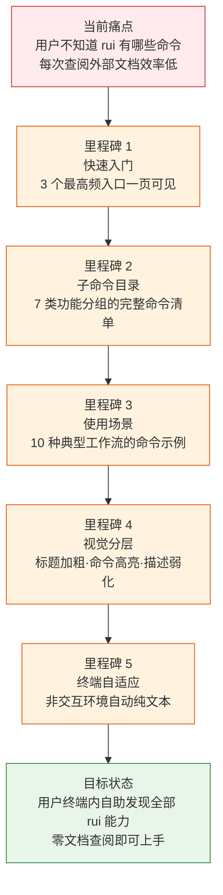
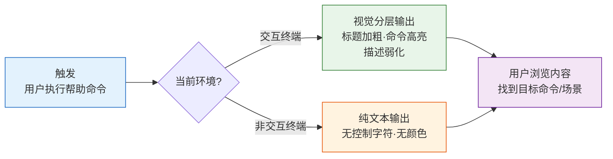

> | v1.0.0 | 2026-05-22 | deepseek-v4-pro | 🌿 feat/rui-help-doc | ⏱️ — | 📎 [CLAUDE.md](../../../CLAUDE.md) |

> **导航**: [→ YrY-使用场景](./YrY-使用场景.md)

> **来源引用**: `/rui doc --from-code rui-help-doc` · 源文件 `skills/rui/help.mjs`

[§0 基线声明](#sec0-baseline) · [§1 Story](#sec1-story) · [§2 Requirements](#sec2-requirements) · [§3 成功标准](#sec3-success) · [§4 范围边界](#sec4-scope) · [§5 AC](#sec5-ac) · [§6 风险与假设](#sec6-risks) · [§7 跨文档索引](#sec7-index) · [§R 关联故事](#secR-related)

# YrY-故事任务 · rui-help-doc

## §0 基线声明

> **问题空间基线**: 本文档定义"做什么(WHAT)"和"为什么(WHY)"。所有下游文档(03-09)的设计、实现、验证、改进决策均必须可追溯至本文档的具体章节。

### 需求概述

rui 编排器需要在命令行内置完整的自文档化帮助系统。当用户输入帮助命令时，终端应展示结构化帮助信息：快速入门入口、全部子命令目录（按功能领域分组）、可选参数说明、以及 10 种覆盖日常开发全流程的使用场景。帮助内容应在交互终端上以视觉分层格式呈现，在非交互环境（管道、重定向）中自动降级为纯文本。

### 效果示意

### 主要价值

- 🚀 即时上手：新用户通过一条命令即可了解 rui 全部能力，无需离开终端查阅外部文档
- 📋 完整索引：7 类子命令、全部标志、10 种使用场景一站式覆盖，消除"还有什么命令"的不确定性
- 🎨 视觉分层：标题/命令名/描述文字使用不同视觉强度区分，信息扫描效率高于纯文本
- 🔧 环境自适应：管道和重定向场景自动输出纯文本，确保帮助内容在任何终端环境下可读
- 📐 对齐布局：命令名与描述固定列宽对齐，阅读节奏一致，定位目标条目更快

---

## §1 Story

### Story 1: rui 命令行帮助展示

| 字段 | 内容 |
|------|------|
| 作为 | rui 命令行用户 |
| 我想要 | 在终端中查看 rui 编排器的完整帮助信息 |
| 以便 | 快速了解可用命令、可选参数和典型使用方式，无需查阅外部文档 |
| 优先级 | P1 |
| 范围边界 | 帮助内容定义 → 输出格式化 → 终端自适应显示 |
| 依赖 | rui 所有子命令与标志的规约已确定 |

##### §1.1 User Operations

| # | 操作 | 触发条件 | 操作步骤 | 预期结果 |
|---|------|---------|---------|---------|
| 1 | 查看完整帮助 | 用户输入帮助命令（如 `/rui --help`） | 系统输出结构化帮助页 | 屏幕展示：快速入门 + 子命令目录 + 标志说明 + 使用场景 |
| 2 | 管道查看帮助 | 用户将帮助输出通过管道传给分页器或文件（如 `| less`、`> help.txt`） | 系统检测到非交互环境，输出纯文本 | 无乱码、无控制字符、可正常阅读和保存 |
| 3 | 帮助内容验证 | rui 新增或变更子命令后，帮助定义同步更新 | 用户执行帮助命令 | 新命令出现在对应功能分组中，布局与已有条目一致 |
| 4 | 空状态 — 无帮助内容 | 帮助定义尚未编写（初始状态） | 用户执行帮助命令 | 输出为空或仅有标题占位 |

---

## §2 Requirements

### 功能点

| FP# | 描述 | 输入 | 输出 | 错误行为 | 优先级 |
|-----|------|------|------|---------|:--:|
| FP1 | 快速入门展示 — 显示最高频的 3 个入口命令及其一句话说明 | 无 | 3 行：端到端管线、项目初始化、任务推荐 | — | P1 |
| FP2 | 子命令目录 — 按功能领域（端到端管线·文档基线·编码实现·增量更新·自改进闭环·版本管理·项目初始化）归类展示所有子命令 | 无 | 7 个分组，每行含命令格式和说明 | 分组缺失时子命令不显示 | P0 |
| FP3 | 标志说明 — 展示每个子命令关联的可选参数及其作用 | 无 | 标志名+说明，视觉上与命令条目区分 | — | P1 |
| FP4 | 使用场景引导 — 展示 10 种覆盖日常开发全流程的典型场景，每场景含具体的命令示例和效果说明 | 无 | 10 个场景分组，每场景 1-2 条命令示例 | — | P1 |
| FP5 | 视觉分层 — 标题、命令名称、描述文字使用不同的视觉强度呈现 | 终端环境信息 | 标题加粗、命令名高亮、描述文字弱化 | 非交互终端自动降级为纯文本，不输出控制字符 | P1 |
| FP6 | 布局对齐 — 命令名列采用固定宽度左对齐，描述列从统一列位开始 | 无 | 整齐的两栏对齐布局 | 命令名超长时描述列自动后移，不截断 | P2 |

> 证据: skills/rui/help.mjs:52-117

### 业务规则

| R# | 描述 | 校验方式 | 证据级别 |
|----|------|---------|:--:|
| R1 | 非交互终端降级输出纯文本，不包含任何视觉控制字符 | 管道输出后检查无转义字符 | B |
| R2 | 帮助内容必须覆盖 rui 的全部 7 类子命令 | 逐类核对计数 | B |
| R3 | 使用场景至少覆盖 10 种典型工作流 | 场景计数 | B |
| R4 | 命令名与描述列之间至少保留 2 字符间隔 | 布局测量 | B |

> 证据: skills/rui/help.mjs:17-19 (R1), 52-117 (R2, R3), 25-26 (R4)

### 数据约束

| 约束 | 类型 | 范围/格式 | 来源 |
|------|------|----------|------|
| 命令名格式 | 文本 | `命令 [参数] [可选参数]` 形式，一行一条 | rui 子命令规约 |
| 描述文字长度 | 文本 | 每条说明 ≤ 一行，简洁概括命令用途 | 终端显示宽度约束 |
| 标志前缀 | 文本 | 单字符用 `-`，多字符用 `--`，后跟参数名和说明 | 命令行通用约定 |
| 命令名显示宽度 | 数值 | 固定 56 字符列宽，超长时描述列自动后移 | 常见终端最小宽度 |

> 证据: skills/rui/help.mjs:25-45

---

## §3 成功标准

| SC# | 描述 | 度量方式 | 目标值 | 优先级 | 关联 FP# |
|-----|------|---------|--------|:--:|---------|
| SC1 | 用户可在 30 秒内定位到目标命令 | 用户测试：从打开帮助到定位目标命令的耗时 | ≤ 30s | P1 | FP1,FP2,FP5 |
| SC2 | 帮助覆盖所有已发布子命令 | 逐条核对 rui 规约中的子命令定义 | 100% | P0 | FP2 |
| SC3 | 非交互终端输出无乱码 | 管道输出后扫描控制字符 | 0 个控制字符 | P1 | FP5,R1 |
| SC4 | 每个使用场景提供可直接复制的命令示例 | 逐场景检查命令完整性 | 10/10 场景含可执行示例 | P1 | FP4 |
| SC5 | 布局在 80 字符宽度终端中完整显示不折行 | 终端宽度模拟测试 | 0 条命令描述折行 | P2 | FP6 |

---

## §4 范围边界

### 范围内

| # | 条目 | 关联 FP# | 边界说明 |
|---|------|---------|---------|
| 1 | 帮助内容定义 | FP1-FP4 | 快速入门 + 7 类子命令 + 标志说明 + 10 种场景，内容与 rui 规约一致 |
| 2 | 输出视觉格式化 | FP5 | 交互终端中使用视觉分层增强可读性 |
| 3 | 终端环境自适应 | FP5,R1 | 检测非交互环境自动输出纯文本 |
| 4 | 布局对齐 | FP6 | 固定列宽的命令-描述两栏布局 |

### 范围外

| # | 条目 | 排除原因 | 替代方案 |
|---|------|---------|---------|
| 1 | 子命令的详细使用手册 | 属于各子命令的独立文档，超出帮助页的信息密度上限 | 查阅各子命令的内置帮助或 README |
| 2 | 国际化/多语言版本 | 当前仅中文，多语言为独立需求 | 未来可作为独立故事追加 |
| 3 | Web 版文档或图形界面 | 帮助定位为终端内即时查阅，不替代完整文档 | CLAUDE.md 和 README 提供专题导航 |
| 4 | 交互式帮助向导（分步引导） | 当前为一次性静态输出，非交互式教程 | 属于 rui 入门引导的独立功能 |

### 灰色区域

| # | 条目 | 触发条件 | 决策人 |
|---|------|---------|--------|
| 1 | 帮助内容的自动生成 vs 手工维护 | 子命令数量持续增长导致手工维护成本过高 | pm 评估维护成本后决策 |
| 2 | 帮助内容的输出语言 | 有国际化需求时 | pm 根据用户反馈决策优先级 |

---

## §5 AC

| AC# | Given | When | Then | 门禁 |
|-----|-------|------|------|------|
| AC1 | rui 已安装，用户在交互终端中 | 用户执行帮助命令 | 显示视觉分层帮助页：标题加粗、命令名高亮、描述弱化。内容含快速入门+7 类子命令+标志说明+10 种场景 | Gate A |
| AC2 | rui 已安装，帮助输出被管道重定向（如 `| cat`） | 用户执行帮助命令 | 显示纯文本帮助，不含任何控制字符，内容完整可读 | Gate A |
| AC3 | rui 新增一个子命令 | 帮助定义新增该命令条目后，用户执行帮助命令 | 新命令出现在对应功能分组中，命令-描述对齐方式与已有条目一致 | Gate A |
| AC4 | rui 新增一个使用场景 | 帮助定义新增该场景及示例命令，用户执行帮助命令 | 新场景出现在场景列表末尾，场景标题与示例命令格式与已有场景一致 | Gate A |
| AC5 | 用户首次接触 rui，仅通过帮助页了解功能 | 用户执行帮助命令，浏览全部内容 | 能在 30 秒内找到目标命令类别并理解其用途 | Gate B |

---

## §6 风险与假设

| # | 风险/假设 | 类型 | 可能性 | 影响 | 缓解/验证策略 | 关联 FP# |
|---|----------|------|--------|------|-------------|---------|
| 1 | 子命令规约变更后帮助内容未同步更新 | 风险 | M | M | 子命令新增/变更流程中加入帮助同步检查点；帮助内容与规约交叉核对 | FP2 |
| 2 | 终端宽度不足（< 80 列）导致布局错乱 | 风险 | L | L | 固定 56 字符命令名列宽，适应 80 列常见终端；描述列不强制对齐以容错 | FP6 |
| 3 | 某些终端不支持视觉格式化 | 风险 | L | L | 非交互环境已覆盖纯文本降级；未知终端默认降级为纯文本 | FP5,R1 |
| 4 | 帮助内容随命令增长变得冗长，超过一屏可读范围 | 风险 | M | L | 快速入门前置，高频命令优先；后续可追加搜索/过滤功能 | FP2,FP4 |
| 5 | 用户终端普遍支持视觉格式化 | 假设 | — | — | 验证：主流终端模拟器均支持 ANSI 转义序列 | FP5 |
| 6 | 帮助页是用户学习 rui 的主要入口之一 | 假设 | — | — | 验证：README 提供架构导航，帮助页提供命令速查，二者互补 | FP1,FP4 |

---

## §7 跨文档索引

| 本文档章节 | 基线内容 | 下游文档编号 | 预期覆盖 | 状态 |
|-----------|---------|------------|---------|:--:|
| §2 FP1-FP4 | 帮助内容四大模块：快速入门/子命令/标志/场景 | 03 技术评审 | 帮助内容结构和生成流程 | 待生成 |
| §2 FP5-FP6,R1 | 视觉分层与终端自适应 | 03 技术评审 | 格式化渲染方案和纯文本降级策略 | 待生成 |
| §5 AC1-AC5 | 帮助输出的用户验收场景 | 04 测试设计 | 帮助展示和终端兼容性测试用例 | 待生成 |
| §2 FP5,R1 | 纯文本降级不输出控制字符 | 05 安全审计 | 终端注入风险检查 | 待生成 |
| §5 AC5 | 用户上手效率 | 07 测试报告 | 用户定位耗时指标验证 | 待生成 |
| §6 风险 1 | 帮助与规约同步 | 08 自改进复盘 | 同步机制效果评估 | 待生成 |

---

## §R 关联故事

暂无跨故事依赖。本故事为 rui 核心设施的独立模块，不依赖其他故事，也不被其他故事阻断。

---

> | 日期 | 变更 | 触发 | 证据 |
> |------|------|------|------|
> | 2026-05-22 | 初始生成 | /rui doc --from-code rui-help-doc | skills/rui/help.mjs:1-120 |
