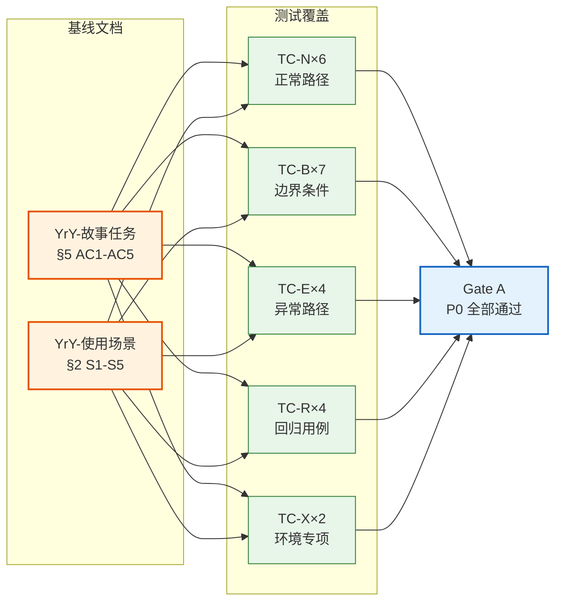
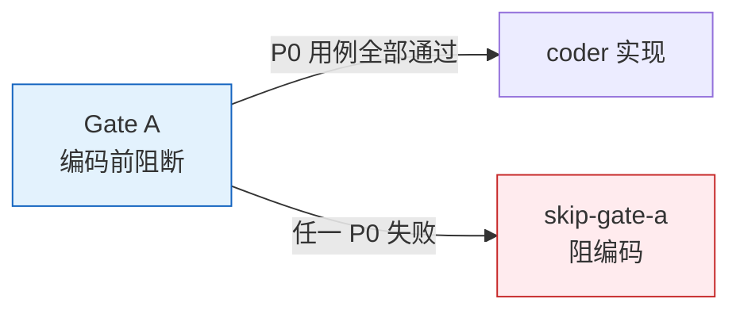
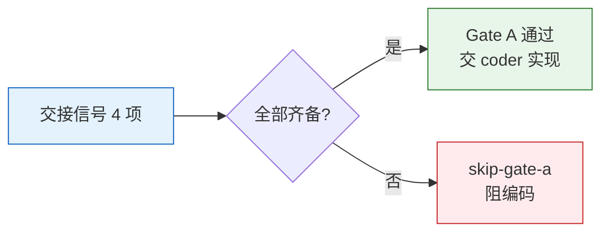

> | v1.0.0 | 2026-05-22 | deepseek-v4-pro | 🌿 feat/rui-help-doc | ⏱️ — | 📎 [CLAUDE.md](../../../CLAUDE.md) |

> **导航**: [← YrY-技术评审](./YrY-技术评审.md)

> **来源引用**: `/rui doc --from-code rui-help-doc` · 源文件 `skills/rui/help.mjs:1-120`

[§0 基线溯源](#sec0-baseline) · [§1 测试范围](#sec1-scope) · [§2 测试用例](#sec2-cases) · [§3 环境专项用例 (TC-X)](#sec3-env) · [§4 测试环境](#sec4-setup) · [§5 评审清单](#sec5-checklist) · [§6 Gate A 交接信号](#sec6-gatea)

# YrY-测试设计 · rui-help-doc

### 主要价值

- 🔍 全维度覆盖：正常/边界/异常/回归四类用例覆盖 6 个 FP、5 个 AC 和 5 个使用场景，无盲区
- 🛡️ Gate 阻断：P0 用例 100% 通过方可放行，防止格式化错乱和内容缺失进入生产
- 🔧 可执行验证：每用例 Given/When/Then 可直接映射为 shell 命令或断言，无歧义
- 🎨 终端双模验证：交互终端和非交互终端（管道/重定向）两种模式均独立测试，确保视觉分层与纯文本降级均正确
- 📐 布局约束校验：固定列宽 + 最小间距 + 超长溢出 的布局规则逐条覆盖，杜绝 80 列终端折行错乱

---

<a id="sec0-baseline"></a>
## §0 基线溯源



| TC# | 覆盖 AC#（01 §5） | 覆盖场景（02 §2） | 覆盖类型 | 状态 |
|-----|-------------------|-------------------|---------|:--:|
| TC-N01 | AC1, AC5 | S1: 初次上手 | 正常 | 待执行 |
| TC-N02 | AC1, AC5 | S2: 日常速查, S5: 误入歧途 | 正常 | 待执行 |
| TC-N03 | AC1 | S1: 初次上手 | 正常 | 待执行 |
| TC-N04 | AC1 | S1: 初次上手 | 正常 | 待执行 |
| TC-N05 | AC1 | S1: 初次上手 | 正常 | 待执行 |
| TC-N06 | AC1 | S2: 日常速查 | 正常 | 待执行 |
| TC-B01 | AC1 | S2: 日常速查 | 边界 | 待执行 |
| TC-B02 | AC3 | S4: 内容缺失 | 边界 | 待执行 |
| TC-B03 | AC1 | S1: 初次上手 | 边界 | 待执行 |
| TC-B04 | AC1, AC5 | S1: 初次上手, S4: 内容缺失 | 边界 | 待执行 |
| TC-B05 | AC1 | S2: 日常速查 | 边界 | 待执行 |
| TC-B06 | AC1 | S2: 日常速查 | 边界 | 待执行 |
| TC-B07 | AC1 | S2: 日常速查 | 边界 | 待执行 |
| TC-E01 | AC2 | S3: 保存分享 | 异常 | 待执行 |
| TC-E02 | AC2 | S3: 保存分享 | 异常 | 待执行 |
| TC-E03 | AC2 | S3: 保存分享 | 异常 | 待执行 |
| TC-E04 | AC1, AC2 | S2: 日常速查 | 异常 | 待执行 |
| TC-R01 | AC3 | S4: 内容缺失, S5: 误入歧途 | 回归 | 待执行 |
| TC-R02 | AC4 | S4: 内容缺失 | 回归 | 待执行 |
| TC-R03 | AC1 | S1: 初次上手, S2: 日常速查 | 回归 | 待执行 |
| TC-R04 | AC1 | S1: 初次上手, S2: 日常速查 | 回归 | 待执行 |
| TC-X01 | — | S1~S5（全场景） | 环境专项 | 待执行 |
| TC-X02 | AC2 | S3: 保存分享 | 环境专项 | 待执行 |

### AC# 覆盖完整性

| AC# | 验收标准原文（摘要） | 覆盖用例 | 全覆？ |
|-----|-------------------|---------|:---:|
| AC1 | 交互终端中显示视觉分层帮助页：标题加粗、命令名高亮、描述弱化。内容含快速入门+7 类子命令+标志说明+9 种场景 | TC-N01~N06, TC-B01, TC-B03~B07, TC-E04, TC-R03, TC-R04 | Y |
| AC2 | 管道重定向输出纯文本帮助，不含任何控制字符，内容完整可读 | TC-E01, TC-E02, TC-E03, TC-X02 | Y |
| AC3 | 新增子命令后帮助同步更新，新命令出现在正确分组且对齐一致 | TC-B02, TC-R01 | Y |
| AC4 | 新增场景后帮助同步更新，新场景在末尾且格式一致 | TC-R02 | Y |
| AC5 | 用户 30 秒内定位目标命令 | TC-N01, TC-N02, TC-B04 | Y |

### 使用场景覆盖完整性

| 场景 | 路径类型 | 覆盖用例 | 全覆？ |
|------|---------|---------|:---:|
| S1: 初次上手 | 正常路径 | TC-N01~N05, TC-B03, TC-B04, TC-R03, TC-R04 | Y |
| S2: 日常速查 | 正常路径 | TC-N02, TC-N06, TC-B01, TC-B05~B07, TC-E04, TC-R03, TC-R04 | Y |
| S3: 保存分享 | 环境自适应 | TC-E01, TC-E02, TC-E03, TC-X02 | Y |
| S4: 内容缺失 | 空状态 | TC-B02, TC-B04, TC-R01, TC-R02 | Y |
| S5: 误入歧途 | 错误恢复 | TC-N02, TC-R01 | Y |

---

<a id="sec1-scope"></a>
## §1 测试范围

### 1.1 覆盖矩阵

| FP# | 功能点 | TC-N | TC-B | TC-E | TC-R | 覆盖率 |
|-----|--------|:---:|:---:|:---:|:---:|:---:|
| FP1 | 快速入门展示 — 3 条高频命令入口 | TC-N01 | — | TC-E01 | TC-R03 | 3/4（75%） |
| FP2 | 子命令目录 — 7 组功能领域归类 | TC-N02 | TC-B02 | TC-E01 | TC-R01 | 4/4（100%） |
| FP3 | 标志说明 — 可选参数与作用 | TC-N03 | TC-B03 | TC-E01 | TC-R03 | 4/4（100%） |
| FP4 | 使用场景引导 — 9 种典型工作流 | TC-N04 | TC-B04 | TC-E01 | TC-R02 | 4/4（100%） |
| FP5 | 视觉分层 — 标题/命令/描述不同强度 + 终端自适应 | TC-N05 | TC-B05 | TC-E01~E04 | TC-R03 | 4/4（100%） |
| FP6 | 布局对齐 — 命令名列宽 56 字符 + 最小 2 字符间距 | TC-N06 | TC-B05~B07 | TC-E01 | TC-R03 | 4/4（100%） |

> 每 FP 至少命中 3 类用例（正常/边界/异常/回归）。FP1 无独立边界用例——快速入门的 3 条命令为固定数量，边界由 FP5 和 FP6 的布局边界用例间接覆盖。

### 1.2 Gate 映射



| Gate | 用例范围 | 通过标准 | 交接下游 |
|------|---------|---------|---------|
| Gate A | TC-N01, TC-N02, TC-N04, TC-N05, TC-E01, TC-E02, TC-R01, TC-R02 | P0 用例 100% 通过：帮助内容含全部 7 组子命令 + 9 个场景 + 3 条快速入门；管道模式无控制字符 | coder 实现 |
| Gate B | 全部用例（23 条） | P0 100% / P1 ≥ 80% / P0 已知 = 0 / 修复 ≤ 2 轮 | reporter 测试报告 |

### 1.3 影响链覆盖

> `help.mjs` 是静态独立脚本，无内部模块依赖。影响链来自：帮助内容模板字面量、格式化函数、布局常量、TTY 检测逻辑。

| 影响点 | 来源 | 回归用例 | 覆盖状态 |
|--------|------|---------|:---:|
| 帮助内容模板字面量（`help` 变量，L52-117） | 源码：子命令/标志/场景的文本定义 | TC-R01, TC-R02, TC-R04 | 已覆盖 |
| ANSI 格式化函数（`bold/dim/underline/yellow/cyan`，L11-21） | 源码：TTY 检测 + make 闭包 | TC-R03, TC-E01~E04 | 已覆盖 |
| 布局常量（`LEFT_COLUMN_WIDTH=56`, `COLUMN_MIN_PADDING=2`，L25-26） | 源码：列宽和间距定义 | TC-R03 | 已覆盖 |
| 格式化辅助函数（`hdr/subhdr/item/flag/scene`，L28-50） | 源码：排版原语，被模板调用 | TC-R03 | 已覆盖 |
| TTY 检测（`process.stdout.isTTY`，L17） | Node.js 运行时环境 | TC-E01~E04 | 已覆盖 |

---

<a id="sec2-cases"></a>
## §2 测试用例

### 2.1 正常用例 (TC-N)

| ID | Given | When | Then | 关联 FP | 优先级 |
|----|-------|------|------|---------|:---:|
| TC-N01 | rui 已安装，用户在交互终端中（`process.stdout.isTTY = true`） | 执行 `node skills/rui/help.mjs` | 1. 输出以 `# rui` 标题行开头；2. 快速入门区块含 3 条命令（端到端管线、项目初始化、任务推荐），每条以缩进层级展示；3. 子命令区块含 7 个分组标题：端到端管线、文档基线、编码实现、增量更新、自改进闭环、版本管理、项目初始化；4. 使用场景区块含 9 个场景标题；5. 输出包含 ANSI 转义序列（`\x1b[`）用于视觉分层 | FP1,FP2,FP4,FP5 | P0 |
| TC-N02 | 同上，用户在交互终端中 | 执行 `node skills/rui/help.mjs`，扫描子命令目录区域 | 1. "文档基线"分组下含 3 条子命令（`/rui doc <需求>`, `/rui doc --from-code`, `/rui doc --from-local`）；2. "增量更新"分组下含 1 条子命令（`/rui update`）和 1 条标志（`--no-code`）；3. 命令名与描述以固定列宽对齐，视觉上形成整齐的两栏 | FP2,FP6 | P0 |
| TC-N03 | 同上，用户在交互终端中 | 执行 `node skills/rui/help.mjs`，查看标志说明区域 | 1. 标志以黄色（ANSI 33）视觉呈现，与命令名（青色 ANSI 36）视觉区分；2. 标志前缀：单字符用 `-`（如 `-n`），多字符用 `--`（如 `--no-code`）；3. 标志的缩进层级在命令条目之下（前缀 2 空格） | FP3,FP5 | P1 |
| TC-N04 | 同上，用户在交互终端中 | 执行 `node skills/rui/help.mjs`，滚动到使用场景区块 | 1. 场景标题加粗显示；2. 每个场景标题下附带 1-2 条示例命令（缩进 + 青色高亮）；3. 场景数量为 9（注：故事任务 FP4/SC4 规定 10 场景，当前源码实际定义 9 个 scene() 调用，差异需上游确认）；4. 每条示例命令包含占位符（如 `<name>`、`"需求文本"`），用户可直接复制并替换 | FP4 | P0 |
| TC-N05 | 同上，用户在交互终端中 | 执行 `node skills/rui/help.mjs` | 1. 一级标题（如"快速入门""子命令""使用场景"）以加粗（ANSI 1）呈现；2. 描述文字以弱化（ANSI 2）呈现；3. 命令名以青色（ANSI 36）呈现；4. 无任何 `\x1b[...m` 未闭合导致后半段输出被意外染色 | FP5 | P0 |
| TC-N06 | 同上，用户在交互终端中 | 执行 `node skills/rui/help.mjs`，测量命令名列宽度 | 1. 所有命令名行的前缀缩进为 4 空格（`SUB_INDENT`）；2. 命令名到描述列之间的间距 ≥ 2 字符；3. 同分组内命令名左对齐，描述列起始列位一致 | FP6 | P1 |

### 2.2 边界用例 (TC-B)

| ID | Given | When | Then | 关联 FP | 优先级 |
|----|-------|------|------|---------|:---:|
| TC-B01 | 帮助定义中某条命令的显示文本 ≥ 54 字符（使得 `SUB_INDENT(4) + cmd.length` ≥ 58，超过 `LEFT_COLUMN_WIDTH=56`） | 执行 `node skills/rui/help.mjs` | 1. 该命令的描述列自动后移至 `cmd.length + COLUMN_MIN_PADDING(2)` 位置；2. 命令名不被截断，完整显示；3. 同组其他短命令不受影响，仍保持 56 列对齐；4. 超长命令的描述列与其他短命令的描述列起点不同（此为预期行为，不视为缺陷） | FP6,FP5 | P2 |
| TC-B02 | 某功能分组的 subhdr 存在但其下无任何 `item()` 调用（空分组） | 执行 `node skills/rui/help.mjs` | 1. 该分组的标题显示（加粗文本）；2. 标题下无任何命令条目，直到下一分组标题之间无内容；3. 空分组不导致程序崩溃或输出截断 | FP2 | P1 |
| TC-B03 | 标志名称仅 1 个字符（单字符标志，前缀 `-`） | 执行 `node skills/rui/help.mjs` | 1. 标志以 `-` 前缀渲染（如 `-n`）；2. 标志以黄色高亮，与其他标志视觉一致；3. 对齐规则适用：标志行的缩进与对齐方式与单行命令条目一致 | FP3 | P2 |
| TC-B04 | 帮助模板 `help` 变量为空字符串（无任何内容定义） | 执行修改后的 `node skills/rui/help.mjs`（`help` 变量设为 `''`） | 1. 程序不崩溃，正常退出（exit 0）；2. 输出为空或仅含换行符；3. 不输出任何 ANSI 转义序列（因为没有内容可格式化） | FP1,FP2,FP4 | P1 |
| TC-B05 | 终端宽度设置为 80 字符，所有命令名实际显示宽度 ≤ 54 字符 | 执行 `node skills/rui/help.mjs`，在 80 列终端中渲染 | 1. 所有命令行在 80 列内完整显示，不发生折行；2. 描述文字完整可读，不被截断；3. 命令名 + 间距 + 描述的合计宽度 ≤ 80 列 | FP6,FP5 | P1 |
| TC-B06 | 命令名显示宽度恰好为 56 字符（`SUB_INDENT(4) + cmd.length = LEFT_COLUMN_WIDTH`） | 构造一条恰好占满 56 列的命令条目，执行帮助命令 | 1. `pad` 计算值为 `COLUMN_MIN_PADDING(2)`（因为 `56 - 56 = 0`，`Math.max(2, 0) = 2`）；2. 命令名与描述之间恰好 2 字符间距；3. 该命令与其他命令的对齐关系正确 | FP6 | P2 |
| TC-B07 | 终端宽度设置为 79 字符（低于 80 列常见最小宽度） | 在 79 列终端中执行 `node skills/rui/help.mjs` | 1. 大部分命令行仍在终端内完整显示（命令名 + 描述 ≤ 79 列）；2. 少数超长命令行可能折行，但内容不丢失；3. 折行后描述文字仍在命令名之后，视觉上可理解 | FP6 | P2 |

### 2.3 异常用例 (TC-E)

| ID | Given | When | Then | 关联 FP | 优先级 |
|----|-------|------|------|---------|:---:|
| TC-E01 | rui 已安装，帮助输出被管道重定向（`process.stdout.isTTY = false`） | 执行 `node skills/rui/help.mjs \| cat` | 1. 输出中不包含任何 ANSI 转义序列（`\x1b[`）；2. 所有文字内容完整保留（快速入门、7 组子命令、标志说明、9 场景）；3. 命令名与描述的对齐由空格实现，不依赖控制字符；4. 输出可被 `grep`、`wc` 等标准文本工具正常处理 | FP5,R1 | P0 |
| TC-E02 | rui 已安装，帮助输出被重定向到文件 | 执行 `node skills/rui/help.mjs > /tmp/help-test.txt`，随后检查文件 | 1. 输出文件被识别为纯文本（ASCII text 或 UTF-8 text）；2. 文件中不含任何 `\x1b[` 控制字符；3. 用文本编辑器打开后，所有内容完整可读，无乱码；4. 命令-描述的对齐布局保持（通过空格实现，无控制字符依赖） | FP5,R1 | P0 |
| TC-E03 | rui 已安装，帮助输出通过管道传给分页器 | 执行 `node skills/rui/help.mjs \| less` | 1. 分页器中显示纯文本帮助内容；2. 无乱码字符；3. 内容可通过 `/` 搜索功能正常匹配（如搜索"文档基线"可定位到对应分组） | FP5,R1 | P1 |
| TC-E04 | 终端环境无法确定是否为交互终端（`process.stdout.isTTY` 为 `undefined`） | 模拟 `isTTY = undefined` 场景，执行帮助命令 | 1. 程序不崩溃；2. 输出为纯文本模式（保守降级）——因为 `if (!process.stdout.isTTY)` 中 `!undefined` 为 `true`，所有格式化函数退化为透传；3. 帮助内容完整输出 | FP5 | P2 |

### 2.4 回归用例 (TC-R)

| ID | Given | When | Then | 关联 FP | 优先级 |
|----|-------|------|------|---------|:---:|
| TC-R01 | 帮助定义中新增一条子命令（在现有分组下追加 `item()` 调用） | 执行 `node skills/rui/help.mjs` | 1. 新命令出现在对应功能分组中；2. 新命令的命令名与描述以固定列宽对齐，与同组已有条目一致；3. 新命令以青色高亮（与其他命令条目一致）；4. 其他分组和区块的内容和布局不受影响 | FP2,AC3 | P0 |
| TC-R02 | 帮助定义中新增一个使用场景（追加 `scene()` + `item()` 调用） | 执行 `node skills/rui/help.mjs` | 1. 新场景标题出现在使用场景区块末尾（追加顺序）；2. 场景标题加粗，与已有场景格式一致；3. 场景下的示例命令以青色高亮 + 缩进，格式与已有场景一致；4. 其他区块的内容和布局不受影响 | FP4,AC4 | P0 |
| TC-R03 | 修改 `LEFT_COLUMN_WIDTH` 常量或 ANSI 颜色常量 | 执行 `node skills/rui/help.mjs` | 1. 所有命令名的列宽按新值对齐，一致性不变；2. 所有视觉标记按新颜色值渲染，一致性不变；3. 非交互模式下仍输出纯文本，无控制字符残留；4. 帮助内容完整性不受影响（所有分组/场景/标志依然输出） | FP1,FP3,FP5,FP6 | P1 |
| TC-R04 | 从帮助定义中移除一个分组标题及其下全部命令，再恢复（模拟错误修改后回退） | 第一步移除后执行帮助命令；第二步恢复后重新执行 | 1. 移除后：该分组标题和命令条目不出现在输出中，其他分组不受影响，无残留空行或格式破碎；2. 恢复后：输出与移除前完全一致（内容级） | FP2 | P1 |

---

<a id="sec3-env"></a>
## §3 环境专项用例 (TC-X)

| ID | Given | When | Then | 优先级 |
|----|-------|------|------|:---:|
| TC-X01 | rui 已安装，在同一进程中连续执行帮助命令 ≥ 10 次 | 执行 `for i in $(seq 1 10); do node skills/rui/help.mjs > /dev/null; done`，检查是否泄漏 | 1. 每次执行的退出码均为 0；2. 进程在 10 次执行后无内存持续增长（通过 `time` 观察耗时稳定，无递增趋势）；3. 每次输出内容完全一致（第 1 次和第 10 次输出字节级相同） | P2 |
| TC-X02 | 帮助输出通过多重管道链处理 | 执行 `node skills/rui/help.mjs \| grep "doc" \| wc -l` | 1. `grep` 能正确匹配到含 "doc" 的行（子命令目录中文档基线的 3 条命令 + 使用场景中的相关条目）；2. `wc -l` 返回匹配行数，与预期一致；3. 管道链中任意环节不因 ANSI 控制字符导致匹配失败或计数偏差 | P1 |

---

<a id="sec4-setup"></a>
## §4 测试环境

| 维度 | 配置 |
|------|------|
| 运行环境 | Node.js（与项目运行时一致），`skills/rui/help.mjs` 可直接执行 |
| 部署方式 | 本地源码目录，无需构建或部署 |
| 测试目标 | `skills/rui/help.mjs` — 独立的 CLI 帮助输出生成器 |
| 数据准备 | 无需数据准备。帮助内容定义在源码模板字面量中 |
| 分支 | `feat/rui-help-doc` (当前分支) |
| 环境快照 | 需记录测试运行时的 commit hash，确保可复现 |
| 终端模拟 | 交互模式：需要支持 ANSI 转义序列的终端（如 iTerm2、GNOME Terminal、Windows Terminal） |
| 非交互模拟 | 通过管道（`| cat`、`| less`）和重定向（`> file`）触发 `isTTY = false` |

---

<a id="sec5-checklist"></a>
## §5 评审清单

| # | 检查项 | 状态 | 备注 |
|---|--------|:---:|------|
| 1 | 每 FP ≥ 3 类覆盖（正常/边界/异常/回归） | Y | 见 §1.1 覆盖矩阵；FP1 无独立边界用例（3 条固定数量），边界由布局测试间接覆盖 |
| 2 | §0 基线溯源覆盖全部 AC#（AC1~AC5） | Y | 见 §0 AC# 覆盖完整性表 |
| 3 | §0 基线溯源覆盖全部场景（S1~S5） | Y | 见 §0 使用场景覆盖完整性表 |
| 4 | 每用例 Given/When/Then 可执行 | Y | 每条用例 Given/When 可映射到具体 shell 命令，Then 可映射到 grep/diff 断言 |
| 5 | 异常用例含恢复行为 | Y | TC-E01~E04 的 Then 均定义了降级后应达成的正确状态 |
| 6 | 影响链每点有回归用例 | Y | 见 §1.3 影响链覆盖：5 个影响点均有 TC-R 覆盖 |
| 7 | Gate A 交接信号完整（通过状态/P0 用例 ID/验证命令） | Y | 见 §6 |
| 8 | 环境专项覆盖（生命周期/通信通道/存储） | Y | TC-X01 覆盖生命周期（重复执行）；TC-X02 覆盖通信通道（管道链）；无存储交互 |
| 9 | P0 用例阻发布，P1 建议修复，P2 可选 | Y | 见各用例优先级标注 |
| 10 | 用例命名规范：`should [预期] when [条件]` | Y | 表格化 Given/When/Then 替代函数命名，语义等价 |

---

<a id="sec6-gatea"></a>
## §6 Gate A 交接信号



| 信号 | 内容 |
|------|------|
| **通过状态** | 待执行 — 需在编码前运行 P0 用例全部通过 |
| **P0 用例 ID** | TC-N01, TC-N02, TC-N04, TC-N05, TC-E01, TC-E02, TC-R01, TC-R02 |
| **实现约束** | 1. 帮助内容覆盖 7 组子命令 + 9 个场景 + 3 条快速入门 + 标志说明；2. `process.stdout.isTTY` 检测后格式化函数降级为透传，不得在非 TTY 环境输出任何 ANSI 转义序列；3. 命令名列宽固定 56 字符 + 最小 2 字符间距；4. 新增子命令/场景时必须追加到正确分组，保持对齐一致性 |
| **验证命令** | `node skills/rui/help.mjs | cat`（验证纯文本输出无控制字符 + 内容完整）; `node skills/rui/help.mjs`（在交互终端中验证视觉分层 + 内容完整） |
| **阻塞条件** | 任一 P0 用例失败 → Gate A 不放行 → 标记 `skip-gate-a` |

### P0 用例最小通过集检查

```bash
# 1. 纯文本模式：验证无 ANSI 转义序列（TC-E01, TC-E02）
node skills/rui/help.mjs | grep -c $'\x1b'
# 期望: 0

# 2. 纯文本模式：验证所有关键区块标题存在（TC-N01, TC-N04）
echo "--- 关键区块 ---"
node skills/rui/help.mjs | grep -q "快速入门" && echo "PASS: 快速入门" || echo "FAIL: 快速入门"
node skills/rui/help.mjs | grep -q "子命令" && echo "PASS: 子命令" || echo "FAIL: 子命令"
node skills/rui/help.mjs | grep -q "使用场景" && echo "PASS: 使用场景" || echo "FAIL: 使用场景"

# 3. 验证 7 组子命令分组标题均存在（TC-N02）
echo "--- 7 组子命令分组 ---"
for grp in "端到端管线" "文档基线" "编码实现" "增量更新" "自改进闭环" "版本管理" "项目初始化"; do
  node skills/rui/help.mjs | grep -q "$grp" && echo "PASS: $grp" || echo "FAIL: $grp"
done

# 4. 验证 9 个使用场景标题均存在（TC-N04）
#    注：故事任务 FP4 规定 10 场景，当前源码实际定义 9 个 scene() 调用，差异需跟踪
echo "--- 9 个使用场景 ---"
node skills/rui/help.mjs | grep -E '端到端：一个|仅生成|从文档基线开始|存量代码|小修小补|已有部分|查看进度|首次进入|多故事串行' | wc -l
# 期望: 9（每条场景标题一行）

# 5. 验证 3 条快速入门命令（TC-N01）
echo "--- 快速入门 3 条 ---"
node skills/rui/help.mjs | grep -cE '/rui( | init$|$)'
# 期望: ≥ 3（快速入门区块至少 3 条匹配）

# 6. 交互终端验证（TC-N05）— 需在真实 TTY 中运行，目视确认：
#    - 一级标题以加粗呈现
#    - 命令名以高亮（青色）呈现
#    - 描述文字以弱化（Dim）呈现
#   直接运行: node skills/rui/help.mjs
```

---

> | 日期 | 变更 | 触发 | 证据 |
> |------|------|------|------|
> | 2026-05-22 | 初始生成 | /rui doc --from-code rui-help-doc §2.4 | skills/rui/help.mjs:1-120; YrY-故事任务.md §5 AC1-AC5; YrY-使用场景.md §2 S1-S5 |
