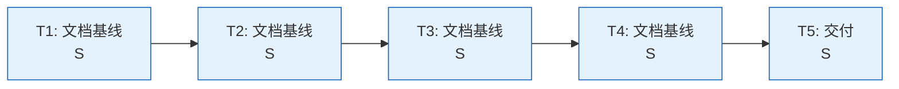
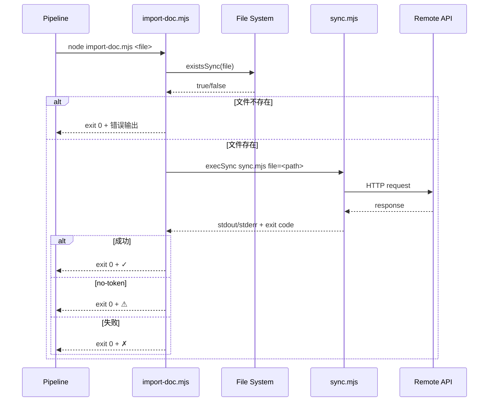

> | v1.0.0 | 2026-05-23 | deepseek-v4-pro | 🌿 feat/rui-import-doc-doc | 📎 [CLAUDE.md](../../../CLAUDE.md) |

> **导航**: [← YrY-使用场景](./YrY-使用场景.md) · [YrY-测试设计 →](./YrY-测试设计.md) · [YrY-安全审计 →](./YrY-安全审计.md)

> **来源引用**: 本文档基于 `YrY-故事任务.md` §2 + `YrY-使用场景.md` §2 生成。技术事实从源码反推。证据 Level B + 源码路径。

### 主要价值

- 🏗 定义逐文件导入工具的完整技术架构，覆盖入口→验证→导入→降级全链路
- 🔗 明确与批量同步脚本的调用关系，消除接口模糊空间
- 🛡 建立纵深防御模型：L1 文件验证 → L2 超时保护 → L3 降级跳过 → L4 错误输出
- ⚡ 提供可执行的技术事实基线，使测试设计和安全审计有明确的攻击面和保护点

---

## §0 设计决策与任务规划

### §0.0 基线溯源

| 本设计章节 | 实现 YrY-故事任务 | 服务 YrY-使用场景 | 覆盖状态 |
|-----------|-----------------|-----------------|---------|
| §1 系统架构 | FP1–FP6 | 场景 1–3 | 已覆盖 |
| §7 安全约束 | FP2 (导入+降级) | 场景 2, 3 | 已覆盖 |
| §8 性能与限制 | FP2 (30s 超时) | 场景 1 | 已覆盖 |
| §0.1 设计决策 | FP2, FP3 | 场景 1 | 已覆盖 |
| §0.2 任务规划 | FP1–FP6 | 场景 1–3 | 已覆盖 |

### §0.1 设计决策

| 决策领域 | 选定方案 | 选择理由 | 详见 | 实现 FP# |
|---------|---------|---------|------|---------|
| 导入失败策略 | exit 0，不阻断管线 | 导入是辅助步骤，不应因远端问题中断核心管线 | §1 | FP2 |
| 降级分级 | no-token→skip (yellow)；其他→failed (red) | no-token 是预期内的配置缺失，不应与网络错误混淆 | §1 | FP2 |
| 超时策略 | 30s 硬超时 | 文档文件通常 <100KB，30s 对 HTTP 上传足够 | §8 | FP2 |
| 标签判定 | 委托给 sync.mjs | 标签逻辑与同步脚本共享，避免重复实现 | §1 | FP3 |
| 输出模式 | TTY 颜色 + JSON + silent 三种 | TTY 给人看，JSON 给机器解析，silent 给管线最小输出 | §1 | FP4, FP5, FP6 |

### §0.2 任务规划

| ID | 描述 | 工作量 | 依赖 | 交付物 | Agent | 门禁 | 交接下游 | 实现 FP# |
|----|------|--------|------|--------|-------|------|---------|---------|
| T1 | 故事任务文档 | S | — | YrY-故事任务.md | pm | Gate A | T2 | FP1–FP6 |
| T2 | 使用场景文档 | S | T1 | YrY-使用场景.md | pm | Gate A | T3 | FP1–FP6 |
| T3 | 技术评审文档 | S | T2 | YrY-技术评审.md | coder | Gate A | T4, T5 | FP1–FP6 |
| T4 | 测试设计文档 | S | T3 | YrY-测试设计.md | tester | Gate A | T5 | FP1–FP6 |
| T5 | 安全审计文档 | S | T3 | YrY-安全审计.md | security | Gate A | 交付 | FP2 |

---

## §1 系统架构

### 效果示意

```mermaid
flowchart TD
    ENTRY["管线调用<br/>node skills/rui/import-doc.mjs &lt;file&gt;"]:::entry --> PARSE["参数解析<br/>parseArgs()"]:::proc
    PARSE -->|"无参数"| HELP["输出帮助<br/>showHelp()"]:::out
    PARSE -->|"文件路径"| EXISTS{"文件存在?<br/>existsSync()"}:::decision
    EXISTS -->|"否"| ERR1["红色错误输出<br/>exit 0"]:::out
    EXISTS -->|"是"| SYNC["调用批量同步<br/>execSync sync.mjs file=&lt;path&gt;"]:::proc
    SYNC -->|"成功"| OK["绿色 ✓ imported<br/>exit 0"]:::out
    SYNC -->|"失败"| CHECK{"stderr 含<br/>no-token?"}:::decision
    CHECK -->|"是"| SKIP["黄色 ⚠ skipped<br/>exit 0"]:::out
    CHECK -->|"否"| ERR2["红色 ✗ failed<br/>exit 0"]:::out

    classDef entry fill:#e8f5e9,stroke:#2e7d32;
    classDef proc fill:#e3f2fd,stroke:#1565c0;
    classDef decision fill:#fff3e0,stroke:#e65100;
    classDef out fill:#f3e5f5,stroke:#6a1b9a;
```

### 1.1 模块清单

| 变更类型 | 模块/文件 | 职责 |
|---------|----------|------|
| 现有 | skills/rui/import-doc.mjs | CLI 入口：参数解析 → 文件验证 → 调用 sync.mjs → 结果输出 |
| 外部依赖 | skills/rui-import/sync.mjs | 批量同步脚本，单文件模式被 import-doc.mjs 调用 |
| 外部依赖 | child_process.execSync | 同步执行 shell 命令（调用 sync.mjs） |
| 外部依赖 | fs.existsSync | 同步检查文件存在性 |

### 1.2 通信通道

| 通道 | 方向 | 协议 | Payload | 错误处理 |
|------|------|------|---------|---------|
| CLI 参数 | Pipeline → import-doc | argv | 文件路径 + 可选标志 | 无参数时显示帮助 |
| 文件系统 | import-doc → FS | existsSync | 绝对路径 | 不存在时输出错误，exit 0 |
| 进程调用 | import-doc → sync.mjs | execSync | shell 命令字符串 | 超时/非零退出捕获，exit 0 |
| 环境变量 | 系统 → sync.mjs | process.env | API_X_TOKEN | 缺失时 sync.mjs 输出 no-token |

---

## §7 安全约束

| # | 威胁 | 信任边界 | 缓解措施 | 优先级 |
|---|------|---------|---------|--------|
| 1 | 文件路径注入 — 恶意路径导致读取非预期文件 | CLI 参数 → 文件系统 | 路径由管线传入（非用户直接输入），管线侧已验证 | P1 |
| 2 | 凭据泄露 — API_X_TOKEN 出现在日志输出 | 环境变量 → stderr/stdout | 通知日志脱敏规则禁止写入 token | P0 |
| 3 | 命令注入 — 文件路径含 shell 元字符 | 文件路径 → execSync | 路径通过 resolve() 规范化为绝对路径，且为管线内部传递 | P1 |
| 4 | 超时拒绝服务 — sync.mjs 挂起耗尽资源 | execSync → 系统 | 30s 硬超时，execSync timeout 选项 | P2 |

---

## §8 性能与限制

| 维度 | 约束 | 应对 |
|------|------|------|
| 单文件导入耗时 | < 5s（典型） | 文档文件 < 100KB，HTTP 上传 |
| 超时上限 | 30s | execSync timeout 选项，超时后抛异常 → exit 0 |
| 内存占用 | < 20MB | Node.js 进程 + 单文件读取 |
| 并发 | 串行调用（管线逐文件调用） | 不涉及并发竞争 |

---

## §9 评审清单

| # | 检查项 | 状态 |
|---|--------|:--:|
| 1 | 权限最小化 — 仅读取目标文件，不写文件系统 | ✅ |
| 2 | 无硬编码密钥 — 凭据仅通过环境变量传入 | ✅ |
| 3 | 输入校验完整 — 文件路径验证存在性 | ✅ |
| 4 | 基线溯源完备 — §0.0 覆盖全部技术章节 | ✅ |
| 5 | 效果示意完整 — §1 含全链路 mermaid flowchart | ✅ |
| 6 | 降级路径明确 — no-token / file-not-found / network-error 均有处理 | ✅ |
| 7 | 错误不阻断 — 所有路径 exit 0 | ✅ |

---

> **变更记录**
> | 日期 | 变更 | 触发 | 证据 |
> |------|------|------|------|
> | 2026-05-23 | 初始生成 — 从源码 + 双基线反推 | /rui doc --from-code rui-import-doc-doc | skills/rui/import-doc.mjs + 故事任务 + 使用场景 |
