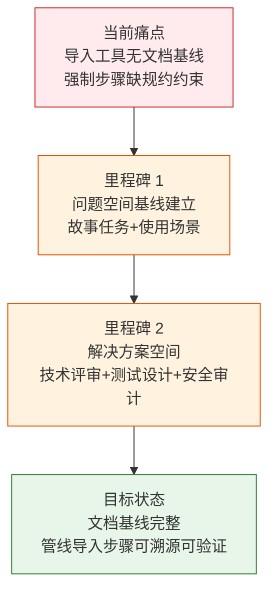
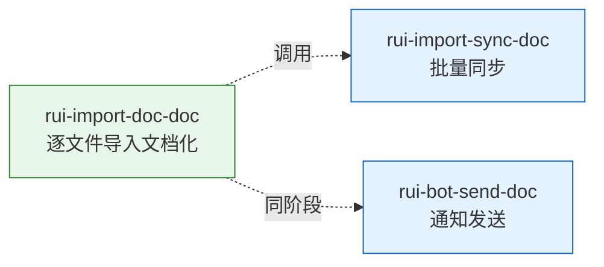

> | v1.0.0 | 2026-05-23 | deepseek-v4-pro | 🌿 feat/rui-import-doc-doc | 📎 [CLAUDE.md](../../../CLAUDE.md) |

> **导航**: [YrY-使用场景 →](./YrY-使用场景.md)

> **来源引用**: 本文档由 `/rui doc --from-code rui-import-doc-doc` 触发，从 `skills/rui/import-doc.mjs` 源码反推生成。证据 Level B + 源码路径。

### 需求概述

管线中文档生成后必须立即同步到远端知识库。当前管线依赖逐文件即时导入作为主路径，批量同步仅作兜底安全网。但逐文件导入工具本身缺少文档基线——它是什么、为谁服务、边界在哪、失败如何处理——这些关键信息没有规约约束，导致管线执行时无法验证导入步骤是否按预期执行。

本故事为逐文件导入工具建立完整的问题空间文档基线，使其成为可被下游文档溯源、可被管线验证的正式步骤。

### 效果示意

### 主要价值

- 📋 为逐文件导入工具建立正式的问题空间基线，使管线强制步骤有规约可依
- 🔗 让下游文档（技术评审/测试设计/安全审计）可溯源至明确的功能需求
- 🛡 定义导入失败不阻断管线的边界条件，防止静默丢失或误阻断
- ⚡ 明确即时导入与批量安全网的关系，消除"谁先谁后"的模糊空间

---

## §1 Story

### Story 1: 逐文件即时导入 — 问题空间基线

| 字段 | 内容 |
|------|------|
| 作为 | 管线执行者 |
| 我想要 | 每个文档生成后立即同步到远端知识库 |
| 以便 | 远端始终保持最新状态，批量安全网仅作兜底 |
| 优先级 | P0 |
| 范围边界 | 仅建立文档基线，不涉及源码修改 |
| 依赖 | 源码文件可读，远端 API 可访问 |

#### 范围外

- 不修改源码
- 不修改远程 API 行为
- 不覆盖已有故事文档

#### §1.1 User Operations

| # | 操作 | 触发条件 | 操作步骤 | 预期结果 |
|---|------|---------|---------|---------|
| 1 | 文档生成后即时导入 | 管线中 Write 一个文档文件 | 调用导入工具，传入文件路径 → 验证文件存在 → 发送到远端 API → 附加语义标签 | 远端知识库中可见该文档，含 stage/type/baseline 标签 |
| 2 | 导入失败降级 | 远端 API 不可达或无 token | 导入工具尝试发送 → 失败时输出告警 → 记录跳过原因 | 管线不阻断，批量安全网兜底 |
| 3 | 查看导入帮助 | 用户执行工具帮助命令 | 工具输出用法说明、选项列表、行为描述 | 用户理解工具功能和参数 |

---

### §2 Requirements

#### 功能点

| FP# | 描述 | 输入 | 输出 | 错误行为 | 优先级 |
|-----|------|------|------|---------|--------|
| FP1 | 文件验证 — 检查目标文件是否存在 | 文件路径 | 通过/文件不存在 | 文件不存在时输出错误信息，不阻断管线 | P0 |
| FP2 | 单文件导入 — 将文档发送到远端 API | 文件路径 | 远端导入成功/跳过/失败 | 无 token 时跳过；网络失败时告警不阻断 | P0 |
| FP3 | 语义标签自动附加 — 根据文件内容自动判定 stage/type/baseline | 文件路径 | 带标签的远端文档 | 标签判定失败时使用默认标签 | P0 |
| FP4 | 帮助输出 — 展示工具用法和选项 | 无参数或 --help | 格式化的帮助文本 | — | P1 |
| FP5 | JSON 输出 — 支持机器可读的结果格式 | --json 选项 | JSON 状态对象 | — | P1 |
| FP6 | 静默模式 — 仅输出错误信息 | --silent 选项 | 最小化输出 | — | P2 |

#### 业务规则

| R# | 描述 | 校验方式 | 证据级别 |
|----|------|---------|---------|
| R1 | 导入失败不阻断管线 | 检查 exit code 始终为 0 | A |
| R2 | 导入是强制步骤，不可跳过或推迟到批量安全网 | 检查管线执行顺序 | A |
| R3 | no-token 场景降级跳过，不报错 | 检查 no-token 时的输出级别 | A |
| R4 | 逐文件导入为主路径，批量安全网仅作兜底 | 检查管线架构 | A |

#### 数据约束

| 约束 | 类型 | 范围/格式 | 来源 |
|------|------|----------|------|
| 文件路径 | string | 绝对路径，文件存在 | 管线传入 |
| 超时时间 | number | 30000ms | 脚本内置 |
| 语义标签 | enum | stage: doc/code/deliver; type: story/scenario/technical-review/test-design/security-audit/implementation-report/test-report/retrospective/notification-log/interaction-log; baseline: problem/user/solution/verification/improvement | 按文件名判定 |

---

### §3 成功标准

| SC# | 描述 | 度量方式 | 目标值 | 优先级 | 关联 FP# |
|-----|------|---------|--------|--------|---------|
| SC1 | 文档 Write 后可立即调用导入 | import-doc.mjs 执行成功 | exit 0 | P0 | FP1, FP2 |
| SC2 | 导入失败时管线不受影响 | 网络断开时管线继续执行 | 不阻断 | P0 | FP2 |
| SC3 | 用户可查看完整帮助 | 无参数执行时输出帮助 | 含用法+选项+行为说明 | P0 | FP4 |
| SC4 | 机器可解析导入结果 | --json 输出 | 含 status 字段 | P1 | FP5 |

---

### §4 范围边界

#### 范围内

| # | 条目 | 关联 FP# | 边界说明 |
|---|------|---------|---------|
| 1 | 单文件导入到远端 API | FP2 | 调用批量同步脚本的单文件模式 |
| 2 | 文件存在性验证 | FP1 | 导入前检查 |
| 3 | 语义标签自动附加 | FP3 | 由同步脚本完成 |
| 4 | 失败降级处理 | FP2 | no-token 跳过，网络失败告警 |

#### 范围外

| # | 条目 | 排除原因 | 替代方案 |
|---|------|---------|---------|
| 1 | 批量同步 | 由 sync.mjs 独立处理 | 使用 `node skills/rui-import/sync.mjs` |
| 2 | 远端 API 实现 | 外部系统 | — |
| 3 | 语义标签规则定义 | 由 sync.mjs 内部判定 | — |
| 4 | 通知发送 | 由 rui-bot 处理 | — |

---

### §5 AC

| AC# | Given | When | Then | 门禁 |
|-----|-------|------|------|------|
| AC1 | 文档文件已写入磁盘 | 调用导入工具传入文件路径 | 文件通过验证，发送到远端 API，返回成功 | Gate A |
| AC2 | 文档文件不存在 | 调用导入工具传入无效路径 | 输出 "file not found" 错误，exit 0（不阻断） | Gate A |
| AC3 | 远端 API 无 token | 调用导入工具传入有效文件 | 输出 "no-token — skipped"，exit 0 | Gate A |
| AC4 | 用户执行无参数命令 | 导入工具启动 | 输出完整帮助文本（用法+选项+行为） | Gate A |
| AC5 | 用户执行 --json | 导入成功 | 输出 JSON `{"status":"ok","file":"..."}` | Gate B |
| AC6 | 用户执行 --silent | 导入成功 | 仅输出错误，无常规信息 | Gate B |

---

### §6 风险与假设

| # | 风险/假设 | 类型 | 可能性 | 影响 | 缓解/验证策略 | 关联 FP# |
|---|----------|------|--------|------|-------------|---------|
| 1 | 远端 API 不可达导致所有导入失败 | 风险 | M | H | 逐文件导入失败降级，批量安全网兜底 | FP2 |
| 2 | 文件路径传入错误导致静默跳过 | 风险 | L | M | 文件存在性验证 + 错误输出 | FP1 |
| 3 | 超时时间不足导致大文件导入失败 | 风险 | L | L | 30s 超时对 markdown 文档足够 | FP2 |
| 4 | 远端 API 始终可达 | 假设 | — | — | 网络失败时降级，不阻断 | FP2 |
| 5 | 语义标签能从文件名正确判定 | 假设 | — | — | sync.mjs 内部有标签推断逻辑 | FP3 |

---

### §7 跨文档索引

| 本文档章节 | 基线内容 | 下游文档编号 | 预期覆盖 | 状态 |
|-----------|---------|-------------|---------|------|
| §2 FP1–FP6 | 功能点定义 | 技术评审 | 架构与实现方案 | 待生成 |
| §5 AC1–AC6 | 验收标准 | 测试设计 | 测试用例覆盖全部 AC# | 待生成 |
| §6 风险 | 安全风险 | 安全审计 | STRIDE 威胁建模 | 待生成 |
| §1 Story 1 | 问题空间定义 | 使用场景 | 用户操作场景覆盖 | 待生成 |

---

### §R 关联故事

本故事为独立工具文档化，无跨故事依赖。

---

> **变更记录**
> | 日期 | 变更 | 触发 | 证据 |
> |------|------|------|------|
> | 2026-05-23 | 初始生成 — 从 skills/rui/import-doc.mjs 源码反推 | /rui doc --from-code rui-import-doc-doc | recommend.mjs 扫描 + 源码分析 |
