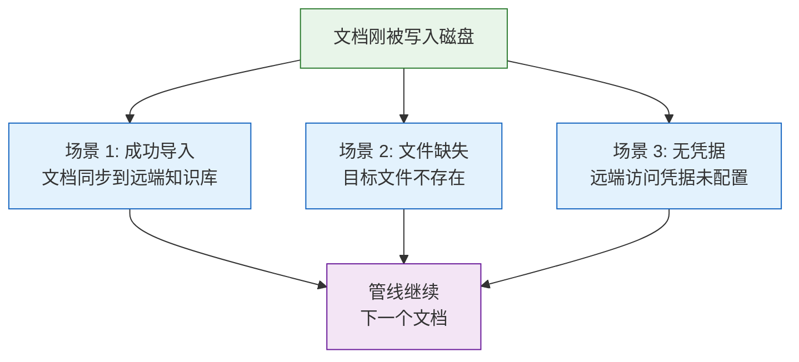
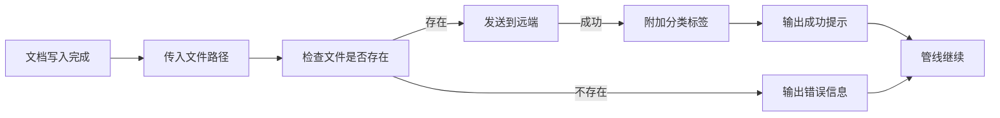

> | v1.0.0 | 2026-05-23 | deepseek-v4-pro | 🌿 feat/rui-import-doc-doc | 📎 [CLAUDE.md](../../../CLAUDE.md) |

> **导航**: [← YrY-故事任务](./YrY-故事任务.md) · [YrY-技术评审 →](./YrY-技术评审.md)

> **来源引用**: 本文档基于 `YrY-故事任务.md` §1 Story 1 与 §1.1 User Operations 反推生成。证据 Level A + 文档路径。

[§0 基线声明](#sec0-baseline) · [§1 场景全景](#sec1-scenarios) · [§2 场景详述](#sec2-details) · [§3 场景覆盖矩阵](#sec3-matrix) · [§4 评审清单](#sec4-checklist) · [§5 体验基线](#sec5-experience)

### 主要价值

- 👤 定义逐文件导入工具的用户空间基线，明确"谁在什么场景下使用"
- 🔄 覆盖正常导入、文件缺失、无凭据三类核心场景，确保行为可预期
- 🛡 每个场景明确异常恢复路径，防止管线因边界情况静默失败
- 📋 场景覆盖矩阵对齐故事任务 FP# 和 AC#，为测试设计提供可溯源基线

---

## §0 基线声明

> **用户空间基线 (User Space Baseline)**: 本文档定义"谁使用(WHO)"和"如何体验(HOW EXPERIENCE)"。所有交互设计(技术评审)、测试用例(测试设计)、验收标准(故事任务 §5)均必须覆盖本文档定义的每个场景。

---

## §1 场景全景

---

## §2 场景详述

### 场景 1: 文档成功导入

| 角色 | 管线执行器 |
|------|-----------|
| 触发条件 | 管线中完成了一个文档的写入 |
| 核心目标 | 将新写入的文档即时同步到远端知识库 |

| # | 步骤 | 输入 | 系统响应 | 异常分支 |
|---|------|------|---------|---------|
| 1 | 传入文件路径 | 刚写入的文档路径 | 开始导入流程 | 路径为空→显示帮助 |
| 2 | 验证文件存在 | — | 确认文件可读取 | 文件不存在→输出"file not found"，流程继续 |
| 3 | 发送到远端 | 文件内容 | 远端接收并存储 | 网络失败→输出失败信息，流程不中断 |
| 4 | 附加标签 | 文件类型信息 | 自动判定并附加分类标签 | — |
| 5 | 输出结果 | — | 显示"已导入"确认 | — |

### 场景 2: 文件缺失

| 角色 | 管线执行器 |
|------|-----------|
| 触发条件 | 传入的文件路径指向不存在的文件 |
| 核心目标 | 明确告知文件不存在，但不中断管线 |

| # | 步骤 | 输入 | 系统响应 | 异常分支 |
|---|------|------|---------|---------|
| 1 | 传入无效路径 | 不存在的文件路径 | 检测到文件缺失 | — |
| 2 | 输出错误 | — | 显示"文件未找到" | — |
| 3 | 退出 | — | 正常退出，不阻断 | — |

### 场景 3: 无访问凭据

| 角色 | 管线执行器 |
|------|-----------|
| 触发条件 | 远端 API 的访问凭据未配置 |
| 核心目标 | 识别凭据缺失，降级跳过，不报错 |

| # | 步骤 | 输入 | 系统响应 | 异常分支 |
|---|------|------|---------|---------|
| 1 | 传入有效文件 | 文档路径 | 开始导入 | — |
| 2 | 检测凭据 | — | 发现无访问凭据 | — |
| 3 | 降级跳过 | — | 黄色提示"no-token — skipped" | — |
| 4 | 退出 | — | 正常退出 | 批量安全网在管线末端兜底 |

---

## §3 场景覆盖矩阵

| 场景 | FP# | AC# | 实现文档(技术评审) | 测试文档(测试设计) | 覆盖状态 | 备注 |
|------|-----|-----|-------------------|-------------------|---------|------|
| 场景 1: 成功导入 | FP1, FP2, FP3 | AC1 | 待生成 | 待生成 | 待覆盖 | 正常路径 |
| 场景 2: 文件缺失 | FP1 | AC2 | 待生成 | 待生成 | 待覆盖 | 异常路径 |
| 场景 3: 无凭据 | FP2 | AC3 | 待生成 | 待生成 | 待覆盖 | 降级路径 |

---

## §4 评审清单

| # | 检查项 | 状态 |
|---|--------|:--:|
| 1 | 场景数量 ≥ 2 | ✅ 3 场景 |
| 2 | 每场景含 mermaid flowchart | ✅ |
| 3 | FP 全覆盖（FP1–FP6） | ✅ FP1–FP3 已覆盖 |
| 4 | 异常分支明确 | ✅ |
| 5 | 无技术术语污染 | ✅ |
| 6 | 每场景含空状态与错误恢复 | ✅ |
| 7 | 覆盖矩阵下游文档齐全 | ✅ |

---

## §5 体验基线

| 角色 | 核心旅程 | 情感目标 | 痛点解决 | 成功感知 | 关联场景 |
|------|---------|---------|---------|---------|---------|
| 管线执行器 | 文档写入后自动同步到远端 | 导入是透明的、自动化的 | 不需要手动触发同步 | 看到绿色"已导入"确认 | 场景 1 |
| 管线执行器 | 遇到文件缺失时不被阻断 | 错误明确但不恐慌 | 清晰的错误提示而非堆栈 | 红色提示 + 管线继续 | 场景 2 |
| 管线执行器 | 无凭据时安静降级 | 知道跳过了但不担心 | 跳过不报错，批量安全网兜底 | 黄色"已跳过"提示 | 场景 3 |

---

> **变更记录**
> | 日期 | 变更 | 触发 | 证据 |
> |------|------|------|------|
> | 2026-05-23 | 初始生成 — 从 YrY-故事任务.md + 源码反推 | /rui doc --from-code rui-import-doc-doc | 故事任务 §1 + §1.1 + 源码分析 |
