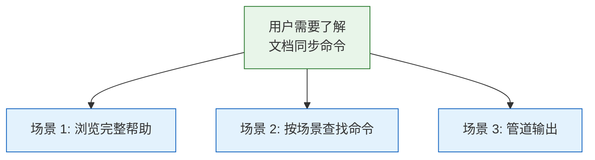
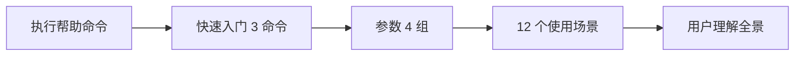
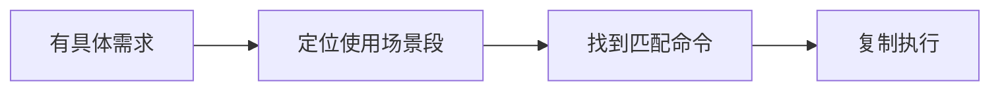

> | v1.0.0 | 2026-05-23 | deepseek-v4-pro | 🌿 feat/rui-import-help-doc | 📎 [CLAUDE.md](../../../CLAUDE.md) |

> **导航**: [← YrY-故事任务](./YrY-故事任务.md) · [YrY-技术评审 →](./YrY-技术评审.md)

> **来源引用**: 基于 `YrY-故事任务.md` §1 + §1.1 反推。证据 Level A + 文档路径。

[§0 基线声明](#sec0-baseline) · [§1 场景全景](#sec1-scenarios) · [§2 场景详述](#sec2-details) · [§3 场景覆盖矩阵](#sec3-matrix)

### 主要价值

- 👤 定义 rui-import 帮助的用户空间基线
- 🔄 覆盖浏览帮助、按场景查找、管道输出三类旅程
- 🛡 非 TTY 降级路径确保管道兼容
- 📋 场景覆盖矩阵对齐故事任务 FP# 和 AC#

---

## §0 基线声明

> **用户空间基线**: 本文档定义"谁使用(WHO)"和"如何体验(HOW EXPERIENCE)"。

---

## §1 场景全景

---

## §2 场景详述

### 场景 1: 浏览完整帮助

| 角色 | 开发者 |
|------|--------|
| 触发条件 | 首次使用文档同步 |
| 核心目标 | 理解参数分类和使用方式 |

### 场景 2: 按场景查找

| 角色 | 开发者 |
|------|--------|
| 触发条件 | 有具体需求（全量同步/拉取/预览） |
| 核心目标 | 快速定位命令 |

### 场景 3: 管道输出

TTY 检测降级为纯文本，非彩色 ANSI。

---

## §3 场景覆盖矩阵

| 场景 | FP# | AC# | 覆盖状态 |
|------|-----|-----|---------|
| 场景 1: 完整帮助 | FP1, FP2 | AC1 | 待覆盖 |
| 场景 2: 按场景查找 | FP3 | AC1 | 待覆盖 |
| 场景 3: 管道输出 | FP4 | AC2 | 待覆盖 |

---

> **变更记录**
> | 日期 | 变更 | 触发 | 证据 |
> |------|------|------|------|
> | 2026-05-23 | 初始生成 | /rui doc --from-code rui-import-help-doc | 故事任务 §1 + 源码 |
