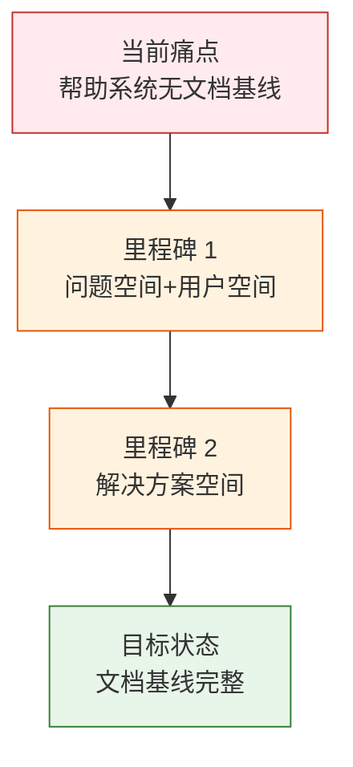

> | v1.0.0 | 2026-05-23 | deepseek-v4-pro | 🌿 feat/rui-import-help-doc | 📎 [CLAUDE.md](../../../CLAUDE.md) |

> **导航**: [YrY-使用场景 →](./YrY-使用场景.md)

> **来源引用**: 由 `/rui doc --from-code rui-import-help-doc` 触发，从 `skills/rui-import/help.mjs` 源码反推。证据 Level B + 源码路径。

[§1 Story](#sec1-story)

### 需求概述

文档批量同步技能的入口需要帮助系统，让用户了解扫描、过滤、路径映射、上传等参数用法。帮助覆盖 4 组参数（路径控制/文件过滤/模式控制/其他）和 12 个使用场景。帮助系统本身缺少文档基线。

### 效果示意

### 主要价值

- 📋 为 rui-import 帮助系统建立问题空间基线
- 🔗 覆盖 12 个参数 + 12 个使用场景的命令分类
- 🎯 使用场景对齐实际管线工作流（先预览再同步）
- 🛡 定义 TTY 降级和格式约定

---

## §1 Story

### Story 1: rui-import 帮助系统 — 问题空间基线

| 字段 | 内容 |
|------|------|
| 作为 | 开发者 |
| 我想要 | 通过命令行查看文档同步的完整帮助 |
| 以便 | 理解扫描/过滤/上传/拉取等操作方式 |
| 优先级 | P0 |
| 范围边界 | 仅建立文档基线，不涉及源码修改 |
| 依赖 | 源码文件可读 |

#### §1.1 User Operations

| # | 操作 | 触发条件 | 操作步骤 | 预期结果 |
|---|------|---------|---------|---------|
| 1 | 查看完整帮助 | 执行帮助命令 | 输出格式化帮助文本 | 快速入门+参数+使用场景三段 |
| 2 | 按场景学习用法 | 需要同步或拉取文档 | 定位场景段→匹配命令 | 可复制执行的命令 |

---

### §2 Requirements

#### 功能点

| FP# | 描述 | 优先级 |
|-----|------|--------|
| FP1 | 帮助文本生成 — 完整格式化帮助 | P0 |
| FP2 | 参数分组 — 路径控制/文件过滤/模式控制/其他 | P0 |
| FP3 | 使用场景 — 12 个典型场景 | P1 |
| FP4 | TTY 颜色适配 | P1 |

---

### §3 成功标准

| SC# | 描述 | 度量方式 | 目标值 |
|-----|------|---------|--------|
| SC1 | 用户可看到完整命令列表 | 输出行数 | ≥ 100 |
| SC2 | 管道中无 ANSI 乱码 | `\| cat` | 0 转义 |

---

### §5 AC

| AC# | Given | When | Then | 门禁 |
|-----|-------|------|------|------|
| AC1 | 帮助脚本存在 | 执行帮助 | 含"快速入门""参数""使用场景" | Gate A |
| AC2 | 管道到非 TTY | `help \| cat` | 纯文本无 ANSI | Gate A |

---

### §7 跨文档索引

| 本文档章节 | 下游文档 | 状态 |
|-----------|---------|------|
| §2 FP1–FP4 | 技术评审 | 待生成 |
| §5 AC1–AC2 | 测试设计 | 待生成 |

---

> **变更记录**
> | 日期 | 变更 | 触发 | 证据 |
> |------|------|------|------|
> | 2026-05-23 | 初始生成 | /rui doc --from-code rui-import-help-doc | skills/rui-import/help.mjs |
