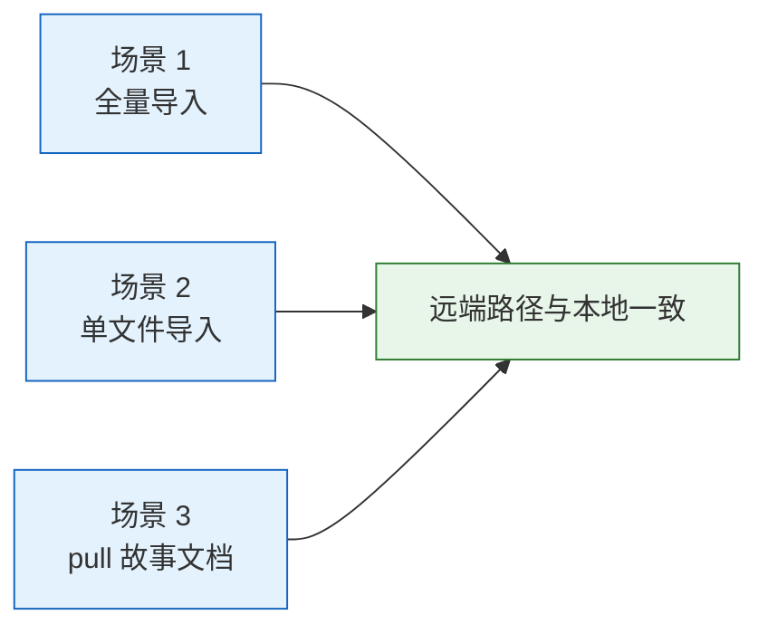
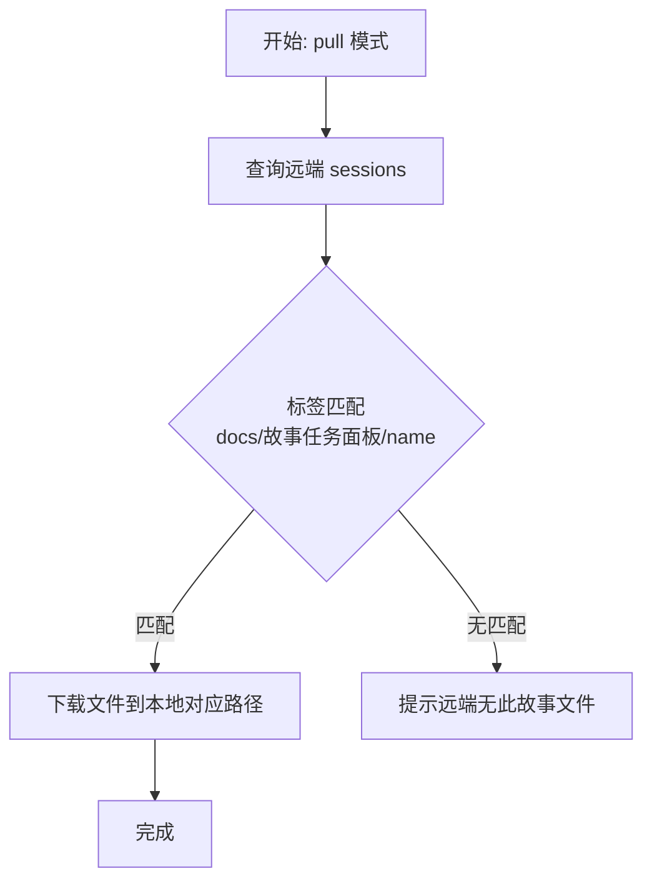

> | v1.0.0 | 2026-05-24 | deepseek-v4-pro | 🌿 feat/rui-import-label-change | 📎 [CLAUDE.md](../../CLAUDE.md) |

> **导航**: [← YrY-故事任务](./YrY-故事任务.md) · [YrY-技术评审 →](./YrY-技术评审.md)

### 来源引用

> 触发: `/rui` "rui-import 导入的目录标签应该和本地项目的目录保持一一对应的效果"
> 基于: [YrY-故事任务](./YrY-故事任务.md) §1 Story 1

---

## §0 基线声明

> **用户空间基线 (User Space Baseline)**: 本文档定义"谁使用(WHO)"和"如何体验(HOW EXPERIENCE)"。所有交互设计(技术评审)、测试用例(测试设计)、验收标准(故事任务 §5)均必须覆盖本文档定义的每个场景。

### 主要价值

- 🎯 使用 rui-import 导入文档的用户无需记忆路径转换规则
- 🔒 本地目录结构即远端标签结构，所见即所得
- ⚡ pull 模式按自然路径层级匹配，减少运维出错
- 📊 全量导入和单文件导入行为完全一致，零意外

---

## §1 场景全景



---

## §2 场景详述

### 场景 1: 全量导入 — 批量同步项目文档到远端

| 角色 | 触发条件 | 核心目标 |
|------|---------|---------|
| 开发者/管线 | 执行 `node skills/rui-import/sync.mjs` | 将项目所有文档同步到远端，远端目录结构与本地一致 |

```mermaid
flowchart TD
    A["开始: 执行 sync.mjs"] --> B["扫描项目文件"]
    B --> C{"文件路径"}
    C -->|"docs/故事任务面板/story/file.md"| D1["远端: docs/故事任务面板/story/file.md"]
    C -->|"README.md"| D2["远端: README.md"]
    C -->|".claude/settings.json"| D3["远端: .claude/settings.json"]
    D1 & D2 & D3 --> E["逐文件上传"]
    E --> F["完成: 远端路径 = 本地相对路径"]

    classDef start fill:#e8f5e9,stroke:#2e7d32;
    classDef end fill:#e8f5e9,stroke:#2e7d32;
```

| # | 步骤 | 输入 | 系统响应 | 异常分支 |
|---|------|------|---------|---------|
| 1 | 扫描项目文件 | 项目根目录 | 列出所有 .md 和 .claude/ 下文件 | 目录不存在 → 提示并跳过 |
| 2 | 计算远端路径 | 本地绝对路径 | 生成相对路径作为远端路径 | 空格替换为 `_` |
| 3 | 上传文件 | 远端路径 + 内容 | POST /write-file 成功 | 单文件失败 → 记录错误继续 |
| 4 | 创建 session | 新文件远端路径 | create_document 成功 | 已存在 → overwritten |

### 场景 2: 单文件导入 — 文档生成后即时同步

| 角色 | 触发条件 | 核心目标 |
|------|---------|---------|
| rui 管线 | 每个文档 Write 后自动调用 `import-doc.mjs` | 单个文档即时同步到远端，路径一致 |


| # | 步骤 | 输入 | 系统响应 | 异常分支 |
|---|------|------|---------|---------|
| 1 | 验证文件存在 | 文件路径 | 存在则继续 | 不存在 → 输出错误退出 |
| 2 | 调用 sync.mjs file= | 文件绝对路径 | 单文件上传 | no-token → 静默跳过 |
| 3 | 附加语义标签 | 文件名后缀 | stage/type/baseline 标签 | 非故事文档 → 无标签 |

### 场景 3: pull 故事文档 — 从远端拉取故事

| 角色 | 触发条件 | 核心目标 |
|------|---------|---------|
| 开发者 | 执行 `sync.mjs dir=docs/故事任务面板/<name>/ mode=pull` | 从远端拉取指定故事的所有文档 |



| # | 步骤 | 输入 | 系统响应 | 异常分支 |
|---|------|------|---------|---------|
| 1 | 查询远端 | API 请求 | 返回 sessions 列表 | 远端不可达 → 提示错误 |
| 2 | 标签过滤 | tags[0]=="docs", tags[1]=="故事任务面板", tags[2]==name | 匹配的文件列表 | 无匹配 → 提示并退出 |
| 3 | 逐文件下载 | 远端路径 | POST /read-file → 写本地 | 单文件失败 → 记录错误继续 |

---

## §3 场景覆盖矩阵

| 场景 | FP# | AC# | 实现文档(技术评审) | 测试文档(测试设计) | 覆盖状态 | 备注 |
|------|-----|------|-------------------|-------------------|---------|------|
| 全量导入 | FP1, FP2 | AC1, AC2, AC3, AC5, AC6 | [YrY-技术评审](./YrY-技术评审.md) §1 | [YrY-测试设计](./YrY-测试设计.md) | 待生成 | — |
| 单文件导入 | FP1 | AC1, AC2, AC3 | 同上 | 同上 | 待生成 | — |
| pull 故事 | FP3, FP4 | AC4 | 同上 §2 | 同上 | 待生成 | — |
| pull claude | FP4, FP5 | — | 同上 §2 | 同上 | 待生成 | — |

---

## §4 评审清单

| # | 检查项 | 状态 |
|---|--------|------|
| 1 | 场景 ≥ 2 | ✅ (3 个场景) |
| 2 | 每场景有 mermaid 流程图 | ✅ |
| 3 | FP 全覆盖（5 个 FP# 均有场景覆盖） | ✅ |
| 4 | 异常分支明确（每场景 ≥ 1 个） | ✅ |
| 5 | 无技术术语（无 API/组件名/代码路径） | ✅ |
| 6 | 每场景含空状态与错误恢复 | ✅ |
| 7 | 覆盖矩阵下游文档齐全 | ✅ |

---

## §5 体验基线

| 角色 | 核心旅程 | 情感目标 | 痛点解决 | 成功感知 | 关联场景 |
|------|---------|---------|---------|---------|---------|
| 开发者 | 全量导入文档到远端 | 确定感 — 知道远端路径是什么 | 不再需要记忆路径转换规则 | 在远端看到与本地一致的目录结构 | 场景 1 |
| 管线 | 每文档生成后即时同步 | 安心 — 每个文档都已同步 | 单文件导入无需额外检查路径 | import-doc.mjs 返回 ✓ | 场景 2 |
| 运维者 | 从远端拉取故事文档 | 可控 — 精确拉取指定故事 | 标签匹配逻辑清晰可预测 | 文件下载到正确本地路径 | 场景 3 |

---

## 变更记录

| 日期 | 变更 | 触发 | 证据 |
|------|------|------|------|
| 2026-05-24 | 初始生成 | `/rui` doc 阶段 | — |
