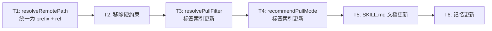
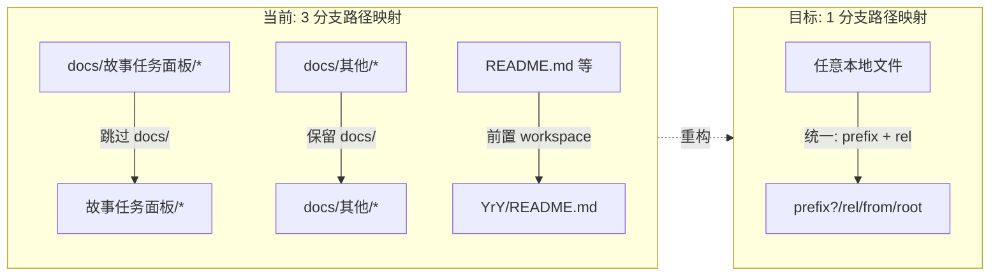

> | v1.0.0 | 2026-05-24 | deepseek-v4-pro | 🌿 feat/rui-import-label-change | 📎 [CLAUDE.md](../../CLAUDE.md) |

> **导航**: [← YrY-使用场景](./YrY-使用场景.md) · [YrY-测试设计 →](./YrY-测试设计.md) · [YrY-安全审计 →](./YrY-安全审计.md)

### 来源引用

> 基于: [YrY-故事任务](./YrY-故事任务.md) §1 Story 1 · §2 FP1–FP5
> 源码: `skills/rui-import/sync.mjs`

### 主要价值

- 🎯 路径映射从 3 分支简化为 1 分支，消除路径转换的心智负担
- 🔒 移除硬编码的一级标签约束，允许 prefix 灵活指定
- ⚡ pull 模式标签索引对齐本地目录结构：`docs/故事任务面板/<name>/`
- 📊 变更范围仅限 sync.mjs 一个文件，风险可控且可快速回退

---

## §0 设计决策与任务规划

### §0.0 基线溯源

| 本设计章节 | 实现 故事任务 | 服务 使用场景 | 覆盖状态 |
|-----------|-------------|-------------|---------|
| §1 resolveRemotePath | FP1, FP2 | 场景 1, 2 | 覆盖 |
| §1 硬约束移除 | FP2 | 场景 1 | 覆盖 |
| §2 resolvePullFilter | FP3, FP4 | 场景 3 | 覆盖 |
| §2 recommendPullMode | FP5 | 场景 3 | 覆盖 |

### §0.1 设计决策

| 决策领域 | 选定方案 | 选择理由 | 详见 | 实现 FP# |
|---------|---------|---------|------|---------|
| 路径映射 | 统一为 `prefix + relative(root, file)` | 消除 3 分支为 1 分支，一一对应 | §1 | FP1 |
| 一级标签约束 | 移除硬约束检查 | 无前缀时第一段即本地首层目录，无需人为限制 | §1 | FP2 |
| pull 标签匹配 | tags[0]=="docs" && tags[1]=="故事任务面板" | 镜像本地目录结构 | §2 | FP3 |
| 兼容旧标签 | 不做兼容处理 | pull 匹配结构变了，但旧 sessions 仍可手动处理 | §2 | — |

### §0.2 任务规划



| ID | 描述 | 工作量 | 依赖 | 交付物 | Agent | 门禁 | 交接下游 | 实现 FP# |
|----|------|--------|------|--------|-------|------|---------|---------|
| T1 | resolveRemotePath 简化为 prefix + rel | S | — | sync.mjs:163-180 | coder | Gate A | T2 | FP1 |
| T2 | 移除 allowedLabels 硬约束 | S | T1 | sync.mjs:597-605 | coder | Gate A | T3 | FP2 |
| T3 | resolvePullFilter 标签索引更新 | S | T2 | sync.mjs:322-357 | coder | Gate A | T4 | FP3, FP4 |
| T4 | recommendPullMode 标签索引更新 | S | T3 | sync.mjs:419-459 | coder | Gate A | T5 | FP5 |
| T5 | SKILL.md 路径映射文档更新 | S | T4 | SKILL.md | coder | Gate A | T6 | — |
| T6 | 记忆文件更新 | S | T5 | .memory/ | coder | Gate B | — | — |

---

## §1 系统架构

### 效果示意



### 1.1 变更模块

| 变更类型 | 模块/文件 | 职责 |
|---------|----------|------|
| 修改 | `skills/rui-import/sync.mjs:163-180` | resolveRemotePath — 统一路径映射 |
| 修改 | `skills/rui-import/sync.mjs:597-605` | 硬约束校验 — 移除 |
| 修改 | `skills/rui-import/sync.mjs:322-357` | resolvePullFilter — 标签索引更新 |
| 修改 | `skills/rui-import/sync.mjs:419-459` | recommendPullMode — 标签索引更新 |
| 修改 | `skills/rui-import/SKILL.md` | 路径映射文档更新 |

### resolveRemotePath 变更

**当前** (`sync.mjs:163-180`):
```js
function resolveRemotePath(localPath, root, workspaceName, prefix) {
  const rel = relative(root, localPath).split(sep).join("/").replace(/\s/g, "_");
  const segments = [];
  if (prefix.length > 0) segments.push(...prefix);
  if (rel.startsWith("docs/故事任务面板/")) {
    segments.push(...rel.split("/").slice(1));   // 跳过 docs
  } else if (rel.startsWith("docs/")) {
    segments.push(...rel.split("/"));             // 保留 docs
  } else {
    segments.push(workspaceName);                  // 前置 workspace
    segments.push(rel);
  }
  return segments.join("/");
}
```

**目标**:
```js
function resolveRemotePath(localPath, root, workspaceName, prefix) {
  const rel = relative(root, localPath).split(sep).join("/").replace(/\s/g, "_");
  const segments = [];
  if (prefix.length > 0) segments.push(...prefix);
  segments.push(...rel.split("/"));
  return segments.join("/");
}
```

### resolvePullFilter 变更

**当前** (`sync.mjs:335`):
```js
return tags[0] === "故事任务面板" && tags[1] === storyName;
```
**目标**:
```js
return tags[0] === "docs" && tags[1] === "故事任务面板" && tags[2] === storyName;
```

**当前** (`sync.mjs:349`):
```js
return tags[0] === workspaceName && fp.startsWith(`${workspaceName}/.claude/`);
```
**目标**:
```js
return tags[0] === ".claude" && fp.startsWith(".claude/");
```

**当前** (`sync.mjs:352`):
```js
toLocal: (remotePath) => join(projectRoot, remotePath.slice(workspaceName.length + 1)),
```
**目标**:
```js
toLocal: (remotePath) => join(projectRoot, remotePath),
```

### recommendPullMode 变更

**当前** (`sync.mjs:439`):
```js
if (tags[0] !== "故事任务面板" || !tags[1]) continue;
const name = tags[1];
```
**目标**:
```js
if (tags[0] !== "docs" || tags[1] !== "故事任务面板" || !tags[2]) continue;
const name = tags[2];
```

### 硬约束移除

**当前** (`sync.mjs:597-605`):
```js
const allowedLabels = new Set([workspaceName, "docs"]);
if (opts.prefix.length > 0) {
  const firstLabel = opts.prefix[0];
  if (!allowedLabels.has(firstLabel)) {
    console.error(`...`);
    process.exit(1);
  }
}
```
**目标**: 整个块移除。

---

## §7 安全约束

| # | 威胁 | 信任边界 | 缓解措施 | 优先级 |
|---|------|---------|---------|--------|
| 1 | prefix 参数注入任意路径段 | CLI 输入 → API 请求 | X-Token 鉴权；远端 API 有自有权限控制 | P2 |
| 2 | 旧 sessions 标签与新 pull 逻辑不匹配 | 本地 ↔ 远端 | 旧数据不变，用户可手动全量重导 | P2 |

---

## §9 评审清单

| # | 检查项 | 状态 |
|---|--------|------|
| 1 | resolveRemotePath 仅 1 条路径分支（prefix + rel） | 待验证 |
| 2 | 硬约束代码块已移除 | 待验证 |
| 3 | resolvePullFilter 标签索引 tags[0..2] 全部更新 | 待验证 |
| 4 | recommendPullMode 标签索引更新 | 待验证 |
| 5 | 基线溯源 §0.0 覆盖全部 FP# | ✅ |
| 6 | 效果示意 mermaid 完整 | ✅ |

---

## 变更记录

| 日期 | 变更 | 触发 | 证据 |
|------|------|------|------|
| 2026-05-24 | 初始生成 | `/rui` doc 阶段 | sync.mjs 源码分析 |
