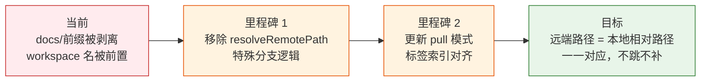

> | v1.0.0 | 2026-05-24 | deepseek-v4-pro | 🌿 feat/rui-import-label-change | 📎 [CLAUDE.md](../../CLAUDE.md) |

> **导航**: [YrY-使用场景 →](./YrY-使用场景.md)

[§1 Story](#sec1-story) · [§2 Requirements](#sec2-requirements) · [§3 成功标准](#sec3-success) · [§4 范围边界](#sec4-scope) · [§5 AC](#sec5-ac) · [§6 风险与假设](#sec6-risks) · [§7 跨文档索引](#sec7-index) · [变更记录](#changelog)

### 来源引用

> 触发: `/rui` "rui-import 导入的目录标签应该和本地项目的目录保持一一对应的效果"
> 来源: 用户需求 · 2026-05-24

### 需求概述

当前 rui-import 的 `resolveRemotePath` 对本地路径做了转换：`docs/故事任务面板/` 路径跳过 `docs/` 段以 `故事任务面板` 为一级标签，非 `docs/` 路径前置 workspace 名。用户要求远端标签与本地目录结构保持一一对应——不跳过、不前置、不重命名，远程路径即本地相对路径。

### 主要价值

- 🎯 远端路径与本地目录完全一致，消除心智映射负担
- 🔒 路径映射规则从 3 分支简化为 1 条，减少 bug 表面积
- ⚡ pull 模式标签匹配语义更清晰：`docs/故事任务面板/<name>/`
- 📊 移除硬编码的一级标签约束，允许 prefix 灵活指定

---

## §1 Story

### Story 1: resolveRemotePath 统一为相对路径直出

| 字段 | 内容 |
|------|------|
| 作为 | rui-import 使用者 |
| 我想要 | 远端路径直接等于本地文件相对于项目根的路径 |
| 以便 | 无需记忆任何路径转换规则，本地看到什么目录结构远端就是什么结构 |
| 优先级 | P0 |
| 范围边界 | 仅修改 `skills/rui-import/sync.mjs` 的路径映射逻辑和标签匹配逻辑 |
| 依赖 | git 仓库可操作 |

#### 范围外

- 不改变 API 契约（/write-file, create_document 不变）
- 不改变语义标签附加逻辑（DOC_TYPE_PATTERNS 不变）
- 不改变 rui-import SKILL.md 以外的文档

#### §1.1 User Operations

| # | 操作 | 触发条件 | 操作步骤 | 预期结果 |
|---|------|---------|---------|---------|
| 1 | 全量导入 | 执行 `node skills/rui-import/sync.mjs` | 扫描项目文件 → 计算远端路径 = 相对路径 → 逐文件上传 | 远端路径与 `git ls-files` 输出的相对路径一致 |
| 2 | 单文件导入 | 执行 `node skills/rui/import-doc.mjs <file>` | 验证文件 → 调用 sync.mjs file= → 上传 | 单文件远端路径 = 其相对项目根路径 |
| 3 | pull 故事 | 执行 `node skills/rui-import/sync.mjs dir=<path> mode=pull` | 查询远端 sessions → 按新标签结构匹配 → 下载 | 远端文件拉取到本地正确位置 |
| 4 | prefix 指定 | 执行 `node skills/rui-import/sync.mjs prefix=a,b` | 在最前追加 prefix 段 → 后续保持相对路径 | 允许任意 prefix 一级标签 |

---

## §2 Requirements

### 功能点

| FP# | 描述 | 输入 | 输出 | 错误行为 | 优先级 |
|-----|------|------|------|---------|--------|
| FP1 | resolveRemotePath 统一为相对路径直出 | 本地文件绝对路径 | 远端路径 = prefix + 相对路径 | 无（纯路径计算） | P0 |
| FP2 | 移除一级标签硬约束 | prefix 参数 | 不再校验 prefix 首段 | 无 | P0 |
| FP3 | resolvePullFilter 故事标签索引更新 | pull dir=docs/故事任务面板/<name>/ | tags[0]=="docs", tags[1]=="故事任务面板", tags[2]==storyName | 索引越界或空匹配时降级 | P0 |
| FP4 | resolvePullFilter claude 标签索引更新 | pull dir=.claude/ | tags[0]==".claude", fp.startsWith(".claude/") | 同上 | P1 |
| FP5 | recommendPullMode 标签索引更新 | 远端 sessions 列表 | 按新标签结构分组 | 无匹配时提示"远端无故事任务面板文件" | P1 |

### 业务规则

| R# | 描述 | 校验方式 | 证据级别 |
|----|------|---------|---------|
| R1 | 远端路径 = prefix（如有）+ 项目根相对路径 | `git ls-files` 对比 sync.mjs mode=list 输出 | B |
| R2 | 所有文档仍附加语义标签（stage/type/baseline） | 检查 createSession 调用参数 | A |
| R3 | pull 模式故事标签匹配不退化 | 执行 `dir=docs/故事任务面板/<name>/ mode=pull` 验证 | B |

### 数据约束

| 约束 | 类型 | 范围/格式 | 来源 |
|------|------|----------|------|
| 远端路径分隔符 | string | `/`（统一，非 `\`） | 路径规整规则 |
| 空白字符 | string | 替换为 `_` | 路径规整规则 |
| prefix | string[] | 可选，任意值 | CLI 参数 |

---

## §3 成功标准

| SC# | 描述 | 度量方式 | 目标值 | 优先级 | 关联 FP# |
|-----|------|---------|--------|--------|---------|
| SC1 | 远端路径与本地相对路径完全一致 | `sync.mjs mode=list` 输出路径 = `git ls-files | grep '\.md$'` 输出 | 100% 匹配 | P0 | FP1 |
| SC2 | 不再需要记忆三种路径映射规则 | resolveRemotePath 代码分支数 | 1（仅 prefix + rel） | P0 | FP1 |
| SC3 | pull 模式在新标签结构下正常工作 | 端到端 pull 测试 | 文件下载到正确路径 | P1 | FP3, FP4 |

---

## §4 范围边界

### 范围内

| # | 条目 | 关联 FP# | 边界说明 |
|---|------|---------|---------|
| 1 | resolveRemotePath 简化为 prefix + rel | FP1 | 移除 docs/ 跳过和 workspace 前置逻辑 |
| 2 | 移除一级标签硬约束 | FP2 | 删除 allowedLabels 校验块 |
| 3 | resolvePullFilter 标签索引更新 | FP3, FP4 | 匹配新的 tags 结构 |
| 4 | recommendPullMode 标签索引更新 | FP5 | 同上 |

### 范围外

| # | 条目 | 排除原因 | 替代方案 |
|---|------|---------|---------|
| 1 | API 契约变更 | /write-file 和 create_document 接口不变 | — |
| 2 | 语义标签变更 | DOC_TYPE_PATTERNS 不变 | — |
| 3 | import-doc.mjs 修改 | 仅转发到 sync.mjs，无需修改 | — |

---

## §5 AC

| AC# | Given | When | Then | 门禁 |
|-----|-------|------|------|------|
| AC1 | 文件位于 `docs/故事任务面板/rui-story/YrY-故事任务.md` | sync.mjs 计算远端路径 | 远端路径 = `docs/故事任务面板/rui-story/YrY-故事任务.md`（保留 docs/） | Gate A |
| AC2 | 文件位于 `README.md`（项目根） | sync.mjs 计算远端路径 | 远端路径 = `README.md`（无 workspace 前缀） | Gate A |
| AC3 | 文件位于 `.claude/settings.json` | sync.mjs 计算远端路径 | 远端路径 = `.claude/settings.json` | Gate A |
| AC4 | pull 模式 dir=docs/故事任务面板/rui-story/ | 查询远端 sessions | 按 tags[0]=="docs" && tags[1]=="故事任务面板" && tags[2]=="rui-story" 匹配 | Gate A |
| AC5 | 无 prefix 参数 | sync.mjs 执行 | 远端路径不含额外前缀 | Gate A |
| AC6 | prefix=x,y 指定 | sync.mjs 执行 | 远端路径 = x/y/<相对路径> | Gate B |

---

## §6 风险与假设

| # | 风险/假设 | 类型 | 可能性 | 影响 | 缓解/验证策略 | 关联 FP# |
|---|----------|------|--------|------|-------------|---------|
| 1 | 远端已有 sessions 使用旧标签结构，更新后新旧标签不兼容 | 风险 | H | M | 旧 sessions 的 tags 不会自动更新，需要在 pull 模式中兼容旧格式或通知用户全量重导 | FP3, FP4 |
| 2 | 移除一级标签约束后 prefix 参数可注入任意值 | 风险 | L | L | prefix 仅影响远端路径，不影响本地安全；API 层面有 X-Token 鉴权 | FP2 |
| 3 | 代码变更影响范围仅限 sync.mjs 一个文件 | 假设 | — | — | Grep 确认全部引用点 | FP1 |

---

## §7 跨文档索引

| 本文档章节 | 基线内容 | 下游文档编号 | 预期覆盖 | 状态 |
|-----------|---------|-------------|---------|------|
| §2 FP1 | resolveRemotePath 统一 | 技术评审 §1 | resolveRemotePath 新实现 | 待生成 |
| §2 FP2 | 移除一级标签约束 | 技术评审 §1 | 硬约束代码移除 | 待生成 |
| §2 FP3-FP5 | pull 模式标签更新 | 技术评审 §1 | resolvePullFilter / recommendPullMode | 待生成 |
| §5 AC1-AC6 | 验收标准 | 测试设计 §2 | 6 个 AC 对应测试用例 | 待生成 |
| §6 风险 1 | 旧标签兼容 | 安全审计 §2 | 数据完整性风险 | 待生成 |

---

## 变更记录

| 日期 | 变更 | 触发 | 证据 |
|------|------|------|------|
| 2026-05-24 | 初始生成 | `/rui` 用户需求 | — |
