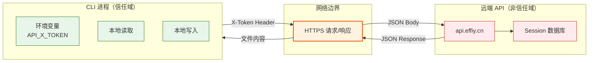

> | v1.0.0 | 2026-05-22 | deepseek-v4-pro | ⏱️ — | 📎 [CLAUDE.md](../../../CLAUDE.md) |

> **导航**: [← YrY-技术评审](./YrY-技术评审.md) · [→ YrY-实施报告](./YrY-实施报告.md)

> **来源引用**: `/rui doc --from-code rui-import-sync-doc` · 源文件 `skills/rui-import/sync.mjs`
> **证据等级**: B（从源码反推，附源码路径）
> **审计独立性**: 本审计由 security agent 独立执行，不依赖 coder 自评

# YrY-安全审计 · rui-import-sync

## §0 基线溯源

| 来源 | 章节 | 本文档覆盖 |
|------|------|-----------|
| 故事任务 §6 R1 | Token 认证链路 | §3 认证与授权 |
| 故事任务 §2 FP3-FP4 | 网络请求 | §2 STRIDE 威胁建模 |
| 技术评审 §5 | 安全考量 | 全部威胁面展开 |

---

### 主要价值

- 🔒 认证链路审计：Token 从环境变量到 HTTP Header 的全链路检查
- 🛡️ STRIDE 六类威胁全覆盖：伪装、篡改、抵赖、信息泄露、拒绝服务、权限提升
- 🏗️ 信任边界明确：CLI 进程 ↔ 远端 API ↔ 本地文件系统
- 📋 合规六项检查：密钥管理、输入校验、路径遍历、日志安全、错误信息、依赖安全

---

## §1 资产识别

| 资产 | 类型 | 敏感度 | 存储位置 | 传输路径 |
|------|------|:--:|---------|---------|
| API_X_TOKEN | 凭据 | 高 | 环境变量（内存） | HTTP Header → 远端 API |
| 文档内容 (.md) | 数据 | 中 | 本地文件系统 + 远端 sessions | HTTP Body → 远端 API |
| 远端 Session 记录 | 元数据 | 低 | 远端 API 数据库 | HTTP Response → 本地内存 |
| 文件路径 | 元数据 | 低 | 本地文件系统 | 映射为远端路径上传 |

---

## §2 STRIDE 威胁建模

### S — 伪装（Spoofing）

| 威胁 | 攻击向量 | 可能性 | 影响 | 缓解措施 | 证据 |
|------|---------|:--:|:--:|---------|------|
| 未授权用户上传文档 | 伪造或窃取 API_X_TOKEN | L | H | Token 仅通过环境变量传入，不落盘 | `sync.mjs:13,188` |
| 未授权用户拉取文档 | 同上 | L | M | pull 模式同样需要 Token | `sync.mjs:509-511` |
| Token 日志泄露 | console 输出包含 Token | L | H | Token 不在日志中输出，仅显式打印的提示不含 Token 值 | 代码审查 |

### T — 篡改（Tampering）

| 威胁 | 攻击向量 | 可能性 | 影响 | 缓解措施 | 证据 |
|------|---------|:--:|:--:|---------|------|
| 上传内容被中间人篡改 | HTTP 明文传输 | L | M | 使用 HTTPS（api.effiy.cn） | `sync.mjs:12` |
| 本地文件在上传前被篡改 | 本地文件系统权限不足 | L | M | 依赖操作系统文件权限 | — |
| 远端文件被覆盖写入 | 同名路径覆盖 | L | L | 这是设计行为（同步），非攻击向量 | `sync.mjs:257` |

### R — 抵赖（Repudiation）

| 威胁 | 攻击向量 | 可能性 | 影响 | 缓解措施 | 证据 |
|------|---------|:--:|:--:|---------|------|
| 无法追溯谁上传了文档 | 无操作者身份记录 | M | L | 当前无审计日志，依赖 API 端记录 | 待补充 |

### I — 信息泄露（Information Disclosure）

| 威胁 | 攻击向量 | 可能性 | 影响 | 缓解措施 | 证据 |
|------|---------|:--:|:--:|---------|------|
| Token 在错误信息中泄露 | HTTP 错误响应包含 Header | L | H | 错误信息截断至 500 字符，不包含 Header | `sync.mjs:18,192` |
| 文档内容通过 API 泄露 | 未授权访问远端 API | L | M | Token 鉴权保护 | `sync.mjs:188` |
| 本地路径信息泄露到远端 | 路径映射规则可推断本地结构 | L | L | 远端路径为语义路径，非原始绝对路径 | `sync.mjs:147-168` |

### D — 拒绝服务（Denial of Service）

| 威胁 | 攻击向量 | 可能性 | 影响 | 缓解措施 | 证据 |
|------|---------|:--:|:--:|---------|------|
| 大量文件上传耗尽资源 | 恶意触发超大目录扫描 | L | M | 并发限制 CONCURRENCY=4，超时 30s | `sync.mjs:16,18` |
| API 请求超时阻塞 | 网络不可达或 API 慢响应 | M | L | AbortController + 30s 超时 | `sync.mjs:178-179` |
| 递归扫描过深 | 符号链接循环 | L | M | 无符号链接检测（潜在风险） | 待补充 |

### E — 权限提升（Elevation of Privilege）

| 威胁 | 攻击向量 | 可能性 | 影响 | 缓解措施 | 证据 |
|------|---------|:--:|:--:|---------|------|
| 路径遍历写入任意文件 | 恶意构造的远端路径 | L | H | pull 模式路径由 `basename(remotePath)` 限制在目标目录内 | `sync.mjs:304` |
| 通过 prefix 参数绕过标签约束 | 恶意构造 prefix | L | L | 一级标签硬约束校验，非法时 exit(1) | `sync.mjs:523-529` |

---

## §3 信任边界

| 边界 | 方向 | 风险 | 控制 |
|------|------|------|------|
| CLI → API | 出站 | Token 泄露、内容篡改 | HTTPS + Token Header |
| API → CLI | 入站 | 恶意响应、数据泄漏 | JSON 解析 + 错误截断 |
| CLI → 本地 FS（写入） | 内部 | 路径遍历 | basename 限制 |
| 环境变量 → 进程内存 | 内部 | Token 残留 | 不落盘，进程退出即清除 |

---

## §4 合规检查

| # | 检查项 | 状态 | 证据 |
|---|--------|:--:|------|
| C1 | 密钥不落盘 | ✅ | Token 仅从 `process.env.API_X_TOKEN` 读取，不写入任何文件 |
| C2 | 输入校验 | ⚠️ | prefix 有一级标签校验，但 dir/workspace 参数无严格校验 |
| C3 | 路径遍历防护 | ✅ | pull 模式使用 `basename(remotePath)` 限制在目标目录 |
| C4 | 日志安全 | ✅ | 错误信息截断 500 字符，不含 Token |
| C5 | 错误信息安全 | ✅ | HTTP 响应截断，不暴露完整错误栈 |
| C6 | 依赖安全 | ✅ | 仅使用 Node.js 内置模块，无第三方依赖 |

---

## §5 缓解优先级

| 优先级 | 威胁 | 建议措施 |
|:--:|------|---------|
| P0 | 路径遍历（pull 模式）| 已有 basename 限制，当前风险可控 |
| P1 | 递归扫描符号链接 | 添加符号链接检测或深度限制 |
| P2 | 审计日志缺失 | API 端记录操作者身份和时间戳 |
| P2 | dir/workspace 参数校验 | 添加路径合法性校验 |

---

> | 日期 | 变更 | 触发 | 证据 |
> |------|------|------|------|
> | 2026-05-22 | 初始生成 — doc --from-code | /rui doc --from-code rui-import-sync-doc | skills/rui-import/sync.mjs |
