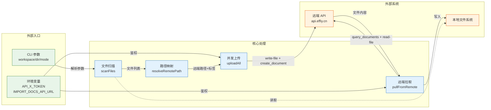
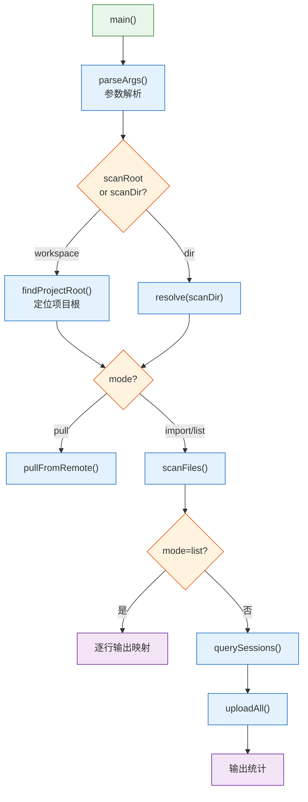
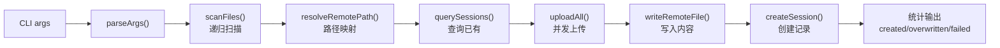
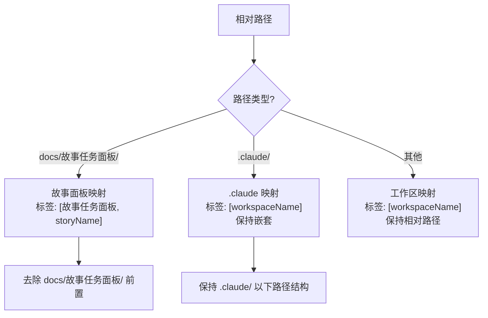
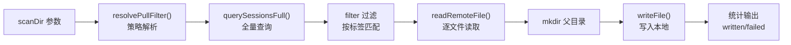
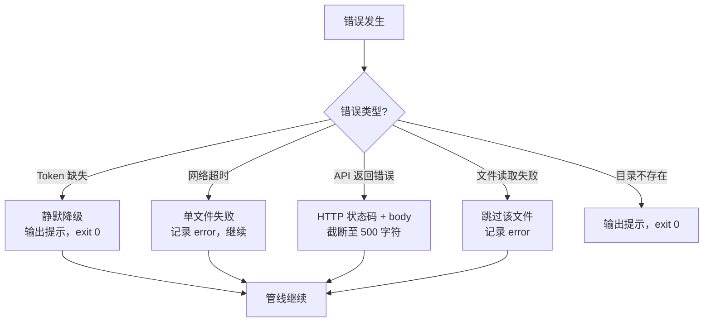

> | v1.0.0 | 2026-05-22 | deepseek-v4-pro | ⏱️ — | 📎 [CLAUDE.md](../../../CLAUDE.md) |

> **导航**: [← YrY-使用场景](./YrY-使用场景.md) · [→ YrY-测试设计](./YrY-测试设计.md) · [→ YrY-安全审计](./YrY-安全审计.md)

> **来源引用**: `/rui doc --from-code rui-import-sync-doc` · 源文件 `skills/rui-import/sync.mjs`
> **证据等级**: B（从源码反推，附源码路径）

# YrY-技术评审 · rui-import-sync

## §0 设计决策与任务规划

### 效果示意

### 基线溯源

| 来源 | 章节 | 本文档覆盖 |
|------|------|-----------|
| 故事任务 §1 Story 1 | 文档批量同步到远端 | §2 上传管线 |
| 故事任务 §1 Story 2 | 从远端拉取文档到本地 | §3 拉取管线 |
| 故事任务 §1 Story 3 | 路径映射与标签管理 | §4 路径映射策略 |
| 故事任务 §2 FP1-FP8 | 8 个功能点 | §2-§5 各对应章节 |
| 使用场景 1-5 | 5 个用户场景 | 每场景对应技术实现 |

---

## §1 系统架构

### 1.1 架构概览

| 维度 | 值 |
|------|-----|
| 架构模式 | 单文件 CLI 脚本，函数式管道 |
| 运行环境 | Node.js，ESM 模块 |
| 入口 | `main()` 异步函数 |
| 外部依赖 | `node:fs/promises`, `node:path`, `node:child_process`, `node:os` |
| 网络协议 | HTTP POST JSON → 远端 API |
| 并发模型 | Promise 池，可配置并发数 |

### 1.2 模块职责

| 模块 | 函数 | 行号 | 职责 |
|------|------|------|------|
| 参数解析 | `parseArgs()` | 25-52 | 解析 CLI 参数，返回配置对象 |
| 项目根定位 | `findProjectRoot()` | 104-113 | 向上查找 .git 或 .claude 目录 |
| 文件扫描 | `scanFiles()` | 116-144 | 递归扫描，扩展名过滤 |
| 路径映射 | `resolveRemotePath()` | 147-168 | 本地路径→远端路径+标签 |
| 标签生成 | `getTags()` | 170-174 | 从远端路径提取标签（去除文件名） |
| HTTP 封装 | `fetchJson()` | 177-196 | 统一 HTTP POST + timeout + 鉴权 |
| 远端查询 | `querySessions()` / `querySessionsFull()` | 198-215 | 查询已有 sessions |
| 远端写入 | `writeRemoteFile()` | 217-220 | 写文件内容到远端 |
| Session 创建 | `createSession()` | 222-245 | 创建文档 session 记录 |
| 并发上传 | `uploadAll()` | 248-280 | Promise 池并发上传 |
| 远端读取 | `readRemoteFile()` | 283-286 | 读取远端文件内容 |
| 拉取策略 | `resolvePullFilter()` | 288-323 | 按目录类型选择过滤/映射策略 |
| 远端拉取 | `pullFromRemote()` | 325-383 | 查询→过滤→下载→写入 |
| 拉取推荐 | `recommendPullMode()` | 385-425 | 列出远端可同步故事 |
| 推荐模式 | `recommendMode()` | 433-477 | 空输入时的状态检测与建议 |

---

## §2 上传管线（import 模式）

### 2.1 数据流

### 2.2 路径映射规则

> 证据: `skills/rui-import/sync.mjs:147-168`

### 2.3 并发控制

> 证据: `skills/rui-import/sync.mjs:248-280`

| 参数 | 值 | 说明 |
|------|-----|------|
| CONCURRENCY | 4 | 最大并发 worker 数 |
| 队列模型 | FIFO 顺序消费 | `while (queue.length > 0)` |
| 隔离 | 单文件 try-catch | 失败不阻塞其他文件 |
| HTTP_TIMEOUT | 30000ms | 单请求超时时间 |

### 2.4 Session 创建

> 证据: `skills/rui-import/sync.mjs:222-245`

每条远端文件对应一个 session 记录，字段：

| 字段 | 值来源 | 说明 |
|------|--------|------|
| `url` | `aicr-session://{timestamp}-{random}` | 唯一标识 |
| `title` | 文件名（basename） | 显示名称 |
| `file_path` | `resolveRemotePath()` | 远端路径 |
| `tags` | `getTags()` | 目录层级标签 |
| `messages` | `[]` | 空消息列表 |
| `isFavorite` | `false` | 默认非收藏 |

---

## §3 拉取管线（pull 模式）

### 3.1 数据流

### 3.2 拉取策略

> 证据: `skills/rui-import/sync.mjs:288-323`

| 目录类型 | 过滤策略 | 路径映射 |
|---------|---------|---------|
| 故事面板目录 | `tags[0]==故事任务面板 && tags[1]==storyName` | 扁平：`localDir/basename(remotePath)` |
| .claude 目录 | `tags[0]==workspaceName && file_path 前缀匹配` | 嵌套：`projectRoot/remotePath 去 workspaceName 前缀` |
| 其他 | 不支持 | 返回 null，报错 |

---

## §4 错误处理与降级

> 证据: `skills/rui-import/sync.mjs:177-196, 252-280`

| 错误场景 | 行为 | exit code |
|---------|------|-----------|
| API_X_TOKEN 缺失（上传/pull） | 静默降级，跳过操作 | 0 |
| 网络请求超时 | 单文件失败，其余继续 | 0 |
| 单文件上传失败 | 记录到 errors 数组，继续其他 | 0 |
| prefix 一级标签非法 | 输出错误，终止 | 1 |
| pull 目录不支持 | 输出错误原因 | 0 |
| 远端查询失败（pull） | 报告错误，返回空结果 | 0 |
| 扫描根目录不存在 | 输出错误，终止 | 0 |

---

## §5 安全考量

| 关注点 | 实现 | 证据 |
|--------|------|------|
| Token 传输 | `X-Token` HTTP Header，不落盘 | `sync.mjs:188` |
| Token 来源 | 仅环境变量 `API_X_TOKEN` | `sync.mjs:13` |
| 路径遍历 | 远端路径来自可控的本地路径映射，非用户自由输入 | `sync.mjs:147-168` |
| 内容注入 | `is_base64: false`，明文传输 | `sync.mjs:218` |
| 超时保护 | AbortController + 30s timeout | `sync.mjs:178-179` |

详见 [YrY-安全审计](./YrY-安全审计.md)。

---

## §6 P0 检查清单

| # | 检查项 | 状态 |
|---|--------|:--:|
| 1 | 效果示意 mermaid 图存在 | ✅ |
| 2 | 基线溯源表完整（映射到故事任务 FP#） | ✅ |
| 3 | 主要价值 ≥ 4 条 | ✅ |
| 4 | 回溯链完整 | ✅ |
| 5 | 按项目类型裁剪（meta：全章节保留） | ✅ |
| 6 | 架构图使用不同节点形状 | ✅ |

---

> | 日期 | 变更 | 触发 | 证据 |
> |------|------|------|------|
> | 2026-05-22 | 初始生成 — doc --from-code | /rui doc --from-code rui-import-sync-doc | skills/rui-import/sync.mjs |
