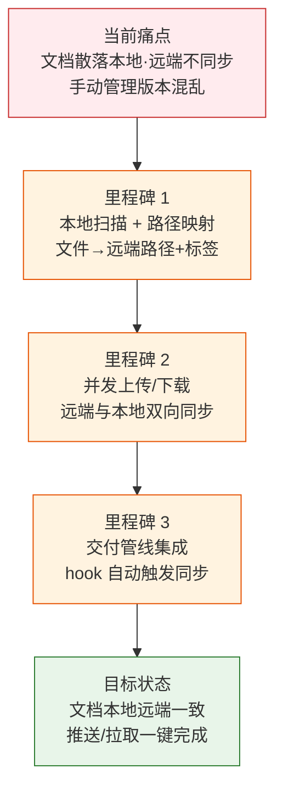
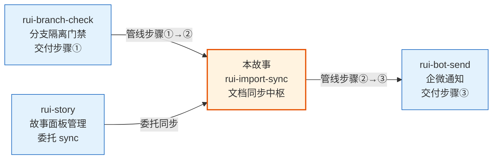

> | v1.0.0 | 2026-05-22 | deepseek-v4-pro | ⏱️ — | 📎 [CLAUDE.md](../../../CLAUDE.md) |

> **导航**: [→ YrY-使用场景](./YrY-使用场景.md)

> **来源引用**: `/rui doc --from-code rui-import-sync-doc` · 源文件 `skills/rui-import/sync.mjs`
> **证据等级**: B（从源码反推，附源码路径）

# YrY-故事任务 · rui-import-sync

## §0 基线声明

> **问题空间基线 (Problem Space Baseline)**: 本文档定义"做什么(WHAT)"和"为什么(WHY)"。所有后续文档的设计、实现、验证、改进决策均必须可追溯至本文档的具体章节。

### 需求概述

文档同步工具是 rui 交付管线的第二步，负责在本地文件系统与远端文档 API 之间双向同步文档。它是连接本地创作与远端存储的桥梁，确保故事文档、配置文件在两端保持一致。支持从本地推送到远端（import）和从远端拉取到本地（pull）两种模式，按目录或全工作区范围操作。

### 效果示意

### 主要价值

- 📋 双向同步：本地→远端（import）和远端→本地（pull）两种模式，覆盖文档全生命周期
- 🔗 管线集成：作为 rui 交付三步的第二步，hook 自动触发，无需手动干预
- 🏷️ 标签体系：自动按目录结构生成远端标签，支持故事面板和 .claude 配置的分类管理
- ⚡ 并发处理：可配置并发数（默认 4），批量同步高效完成
- 🛡️ 降级容错：Token 缺失时静默降级不阻断管线，网络失败仅告警

---

## §1 Story

### Story 1: 文档批量同步到远端

| 字段 | 内容 |
|------|------|
| 作为 | 管线操作者 |
| 我想要 | 将本地项目文档批量推送到远端 API |
| 以便 | 故事文档在远端有统一备份，其他协作者可查询和拉取 |
| 优先级 | P0 |
| 范围边界 | 扫描本地文件、映射远端路径、创建 session、上传内容 |
| 依赖 | API_X_TOKEN 环境变量、远端 API 可达 |

#### 范围外

- 不负责文档内容生成（那是 /rui doc）
- 不负责通知发送（那是 rui-bot）
- 不负责文档格式校验

##### §1.1 User Operations

| # | 操作 | 触发条件 | 操作步骤 | 预期结果 |
|---|------|---------|---------|---------|
| 1 | 全量导入 | 执行 `workspace=true` | 扫描项目全部文件 → 过滤扩展名 → 映射远端路径 → 并发上传 → 创建 session | 全部文件同步到远端，输出 created/overwritten/failed 统计 |
| 2 | 目录导入 | 执行 `dir=<path>` | 扫描指定目录 → 映射路径 → 并发上传 | 目录内文件同步到远端 |
| 3 | 预览模式 | 执行 `mode=list` | 扫描文件 → 映射路径 → 仅列出不实际上传 | 终端输出文件清单及远端路径映射 |

---

### Story 2: 从远端拉取文档到本地

| 字段 | 内容 |
|------|------|
| 作为 | 故事文档消费者 |
| 我想要 | 从远端 API 拉取故事文档到本地目录 |
| 以便 | 获取最新的远端文档基线，保持本地与远端一致 |
| 优先级 | P0 |
| 范围边界 | 查询远端 sessions → 按标签过滤 → 下载内容 → 写入本地 |
| 依赖 | API_X_TOKEN、远端 sessions 数据存在 |

##### §1.1 User Operations

| # | 操作 | 触发条件 | 操作步骤 | 预期结果 |
|---|------|---------|---------|---------|
| 1 | 拉取故事文档 | 执行 `dir=docs/故事任务面板/<name>/ mode=pull` | 查询远端 sessions → 按故事名过滤标签 → 逐个下载 → 写入本地目录 | 远端文档覆盖本地对应文件 |
| 2 | 拉取 .claude 配置 | 执行 `dir=.claude/ mode=pull` | 查询远端 sessions → 按工作区名过滤 → 下载 → 保持嵌套结构写入 | .claude/ 目录与远端同步 |
| 3 | 拉取推荐 | 执行 `mode=pull`（无 dir） | 查询远端 → 按故事名分组 → 列出可同步故事及推荐命令 | 展示可同步故事列表 |

---

### Story 3: 路径映射与标签管理

| 字段 | 内容 |
|------|------|
| 作为 | 管线设计者 |
| 我想要 | 本地文件路径自动映射为有意义的远端路径和标签 |
| 以便 | 远端文档可被分类检索，故事面板与配置文件区分清晰 |
| 优先级 | P1 |
| 范围边界 | 路径解析 → 标签生成 → 一级目录标签约束校验 |
| 依赖 | 项目目录结构符合约定 |

##### §1.1 User Operations

| # | 操作 | 触发条件 | 操作步骤 | 预期结果 |
|---|------|---------|---------|---------|
| 1 | 故事面板路径映射 | 文件位于 `docs/故事任务面板/` 下 | 提取故事目录名 → 生成标签 `[故事任务面板, <name>]` → 远端路径去掉前置目录 | 故事文档归类在故事任务面板标签下 |
| 2 | .claude 路径映射 | 文件位于 `.claude/` 下 | 提取工作区名作为一级标签 → 保持嵌套结构 | 配置文件归类在工作区标签下 |
| 3 | 一级标签校验 | 用户指定 `prefix` 参数 | 校验一级标签必须是工作区名或"故事任务面板" | 不合法标签拒绝执行 |

---

## §2 Requirements

### 功能点

| FP# | 描述 | 输入 | 输出 | 错误行为 | 优先级 |
|-----|------|------|------|---------|--------|
| FP1 | 本地文件扫描 — 递归扫描目录，按扩展名过滤 | 根目录 + 扩展名列表 + 排除目录 | 文件路径列表 | 目录不可达时跳过 | P0 |
| FP2 | 远端路径映射 — 将本地路径转为远端语义路径 | 本地文件路径 + 项目根 + 工作区名 | 远端路径字符串 + 标签列表 | 无法归类时纳入工作区根 | P1 |
| FP3 | 并发上传 — 批量上传文件到远端 API | 文件列表 + API 地址 + Token | 写入远端文件 + 创建 session | 网络超时/失败时记录错误继续 | P0 |
| FP4 | 远端拉取 — 从远端 API 下载文件到本地 | 本地目录 + API 地址 + Token | 本地文件覆盖写入 | 远端无匹配文件时报告空结果 | P0 |
| FP5 | 冲突检测 — 上传前查询已有 session 判断新建/覆盖 | 远端已有路径集合 | created / overwritten 分类计数 | 查询失败时降级为全部新建 | P1 |
| FP6 | 拉取策略解析 — 按目录类型选择过滤和路径映射策略 | 本地目录路径 + 项目根 | story/claude/null 策略对象 | 不支持的目录返回 null | P1 |
| FP7 | Token 降级 — Token 缺失时静默跳过不阻断 | 环境变量 API_X_TOKEN | 跳过标志 + 终端提示 | 无 Token 时静默降级 | P0 |
| FP8 | 推荐模式 — 空输入时展示同步状态和建议 | 无参数 | 文件统计 + Token 状态 + 推荐命令 | 网络失败仅告警 | P2 |

### 业务规则

| R# | 描述 | 校验方式 | 证据级别 |
|----|------|---------|---------|
| R1 | 一级目录标签只能是项目目录名或"故事任务面板" | prefix 参数校验，不合法时 exit(1) | A |
| R2 | pull 模式必须有 API_X_TOKEN | 检查环境变量，缺失时跳过 | A |
| R3 | 并发上传数不超过 CONCURRENCY（默认 4） | worker 池大小控制 | A |
| R4 | 每文件上传失败不阻断其他文件 | try-catch 单文件隔离 | A |
| R5 | pull 模式仅支持故事目录和 .claude 目录 | resolvePullFilter 策略匹配 | A |
| R6 | 远端路径中空格替换为下划线 | replace(/\s/g, "_") | A |

### 数据约束

| 约束 | 类型 | 范围/格式 | 来源 |
|------|------|----------|------|
| API URL | string | 默认 `https://api.effiy.cn` | 环境变量 IMPORT_DOCS_API_URL |
| API Token | string | 环境变量 API_X_TOKEN | 环境变量 |
| 文件扩展名 | string[] | 默认 `["md"]` | DEFAULT_EXTS |
| 排除目录 | Set | `.git`, `node_modules`, `.claude-plugin` | DEFAULT_EXCLUDES |
| 并发数 | number | 默认 4 | CONCURRENCY |
| HTTP 超时 | number | 30000ms | HTTP_TIMEOUT |
| 查询上限 | number | 10000 | QUERY_LIMIT |

---

## §3 成功标准

| SC# | 描述 | 度量方式 | 目标值 | 优先级 | 关联 FP# |
|-----|------|---------|--------|--------|---------|
| SC1 | 用户可用一行命令完成全量文档同步 | `workspace=true` 执行到完成 | 全部文件同步成功 | P0 | FP1,FP3 |
| SC2 | 故事文档可从远端一键拉取到本地 | `dir=... mode=pull` 执行完成 | 远端文件覆盖本地 | P0 | FP4,FP6 |
| SC3 | Token 缺失时不阻断管线 | 无 Token 时执行返回 exit 0 | 静默降级 | P0 | FP7 |
| SC4 | 单文件失败不阻塞其余文件 | 并发上传中注入单文件错误 | 仅该文件失败，其余成功 | P0 | FP3, R4 |

---

## §4 范围边界

### 范围内

| # | 条目 | 关联 FP# | 边界说明 |
|---|------|---------|---------|
| 1 | 本地文件扫描与过滤 | FP1 | 递归扫描，按扩展名和排除目录过滤 |
| 2 | 远端路径映射与标签生成 | FP2 | 按故事面板/.claude 分类策略 |
| 3 | 批量上传（import） | FP3 | 并发上传 + session 创建 |
| 4 | 远端拉取（pull） | FP4 | 按标签过滤 + 逐文件下载 |
| 5 | 推荐与状态检测 | FP8 | 空输入时展示同步建议 |

### 范围外

| # | 条目 | 排除原因 | 替代方案 |
|---|------|---------|---------|
| 1 | 文档内容生成 | 属于 /rui doc | 使用 /rui doc |
| 2 | 增量同步（仅同步变更文件） | 当前全量扫描上传 | 后续版本考虑 |
| 3 | 远端文件删除 | 安全考虑，仅增不改删 | 手动清理 |
| 4 | 二进制文件支持 | 当前仅文本文件 | 后续版本考虑 |

---

## §5 AC

| AC# | Given | When | Then | 门禁 |
|-----|-------|------|------|------|
| AC1 | 项目目录有 .md 文件 | 执行 `workspace=true` | 全部 .md 文件上传到远端，输出 created/overwritten/failed 统计 | Gate B |
| AC2 | 远端有故事文档 | 执行 `dir=docs/故事任务面板/<name>/ mode=pull` | 远端文件下载到本地指定目录 | Gate B |
| AC3 | API_X_TOKEN 未设置 | 执行任意上传/pull 命令 | 静默降级，输出提示，exit 0 | Gate B |
| AC4 | 上传中某文件网络失败 | 并发上传执行中 | 该文件记录错误，其余文件正常完成 | Gate B |
| AC5 | 指定非法 prefix 一级标签 | 执行 `prefix=illegal` | 输出错误信息，exit 1 | Gate A |
| AC6 | 执行 pull 但远端无匹配文件 | mode=pull 对空目录 | 输出 "远端无匹配文件"，written=0 | Gate B |

---

## §6 风险与假设

| # | 风险/假设 | 类型 | 可能性 | 影响 | 缓解/验证策略 | 关联 FP# |
|---|----------|------|--------|------|-------------|---------|
| 1 | 远端 API 不可达导致同步失败 | 风险 | M | H | 网络错误不阻断管线，仅告警 | FP3,FP4 |
| 2 | 大文件批量上传超时 | 风险 | L | M | HTTP_TIMEOUT 30s + 并发数限制 | FP3 |
| 3 | 远端路径冲突（同名文件不同内容） | 风险 | L | M | 后上传覆盖先上传，session 更新 | FP5 |
| 4 | Token 泄露导致未授权写入 | 风险 | L | H | Token 仅通过环境变量传入，不落盘 | FP7 |
| 5 | 项目根目录名作为工作区名 | 假设 | — | — | 使用 `root.split(sep).pop()` 提取 | FP2 |
| 6 | .claude/ 和 .git 存在其一即判定为项目根 | 假设 | — | — | findProjectRoot 逻辑 | FP1 |

---

## §7 跨文档索引

| 本文档章节 | 基线内容 | 下游文档编号 | 预期覆盖 | 状态 |
|-----------|---------|-------------|---------|:--:|
| §1 Story 1-3 | 同步/拉取/路径映射三个故事 | 03 技术评审 | 架构设计 + API 设计 + 数据流 | 待生成 |
| §2 FP1-FP8 | 8 个功能点 | 03 技术评审 | 每个 FP 的技术实现方案 | 待生成 |
| §5 AC1-AC6 | 6 条验收标准 | 04 测试设计 | 每条 AC 的测试用例 | 待生成 |
| §6 R1 | Token 认证链路 | 05 安全审计 | 认证威胁建模 | 待生成 |
| §2 FP3-FP4 | 网络请求与文件写入 | 05 安全审计 | 注入/路径遍历威胁 | 待生成 |

---

> | 日期 | 变更 | 触发 | 证据 |
> |------|------|------|------|
> | 2026-05-22 | 初始生成 — doc --from-code | /rui doc --from-code rui-import-sync-doc | skills/rui-import/sync.mjs |

## 关联故事

| 关联故事 | 关系类型 | 说明 |
|---------|---------|------|
| rui-branch-check-doc | 管线链 | 分支检查通过后进入本文档同步步骤（上游） |
| rui-bot-send-doc | 管线链 | 文档同步完成后触发企微通知（下游） |
| rui-story | 委托 | rui-story 的 sync 命令完全委托 rui-import 执行远端拉取 |
