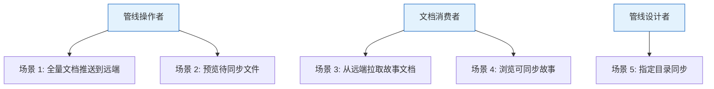
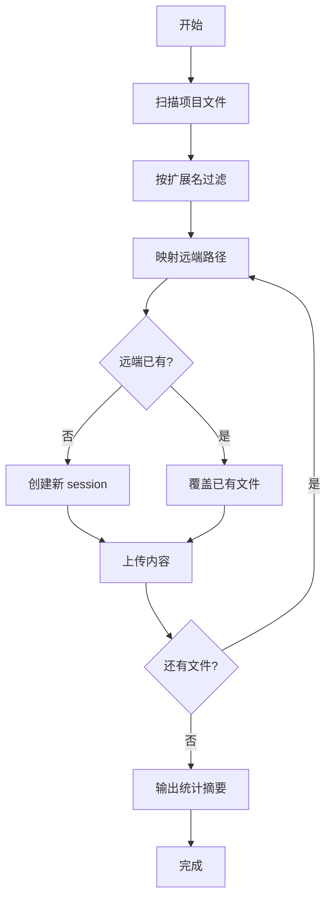
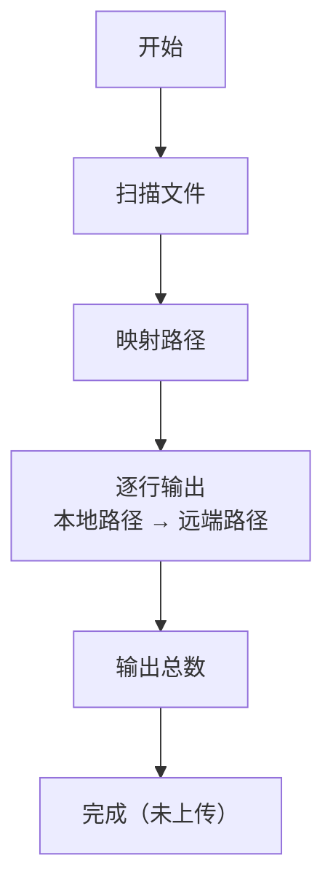
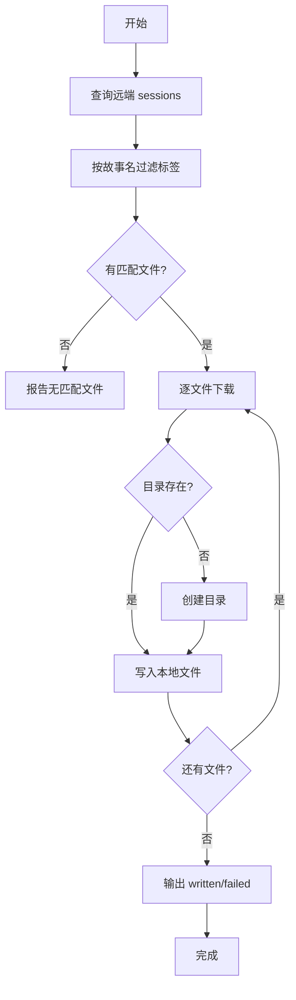

> | v1.0.0 | 2026-05-22 | deepseek-v4-pro | ⏱️ — | 📎 [CLAUDE.md](../../../CLAUDE.md) |

> **导航**: [← YrY-故事任务](./YrY-故事任务.md) · [→ YrY-技术评审](./YrY-技术评审.md)

> **来源引用**: `/rui doc --from-code rui-import-sync-doc` · 源文件 `skills/rui-import/sync.mjs`
> **证据等级**: B（从源码反推，附源码路径）

[§0 基线声明](#sec0-baseline) · [§1 场景全景](#sec1-scenarios) · [§2 场景详述](#sec2-details) · [§3 场景覆盖矩阵](#sec3-matrix) · [§4 评审清单](#sec4-checklist) · [§5 体验基线](#sec5-experience)

# YrY-使用场景 · rui-import-sync

## §0 基线声明

> **用户空间基线 (User Space Baseline)**: 本文档定义"谁使用(WHO)"和"如何体验(HOW EXPERIENCE)"。所有交互设计、测试用例、验收标准均必须覆盖本文档定义的每个场景。

---

### 主要价值

- 🧩 覆盖三种用户角色：管线操作者、故事文档消费者、管线设计者
- 🔄 双向同步场景：推送到远端和从远端拉取，覆盖完整文档生命周期
- 🛡️ 降级场景：Token 缺失时静默处理，不中断用户工作流
- ⚡ 批量操作：一次命令处理大量文件，实时反馈进度

---

## §1 场景全景

## §2 场景详述

### 场景 1: 全量文档推送到远端

| 角色 | 触发条件 | 核心目标 |
|------|---------|---------|
| 管线操作者 | 执行全量同步命令 | 将项目所有文档一次性同步到远端 |

| # | 步骤 | 输入 | 系统响应 | 异常分支 |
|---|------|------|---------|---------|
| 1 | 触发同步 | 同步命令 | 开始扫描项目目录 | 目录不存在：提示错误 |
| 2 | 文件扫描 | 项目根目录 | 递归发现所有 .md 文件 | 空目录：输出 0 个文件 |
| 3 | 路径映射 | 本地路径 | 生成远端路径和标签 | 无法归类：放入工作区根 |
| 4 | 查询远端 | API 请求 | 获取已有文件列表 | 网络超时：降级为全部新建 |
| 5 | 上传文件 | 文件内容 | 远端写入 + session 创建 | 单文件失败：记录错误继续下一个 |
| 6 | 完成汇总 | — | 显示新建/覆盖/失败数量 | — |

### 场景 2: 预览待同步文件

| 角色 | 触发条件 | 核心目标 |
|------|---------|---------|
| 管线操作者 | 执行预览命令 | 查看哪些文件将被同步及远端路径，不实际上传 |

| # | 步骤 | 输入 | 系统响应 | 异常分支 |
|---|------|------|---------|---------|
| 1 | 触发预览 | 预览命令 | 扫描并映射路径 | 空目录：输出 0 个文件 |
| 2 | 查看清单 | — | 终端逐行显示映射关系 | — |
| 3 | 确认不执行 | — | 明确提示 "list mode, no upload" | — |

### 场景 3: 从远端拉取故事文档

| 角色 | 触发条件 | 核心目标 |
|------|---------|---------|
| 文档消费者 | 执行拉取命令 | 将远端故事文档下载到本地，覆盖本地旧版本 |

| # | 步骤 | 输入 | 系统响应 | 异常分支 |
|---|------|------|---------|---------|
| 1 | 触发拉取 | 故事目录路径 | 解析拉取策略 | 不支持的目录：提示并终止 |
| 2 | 查询远端 | API 请求 | 获取全部 sessions | 网络失败：报告错误 |
| 3 | 过滤匹配 | 标签过滤 | 筛选出目标故事的文件列表 | 无匹配：输出 "远端无匹配文件" |
| 4 | 下载写入 | 远端文件内容 | 写入本地对应路径 | 单文件下载失败：记录并继续 |
| 5 | 完成汇总 | — | 显示写入成功/失败数量 | — |

### 场景 4: 浏览可同步故事列表

| 角色 | 触发条件 | 核心目标 |
|------|---------|---------|
| 文档消费者 | 执行拉取推荐命令 | 查看远端有哪些故事可以同步到本地 |

| # | 步骤 | 输入 | 系统响应 | 异常分支 |
|---|------|------|---------|---------|
| 1 | 触发推荐 | 拉取推荐命令 | 查询远端全部 sessions | Token 缺失：提示并终止 |
| 2 | 分组展示 | — | 按故事名分组，显示文件数 | 远端无故事面板数据：提示空 |
| 3 | 推荐命令 | — | 逐故事输出可执行的拉取命令 | — |

### 场景 5: Token 缺失时的降级体验

| 角色 | 触发条件 | 核心目标 |
|------|---------|---------|
| 管线操作者 | 未配置 API_X_TOKEN | 系统静默降级，不中断管线 |

| # | 步骤 | 输入 | 系统响应 | 异常分支 |
|---|------|------|---------|---------|
| 1 | 触发同步 | 同步命令 | 检测到 Token 缺失 | — |
| 2 | 降级处理 | — | 输出提示信息 | — |
| 3 | 正常退出 | — | exit 0，不阻断管线 | — |

---

## §3 场景覆盖矩阵

| 场景 | FP# | AC# | 实现文档 | 测试文档 | 覆盖状态 | 备注 |
|------|-----|------|---------|---------|:--:|------|
| 场景 1: 全量推送 | FP1,FP3,FP5 | AC1,AC4 | 技术评审 §2 | 测试设计 §2.1 | 待生成 | — |
| 场景 2: 预览 | FP1,FP2 | — | 技术评审 §2 | 测试设计 §2.2 | 待生成 | — |
| 场景 3: 拉取 | FP4,FP6 | AC2,AC6 | 技术评审 §3 | 测试设计 §2.3 | 待生成 | — |
| 场景 4: 推荐 | FP8 | — | 技术评审 §2 | 测试设计 §2.4 | 待生成 | — |
| 场景 5: 降级 | FP7 | AC3 | 技术评审 §5 | 测试设计 §2.5 | 待生成 | — |

---

## §4 评审清单

| # | 检查项 | 状态 |
|---|--------|:--:|
| 1 | 场景数量 ≥ 2 | ✅ (5 个场景) |
| 2 | 每场景有流程图 | ✅ (场景 1/2/3 含 mermaid) |
| 3 | FP# 全覆盖 | ✅ (FP1-FP8 均有对应场景) |
| 4 | 异常分支明确 | ✅ (每场景含异常分支列) |
| 5 | 无技术术语 | ✅ (无代码路径/API/组件名) |
| 6 | 每场景含空状态与错误恢复 | ✅ (空目录/网络失败/Token缺失) |
| 7 | 覆盖矩阵下游文档齐全 | ✅ (技术评审+测试设计) |

---

## §5 体验基线

| 角色 | 核心旅程 | 情感目标 | 痛点解决 | 成功感知 | 关联场景 |
|------|---------|---------|---------|---------|---------|
| 管线操作者 | 一键推送全部文档到远端 | 感到操作简单可靠 | 不再手动逐文件上传 | 看到统计摘要：created N, overwritten M, failed 0 | 场景 1,2 |
| 文档消费者 | 从远端拉取最新故事文档 | 感到数据随时可获取 | 不再手动查找和复制文件 | 看到 written N, failed 0 | 场景 3,4 |
| 管线设计者 | Token 缺失时不被阻断 | 感到系统健壮宽容 | Token 问题不再卡住整个管线 | 看到降级提示，exit 0 正常继续 | 场景 5 |

---

> | 日期 | 变更 | 触发 | 证据 |
> |------|------|------|------|
> | 2026-05-22 | 初始生成 — doc --from-code | /rui doc --from-code rui-import-sync-doc | skills/rui-import/sync.mjs |
