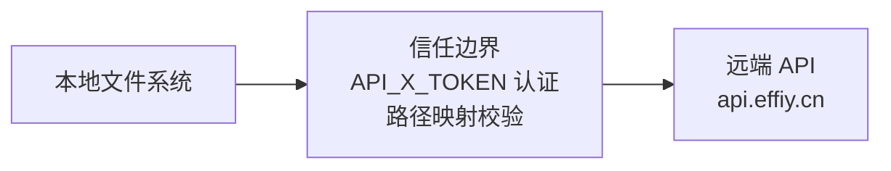

> | v1.0.0 | 2026-05-26 | deepseek-v4-pro | 🌿 feat/rui-import | 📎 [CLAUDE.md](../../../CLAUDE.md) |

> **导航**: [← YrY-测试设计](./YrY-测试设计.md)

> **来源引用**: security agent 基于技术评审 §5 安全设计独立审计。

[§0 基线溯源](#sec0-baseline) · [§1 资产识别](#sec1-assets) · [§2 STRIDE 威胁建模](#sec2-stride) · [§3 信任边界](#sec3-trust) · [§4 合规检查](#sec4-compliance)

---

### 主要价值

- 🎯 STRIDE 六类威胁全覆盖 — 重点关注 Information Disclosure(Token 泄露)和 Tampering(路径遍历)
- 🔒 Token 安全为 P0 最高优先 — API_X_TOKEN 仅环境变量，禁止落盘
- ⚡ 独立审计标记 — security agent 独立执行
- 📊 合规 4 项全查 — 认证/密钥/输入校验/路径遍历

---

## §0 基线溯源

| 基线来源 | 本文档章节 | 映射关系 |
|---------|-----------|---------|
| 技术评审 §5 安全设计 | §2 STRIDE | 安全面→威胁建模 |
| 技术评审 §3 路径映射 | §3 信任边界 | 路径遍历→信任边界 |

---

## §1 资产识别

| 资产 | 类型 | 敏感级别 | 存储位置 |
|------|------|---------|---------|
| API_X_TOKEN | 认证凭据 | 高 | 仅环境变量 |
| 文档内容 | 项目知识 | 中 | 本地 docs/+.claude/ |
| 远端 API 凭证 | 认证 | 高 | HTTP Header X-Token |
| 远端 sessions | 文档元数据 | 低 | api.effiy.cn |

---

## §2 STRIDE 威胁建模

### S — Spoofing
| 威胁 | 缓解 |
|------|------|
| 伪造 Token 调用 API | Token 仅环境变量，远端验证有效性 |

### T — Tampering
| 威胁 | 缓解 |
|------|------|
| 路径遍历覆盖远端任意文件 | 远端路径 = 项目根相对路径，无跳段无前置 |
| 上传恶意内容 | 文件内容为 UTF-8 文本，is_base64=false |

### R — Repudiation
| 威胁 | 缓解 |
|------|------|
| 同步操作无记录 | session create/update 记录时间戳；git log 记录本地变更 |

### I — Information Disclosure
| 威胁 | 缓解 |
|------|------|
| API_X_TOKEN 写入源码/配置 | P0 违规；grep 扫描；git history 清除 |
| Token 在日志中回显 | 错误日志不记录 Token 值 |
| 远端路径泄露项目结构 | 按设计：远端路径公开项目结构是预期行为 |

### D — Denial of Service
| 威胁 | 缓解 |
|------|------|
| 大量并发上传超载 API | 并发上限 4；HTTP 超时 30s |

### E — Elevation of Privilege
| 威胁 | 缓解 |
|------|------|
| 覆盖他人文档 | 远端路径限定为当前项目根相对路径 |

---

## §3 信任边界

---

## §4 合规检查

| # | 合规项 | 状态 | 证据 |
|---|--------|------|------|
| 1 | 认证不可绕过 | ✅ | API_X_TOKEN Header 传递 |
| 2 | 密钥不落盘 | ✅ | Token 仅 process.env |
| 3 | 输入校验 | ✅ | 文件路径校验+内容 UTF-8 |
| 4 | 路径遍历防护 | ✅ | 相对路径映射，无跳段 |

---

> **变更记录**
> | 日期 | 变更 | 触发 | 证据 |
> |------|------|------|------|
> | 2026-05-26 | 初始生成，security 独立审计 | /rui doc --from-code rui-import | skills/rui-import/SKILL.md §安全 |
