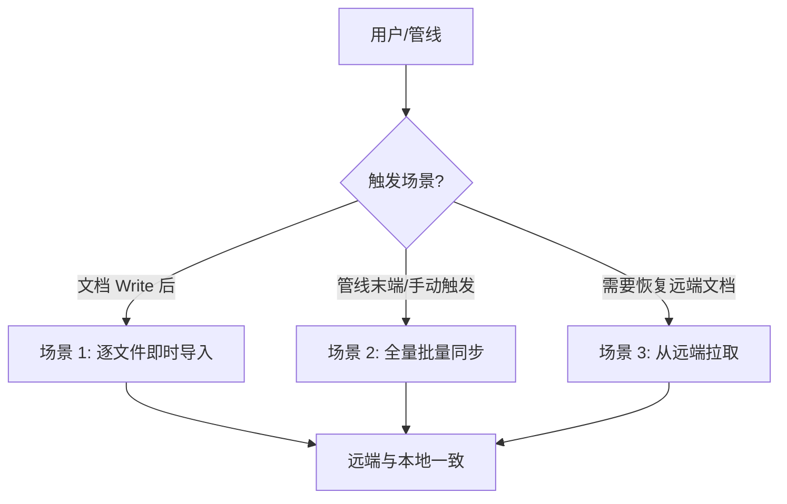
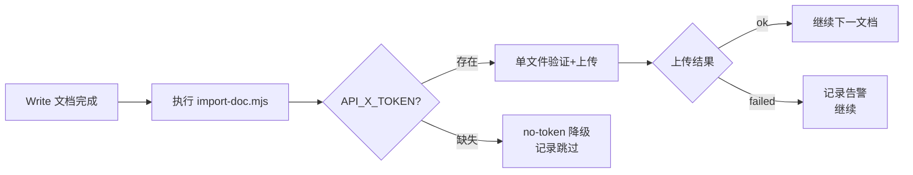
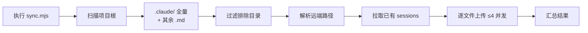
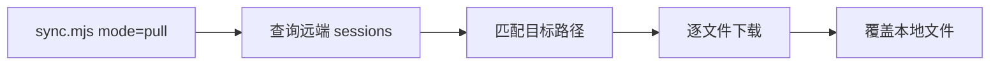

> | v1.0.0 | 2026-05-26 | deepseek-v4-pro | 🌿 feat/rui-import | 📎 [CLAUDE.md](../../../CLAUDE.md) |

> **导航**: [← 故事任务](./故事任务.md) · [技术评审 →](./技术评审.md)

> **来源引用**: 由 `/rui doc --from-code rui-import` 触发，从 `skills/rui-import/SKILL.md` 反推用户交互场景。

[§1 场景全景](#sec1-overview) · [§2 场景详述](#sec2-detail) · [§3 场景覆盖矩阵](#sec3-matrix) · [§4 评审清单](#sec4-checklist)

---

### 主要价值

- 🎯 覆盖三种同步模式 — 逐文件即时导入/批量全量同步/远端拉取覆盖
- 🔒 每场景含正常路径 + 降级处理(no-token/网络失败)
- ⚡ 使用场景对齐 rui 管线强制集成点
- 📊 语言边界纯净 — 面向用户描述操作，禁止技术术语

---

## §1 场景全景

---

## §2 场景详述

### 场景 1: 逐文件即时导入

| 角色 | 触发条件 | 核心目标 |
|------|---------|---------|
| rui 管线 | 每个文档 Write 完成后 | 立即将新生成的文档导入远端 |

| # | 步骤 | 输入 | 系统响应 | 异常分支 |
|---|------|------|---------|---------|
| 1 | 触发导入 | Write 完成的文件路径 | 验证文件存在→调用 sync.mjs file= | 文件不存在→跳过 |
| 2 | 上传 | 文件内容+路径 | POST /write-file→created/overwritten | 网络失败→记录告警不阻断 |
| 3 | 标签 | 文件名后缀 | 匹配后缀→附加语义标签 | 不匹配→仅路径标签 |

### 场景 2: 全量批量同步

| 角色 | 触发条件 | 核心目标 |
|------|---------|---------|
| 管线/开发者 | 管线末端或手动触发 | 扫描全项目文档并同步到远端 |

| # | 步骤 | 输入 | 系统响应 | 异常分支 |
|---|------|------|---------|---------|
| 1 | 扫描 | 项目根路径 | 递归遍历，.claude/ 全量+其余 .md | 扫描根不存在→跳过 |
| 2 | 过滤 | 文件路径 | 排除 .git/node_modules/.claude-plugin | 命中→跳过整树 |
| 3 | 上传 | 远端路径+内容 | 并发 ≤4，存在覆盖不存在新建 | 单文件失败→记录继续 |

### 场景 3: 从远端拉取覆盖

| 角色 | 触发条件 | 核心目标 |
|------|---------|---------|
| 开发者 | 需要将远端文档恢复到本地 | 从远端下载覆盖本地文件 |

---

## §3 场景覆盖矩阵

| 场景 | FP# | AC# | 技术评审 | 测试设计 | 覆盖状态 |
|------|-----|------|---------|---------|---------|
| 场景 1: 逐文件导入 | FP4, FP5, FP6 | AC2, AC4 | §2 API | §3 用例 | 待生成 |
| 场景 2: 全量同步 | FP1–FP8 | AC1, AC3 | §1 架构 | §3 用例 | 待生成 |
| 场景 3: 远端拉取 | FP7 | — | §2 API | §3 用例 | 待生成 |

---

## §4 评审清单

| # | 检查项 | 状态 |
|---|--------|------|
| 1 | 场景 ≥ 2 个 | ✅ 3 场景 |
| 2 | 每场景有 mermaid flowchart | ✅ |
| 3 | FP# 全覆盖 | ✅ |
| 4 | 异常分支明确 | ✅ |
| 5 | 无技术术语 | ✅ |

---

> **变更记录**
> | 日期 | 变更 | 触发 | 证据 |
> |------|------|------|------|
> | 2026-05-26 | 初始生成 | /rui doc --from-code rui-import | skills/rui-import/SKILL.md |
