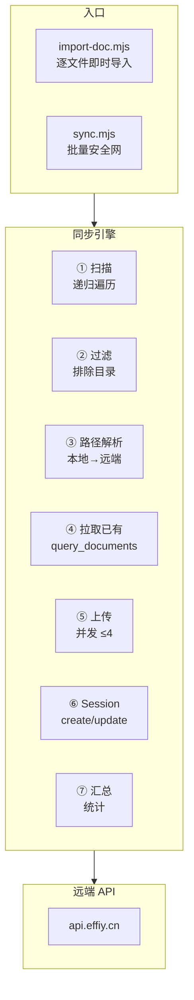
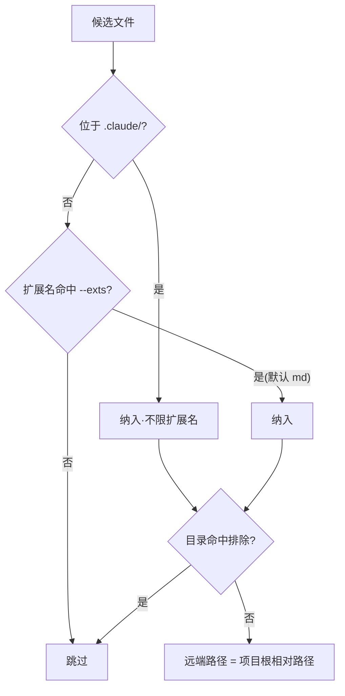

> | v1.0.0 | 2026-05-26 | deepseek-v4-pro | 🌿 feat/rui-import | 📎 [CLAUDE.md](../../../CLAUDE.md) |

> **导航**: [← 使用场景](./使用场景.md) · [测试设计 →](./测试设计.md) · [安全审计 →](./安全审计.md)

> **来源引用**: 由 `/rui doc --from-code rui-import` 触发，从 `skills/rui-import/SKILL.md` 反推。

[§0 基线溯源](#sec0-baseline) · [§1 架构设计](#sec1-arch) · [§2 API 契约](#sec2-api) · [§3 扫描与路径映射](#sec3-scan) · [§4 语义标签](#sec4-tags) · [§5 安全设计](#sec5-security)

---

### 主要价值

- 🎯 七步同步管线 — 扫描→过滤→解析→拉取已有→上传→session→汇总
- 🔒 路径映射一一对应 — 远端路径 = 项目根相对路径，不跳段不前置不重命名
- ⚡ 并发控制 + 错误隔离 — 并发上限 4，单文件失败不阻断
- 📊 五接口 API 契约 — query/write/read/create/update 完整覆盖

---

## §0 基线溯源

| 基线来源 | 本文档章节 | 映射关系 |
|---------|-----------|---------|
| 故事任务 §1 Story 1 | §3 扫描与路径映射 | 文档同步→扫描引擎 |
| 故事任务 §1 Story 2 | §4 语义标签 | 标签附加→分类规则 |
| 故事任务 §2 FP1–FP8 | §1–§5 | 全功能点→技术方案 |

---

## §1 架构设计

### 效果示意

---

## §2 API 契约

| 接口 | 方法 | 用途 | 并发 |
|------|------|------|------|
| query_documents | POST / | 拉取已有 sessions，分页 500 | — |
| write-file | POST /write-file | 上传文件内容，overwrite=true/false | ≤4 |
| read-file | POST /read-file | pull 模式读取远端文件 | — |
| create_document | POST / | 新建 session（仅 created 路径） | — |
| update_document | POST / | 更新 session 时间戳（overwritten 路径） | — |

### 通用请求头

| Header | 值 |
|--------|------|
| Content-Type | application/json |
| Accept | application/json |
| X-Token | `${API_X_TOKEN}`（仅环境变量） |

---

## §3 扫描与路径映射

| 规则 | 说明 |
|------|------|
| .claude/ 全量 | 不限扩展名，递归全部子目录 |
| 其他目录 | 仅扩展名命中 --exts 默认 md |
| 默认排除 | .git / node_modules / .claude-plugin |
| 路径规整 | 分隔符→`/`，空白字符→`_` |

---

## §4 语义标签

| 文档后缀 | stage | type | baseline |
|---------|-------|------|----------|
| -使用场景.md | stage:doc | type:scenario | baseline:problem |
| -技术评审.md | stage:doc | type:tech-review | baseline:solution |
| -测试设计.md | stage:doc | type:test-design | baseline:solution |
| -安全审计.md | stage:doc | type:security-audit | baseline:solution |
| -实施报告.md | stage:code | type:impl-report | baseline:verify |
| -测试报告.md | stage:code | type:test-report | baseline:verify |
| -自改进复盘.md | stage:improve | type:retrospective | baseline:verify |

---

## §5 安全设计

| 安全面 | 设计决策 |
|--------|---------|
| 认证 | API_X_TOKEN 仅环境变量，Header X-Token 传递 |
| Token 保护 | 禁止写入仓库/日志/文档，P0 违规 |
| 路径遍历 | 远端路径 = 项目根相对路径，无跳段 |
| 错误处理 | 单文件失败不阻断，记录错误继续 |

---

> **变更记录**
> | 日期 | 变更 | 触发 | 证据 |
> |------|------|------|------|
> | 2026-05-26 | 初始生成 | /rui doc --from-code rui-import | skills/rui-import/SKILL.md |
