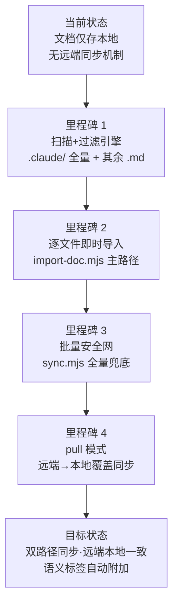

> | v1.0.0 | 2026-05-26 | deepseek-v4-pro | 🌿 feat/rui-import | 📎 [CLAUDE.md](../../../CLAUDE.md) |

> **导航**: [使用场景 →](./使用场景.md)

> **来源引用**: 由 `/rui doc --from-code rui-import` 触发，从 `skills/rui-import/SKILL.md` 基线反推。证据 Level A + SKILL.md 路径。

[§1 Story](#sec1-story) · [§2 Requirements](#sec2-requirements) · [§3 成功标准](#sec3-success) · [§4 范围边界](#sec4-scope) · [§5 AC](#sec5-ac) · [§6 风险与假设](#sec6-risks) · [§7 跨文档索引](#sec7-index)

---

### §0 基线声明

> **问题空间基线 (Problem Space Baseline)**: 本文档定义 rui-import 文档同步技能的 WHAT 和 WHY。

---

### 需求概述

将 workspace 内文档批量同步到远端 API。提供逐文件即时导入（主路径）和批量安全网（兜底）两种机制。扫描 `.claude/` 全部文件 + 其余 `.md` 文件，过滤排除目录，解析远端路径，逐文件上传到远端 API。支持 pull 模式从远端下载覆盖本地。

### 效果示意

### 主要价值

- 🎯 双路径同步机制 — 逐文件即时导入(主路径) + 批量安全网(兜底)，确保不遗漏
- 🔒 语义标签自动附加 — 故事文档按后缀自动附加 stage/type/baseline 三组标签
- ⚡ 扫描规则明确 — .claude/ 全量不限扩展名，其余仅 .md，排除 .git/node_modules/.claude-plugin
- 📊 API 契约完整 — query_documents/write-file/read-file/create_document/update_document 五接口

---

## §1 Story

### Story 1: 文档同步到远端

| 字段 | 内容 |
|------|------|
| 作为 | 管线/开发者 |
| 我想要 | 将本地文档批量同步到远端 API，支持逐文件即时导入和全量批量两种模式 |
| 以便 | 远端始终保持与本地一致的文档副本，支持跨设备访问和故事面板查询 |
| 优先级 | P0 |
| 范围边界 | 扫描→过滤→路径解析→上传，仅操作文档同步，不创建文档内容 |
| 依赖 | API_X_TOKEN 环境变量，远端 API 可达 |

#### §1.1 User Operations

| # | 操作 | 触发条件 | 操作步骤 | 预期结果 |
|---|------|---------|---------|---------|
| 1 | 逐文件即时导入 | 每个文档 Write 后 | `node skills/rui/import-doc.mjs <file-path>` | 单文件验证→上传→输出 ok/skipped/failed |
| 2 | 全量批量同步 | 管线末端/直接调用 | `node skills/rui-import/sync.mjs` | 扫描全项目→逐文件上传→输出 created/overwritten/failed 统计 |
| 3 | 从远端拉取 | sync 指定 mode=pull | `node skills/rui-import/sync.mjs dir=<path> mode=pull` | 远端查询→逐文件下载覆盖本地 |

---

### Story 2: 语义标签自动附加

| 字段 | 内容 |
|------|------|
| 作为 | 管线 |
| 我想要 | 故事文档导入时自动附加语义标签(stage/type/baseline) |
| 以便 | 远端可按文档类型和管线阶段分类查询 |
| 优先级 | P0 |
| 范围边界 | 仅对匹配后缀的故事文档附加标签，非故事文档仅保留路径标签 |
| 依赖 | import-doc.mjs 执行 |

---

### §2 Requirements

#### 功能点

| FP# | 描述 | 输入 | 输出 | 错误行为 | 优先级 |
|-----|------|------|------|---------|--------|
| FP1 | 文件扫描 — 递归遍历项目根 | 项目根路径 | 文件清单 | 扫描根不存在跳过 | P0 |
| FP2 | 过滤排除 — 跳过 .git/node_modules/.claude-plugin | 文件路径 | 通过/跳过 | 命中即跳过整树 | P0 |
| FP3 | 路径解析 — 本地→远端路径映射 | 本地绝对路径 | 远端相对路径(分隔符 `/`，空格→`_`) | 路径不规范时规整 | P0 |
| FP4 | 逐文件上传 — POST /write-file | 远端路径+内容 | created/overwritten/failed | 单文件失败不阻断 | P0 |
| FP5 | 语义标签 — 按文档后缀附加 stage/type/baseline | 文件路径 | 标签数组 | 不匹配后缀→仅路径标签 | P1 |
| FP6 | session 管理 — create_document/update_document | 上传结果 | session 创建/更新 | API 失败记录错误 | P1 |
| FP7 | pull 模式 — 从远端下载覆盖本地 | 远端路径 | 本地文件覆盖 | 网络失败告警 | P1 |
| FP8 | 结果汇总 — created/overwritten/failed 统计 | 全部上传结果 | 汇总报告 | — | P1 |

---

### §3 成功标准

| SC# | 描述 | 度量方式 | 目标值 | 优先级 | 关联 FP# |
|-----|------|---------|--------|--------|---------|
| SC1 | 用户可一键同步全项目文档到远端 | `node skills/rui-import/sync.mjs` 执行成功 | 全部文件上传，failed=0 | P0 | FP1–FP8 |
| SC2 | 逐文件导入在文档 Write 后立即执行 | import-doc.mjs 调用次数 = Write 次数 | 100% 覆盖 | P0 | FP4 |
| SC3 | 故事文档在远端有正确的语义标签 | 远端 sessions 查询验证 | 7 种后缀全部正确匹配 | P1 | FP5 |

---

### §4 范围边界

#### 范围内

| # | 条目 | 关联 FP# | 边界说明 |
|---|------|---------|---------|
| 1 | 逐文件即时导入 | FP4, FP5, FP6 | import-doc.mjs，每个 Write 后必须调用 |
| 2 | 批量全量同步 | FP1–FP8 | sync.mjs，管线末端兜底 |
| 3 | pull 模式远端同步 | FP7 | 从远端拉取覆盖本地 |

#### 范围外

| # | 条目 | 排除原因 | 替代方案 |
|---|------|---------|---------|
| 1 | 创建文档内容 | 属于 rui doc 职责 | 使用 `/rui doc` |
| 2 | 企微通知发送 | 属于 rui-bot 职责 | 管线末端自动触发 |

---

### §5 AC

| AC# | Given | When | Then | 门禁 |
|-----|-------|------|------|------|
| AC1 | 项目根有 .md 文件和 .claude/ 目录 | 执行 `sync.mjs` | 所有文件上传到远端，路径映射正确 | Gate A |
| AC2 | 文档 Write 完成 | 执行 `import-doc.mjs <file>` | 单文件上传成功，返回 ok | Gate A |
| AC3 | API_X_TOKEN 缺失 | 执行 sync | 静默跳过(no-token 降级)，exit 0 | Gate B |
| AC4 | 故事文档(含 -使用场景.md 后缀) | import-doc.mjs 执行 | 远端 session 含 stage:doc + type:scenario + baseline:problem | Gate A |

---

### §6 风险与假设

| # | 风险/假设 | 类型 | 可能性 | 影响 | 缓解/验证策略 | 关联 FP# |
|---|----------|------|--------|------|-------------|---------|
| 1 | 远端 API 不可达导致同步全部失败 | 风险 | M | H | 网络超时 30s；单文件失败不阻断；最终 exit code 1 | FP4 |
| 2 | API_X_TOKEN 缺失导致无法上传 | 风险 | M | M | 降级 no-token，静默跳过 | FP4, FP7 |
| 3 | 远端 API 服务可用且网络可达 | 假设 | — | — | 管线末端批量安全网兜底 | FP4 |

---

### §7 跨文档索引

| 本文档章节 | 下游文档 | 状态 |
|-----------|---------|------|
| §1 Story 1–2 | 使用场景 | 待生成 |
| §2 FP1–FP8 | 技术评审 | 待生成 |
| §5 AC1–AC4 | 测试设计 | 待生成 |
| §6 风险 1–3 | 安全审计 | 待生成 |

---

> **变更记录**
> | 日期 | 变更 | 触发 | 证据 |
> |------|------|------|------|
> | 2026-05-26 | 初始生成 | /rui doc --from-code rui-import | skills/rui-import/SKILL.md |
