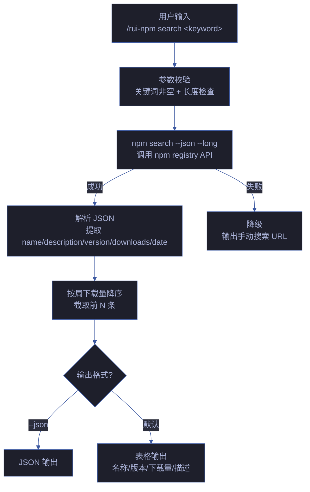

# 场景 1 — npm 包搜索与发现

> | v1.0.0 | 2026-06-05 | 场景 1/4 | 📎 [故事任务](../故事任务.md) |

## §0 技术评审

### 效果示意

### 概述

用户输入关键词，系统查询 npm registry 并返回结构化的搜索结果，按周下载量降序排列。支持 JSON 和表格两种输出格式。网络不可达时降级为引导用户手动访问 npm 官网。

### 主要价值

- 🔍 **语义搜索** — 用户只需输入关键词，无需记忆 npm search 的复杂参数
- 📊 **结构化展示** — 结果按下载量排序，关键信息（名称/版本/下载量/描述）一目了然
- 📋 **双格式输出** — 默认表格便于阅读，`--json` 标志输出机器可读格式供下游消费
- ⚡ **快速决策** — 最多展示 20 条结果，足够覆盖主流选择

### 基线溯源

| 来源 | 路径 | 证据级别 |
|------|------|---------|
| 故事任务 FP1 | [故事任务.md](../故事任务.md) | A |
| SKILL.md search | [SKILL.md](../../../../skills/rui-npm/SKILL.md) | A |
| rui-npm.mjs cmdSearch | [rui-npm.mjs](../../../../skills/rui-npm/rui-npm.mjs) | A |

---

## §1 测试设计

### 测试用例

| # | 输入 | 期望输出 | 优先级 |
|---|------|---------|--------|
| 1 | `search react` | 返回 react 相关包表格，含 react 本体在前列 | P0 |
| 2 | `search xyzzy123notexist` | 输出"未找到相关包" | P0 |
| 3 | `search react --json` | 输出 JSON 数组，每个元素含 name/version/description | P0 |
| 4 | `search react --limit 5` | 返回最多 5 条结果 | P1 |
| 5 | `search` (无参数) | 错误提示 + 用法说明 | P0 |
| 6 | 断网环境 `search react` | 错误提示 + npmjs.com 手动搜索 URL | P0 |

### Gate A 交接信号

| 信号 | 值 | 说明 |
|------|-----|------|
| `test_design_exists` | `true` | §1 测试设计已就绪 |
| `test_case_count` | 6 | 覆盖正常/边界/错误路径 |
| `fp_coverage` | FP1 | 覆盖故事任务 FP1 |

---

## §2 实施报告

> 由 code 阶段填充。

---

## §3 测试报告

> 由 code 阶段填充。

---

## §4 自改进

> 由 code 阶段 / yry 闭环填充。
