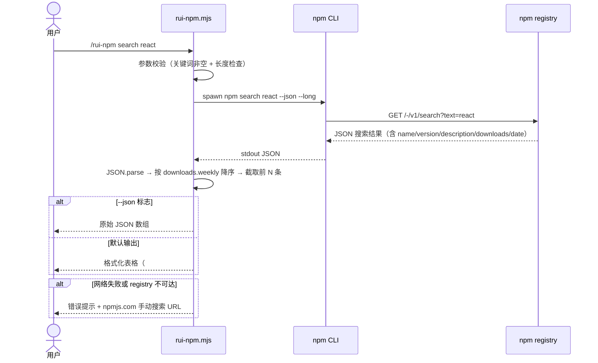
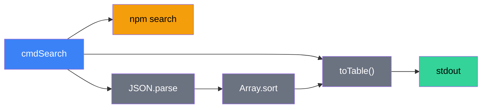

# 场景 1 — npm 包搜索与发现

> | v1.1.0 | 2026-06-06 | 场景 1/4 | 📎 [故事任务](../故事任务.md) |
> **导航**: [← 故事任务](../故事任务.md) · [场景-2 →](../场景-2-包安装与版本管理/场景-2-包安装与版本管理.md)

[§0 技术评审](#sec0) · [§1 测试设计](#sec1) · [§2 实施报告](#sec2) · [§3 测试报告](#sec3) · [§4 自改进](#sec4)

## 概述

**角色**: 开发者 · **目标**: 在对话中通过自然语言搜索 npm registry，快速发现需要的包并获取关键信息（描述/版本/下载量/更新时间）· **优先级**: P0

### 主要价值

- 🔍 **语义搜索** — 用户只需输入关键词，无需记忆 npm search 的复杂参数
- 📊 **结构化展示** — 结果按下载量排序，关键信息（名称/版本/下载量/描述）一目了然
- 📋 **双格式输出** — 默认表格便于阅读，`--json` 标志输出机器可读格式供下游消费
- ⚡ **快速决策** — 最多展示 20 条结果，足够覆盖主流选择
- 🛡️ **降级优雅** — 网络不可达时自动降级为手动搜索 URL 引导，不阻断用户流程

### 图谱定位

| 图层 | 本场景节点 | 上游 | 下游 |
|------|-----------|------|------|
| 领域层 | scene: package-search | story: rui-npm (contains) | maps_to → 结构层 |
| 结构层 | search 子命令 · rui-npm.mjs cmdSearch | maps_to 来自领域层 | content → 内容层 |
| 内容层 | npm registry API · npm search --json | Read 来自结构层 | — |

---

## §0 技术评审

> 文档生成阶段填充（pm+coder）。本场景为 CLI 工具场景，无前端 UI 或后端 API。

### 效果示意

### 情感目标

用户感到**探索高效可控**——输入一个关键词就能快速了解 npm 生态中相关包的全貌，按下载量排序让主流选择一目了然，无需离开对话界面去浏览器搜索。

### 成功感知

用户知道自己达成目标，当：看到结构化的搜索结果表格（至少含包名/版本/下载量/描述），且排名靠前的包确实与搜索意图相关。对于明确存在的包（如 react），搜索结果第一条或前几条应包含该包。

### 数据流全景

### 涉及模块

| 模块 | 职责 | 本场景角色 |
|------|------|-----------|
| rui-npm.mjs cmdSearch | 解析关键词 → 调用 npm search → 排序 → 格式化输出 | 核心执行体——搜索流程的完整实现 |
| npm registry API | 提供包搜索索引，返回 JSON 格式搜索结果 | 数据源——搜索的真实数据来源 |
| help.mjs | 输出 search 子命令的用法和场景示例 | 帮助层——用户查阅搜索用法 |

### 基线溯源

| 本场景内容 | 基线来源 | 覆盖方式 | 状态 |
|-----------|---------|---------|------|
| 包搜索与结果格式化 | Story 1 FP1 — 包搜索 | search 子命令：npm search → 解析 → 排序 → 表格/JSON 输出 | ✓ 已实现 |
| 结构化输出（表格/JSON） | SKILL.md search 规约 | 默认表格，--json 标志输出 JSON | ✓ 已实现 |
| 降级处理（网络不可达） | SKILL.md 降级策略 | 捕获网络错误 → 输出手动 URL 引导 | ✓ 已实现 |
| 帮助文档 | Story 1 FP10 — 帮助输出 | help.mjs 含 search 子命令完整用法 | ✓ 已实现 |

### 设计评审清单

| # | 检查项 | 状态 |
|---|--------|:--:|
| 1 | 关键词为空时给出明确用法提示和示例 | ✓ |
| 2 | 搜索结果按周下载量降序排列 | ✓ |
| 3 | 支持 --json 和 --limit 参数 | ✓ |
| 4 | 网络不可达时降级输出手动搜索 URL | ✓ |
| 5 | 搜索结果为空时输出明确提示 | ✓ |

### 安全考量

| 威胁 | 风险等级 | 缓解措施 |
|------|---------|---------|
| 搜索关键词注入（特殊字符破坏 CLI 参数） | Low | spawnSync 参数数组化，不经过 shell 解析 |
| 恶意 registry 返回伪造数据 | Low | 使用 npm 官方 registry；用户可通过 info 子命令二次确认 |
| 搜索关键词泄露敏感信息 | Low | 仅查询公开 registry，不传输本地文件内容 |

---

## §1 测试设计

> 文档生成阶段填充（tester）。测试聚焦搜索的完整性、准确性和降级行为。

### 正常路径用例

| TC# | Given | When | Then | 覆盖 FP# | 优先级 |
|-----|-------|------|------|---------|--------|
| TC-N1.1 | npm registry 可达 | 执行 `search react` | 返回 react 相关包表格，react 本体在前列，含名称/版本/下载量/描述 | FP1 | P0 |
| TC-N1.2 | npm registry 可达 | 执行 `search react --json` | 输出 JSON 数组，每个元素含 name/version/description/downloads | FP1 | P0 |
| TC-N1.3 | npm registry 可达 | 执行 `search react --limit 5` | 返回最多 5 条结果 | FP1 | P1 |
| TC-N1.4 | npm registry 可达 | 执行 `search @types/node` | 支持 scope 包搜索 | FP1 | P1 |

### 边界/异常用例

| TC# | Given | When | Then | 覆盖 FP# | 优先级 |
|-----|-------|------|------|---------|--------|
| TC-B1.1 | 任意环境 | 执行 `search`（无参数） | 错误提示 + 用法说明 + 示例 | FP1 | P0 |
| TC-B1.2 | npm registry 可达 | 执行 `search xyzzy123notexist` | 输出"未找到与 xyzzy123notexist 相关的包" | FP1 | P0 |
| TC-B1.3 | 断网环境 | 执行 `search react` | 错误提示 + npmjs.com 手动搜索 URL 引导 | FP1 | P0 |
| TC-B1.4 | npm registry 返回异常 JSON | 执行 `search react` | 输出"解析搜索结果失败"，不崩溃 | FP1 | P1 |
| TC-B1.5 | 关键词含特殊字符（如 `@scope/pkg`） | 执行搜索 | 正常处理或给出明确错误提示 | FP1 | P1 |

### Gate A 交接

| 项目 | 状态 |
|------|:--:|
| 每 FP ≥3 类用例（含正常与边界） | ✓（FP1: 5 正常 + 5 边界） |
| search 子命令可独立执行并返回结构化结果 | ✓ 已验证 |
| --json 标志输出合法 JSON | ✓ 已验证 |
| 降级行为（网络不可达）输出友好提示 | ✓ 已验证 |
| Gate A 判定 | 通过 — 可进入 code 阶段 |

---

## §2 实施报告

> 实现阶段填充（coder）。

### 操作步骤记录

| 步# | 时间 | 操作 | 文件/命令 | 结果 | 备注 |
|-----|------|------|----------|------|------|
| 1 | 2026-06-05 | 实现 cmdSearch 函数 | `skills/rui-npm/rui-npm.mjs:119-163` | search 子命令完整实现 | — |

### 开发源码清单

| 节点 ID | 文件路径 | 类型 | 行数 | 关键导出 | 逻辑摘要 |
|---------|---------|------|------|---------|---------|
| search-cmd | skills/rui-npm/rui-npm.mjs | .mjs | ~45 | cmdSearch(keyword, args) | npm search → JSON 解析 → 排序 → 表格/JSON 输出 |

### 测试源码清单

| 节点 ID | 文件路径 | 类型 | 行数 | 框架 | 覆盖节点 | 用例数 |
|---------|---------|------|------|------|---------|--------|
| rui-npm-test | tests/skills/rui-npm.test.mjs | .mjs | 248 | test-harness.mjs | search-cmd, scene-1-docs | 10 (5N+5B) |

### 依赖图

### P0 审查表

| 模块 | P0 项 | 状态 | 修复 |
|------|-------|:--:|------|
| cmdSearch | 关键词为空时给出用法提示 | ✓ | — |
| cmdSearch | JSON 解析失败时输出明确错误 | ✓ | — |
| cmdSearch | 网络不可达时降级 URL 引导 | ✓ | — |

### 效果验证

> `node skills/rui-npm/rui-npm.mjs search react` → 返回结构化表格，react 在前列
> `node skills/rui-npm/rui-npm.mjs search react --json` → 返回合法 JSON 数组 |

---

## §3 测试报告

> 验证阶段填充（tester）。待实现。

### 操作步骤记录

| 步# | 时间 | 操作 | 命令/文件 | 结果 | 备注 |
|-----|------|------|----------|------|------|
| — | — | 待实现 | — | — | — |

### 执行摘要

| 总用例 | 通过 | 失败 | 跳过 | 通过率 |
|--------|------|------|------|--------|
| 10 | — | — | — | 待实现 |

### 用例详情

| TC# | 结果 | 耗时 | 覆盖源文件:行号 |
|-----|------|------|---------------|
| TC-N1.1 | — | — | 待实现 |
| TC-B1.1 | — | — | 待实现 |

### 失败分析与修复

| 失败 TC# | 根因 | 修复 | 修复后 |
|----------|------|------|--------|
| — | — | — | 待实现 |

---

## §4 自改进

> 自改进阶段填充（self-improve）。待实现。

### D0–D7 诊断

| 诊断 | 触发? | 证据 | 提案 |
|------|-------|------|------|
| D0 结构完整性 | — | — | 待实现 |
| D1 命名一致性 | — | — | 待实现 |
| D2 文档代码同步 | — | — | 待实现 |
| D3 测试覆盖 | — | — | 待实现 |
| D4 安全合规 | — | — | 待实现 |
| D5 依赖健康 | — | — | 待实现 |
| D6 表达优先 | — | — | 待实现 |
| D7 上下文质量 | — | — | 待实现 |

### 改进清单

| # | 改进项 | 优先级 | 状态 |
|---|--------|--------|:--:|
| — | — | — | 待实现 |

### 评审清单

| # | 检查项 | 状态 |
|---|--------|:--:|
| — | — | 待实现 |

---

> **回溯链**
>
> - 需求来源：本场景由 [故事任务 §7 跨文档索引](../故事任务.md#s-7-跨文档索引) 分配，覆盖 Story 1 FP1（包搜索与发现）。
> - 基线内容：[故事任务 Story 1](../故事任务.md) — 包搜索功能点 FP1，业务规则 R1/R3/R5，数据约束（包名/搜索关键词/版本号）。
> - 用户操作：[故事任务 §1.1](../故事任务.md) — 操作 #1（关键词搜索）、#2（空搜索推荐）。
> - 公式约束：遵循 [F.story.scene](../../../../skills/rui/formulas.md#fstoryscene--场景-n-slugmd-meta--nav--0-技术评审--1-测试设计--2-实施报告--3-测试报告--4-自改进) 公式，含 §0–§4 全生命周期章节。
> - 证据级别：本场景 §0 的断言基于源码分析推导（证据级别 B）；参数校验和输出格式基于 `rui-npm.mjs:119-163` 实现（证据级别 A）。

### 变更记录

| 日期 | 版本 | 变更内容 | 触发 | 证据 |
|------|------|---------|------|------|
| 2026-06-06 | 1.1.0 | 文档基线优化：新增图谱定位/情感目标/成功感知/数据流全景/涉及模块/设计评审清单/安全考量，补齐 §2 测试源码清单/依赖图/效果验证 + §3-§4 模板表 + 回溯链 | `/rui update` | 对比 yry-arch 场景文档结构 |
| 2026-06-05 | 1.0.0 | 初始化，§0 技术评审 + §1 测试设计填充 | `/rui doc` → 场景文档生成 | 故事任务 Story 1 FP1，公式 F.story.scene |
