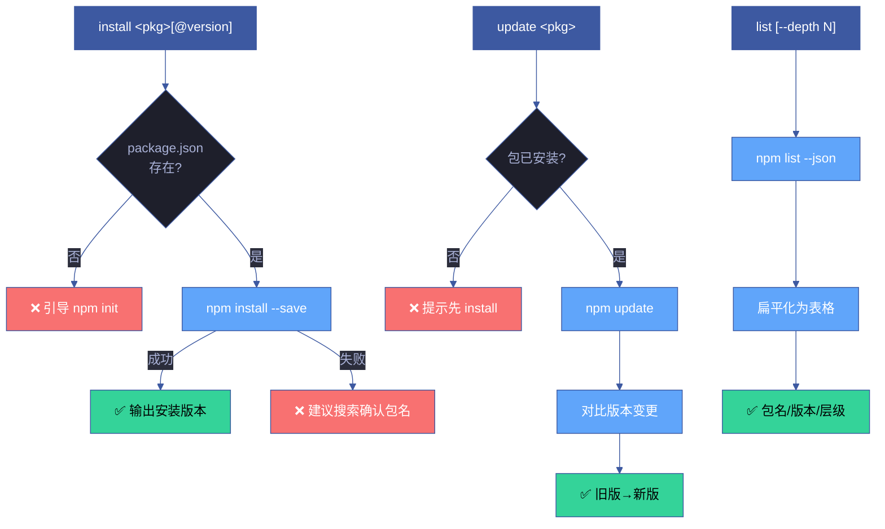

# 场景 2 — 包安装与版本管理

> | v1.0.0 | 2026-06-05 | 场景 2/4 | 📎 [故事任务](../故事任务.md) |

## §0 技术评审

### 效果示意

### 概述

安装、更新、列表三个子命令覆盖 npm 包版本管理的日常操作。所有写操作（install/update）前置校验 package.json 存在性和包的有效性，列表操作支持 `--depth` 控制依赖树深度。

### 主要价值

- 📦 **安装即用** — 一条命令安装包并自动更新 package.json
- ⬆️ **版本追踪** — 更新时展示版本变更（旧版→新版），变更可感知
- 📋 **依赖可视化** — 列表命令将嵌套 JSON 依赖树扁平化为可读表格
- 🛡️ **安全前置** — 操作前验证前置条件，失败时给出明确恢复路径

### 基线溯源

| 来源 | 路径 | 证据级别 |
|------|------|---------|
| 故事任务 FP2, FP3, FP4 | [故事任务.md](../故事任务.md) | A |
| SKILL.md install, update, list | [SKILL.md](../../../../skills/rui-npm/SKILL.md) | A |
| rui-npm.mjs cmdInstall, cmdUpdate, cmdList | [rui-npm.mjs](../../../../skills/rui-npm/rui-npm.mjs) | A |

---

## §1 测试设计

### 测试用例

| # | 输入 | 期望输出 | 优先级 |
|---|------|---------|--------|
| 1 | `install lodash` | lodash 安装到 node_modules，package.json 更新 | P0 |
| 2 | `install lodash@4.17.20` | 安装指定版本 4.17.20 | P0 |
| 3 | `install lodash --dev` | 安装为 devDependency | P1 |
| 4 | `install some-nonexistent-pkg` | 错误提示 + 搜索建议 | P0 |
| 5 | 无 package.json 时 `install lodash` | 错误提示：无 package.json | P0 |
| 6 | `update lodash` | 展示旧版→新版变更 | P0 |
| 7 | `update nonexistent`（未安装的包） | 错误提示 | P1 |
| 8 | `list` | 表格输出所有直接依赖 | P0 |
| 9 | `list --depth 1` | 含一级子依赖 | P1 |
| 10 | `list --json` | JSON 格式输出 | P1 |

### Gate A 交接信号

| 信号 | 值 | 说明 |
|------|-----|------|
| `test_design_exists` | `true` | §1 测试设计已就绪 |
| `test_case_count` | 10 | 覆盖安装/更新/列表的正常/边界/错误 |
| `fp_coverage` | FP2, FP3, FP4 | 覆盖故事任务三个功能点 |

---

## §2 实施报告

> 由 code 阶段填充。

---

## §3 测试报告

> 由 code 阶段填充。

---

## §4 自改进

> 由 code 阶段 / yry 闭环填充。
