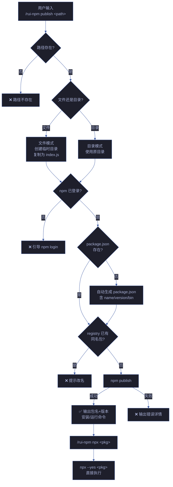

# 场景 3 — 本地发布与 npx 使用

> | v1.0.0 | 2026-06-05 | 场景 3/4 | 📎 [故事任务](../故事任务.md) |

## §0 技术评审

### 效果示意

### 概述

用户将本地 JavaScript/TypeScript 文件或目录一键发布为 npm 包，发布后立即可通过包名安装或用 npx 直接执行。自动处理 package.json 生成、登录检查、命名冲突检测，输出安装和运行命令。

### 主要价值

- 🚀 **即发即用** — 本地脚本写完立即发布，同会话中即可 npx 使用
- 🤖 **自动脚手架** — 无需手动创建 package.json，自动生成含 bin 入口的配置
- 🛡️ **安全前置** — 发布前校验 npm 登录状态 + registry 命名冲突检测
- 🧪 **干运行支持** — `--dry-run` 模拟发布流程，不实际上传

### 基线溯源

| 来源 | 路径 | 证据级别 |
|------|------|---------|
| 故事任务 FP7, FP8 | [故事任务.md](../故事任务.md) | A |
| SKILL.md publish, npx | [SKILL.md](../../../../skills/rui-npm/SKILL.md) | A |
| rui-npm.mjs cmdPublish, cmdNpx | [rui-npm.mjs](../../../../skills/rui-npm/rui-npm.mjs) | A |

---

## §1 测试设计

### 测试用例

| # | 输入 | 期望输出 | 优先级 |
|---|------|---------|--------|
| 1 | `publish ./test-script.js --name test-pkg` | 成功发布，输出包名和版本 | P0 |
| 2 | `publish ./test-script.js --dry-run` | 模拟成功，不实际上传 | P0 |
| 3 | `publish ./nonexistent.js` | 错误：路径不存在 | P0 |
| 4 | `npx cowsay hello` | npx 执行 cowsay，输出 hello | P0 |
| 5 | `npx nonexistent-pkg-xyz` | npx 报错包不存在 | P0 |
| 6 | `publish ./mydir` (目录含 package.json) | 使用已有 package.json 发布 | P1 |
| 7 | `publish ./mydir` (目录无 package.json) | 自动生成 package.json 后发布 | P1 |

### Gate A 交接信号

| 信号 | 值 | 说明 |
|------|-----|------|
| `test_design_exists` | `true` | §1 测试设计已就绪 |
| `test_case_count` | 7 | 覆盖文件/目录/干运行/错误路径 |
| `fp_coverage` | FP7, FP8 | 覆盖故事任务 FP7 (publish) + FP8 (npx) |

---

## §2 实施报告

> 由 code 阶段填充。

---

## §3 测试报告

> 由 code 阶段填充。

---

## §4 自改进

> 由 code 阶段 / yry 闭环填充。
