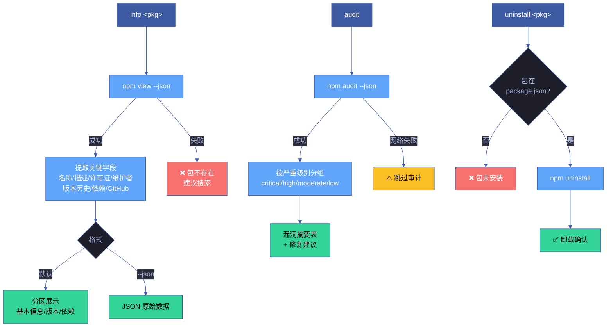

# 场景 4 — 包信息审计与卸载

> | v1.0.0 | 2026-06-05 | 场景 4/4 | 📎 [故事任务](../故事任务.md) |

## §0 技术评审

### 效果示意

### 概述

信息查询、安全审计、卸载三个子命令覆盖包的审计和清理操作。信息查询输出包的完整元数据，安全审计按严重级别分组展示漏洞并提供修复建议，卸载操作简洁明确。

### 主要价值

- 📋 **元数据全览** — 一条命令查看包的所有关键信息（许可证/维护者/版本历史/GitHub）
- 🔒 **安全可见** — 审计结果按严重级别分组，一眼定位高危漏洞，附带修复命令
- 🧹 **干净卸载** — 卸载操作简洁，前置校验避免误操作

### 基线溯源

| 来源 | 路径 | 证据级别 |
|------|------|---------|
| 故事任务 FP5, FP6, FP9 | [故事任务.md](../故事任务.md) | A |
| SKILL.md info, uninstall, audit | [SKILL.md](../../../../skills/rui-npm/SKILL.md) | A |
| rui-npm.mjs cmdInfo, cmdUninstall, cmdAudit | [rui-npm.mjs](../../../../skills/rui-npm/rui-npm.mjs) | A |

---

## §1 测试设计

### 测试用例

| # | 输入 | 期望输出 | 优先级 |
|---|------|---------|--------|
| 1 | `info react` | 输出 react 的版本/许可证/维护者/仓库链接 | P0 |
| 2 | `info react --json` | JSON 格式完整元数据 | P1 |
| 3 | `info nonexistent-pkg-xyz` | 错误：包不存在 + 搜索建议 | P0 |
| 4 | `uninstall lodash` | lodash 从 node_modules 和 package.json 移除 | P0 |
| 5 | `uninstall not-installed-pkg` | 错误提示 | P1 |
| 6 | `audit` | 漏洞摘要表，按严重级别分组 | P0 |
| 7 | `audit --json` | JSON 格式原始审计数据 | P1 |
| 8 | 无 package.json 时 `audit` | 错误提示 | P0 |

### Gate A 交接信号

| 信号 | 值 | 说明 |
|------|-----|------|
| `test_design_exists` | `true` | §1 测试设计已就绪 |
| `test_case_count` | 8 | 覆盖 info/audit/uninstall 的正常/边界/错误 |
| `fp_coverage` | FP5, FP6, FP9 | 覆盖故事任务三个功能点 |

---

## §2 实施报告

> 由 code 阶段填充。

---

## §3 测试报告

> 由 code 阶段填充。

---

## §4 自改进

> 由 code 阶段 / yry 闭环填充。
