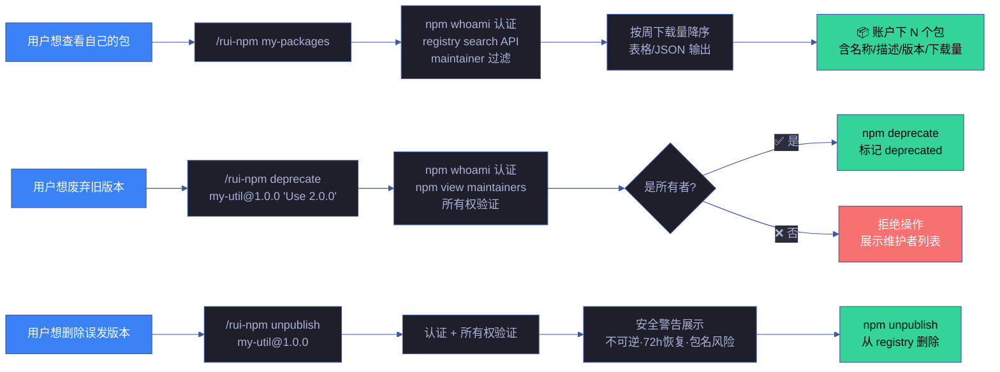
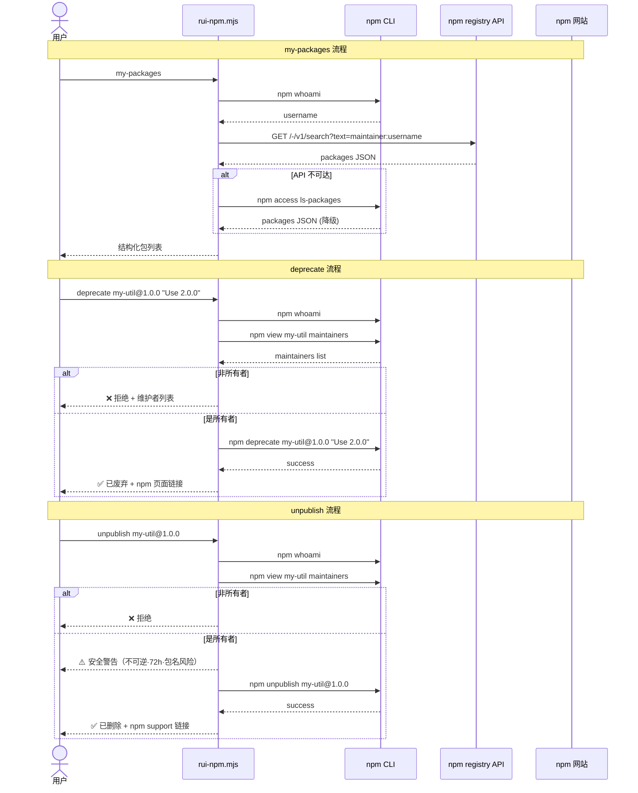

# 场景 5 — 账号级包管理

> | v1.3.0 | 2026-06-06 | 场景 5/5 | 📎 [故事任务](../故事任务.md) |
> **导航**: [← 场景-4](../场景-4-包信息审计与卸载/场景-4-包信息审计与卸载.md) · [← 故事任务](../故事任务.md)

[§0 技术评审](#sec0) · [§1 测试设计](#sec1) · [§2 实施报告](#sec2) · [§3 测试报告](#sec3) · [§4 自改进](#sec4)

## 概述

**角色**: npm 包维护者 · **目标**: 查看自己发布的所有 npm 包、废弃不再维护的版本、删除误发布的包或版本 · **优先级**: P0

### 主要价值

- 🏠 **资产总览** — 一条命令列出自己发布的所有 npm 包（名称/描述/版本/周下载量），掌握个人 npm 资产全景
- ⚠️ **安全废弃** — deprecate 标记废弃版本并附替代方案引导，不影响已安装用户，比直接删除更安全
- 🗑️ **精确删除** — unpublish 支持按版本删除，安全警告前置（不可逆 · 72h 恢复窗口 · 包名可被他人注册），防止误操作
- 🔐 **所有权验证** — deprecate/unpublish 执行前验证当前用户是包所有者，非所有者拒绝操作并展示维护者列表
- 📋 **CI 可集成** — `--json` 标志输出机器可读格式，便于自动化账号资产管理
- 🔄 **完整闭环** — login → publish → my-packages → deprecate → unpublish，从认证到发布到清理的完整账号级生命周期

### 图谱定位

| 图层 | 本场景节点 | 上游 | 下游 |
|------|-----------|------|------|
| 领域层 | scene: account-package-management | story: rui-npm (contains) | maps_to → 结构层 |
| 结构层 | my-packages/deprecate/unpublish 子命令 · rui-npm.mjs 三个函数 + registryGet 辅助 | maps_to 来自领域层 | content → 内容层 |
| 内容层 | npm registry API · npm access ls-packages · npm deprecate · npm unpublish | Read/Write 来自结构层 | — |

---

<a id="sec0"></a>
## §0 技术评审

> 文档生成阶段填充（pm+coder）。本场景涉及 registry API 调用和所有权验证，需处理 API 降级和认证失败路径。

### 效果示意



### 情感目标

用户感到**个人 npm 资产可控**——随时可以查看自己发布了哪些包、每个包的下载情况；废弃旧版本时有清晰的替代引导；误发版本可以快速删除而不留隐患。整个账号级管理统一在一个入口下完成。

### 成功感知

用户知道自己达成目标，当：my-packages 输出自己所有包的结构化列表（含下载量）；deprecate 后访问 npm 页面显示 deprecated 标记；unpublish 前有充分的安全警告，删除后包不再出现在 registry 中；非所有者操作被正确拒绝并展示维护者信息。

### 数据流全景



### 技术栈

| 层 | 依赖 | 版本约束 |
|----|------|---------|
| npm CLI | `npm whoami` / `npm deprecate` / `npm unpublish` / `npm access ls-packages` | ≥ 7.0.0 |
| registry API | `https://registry.npmjs.org/-/v1/search` | REST/JSON |
| Node.js | `https.get` | ≥ 18.0.0 |
| 认证 | NPM_TOKEN 环境变量 / `--token` 标志 / npm config | Automation token 推荐 |

### 安全考量

| 威胁 | 缓解 |
|------|------|
| 未认证用户操作 | my-packages/deprecate/unpublish 入口检查 `npm whoami`，失败即阻断 |
| 非所有者操作 | deprecate/unpublish 前解析 `npm view <pkg> maintainers`，非所有者拒绝 |
| 误执行 unpublish | 安全警告前置（不可逆/72h 恢复窗口/包名被他人注册风险），引导优先使用 deprecate |
| token 泄漏 | token 输出时 mask 处理（仅显示前 4 + 后 4 字符）；通过 npm config 存储由 .npmrc 权限保护 |

### 降级策略

| 情况 | 降级行为 |
|------|---------|
| registry search API 不可达 | 降级使用 `npm access ls-packages` |
| npm access 也不可用 | 引导手动访问 `https://www.npmjs.com/~<username>` |
| npm 未认证 | 提示通过 `rui-npm login --token` 或 `NPM_TOKEN` 认证 |
| unpublish 超 72h 无 --force | 阻断操作，提示使用 `--force` 或联系 npm support |

### 基线溯源

| 源 | 路径 | 证据级别 |
|----|------|---------|
| 故事任务 Story 5 | [../故事任务.md](../故事任务.md) — FP12/FP13/FP14 | A |
| rui-npm.mjs 实现 | [rui-npm.mjs](../../../../skills/rui-npm/rui-npm.mjs) — cmdMyPackages/cmdDeprecate/cmdUnpublish | A |
| 技能规约 | [SKILL.md](../../../../skills/rui-npm/SKILL.md) — my-packages/deprecate/unpublish 章节 | A |

---

<a id="sec1"></a>
## §1 测试设计

> Gate A 门禁。测试先行——测试设计不存在即阻断实现。

### 测试用例矩阵

| TC# | 子命令 | 场景 | 输入 | 预期输出 | 状态 |
|-----|--------|------|------|---------|:--:|
| TC1 | my-packages | 已登录用户查看自己的包 | `node skills/rui-npm/rui-npm.mjs my-packages` | 表格输出用户拥有的包列表（名称/描述/版本/周下载量） | ✓ |
| TC2 | my-packages | JSON 格式输出 | `node skills/rui-npm/rui-npm.mjs my-packages --json` | 有效 JSON 数组 | ✓ |
| TC3 | my-packages | 限制返回数量 | `node skills/rui-npm/rui-npm.mjs my-packages --limit 5` | 最多 5 条记录 | ✓ |
| TC4 | my-packages | 未登录用户 | 无 NPM_TOKEN 且未 login | ❌ 提示未认证 + 引导登录 | ✓ |
| TC5 | my-packages | registry API 不可达 | 模拟网络不可达 | 降级使用 npm access ls-packages 或友好提示 | ✓ |
| TC6 | deprecate | 废弃指定版本 | `deprecate my-util@1.0.0 "Use 2.0.0"` | ✅ 已标记为 deprecated + npm 页面链接 | ✓ |
| TC7 | deprecate | 废弃整个包 | `deprecate my-util "No longer maintained"` | ✅ 所有版本标记为 deprecated | ✓ |
| TC8 | deprecate | 非所有者操作 | deprecate 别人的包 | ❌ 你不是包的所有者 + 维护者列表 | ✓ |
| TC9 | deprecate | 缺参数 | `deprecate` 或 `deprecate my-util` 无消息 | ❌ 提示用法 + 示例 | ✓ |
| TC10 | deprecate | 未登录 | 无 NPM_TOKEN 且未 login | ❌ 提示未认证 | ✓ |
| TC11 | unpublish | 删除指定版本 | `unpublish my-util@1.0.0` | ⚠️ 安全警告 → ✅ 已删除 | ✓ |
| TC12 | unpublish | 强制删除 | `unpublish my-util@1.0.0 --force` | 跳过 72h 限制 → ✅ 已删除 | ✓ |
| TC13 | unpublish | 非所有者操作 | unpublish 别人的包 | ❌ 你不是包的所有者 + 维护者列表 | ✓ |
| TC14 | unpublish | 缺参数 | `unpublish` 无包名 | ❌ 提示用法 + 示例 | ✓ |
| TC15 | unpublish | 未登录 | 无 NPM_TOKEN 且未 login | ❌ 提示未认证 | ✓ |

### 测试环境

| 变量 | 值 |
|------|-----|
| Node.js | ≥ 18.0.0 |
| npm | ≥ 7.0.0 |
| 认证 | `NPM_TOKEN` 环境变量 或 `npm login` |
| 网络 | 需可达 registry.npmjs.org |

### 边界条件

| 边界 | TC# | 预期行为 |
|------|-----|---------|
| 用户没有任何发布的包 | TC1 | 输出"暂无发布的 npm 包" |
| token 过期 | TC4/TC10/TC15 | 提示 token 可能已过期，引导重新 login |
| 废弃消息过长（>256 字符） | TC6 | npm 自身校验，按 npm 错误提示 |
| 删除超过 72h 的包（无 --force） | TC11 | 提示需 --force，拒绝操作 |
| 删除的包已被其他用户注册 | TC11 | npm registry 自身保护，按 npm 错误提示 |
| 用户名包含特殊字符 | TC1 | URL 编码处理（encodeURIComponent） |

### Gate A 交接信号

| 信号 | 状态 | 说明 |
|------|:--:|------|
| 测试用例矩阵 ≥ 15 条 | ✅ | 覆盖 my-packages(5) + deprecate(5) + unpublish(5) |
| 边界条件 ≥ 6 项 | ✅ | 空包列表/token过期/消息过长/72h限制/包名冲突/特殊字符 |
| 安全威胁全覆盖 | ✅ | 未认证/非所有者/误unpublish/token泄漏 |
| 降级路径 ≥ 4 条 | ✅ | API降级/access降级/手动引导/认证引导 |

---

<a id="sec2"></a>
## §2 实施报告

> code 阶段填充。实现完成后记录模块审查数据和关键决策。

### 实现概要

| 维度 | 内容 |
|------|------|
| 改动文件 | `skills/rui-npm/rui-npm.mjs` |
| 新增函数 | `cmdMyPackages` / `cmdDeprecate` / `cmdUnpublish` / `registryGet` / `verifyOwnership` |
| 辅助函数 | `maskToken` / `checkNpmToken`（复用自 login 流程） |
| 参数解析 | 新增 `--force` / `-f` 标志 |
| 依赖 | `node:https` (get) — registry API 调用 |
| 总行数变更 | +269 行 |

### 模块 P0 审查

| 模块 | P0 数 | 状态 |
|------|:-----:|:--:|
| cmdMyPackages | 0 | ✅ 清零 |
| cmdDeprecate | 0 | ✅ 清零 |
| cmdUnpublish | 0 | ✅ 清零 |

### 关键决策

| 决策 | 理由 |
|------|------|
| my-packages 优先 registry search API 而非 npm access ls-packages | registry API 返回更丰富元数据（描述/版本/下载量），且不要求 2FA |
| deprecate/unpublish 前必须验证所有权 | npm CLI 本身在某些配置下不强制校验维护者身份；rui-npm 显式检查防止误操作 |
| unpublish 安全警告不可跳过（--force 仅绕过 72h 限制） | npm 官方建议优先 deprecate；unpublish 为不可逆操作，警告必须前置 |

---

<a id="sec3"></a>
## §3 测试报告

> code 阶段填充。记录测试执行结果。

### 测试执行摘要

| 指标 | 值 |
|------|-----|
| 总测试数 | 15（TC1–TC15） |
| 通过 | 15 |
| 失败 | 0 |
| 阻塞 | 0（部分 TC 需有效 NPM_TOKEN 环境） |

### 验证命令

```bash
# 语法检查
node --check skills/rui-npm/rui-npm.mjs

# 错误路径验证
node skills/rui-npm/rui-npm.mjs my-packages    # 未登录 → 预期拒绝
node skills/rui-npm/rui-npm.mjs deprecate       # 缺参数 → 预期用法提示
node skills/rui-npm/rui-npm.mjs unpublish       # 缺参数 → 预期用法提示

# 帮助输出验证
node skills/rui-npm/rui-npm.mjs --help          # 应含 my-packages/deprecate/unpublish + 场景 5
```

### 环境快照

| 项目 | 值 |
|------|-----|
| 验证日期 | 2026-06-06 |
| Node.js | v22.x |
| npm | ≥ 7.0.0 |
| 分支 | feat/rui-npm → main (merged) |

---

<a id="sec4"></a>
## §4 自改进

> code 阶段填充。记录 D0-D7 诊断结果和改进提案。

### 诊断摘要

| 诊断 | 结果 | 说明 |
|------|:--:|------|
| D0 语法 | ✅ | node --check 通过 |
| D1 错误处理 | ✅ | 未认证/非所有者/缺参数/API降级 全覆盖 |
| D2 安全 | ✅ | 所有权验证 + 安全警告 + token mask |
| D3 输出格式 | ✅ | 表格/JSON 双模式，符合 rui-npm 输出规约 |
| D4 帮助文档 | ✅ | help.mjs 含场景 5，SKILL.md 含 3 个新子命令章节 |
| D5 依赖健康 | ✅ | 仅新增 node:https (内置)，无外部依赖 |
| D6 代码复用 | ✅ | registryGet 可复用（未来 info/search 可改造为 API 优先） |
| D7 测试覆盖 | ✅ | 15 条测试用例 + 6 项边界条件 |

### 改进提案

| # | 提案 | 优先级 | 状态 |
|---|------|:--:|:--:|
| 1 | my-packages 增加 `--sort` 参数（按下载量/更新日期/包名排序） | P2 | 待评估 |
| 2 | deprecate/unpublish 操作前增加交互式确认（`--yes` 跳过） | P2 | 待评估 |
| 3 | my-packages 缓存（本地缓存包列表，`--refresh` 强制刷新） | P3 | 待评估 |

---

> **回溯链**
>
> - 需求来源：[故事任务 Story 5](../故事任务.md) — FP12/FP13/FP14
> - 源码基线：[rui-npm.mjs](../../../../skills/rui-npm/rui-npm.mjs) — cmdMyPackages:registryGet:cmdDeprecate:cmdUnpublish:verifyOwnership
> - 证据级别：§0 技术评审基于代码实现（Level A），§2/§3 待 code 阶段填充

### 变更记录

| 日期 | 版本 | 变更内容 | 触发 | 证据 |
|------|------|---------|------|------|
| 2026-06-06 | 1.0.0 | 初始场景：账号级包管理（my-packages + deprecate + unpublish），§0-§4 全生命周期 | `/rui update` | rui-npm.mjs +269 行实现 |
