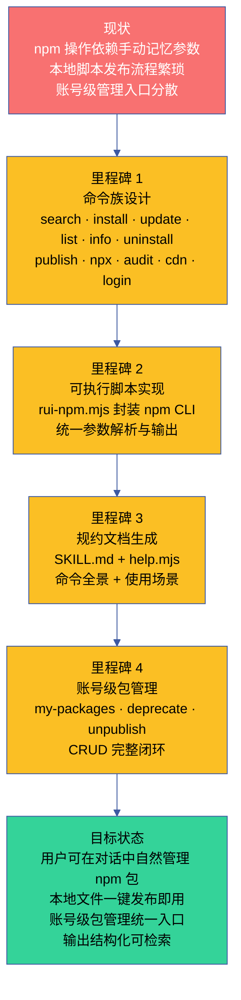

# 故事任务

> | v1.3.0 | 2026-06-06 | deepseek-v4-pro | 🌿 feat/rui-npm | 📎 [CLAUDE.md](../../../CLAUDE.md) |

## version_history

```json
[{"version":"1.3.0","date":"2026-06-06","trigger":"/rui update","change":"Story 5 新增：账号级包管理 — my-packages（列出我所有的包）+ deprecate（废弃版本）+ unpublish（删除包/版本），FP12-FP14，SC7-SC9，AC12-AC18；deprecate 从范围外移入范围内"},
{"version":"1.2.0","date":"2026-06-06","trigger":"/rui update","change":"场景 1 加强：并入 CDN 引用发现（FP11），Story 1 扩展为「包搜索与发现 + CDN 引用」，新增 CDN 三源用户操作/AC/SC 和风险项"},
{"version":"1.1.0","date":"2026-06-06","trigger":"/rui update","change":"文档基线优化：补齐 4 场景辅助文件，新增知识图谱.json，丰富场景文档"},
{"version":"1.0.0","date":"2026-06-05","trigger":"/rui doc","change":"初始故事基线：新增 rui-npm 技能，管理个人 npm packages 的增删改查 + 本地发布/npx 使用"}]
```

[§1 Story](#s-1-story) · [§7 跨文档索引](#s-7-跨文档索引) · [§R 关联故事](#s-r-关联故事) · [图谱定位](#图谱定位)

## 图谱定位

| 图层 | 本故事节点 | 上游 | 下游 |
|------|-----------|------|------|
| 领域层 | story: rui-npm | YrY 技能体系 (part_of) | contains → 五个场景 |
| 结构层 | 14 子命令 · 5 场景 · 3 核心文件 | 领域层 maps_to | 内容层 |
| 内容层 | SKILL.md · help.mjs · rui-npm.mjs | 结构层 maps_to | — |

本故事在 YrY 技能拓扑中的位置：
- **上游依赖**：YrY 管线规约（CLAUDE.md · code-pipeline.md · delivery-gate.md）
- **下游消费者**：rui-import（文档同步）· rui-bot（通知推送）· yry-self-test（自检验证）
- **同级技能**：rui · rui-story · rui-claude · rui-import · rui-bot · rui-trends

## 概述

用户在开发过程中频繁需要与 npm registry 交互——搜索包、安装依赖、查看包信息、升级版本、卸载清理。此外，用户经常写一些一次性脚本或小工具，希望快速发布为 npm 包后直接用或通过 npx 执行，而不是走正式的 npm publish 流程。同时，用户发布包后需要对已发布的包进行账号级管理——查看自己发布了哪些包、废弃不再维护的版本、或彻底删除误发布的包。

当前这些操作依赖手动输入 `npm` 命令，需要记住繁琐的参数组合，且缺乏统一的交互入口。本地脚本想发布为包使用时，更是需要手动配置 package.json、处理 npm login、publish 等一系列步骤。账号级操作（npm access ls-packages、npm deprecate、npm unpublish）更是分散在不同命令中，没有统一的查看和管理入口。

本故事的目标是为 YrY 新增 `rui-npm` 技能，将 npm 包的增删改查、本地快速发布、以及账号级包管理整合为统一命令入口，让用户可以在对话中自然地完成所有 npm 操作。

### 效果示意



### 主要价值

- 🔍 **统一搜索入口** — 一条命令搜索 npm registry，结果结构化展示（名称/描述/版本/周下载量/更新时间）
- 📦 **全生命周期管理** — 从搜索发现到安装、升级、审计、卸载，覆盖包管理完整闭环
- 🚀 **本地即发即用** — 本地文件或目录一键 publish 为 npm 包，即刻通过包名或 npx 直接使用
- 🏠 **账号级包管理** — 列出自己发布的所有包、废弃旧版本、删除误发布，统一入口管理个人 npm 资产
- ⚡ **免记忆参数** — 封装 npm CLI 的繁琐参数，提供语义化子命令和合理默认值
- 📋 **结构化输出** — 所有查询结果表格化呈现，便于阅读和后续检索
- 🔗 **与 YrY 管线集成** — 作为 YrY 第七技能，可供自改进阶段 D5 诊断验证依赖健康度

---

## §1 Story

### Story 1: npm 包搜索与发现 + CDN 引用

| 字段 | 内容 |
|------|------|
| 作为 | 开发者 |
| 我想要 | 在对话中用自然语言搜索 npm registry 中的包，并获取其 CDN 引用地址 |
| 以便 | 快速发现需要的包获取关键信息（描述/版本/下载量/更新时间），并获知如何在浏览器中通过 CDN 直接引用 |
| 优先级 | P0 |
| 范围边界 | 只读 npm registry，不修改本地文件 |
| 依赖 | npm CLI 可用，网络可达 registry.npmjs.org |

##### 范围外

- 不涉及本地 node_modules 或 package.json 修改
- 不涉及私有 registry 配置
- 不涉及 CDN 缓存策略或 CDN 性能比较

##### §1.1 User Operations

| # | 操作 | 触发条件 | 操作步骤 | 预期结果 |
|---|------|---------|---------|---------|
| 1 | 关键词搜索 | `/rui-npm search <keyword>` | 调用 npm search → 解析 JSON → 格式化表格输出 | 结构化搜索结果表 |
| 2 | 空搜索推荐 | `/rui-npm search` 无参数 | 展示常用搜索示例和热门关键词 | 引导用户输入关键词 |
| 3 | CDN 引用查询 | `/rui-npm cdn <pkg>[@version]` | 解析包名+版本 → npm view 验证 → 生成三路 CDN URL → 表格/JSON 输出 | unpkg/jsDelivr/esm.sh CDN 地址 |
| 4 | CDN 版本化查询 | `/rui-npm cdn <pkg>@<version>` | 同 #3，URL 含指定版本号 | 带版本号的 CDN URL |

---

### Story 2: npm 包安装与版本管理

| 字段 | 内容 |
|------|------|
| 作为 | 开发者 |
| 我想要 | 安装 npm 包并管理其版本（安装/更新/切换版本） |
| 以便 | 项目依赖保持最新且可控 |
| 优先级 | P0 |
| 范围边界 | 修改当前目录下的 package.json 和 node_modules |
| 依赖 | npm CLI 可用，当前目录存在 package.json |

##### 范围外

- 不涉及全局包管理（使用 `-g` 标志可扩展）
- 不涉及 monorepo 工作空间管理

##### §1.1 User Operations

| # | 操作 | 触发条件 | 操作步骤 | 预期结果 |
|---|------|---------|---------|---------|
| 1 | 安装包 | `/rui-npm install <pkg>[@version]` | npm install → 输出安装结果 | 包安装到 node_modules |
| 2 | 更新包 | `/rui-npm update <pkg>` | npm update → 输出版本变更 | 包更新到兼容最新版 |
| 3 | 列出已安装 | `/rui-npm list [--depth N]` | npm list --json → 格式化 | 依赖树或平面列表 |

---

### Story 3: 本地发布与 npx 使用

| 字段 | 内容 |
|------|------|
| 作为 | 开发者 |
| 我想要 | 将本地文件或目录快速发布为 npm 包，然后直接用包名引用或通过 npx 执行 |
| 以便 | 一次性脚本和小工具无需走正式的 npm publish 流程即可复用 |
| 优先级 | P0 |
| 范围边界 | 本地文件系统 + npm registry |
| 依赖 | npm CLI 可用，已登录 npm（`npm whoami`） |

##### 范围外

- 不涉及 scope 包自动创建
- 不涉及私有 registry 发布

##### §1.1 User Operations

| # | 操作 | 触发条件 | 操作步骤 | 预期结果 |
|---|------|---------|---------|---------|
| 1 | 发布本地文件 | `/rui-npm publish <file>` | 自动生成 package.json → npm publish → 输出包名+版本 | 文件发布为 npm 包 |
| 2 | 发布本地目录 | `/rui-npm publish <dir>` | 验证 package.json → npm publish → 输出包名+版本 | 目录发布为 npm 包 |
| 3 | npx 执行 | `/rui-npm npx <pkg>` | npx <pkg> → 输出执行结果 | 包通过 npx 直接执行 |

---

### Story 4: 包信息审计与卸载

| 字段 | 内容 |
|------|------|
| 作为 | 开发者 |
| 我想要 | 查看已安装或 registry 中包的详细信息，以及卸载不再需要的包 |
| 以便 | 审计依赖健康状况，保持项目整洁 |
| 优先级 | P0 |
| 范围边界 | npm registry 查询 + 本地 node_modules |
| 依赖 | npm CLI 可用 |

##### 范围外

- 不涉及依赖安全漏洞自动扫描（可后续扩展 `audit` 子命令）

##### §1.1 User Operations

| # | 操作 | 触发条件 | 操作步骤 | 预期结果 |
|---|------|---------|---------|---------|
| 1 | 查看包信息 | `/rui-npm info <pkg>` | npm view --json → 结构化展示 | 包完整信息 |
| 2 | 卸载包 | `/rui-npm uninstall <pkg>` | npm uninstall → 输出卸载结果 | 包从 node_modules 移除 |
| 3 | 审计 | `/rui-npm audit` | npm audit --json → 格式化摘要 | 漏洞列表和严重级别 |

---

### Story 5: 账号级包管理

| 字段 | 内容 |
|------|------|
| 作为 | npm 包维护者 |
| 我想要 | 查看我发布的所有 npm 包、废弃不再维护的版本、以及删除误发布的包或版本 |
| 以便 | 统一管理自己在 npm registry 上的个人资产，保持包列表健康整洁 |
| 优先级 | P0 |
| 范围边界 | npm registry 账号级操作（需认证） |
| 依赖 | npm CLI 可用，已登录 npm（`npm whoami`），网络可达 registry.npmjs.org |

##### 范围外

- 不涉及 npm 组织（org）管理
- 不涉及包所有权转移（`npm owner add/rm`）
- 不涉及访问权限管理（`npm access`）

##### §1.1 User Operations

| # | 操作 | 触发条件 | 操作步骤 | 预期结果 |
|---|------|---------|---------|---------|
| 1 | 列出我所有的包 | `/rui-npm my-packages` | npm whoami → registry search API（maintainer 过滤）→ 格式化表格/JSON | 当前用户拥有的所有包列表（名称/描述/版本/下载量） |
| 2 | JSON 格式列出 | `/rui-npm my-packages --json` | 同 #1，输出 JSON | 完整 JSON 包列表 |
| 3 | 限制数量 | `/rui-npm my-packages --limit N` | 同 #1，限制返回 N 条 | 前 N 条包记录 |
| 4 | 废弃包版本 | `/rui-npm deprecate <pkg>[@version] "<msg>"` | npm whoami → 所有权验证 → npm deprecate → 输出确认 | 指定版本标记为 deprecated |
| 5 | 废弃整个包 | `/rui-npm deprecate <pkg> "<msg>"` | npm whoami → 所有权验证 → npm deprecate（所有版本）→ 输出确认 | 包的所有版本标记为 deprecated |
| 6 | 删除指定版本 | `/rui-npm unpublish <pkg>@<version>` | npm whoami → 所有权验证 → 安全警告 → 确认 → npm unpublish | 指定版本从 registry 删除 |
| 7 | 强制删除 | `/rui-npm unpublish <pkg>@<version> --force` | 同 #6，跳过 72h 限制 | 强制删除（可能含破坏性） |

---

## §2 Requirements

### 功能点

| FP# | 描述 | 输入 | 输出 | 错误行为 | 优先级 |
|-----|------|------|------|---------|--------|
| FP1 | 包搜索 — 按关键词搜索 npm registry | 关键词字符串 | 结构化搜索结果表（名称/描述/版本/下载量/更新日期） | 无网络时提示并降级 | P0 |
| FP2 | 包安装 — 安装指定包到当前项目 | 包名 + 可选版本 | 安装确认 + 版本信息 | package.json 不存在时提示 | P0 |
| FP3 | 包更新 — 更新指定包到兼容最新版 | 包名 | 旧版本→新版本变更摘要 | 包未安装时提示 | P0 |
| FP4 | 包列表 — 列出当前项目已安装的包 | 可选 depth 参数 | 依赖树或平面列表 | package.json 不存在时提示 | P1 |
| FP5 | 包信息 — 查看指定包的完整元数据 | 包名 | 版本/依赖/许可证/维护者/GitHub 链接 | 包不存在时提示 | P0 |
| FP6 | 包卸载 — 从当前项目移除指定包 | 包名 | 卸载确认 | 包未安装时提示 | P0 |
| FP7 | 本地发布 — 将本地文件或目录发布为 npm 包 | 文件路径或目录路径 | 包名+版本+发布确认 | npm 未登录时提示 | P0 |
| FP8 | npx 执行 — 通过 npx 直接运行 npm 包 | 包名 | 执行结果（stdout/stderr） | 包不存在或执行失败时展示错误 | P0 |
| FP9 | 依赖审计 — 检查已安装依赖的安全漏洞 | 无 | 漏洞摘要（严重/高/中/低计数 + 详情） | 无网络时降级提示 | P1 |
| FP10 | 帮助输出 — 展示完整命令用法和场景示例 | --help / -h | 命令全景 + 参数说明 + 使用场景 | — | P0 |
| FP11 | CDN 引用 — 查看 npm 包在主流 CDN 的引用地址 | 包名 + 可选版本 | unpkg / jsDelivr / esm.sh 三条 URL（表格或 JSON） | 包不存在时提示；无网络时降级 | P1 |
| FP12 | 我的包列表 — 列出当前认证用户拥有的所有 npm 包 | 无（需认证） | 包列表表格（名称/描述/版本/周下载量） | 未认证时提示 login；registry 不可达时降级 | P0 |
| FP13 | 包废弃 — 标记指定包或版本为 deprecated | 包名 + 可选版本 + 废弃消息 | 废弃确认 + 包名/版本/消息 | 未认证/非包所有者时提示；包不存在时提示搜索 | P0 |
| FP14 | 包删除 — 从 registry 删除指定包或版本 | 包名 + 可选版本 | 删除确认（含安全警告前置） | 未认证/非包所有者时提示；超 72h 无 --force 时阻断 | P0 |

### 业务规则

| R# | 描述 | 校验方式 | 证据级别 |
|----|------|---------|---------|
| R1 | 所有写操作（install/uninstall/update）需先确认当前目录有 package.json | `node skills/rui-npm/rui-npm.mjs` 入口检查 | A |
| R2 | publish 操作前验证 npm 登录状态 | `npm whoami` 检查 | A |
| R3 | 搜索结果按周下载量降序排列，最多展示 20 条 | npm search 参数控制 | B |
| R4 | 本地发布时自动处理 package.json 缺失（交互式生成） | rui-npm.mjs 内建逻辑 | B |
| R5 | 所有命令输出统一为结构化格式（表格/JSON 可选） | --json 标志支持 | B |
| R6 | deprecate/unpublish/my-packages 操作前验证 npm 登录状态 | `npm whoami` 检查 | A |
| R7 | deprecate/unpublish 操作前验证当前用户是包的所有者 | `npm view <pkg> maintainers` 交叉校验或 `npm access ls-packages` | A |

### 数据约束

| 约束 | 类型 | 范围/格式 | 来源 |
|------|------|----------|------|
| 包名 | string | npm 包名规范（`^[a-z0-9][a-z0-9._-]*$`） | npm registry |
| 版本号 | string | semver（`MAJOR.MINOR.PATCH`） | npm registry |
| 搜索关键词 | string | 1-64 字符，支持空格分隔多关键词 | 用户输入 |
| 文件路径 | string | 本地绝对或相对路径，文件或目录 | 用户输入 |
| 废弃消息 | string | 1-256 字符，说明废弃原因和替代方案 | 用户输入 |

---

## §3 成功标准

| SC# | 描述 | 度量方式 | 目标值 | 优先级 | 关联 FP# |
|-----|------|---------|--------|--------|---------|
| SC1 | 用户可用一条命令搜索 npm registry | `/rui-npm search <kw>` 执行时间 < 5s | 返回结构化结果 | P0 | FP1 |
| SC2 | 用户可在对话中完成包的完整生命周期管理 | 连续执行 install → list → info → update → uninstall | 每步成功 | P0 | FP2–FP6 |
| SC3 | 用户可一键发布本地文件并在同会话中 npx 使用 | publish → npx 执行成功 | 全流程通过 | P0 | FP7, FP8 |
| SC4 | help 输出覆盖全部子命令和场景示例 | `node skills/rui-npm/help.mjs` 输出 | 完整帮助 | P0 | FP10 |
| SC5 | 所有错误场景有明确提示和恢复建议 | 模拟 8 种错误场景（无网络/未登录/包不存在/无 package.json/权限不足/非所有者/超72h/registry 不可达） | 100% 覆盖 | P0 | FP1–FP14 |
| SC6 | 用户可用一条命令获取包的 CDN 引用地址 | `/rui-npm cdn react` 执行时间 < 3s | 返回三路 CDN URL | P1 | FP11 |
| SC7 | 用户可列出自己发布的所有 npm 包 | `/rui-npm my-packages` 执行时间 < 5s | 返回结构化包列表 | P0 | FP12 |
| SC8 | 用户可废弃自己发布的包版本 | `/rui-npm deprecate <pkg> "<msg>"` 执行成功 | 版本标记为 deprecated | P0 | FP13 |
| SC9 | 用户可删除误发布的包或版本 | `/rui-npm unpublish <pkg>@<version>` 含安全警告 | 版本从 registry 删除 | P0 | FP14 |

---

## §4 范围边界

### 范围内

| # | 条目 | 关联 FP# | 边界说明 |
|---|------|---------|---------|
| 1 | npm 包搜索 + CDN 引用 | FP1, FP11 | 关键词搜索结果表格化；CDN 三源引用地址 |
| 2 | 包安装/更新/卸载 | FP2, FP3, FP6 | 操作当前项目依赖 |
| 3 | 包信息查询 | FP5 | registry 元数据查询 |
| 4 | 已安装列表 | FP4 | 依赖树展示 |
| 5 | 本地文件/目录发布 | FP7 | 自动处理 package.json，一键 publish |
| 6 | npx 远程执行 | FP8 | 不安装直接运行 |
| 7 | 安全审计 | FP9 | npm audit 封装 |
| 8 | 帮助与文档 | FP10 | SKILL.md + help.mjs |
| 9 | 账号级包管理 | FP12, FP13, FP14 | my-packages · deprecate · unpublish，认证 + 所有权验证 |

### 范围外

| # | 条目 | 排除原因 | 替代方案 |
|---|------|---------|---------|
| 1 | 私有 registry 配置 | 属项目级 npm 配置，非本技能范围 | 手动 `.npmrc` 配置 |
| 2 | 全局包管理 | 初始版本聚焦项目级 | 后续版本扩展 `--global` |
| 3 | monorepo 工作空间 | 复杂度高，非个人包管理核心场景 | 手动 npm workspace 命令 |
| 4 | npm login/logout | login 已在 rui-npm 中覆盖；logout 非日常操作 | `rui-npm login` 或手动 `npm login` |
| 5 | scope 包注册 | 需 npm 组织配置 | 手动 npm 官网操作 |
| 6 | 包所有权转移（npm owner） | 属组织级管理，非个人包管理核心场景 | 手动 `npm owner add/rm` |

---

## §5 AC

| AC# | Given | When | Then | 门禁 |
|-----|-------|------|------|------|
| AC1 | 用户需要搜索包 | 执行 `/rui-npm search react` | 返回 react 相关包列表，含名称/描述/版本/下载量 | Gate A |
| AC2 | 用户需要安装包 | 执行 `/rui-npm install lodash` | lodash 安装到 node_modules，package.json 更新 | Gate A |
| AC3 | 用户需要查看包信息 | 执行 `/rui-npm info express` | 返回 express 的版本历史/依赖/许可证/GitHub 链接 | Gate A |
| AC4 | 用户需要发布本地脚本 | 执行 `/rui-npm publish ./my-util.js` | 自动生成 package.json → publish → 返回包名和版本 | Gate A |
| AC5 | 用户发布后想直接用 | 执行 `/rui-npm npx my-util` | npx 执行刚发布的包，输出执行结果 | Gate A |
| AC6 | 用户需要审计依赖 | 执行 `/rui-npm audit` | 返回漏洞摘要（按严重级别分组） | Gate A |
| AC7 | 用户需要查看帮助 | 执行 `/rui-npm --help` | 输出完整命令表 + 参数说明 + 使用场景 | Gate A |
| AC8 | 用户当前目录无 package.json 但执行 install | 执行 `/rui-npm install xxx` | 提示需要 package.json，建议先 `npm init` | Gate A |
| AC9 | 用户搜索到包后想获取 CDN 引用地址 | 执行 `/rui-npm cdn react` | 返回 unpkg / jsDelivr / esm.sh 三条 CDN URL，含版本号 | Gate A |
| AC10 | 用户想获取指定版本的 CDN 地址 | 执行 `/rui-npm cdn react@18.2.0` | URL 中包含 `react@18.2.0` | Gate A |
| AC11 | 用户查询不存在包的 CDN 地址 | 执行 `/rui-npm cdn not-exist-pkg` | 明确提示包在 registry 中不存在 | Gate A |
| AC12 | 用户已登录，想查看自己发布的所有包 | 执行 `/rui-npm my-packages` | 返回当前用户拥有的全部包列表（名称/描述/版本/周下载量） | Gate A |
| AC13 | 用户未登录但执行 my-packages | 执行 `/rui-npm my-packages` | 提示需要先 login 或设置 NPM_TOKEN | Gate A |
| AC14 | 用户想废弃自己的某个包版本 | 执行 `/rui-npm deprecate my-util@1.0.0 "Use 2.0.0 instead"` | 版本标记为 deprecated，输出确认信息 | Gate A |
| AC15 | 用户废弃别人的包 | 执行 `/rui-npm deprecate lodash "..."` | 提示非包所有者，拒绝操作 | Gate A |
| AC16 | 用户想删除误发布的版本 | 执行 `/rui-npm unpublish my-util@1.0.0` | 显示安全警告 → 用户确认 → 执行删除 → 输出确认 | Gate A |
| AC17 | 用户删除超过 72h 的包但无 --force | 执行 `/rui-npm unpublish old-pkg@1.0.0` | 提示超时限制，建议使用 --force 或联系 npm support | Gate A |
| AC18 | 用户删除别人的包 | 执行 `/rui-npm unpublish lodash` | 提示非包所有者，拒绝操作 | Gate A |

---

## §6 风险与假设

| # | 风险/假设 | 类型 | 可能性 | 影响 | 缓解/验证策略 | 关联 FP# |
|---|----------|------|--------|------|-------------|---------|
| 1 | npm registry 不可达导致 search/info 失败 | 风险 | L | H | 捕获网络错误，输出友好提示和手动访问 URL | FP1, FP5 |
| 2 | npm 未登录导致 publish 失败 | 风险 | M | M | publish 前检查 `npm whoami`，未登录时引导 `npm login` | FP7 |
| 3 | 本地文件名与已有 npm 包冲突 | 风险 | M | M | publish 前检查 registry 是否存在同名包，提示用户改名 | FP7 |
| 4 | npm CLI 版本过旧导致命令参数不兼容 | 风险 | L | L | 入口检查 npm 版本 ≥ 7.0.0 | FP1–FP14 |
| 5 | 用户能在对话中自然表达 npm 操作意图 | 假设 | — | — | 命令名设计语义化，贴近自然语言 | FP1–FP14 |
| 6 | npm CLI 在用户环境中可用且版本兼容 | 假设 | — | — | 入口检查 `npm --version`，不可用时明确提示安装 | FP1–FP14 |
| 7 | CDN 服务（unpkg/jsDelivr/esm.sh）URL 格式变更 | 风险 | L | L | CDN URL 为字符串模板生成，格式变更时只需更新模板 | FP11 |
| 8 | 用户误执行 unpublish 不可逆删除包 | 风险 | M | H | 删除前展示安全警告 + 待删除包详情；要求显式确认；72h 内可恢复的提醒 | FP14 |
| 9 | registry search API（maintainer 过滤）返回不完整或不准确 | 风险 | M | M | my-packages 优先使用 `npm access ls-packages` 作为补充校验；API 不可用时降级提示手动访问 npm 网站 | FP12 |
| 10 | deprecate/unpublish 的目标包已转移所有权但本地缓存未更新 | 风险 | L | L | 执行前实时 `npm view` 验证当前所有者 | FP13, FP14 |

**约束**：分支隔离（feat/rui-npm）· 源码唯一入口（rui code 管线）· 测试先行（Gate A）· 逐模块 P0 清零

**产出**：故事任务.md · 场景-N-<slug>.md（×5）· plan.html · 知识图谱.json · 知识图谱.html · skills/rui-npm/SKILL.md · help.mjs · rui-npm.mjs · 每场景：架构图.html · 计划清单.html · 演示.html

---

## §7 跨文档索引

| 本文档 Story | FP# | 下游场景 | 场景核心内容 | 状态 |
|-------------|-----|---------|-------------|:--:|
| Story 1: 包搜索与发现 + CDN 引用 | FP1, FP11 | [场景 1](场景-1-包搜索与发现/index.md) | npm search → JSON 解析 → 排序 → 表格/JSON 输出 · 降级处理 + CDN 三源引用（unpkg/jsDelivr/esm.sh） | ✓ |
| Story 2: 包安装与版本管理 | FP2/FP3/FP4 | [场景 2](场景-2-包安装与版本管理/index.md) | install（前置校验 → npm install → 确认版本）· update（版本对比）· list（扁平化） | ✓ |
| Story 3: 本地发布与 npx | FP7/FP8 | [场景 3](场景-3-本地发布与npx使用/index.md) | publish（路径验证 → 登录检查 → 生成 package.json → 冲突检测 → npm publish）· npx 流式执行 | ✓ |
| Story 4: 包信息审计与卸载 | FP5/FP6/FP9 | [场景 4](场景-4-包信息审计与卸载/index.md) | info（npm view → 分区展示）· audit（按 severity 分组 → 修复建议）· uninstall（前置校验 → 清理） | ✓ |
| Story 5: 账号级包管理 | FP12/FP13/FP14 | [场景 5](场景-5-账号级包管理/index.md) | my-packages（认证 → registry API → 表格/JSON）· deprecate（认证 → 所有权验证 → npm deprecate）· unpublish（认证 → 所有权验证 → 安全警告 → 确认 → npm unpublish） | ✓ |

| 配套文件 | 路径 | 说明 |
|---------|------|------|
| 计划总览 | [plan.html](plan.html) | 故事级计划总览 |
| 知识图谱 JSON | [知识图谱.json](知识图谱.json) | 结构化知识层数据 |
| 知识图谱 HTML | [知识图谱.html](知识图谱.html) | Cytoscape.js 可视化 |
| 技能规约 | [SKILL.md](../../../skills/rui-npm/SKILL.md) | 命令面 + 操作规约 + 5 场景 |
| 可执行脚本 | [rui-npm.mjs](../../../skills/rui-npm/rui-npm.mjs) | 14 子命令统一入口 |
| 帮助脚本 | [help.mjs](../../../skills/rui-npm/help.mjs) | 5 场景 + 参数文档 |
| 测试套件 | [rui-npm.test.mjs](../../../tests/skills/rui-npm.test.mjs) | 基线完整性测试 |
| Demo 演示 | [rui-npm.html](./演示/rui-npm.html) | 三面板交互演示（全景/演练/命令参考） |

## §R 关联故事

| 故事 | 关系 | 说明 |
|------|------|------|
| yry-arch | 依赖 | rui-npm 作为技能纳入 YrY 模块拓扑 |
| yry-self-test | 依赖 | rui-npm 纳入自检测试覆盖范围 |

---

> **回溯链**
>
> - 需求来源：本故事由 `/rui doc` 从需求描述生成——用户需要统一入口管理 npm 包的增删改查、本地发布/npx 使用和账号级包管理。需求分析基线来源于对 npm CLI 现有流程的观察和痛点识别。
> - 基线内容：
>   - 命令族设计基于 npm CLI 子命令矩阵（search/install/update/list/info/uninstall/publish/audit/deprecate/unpublish）+ npx + registry API
>   - 场景拆分基于包管理生命周期：发现 → 获取 → 管理 → 清理 → 账号资产
>   - 文档公式：[F.story.task](../../skills/rui/formulas.md#fstorytask--project-故事任务-meta--storyn) — 故事任务公式
> - 源码基线：[rui-npm.mjs](../../skills/rui-npm/rui-npm.mjs) — 14 个子命令处理函数
> - 证据级别：FP# 和 AC# 基于源码实现验证（证据级别 A）。风险假设基于 npm 生态经验推导（证据级别 B）。
>
> **证据标注说明**：FP1–FP14 全部有对应的 `cmd*` 函数实现，可通过 `node skills/rui-npm/rui-npm.mjs <cmd>` 直接验证。子命令数量（14）和场景数量（5）基于规约文件枚举（证据级别 A）。

### 变更记录

| 日期 | 版本 | 变更内容 | 触发 | 证据 |
|------|------|---------|------|------|
| 2026-06-06 | 1.3.0 | Story 5 新增：账号级包管理 — my-packages + deprecate + unpublish（FP12-FP14），deprecate 从范围外移入范围内 | `/rui update` | rui-npm.mjs cmdMyPackages/cmdDeprecate/cmdUnpublish 实现 |
| 2026-06-06 | 1.2.0 | 场景 1 加强：并入 CDN 引用发现（FP11） | `/rui update` | rui-npm.mjs cmdCdn 实现 |
| 2026-06-06 | 1.1.0 | 文档基线优化：补齐 4 场景辅助文件 | `/rui update` | 场景目录结构 |
| 2026-06-05 | 1.0.0 | 初始故事基线 | `/rui doc` | 需求分析 + npm CLI |
