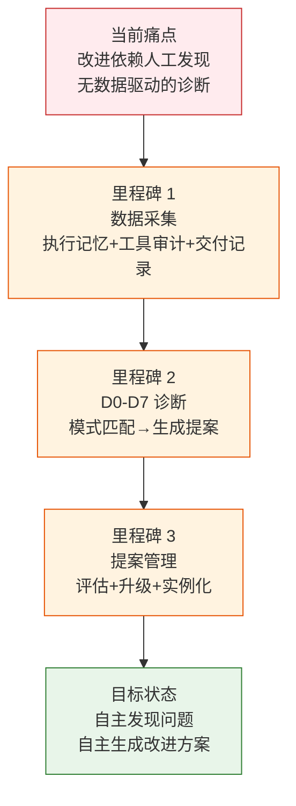
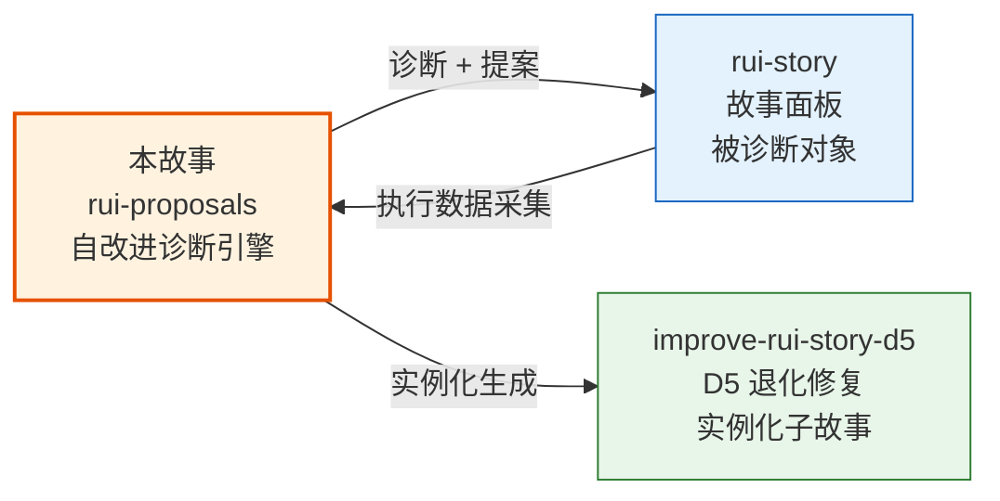

> | v1.0.0 | 2026-05-22 | deepseek-v4-pro | ⏱️ — | 📎 [CLAUDE.md](../../../CLAUDE.md) |

> **导航**: [→ YrY-使用场景](./YrY-使用场景.md)

# YrY-故事任务 · rui-proposals

## §0 基线声明

> **问题空间基线**

### 需求概述

自改进诊断引擎是 YrY 自我进化能力的核心。它采集执行记忆数据，按 D0-D7 八维诊断模式匹配问题，自动生成改进提案，支持提案生命周期管理（生成→评估→升级→实例化），形成闭环反馈。

### 效果示意

### 主要价值

- 🔍 八维诊断：D0-D7 覆盖基线/效率/质量/复杂度/流程/依赖/文档/配置
- 📊 数据驱动：基于执行记忆+工具审计+交付记录的三维数据源
- 🔄 闭环管理：生成→列表→评估→升级→实例化全生命周期
- ⚡ 自主运行：yry 管线自动触发，无需人工干预

---

## §1 Story

### Story 1: 诊断引擎

| 字段 | 内容 |
|------|------|
| 作为 | self-improve agent |
| 我想要 | 自动扫描执行记忆并生成改进提案 |
| 以便 | 发现流程/质量/架构退化并自动修复 |
| 优先级 | P0 |
| 范围边界 | 数据采集→D0-D7模式匹配→提案生成 |
| 依赖 | execution-memory.jsonl 至少有 3 条记录 |

### Story 2: 提案管理

| 字段 | 内容 |
|------|------|
| 作为 | PM agent |
| 我想要 | 查看、评估、升级、实例化提案 |
| 以便 | 优秀改进经验沉淀为规则 |
| 优先级 | P1 |

---

## §2 Requirements

### 功能点

| FP# | 描述 | 优先级 |
|-----|------|:--:|
| FP1 | D0-D7 诊断 — 从执行记忆匹配退化模式 | P0 |
| FP2 | 提案生成 — 诊断→提案类型路由→写入 proposals.jsonl | P0 |
| FP3 | 提案列表 — 按状态/故事过滤查询 | P1 |
| FP4 | E1-E4 评估 — 前后对比评估改进效果 | P1 |
| FP5 | 经验升级 — 同类型提案≥阈值时升级为规则 | P2 |
| FP6 | 实例化 — 提案转为故事任务目录 | P1 |

### 业务规则

| R# | 描述 |
|----|------|
| R1 | 执行记忆 < 3 条时诊断降级 |
| R2 | 阻断率 > 20% 触发 D2 质量诊断 |
| R3 | P0 密度过高（×2 基线）触发 D3 复杂度诊断 |
| R4 | 同类型提案 ≥ 阈值故事数时升级为规则 |

---

## §3 成功标准

| SC# | 描述 | 优先级 | 关联 FP# |
|-----|------|:--:|---------|
| SC1 | 有足够数据时生成有效提案 | P0 | FP1,FP2 |
| SC2 | 提案可被列表查询和过滤 | P1 | FP3 |
| SC3 | 同类型经验可升级为规则 | P2 | FP5 |

---

## §4 范围边界

**范围内**: 诊断、提案生成、评估、升级、实例化
**范围外**: 提案自动执行（由 yry 管线执行）、提案效果的人工验收

---

## §5 AC

| AC# | Given | When | Then | 门禁 |
|-----|-------|------|------|------|
| AC1 | 执行记忆 ≥ 3 条 | generate | 生成 ≥ 1 个提案，写入 proposals.jsonl | Gate A |
| AC2 | proposals.jsonl 有记录 | list --status=open | 仅列出 open 状态提案 | Gate A |
| AC3 | 执行记忆 < 3 条 | generate | 降级提示，不生成提案 | Gate A |

---

## §6 风险

| # | 风险 | 可能性 | 影响 | 缓解 |
|---|------|:--:|:--:|------|
| 1 | 数据不足导致误诊 | M | M | 最少 3 条记忆阈值 |
| 2 | 提案质量低 | M | L | E1-E4 评估过滤 |
| 3 | 死循环（反复生成同一提案） | L | M | 失败 ≥ 2 次 skip |

---

## §7 跨文档索引

| 基线内容 | 下游文档 | 状态 |
|---------|---------|:--:|
| §2 FP1-FP6 | 03 技术评审 | 待生成 |
| §5 AC1-AC3 | 04 测试设计 | 待生成 |
| D3 安全诊断 | 05 安全审计 | 待生成 |

---

> | 日期 | 变更 | 触发 | 证据 |
> |------|------|------|------|
> | 2026-05-22 | 初始生成 | /rui doc --from-code rui-proposals-doc | skills/rui/proposals.mjs |

## 关联故事

| 关联故事 | 关系类型 | 说明 |
|---------|---------|------|
| rui-story | 诊断对象 | 对 rui-story 执行 D0-D7 诊断，生成改进提案 |
| improve-rui-story-d5 | 实例化 | D5 提案实例化为独立故事目录，含完整文档基线 |
