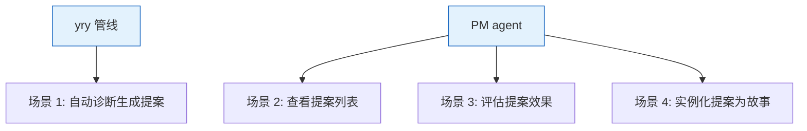
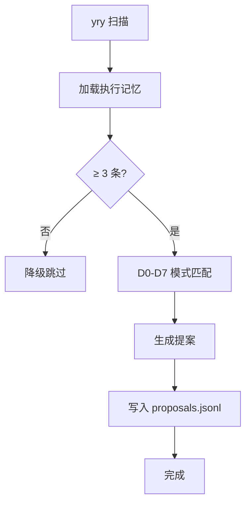

> | v1.0.0 | 2026-05-22 | deepseek-v4-pro | ⏱️ — | 📎 [CLAUDE.md](../../../CLAUDE.md) |

> **导航**: [← YrY-故事任务](./YrY-故事任务.md) · [→ YrY-技术评审](./YrY-技术评审.md)

[§0 基线声明](#sec0-baseline) · [§1 场景全景](#sec1-scenarios) · [§2 场景详述](#sec2-details) · [§3 场景覆盖矩阵](#sec3-matrix) · [§4 评审清单](#sec4-checklist) · [§5 体验基线](#sec5-experience)

# YrY-使用场景 · rui-proposals

## §0 基线声明

> **用户空间基线**

### 主要价值

- 🔍 self-improve agent 自主发现改进机会
- 📊 PM agent 查看提案全景
- 🔄 yry 管线自动闭环：诊断→实现→验证

---

## §1 场景全景

## §2 场景详述

### 场景 1: 自动诊断生成提案

| 角色 | 触发条件 | 核心目标 |
|------|---------|---------|
| yry 管线 | `/rui yry` 执行 | 扫描执行记忆→D0-D7诊断→生成提案 |

| # | 步骤 | 异常分支 |
|---|------|---------|
| 1 | 加载数据 | 文件不存在：降级跳过 |
| 2 | D0-D7 诊断 | 无匹配模式：输出健康声明 |
| 3 | 生成提案 | 同类型重复：skip |
| 4 | 写入文件 | — |

### 场景 2: 查看提案列表

PM agent 执行 `proposals.mjs list --story=<name>` 查看某故事的所有改进提案。

### 场景 3: 评估提案效果

执行 `proposals.mjs evaluate --id=<id>` 按 E1-E4 四维评估改进效果。

### 场景 4: 实例化提案为故事

执行 `proposals.mjs materialize --story=<name>` 将 open 提案转为 `improve-*` 故事任务目录。

---

## §3 场景覆盖矩阵

| 场景 | FP# | AC# | 状态 |
|------|-----|------|:--:|
| 场景 1 | FP1,FP2 | AC1,AC3 | 待生成 |
| 场景 2 | FP3 | AC2 | 待生成 |
| 场景 3 | FP4 | — | 待生成 |
| 场景 4 | FP6 | — | 待生成 |

---

## §4 评审清单

| # | 检查项 | 状态 |
|---|--------|:--:|
| 1 | 场景 ≥ 2 | ✅ (4) |
| 2 | 异常分支明确 | ✅ |

---

## §5 体验基线

| 角色 | 核心旅程 | 情感目标 | 成功感知 | 关联场景 |
|------|---------|---------|---------|---------|
| yry | 自动扫描→发现问题→生成提案 | 项目自我修复 | 看到新提案写入 proposals.jsonl | 场景 1 |
| PM | 查看提案→评估→升级→实例化 | 改进有据可查 | 提案实例化为故事任务 | 场景 2-4 |

---

> | 日期 | 变更 | 触发 | 证据 |
> |------|------|------|------|
> | 2026-05-22 | 初始生成 | /rui doc --from-code rui-proposals-doc | skills/rui/proposals.mjs |
