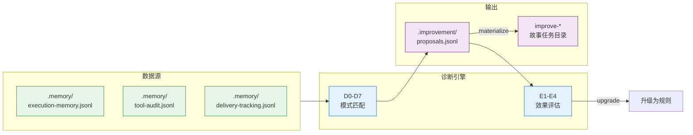

> | v1.0.0 | 2026-05-22 | deepseek-v4-pro | ⏱️ — | 📎 [CLAUDE.md](../../../CLAUDE.md) |

> **导航**: [← YrY-使用场景](./YrY-使用场景.md) · [→ YrY-测试设计](./YrY-测试设计.md) · [→ YrY-安全审计](./YrY-安全审计.md)

[§0 设计决策](#sec0-design) · [§1 D0-D7 诊断引擎](#sec1-diagnosis-engine) · [§2 提案生命周期](#sec2-proposal-lifecycle) · [§3 数据契约](#sec3-data-contract) · [§4 P0 检查清单](#sec4-p0-checklist)

# YrY-技术评审 · rui-proposals

<a id="sec0-design"></a>
## §0 设计决策

### 效果示意



### 基线溯源

| 来源 | 覆盖 |
|------|------|
| 故事任务 §2 FP1 | D0-D7 诊断架构 |
| 故事任务 §2 FP4 | E1-E4 评估模型 |

---

<a id="sec1-diagnosis-engine"></a>
## §1 D0-D7 诊断引擎

> 证据: `skills/rui/proposals.mjs`

| 诊断 | 标签 | 检测模式 | 提案类型 |
|:--:|------|------|:--:|
| D0 | 基线偏离 | CLAUDE.md/agents 与基线对比 | process |
| D1 | 效率退化 | 阶段耗时 > 3x 基线 | refactor |
| D2 | 质量退化 | 阻断率 > 20% | quality |
| D3 | 复杂度增长 | P0 密度 > 2x 基线 | security |
| D4 | 流程退化 | T3 变更占比 > 30% | quality |
| D5 | 依赖退化 | 依赖变更频率异常 | refactor |
| D6 | 文档过时 | 文档版本落后代码 | process |
| D7 | 配置漂移 | 配置与基线不一致 | process |

---

<a id="sec2-proposal-lifecycle"></a>
## §2 提案生命周期

```
generate → list → evaluate → upgrade-candidates → materialize
```

| 命令 | 功能 |
|------|------|
| `generate --story=<name>` | 诊断→生成提案 |
| `list --story=<name>` | 查询提案列表 |
| `evaluate --id=<id>` | E1-E4 效果评估 |
| `upgrade-candidates` | 经验→规则升级候选 |
| `materialize --story=<name>` | 提案→故事任务目录 |

---

<a id="sec3-data-contract"></a>
## §3 数据契约

| 文件 | 格式 | 最小记录数 |
|------|------|:--:|
| execution-memory.jsonl | JSONL 追加 | 3（不足降级） |
| tool-audit.jsonl | JSONL 追加 | — |
| delivery-tracking.jsonl | JSONL 追加 | — |
| proposals.jsonl | JSONL 追加 | — |

---

<a id="sec4-p0-checklist"></a>
## §4 P0 检查清单

| # | 检查项 | 状态 |
|---|--------|:--:|
| 1 | 效果示意 mermaid 图 | ✅ |
| 2 | 基线溯源表 | ✅ |
| 3 | 主要价值 ≥ 4 | ✅ |
| 4 | 回溯链完整 | ✅ |

---

> | 日期 | 变更 | 触发 | 证据 |
> |------|------|------|------|
> | 2026-05-22 | 初始生成 | /rui doc --from-code rui-proposals-doc | skills/rui/proposals.mjs |
