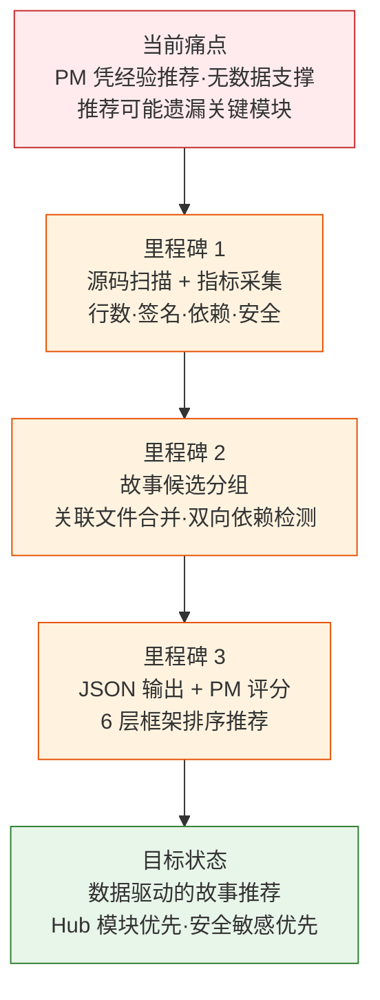
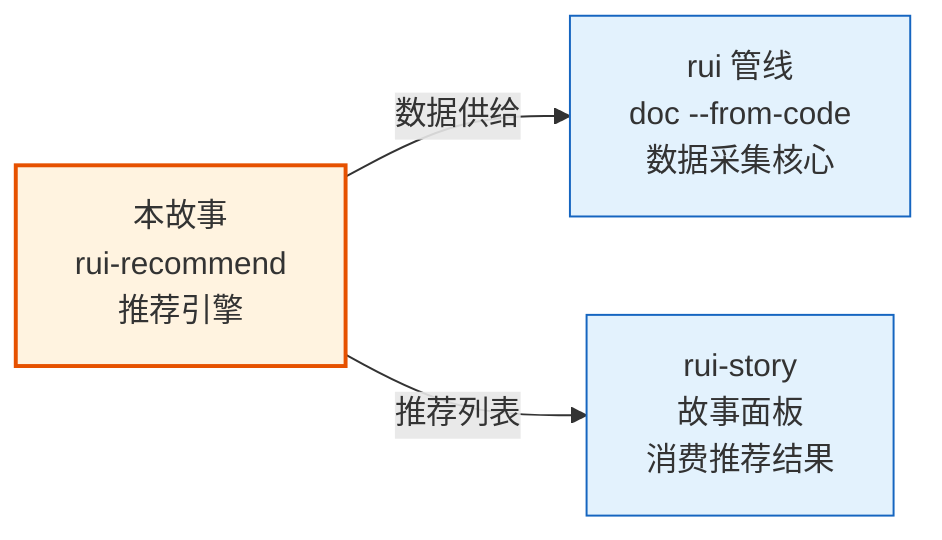

> | v1.0.0 | 2026-05-22 | deepseek-v4-pro | ⏱️ — | 📎 [CLAUDE.md](../../../CLAUDE.md) |

> **导航**: [→ YrY-使用场景](./YrY-使用场景.md)

> **来源引用**: `/rui doc --from-code rui-recommend-doc` · 源文件 `skills/rui/recommend.mjs`

# YrY-故事任务 · rui-recommend

## §0 基线声明

> **问题空间基线**: 本文档定义"做什么(WHAT)"和"为什么(WHY)"。所有后续文档的设计、实现、验证、改进决策均必须可追溯至本文档的具体章节。

### 需求概述

推荐引擎是 rui 管线中 `doc --from-code` 探索模式的数据采集核心。它扫描项目源码，提取每个文件的客观指标（行数、签名、依赖关系、git 变更频率、文档覆盖度、安全信号），输出结构化的故事候选列表，供 PM agent 按 6 层评分框架排序推荐。

### 效果示意

### 主要价值

- 📊 数据驱动：从源码提取 6 维客观指标，替代主观判断
- 🔗 依赖分析：构建导入图，区分 Hub/Leaf 模块，识别影响面
- 🛡️ 安全感知：自动检测用户输入、认证、API 调用等安全信号
- 📋 文档覆盖：检查已有故事文档状态，识别文档缺口
- ⚡ 关联合并：自动将同目录双向依赖的文件合并为一个故事候选

---

## §1 Story

### Story 1: 源码扫描与指标采集

| 字段 | 内容 |
|------|------|
| 作为 | PM agent |
| 我想要 | 自动扫描项目源码并采集每个文件的客观指标 |
| 以便 | 有数据支撑的推荐排序，而非凭经验猜测 |
| 优先级 | P0 |
| 范围边界 | 扫描→分类→提取签名→git指标→文档状态→安全信号 |
| 依赖 | 项目源码可访问，git 仓库存在 |

##### §1.1 User Operations

| # | 操作 | 触发条件 | 操作步骤 | 预期结果 |
|---|------|---------|---------|---------|
| 1 | 扫描项目 | PM 执行 `doc --from-code` | 检测项目类型→扫描源文件→逐文件采集 6 维指标→输出 JSON | 每文件一个候选记录，含完整指标 |
| 2 | 限定类型 | 用户指定 `--type=frontend` | 仅扫描前端文件（.vue/.jsx/.tsx/.svelte） | 过滤后的候选列表 |

---

### Story 2: 故事候选分组与排序

| 字段 | 内容 |
|------|------|
| 作为 | PM agent |
| 我想要 | 将关联文件合并为故事候选并输出可执行命令 |
| 以便 | 每个推荐项是完整的、可独立执行的故事 |
| 优先级 | P0 |
| 范围边界 | 同目录+双向依赖合并→生成 storyName→拼接推荐命令 |

---

## §2 Requirements

### 功能点

| FP# | 描述 | 输入 | 输出 | 错误行为 | 优先级 |
|-----|------|------|------|---------|--------|
| FP1 | 项目类型检测 | 项目根目录 | frontend/backend/fullstack/meta/unknown | 无法判定时返回 unknown | P1 |
| FP2 | 源文件扫描 | 根目录+类型 | 按扩展名过滤的文件列表 | 目录不可达时跳过 | P0 |
| FP3 | 签名提取 | 文件内容 | Props/Events/API Routes 签名列表 | 解析失败返回空数组 | P1 |
| FP4 | 依赖图构建 | 文件列表 | importedBy 映射表 | — | P0 |
| FP5 | Git 指标采集 | 文件路径 | lastModified/authorCount/recentChurn | 非 git 仓库返回 null | P1 |
| FP6 | 文档覆盖检查 | 文件路径+项目名 | docStatus + 已有文件列表 | — | P0 |
| FP7 | 安全信号检测 | 文件内容 | hasUserInput/hasAuth/hasApiCall | — | P0 |
| FP8 | 故事候选合并 | 单文件指标列表 | 按目录+依赖关系合并的故事候选 | — | P1 |

### 业务规则

| R# | 描述 | 校验方式 | 证据级别 |
|----|------|---------|---------|
| R1 | 推荐必须基于脚本输出，不可凭经验 | PM 执行前必须先跑 recommend.mjs | A |
| R2 | 关联文件同目录+双向依赖时自动合并 | groupIntoStories 函数 | A |
| R3 | 安全信号通过正则匹配源码关键词 | securitySignals 函数 | B |

---

## §3 成功标准

| SC# | 描述 | 度量方式 | 目标值 | 优先级 | 关联 FP# |
|-----|------|---------|--------|--------|---------|
| SC1 | 扫描完成输出有效 JSON | `--format=json` 输出可解析 | 所有文件有完整指标 | P0 | FP2-FP7 |
| SC2 | hub 模块被正确识别 | importedByCount ≥ 3 的文件 | 依赖数准确 | P0 | FP4 |
| SC3 | 安全敏感文件被标记 | 含 auth/token/input 关键词 | 布尔信号准确 | P0 | FP7 |

---

## §4 范围边界

### 范围内
| # | 条目 | 关联 FP# |
|---|------|---------|
| 1 | 源码扫描与指标采集 | FP1-FP7 |
| 2 | 故事候选分组与命令生成 | FP8 |

### 范围外
| # | 条目 | 排除原因 | 替代方案 |
|---|------|---------|---------|
| 1 | PM 评分排序 | 属于 PM agent 决策 | PM 读取 JSON 后执行 ranking.md |
| 2 | 文档生成 | 属于 /rui doc | /rui doc --from-code |

---

## §5 AC

| AC# | Given | When | Then | 门禁 |
|-----|-------|------|------|------|
| AC1 | 项目有 17 个源文件 | 执行 `--root=. --format=json` | 输出 17 个候选，每个含 6 维指标 | Gate A |
| AC2 | 某文件含 `API_X_TOKEN` 引用 | 扫描该文件 | security.hasAuth = true | Gate A |
| AC3 | 某文件被 3 个其他文件导入 | 构建依赖图 | importedByCount = 3，标记为 Hub | Gate A |

---

## §6 风险与假设

| # | 风险/假设 | 类型 | 可能性 | 影响 | 缓解策略 | 关联 FP# |
|---|----------|------|--------|------|---------|---------|
| 1 | 项目类型误判导致扫描遗漏 | 风险 | M | M | 默认 unknown 时扫描全部扩展名 | FP1 |
| 2 | 非 git 仓库无 git 指标 | 风险 | M | L | 返回 null，不阻断 | FP5 |
| 3 | 正则签名提取不完整 | 假设 | — | — | 仅作辅助指标，非阻塞 | FP3 |

---

## §7 跨文档索引

| 本文档章节 | 基线内容 | 下游文档编号 | 预期覆盖 | 状态 |
|-----------|---------|-------------|---------|:--:|
| §1 Story 1 | 源码扫描与指标采集 | 03 技术评审 | 扫描管线架构 | 待生成 |
| §2 FP4 | 依赖图构建 | 03 技术评审 | import 解析算法 | 待生成 |
| §2 FP7 | 安全信号检测 | 05 安全审计 | 安全正则覆盖 | 待生成 |

---

> | 日期 | 变更 | 触发 | 证据 |
> |------|------|------|------|
> | 2026-05-22 | 初始生成 | /rui doc --from-code rui-recommend-doc | skills/rui/recommend.mjs |

## 关联故事

| 关联故事 | 关系类型 | 说明 |
|---------|---------|------|
| rui-story | 数据供给 | 推荐引擎为故事面板的 list/recommend 命令提供数据 |
| rui 管线 | 数据供给 | `doc --from-code` 探索模式的数据采集核心 |
