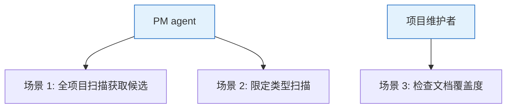
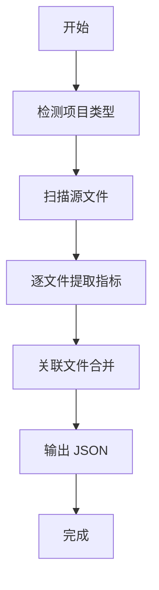

> | v1.0.0 | 2026-05-22 | deepseek-v4-pro | ⏱️ — | 📎 [CLAUDE.md](../../../CLAUDE.md) |

> **导航**: [← YrY-故事任务](./YrY-故事任务.md) · [→ YrY-技术评审](./YrY-技术评审.md)

[§0 基线声明](#sec0-baseline) · [§1 场景全景](#sec1-scenarios) · [§2 场景详述](#sec2-details) · [§3 场景覆盖矩阵](#sec3-matrix) · [§4 评审清单](#sec4-checklist) · [§5 体验基线](#sec5-experience)

# YrY-使用场景 · rui-recommend

## §0 基线声明

> **用户空间基线**: 本文档定义"谁使用(WHO)"和"如何体验(HOW EXPERIENCE)"。

### 主要价值

- 🧩 PM agent 获得数据驱动的推荐依据
- 🔍 项目维护者发现文档缺口
- ⚡ 一次命令完成全项目扫描
- 📊 结构化 JSON 输出可被下游工具消费

---

## §1 场景全景

## §2 场景详述

### 场景 1: 全项目扫描获取故事候选

| 角色 | 触发条件 | 核心目标 |
|------|---------|---------|
| PM agent | `/rui doc --from-code` 探索模式 | 获取所有源文件的客观指标，为推荐排序提供数据 |

| # | 步骤 | 输入 | 系统响应 | 异常分支 |
|---|------|------|---------|---------|
| 1 | 检测类型 | 项目根目录 | 读取 package.json 判定类型 | 无 package.json：返回 unknown |
| 2 | 扫描文件 | 类型对应的扩展名 | 递归遍历目录 | 目录不可达：跳过 |
| 3 | 提取指标 | 文件内容+路径 | 逐文件采集 6 维指标 | 文件不可读：空内容 |
| 4 | 合并候选 | 单文件结果 | 按目录+依赖关系合并 | 无关联：每个文件独立候选 |
| 5 | 输出结果 | 候选列表 | JSON 输出到 stdout | — |

### 场景 2: 限定类型扫描

| 角色 | 触发条件 | 核心目标 |
|------|---------|---------|
| PM agent | 指定 `--type=frontend` | 仅扫描前端文件，缩小推荐范围 |

| # | 步骤 | 输入 | 系统响应 | 异常分支 |
|---|------|------|---------|---------|
| 1 | 限定类型 | `--type=frontend` | 仅使用前端扩展名集合 | 不支持的类型：使用全部扩展名 |
| 2 | 扫描过滤 | 前端扩展名 | 仅 .vue/.jsx/.tsx/.svelte 文件被扫描 | — |

### 场景 3: 检查文档覆盖度

| 角色 | 触发条件 | 核心目标 |
|------|---------|---------|
| 项目维护者 | 想知道哪些模块缺文档 | 查看每个候选的 doc.status 字段 |

| # | 步骤 | 输入 | 系统响应 | 异常分支 |
|---|------|------|---------|---------|
| 1 | 执行扫描 | `--root=.` | 每个候选含 doc.status | 目录不存在：返回空 |
| 2 | 查看覆盖 | JSON 输出 | no_docs/partial/complete | — |

---

## §3 场景覆盖矩阵

| 场景 | FP# | AC# | 实现文档 | 测试文档 | 覆盖状态 |
|------|-----|------|---------|---------|:--:|
| 场景 1: 全项目扫描 | FP1-FP8 | AC1 | 技术评审 §2 | 测试设计 §2.1 | 待生成 |
| 场景 2: 限定类型 | FP2 | — | 技术评审 §2 | 测试设计 §2.2 | 待生成 |
| 场景 3: 文档覆盖检查 | FP6 | — | 技术评审 §4 | 测试设计 §2.3 | 待生成 |

---

## §4 评审清单

| # | 检查项 | 状态 |
|---|--------|:--:|
| 1 | 场景 ≥ 2 | ✅ (3 场景) |
| 2 | 每场景有图 | ✅ |
| 3 | FP 全覆盖 | ✅ |
| 4 | 无技术术语 | ✅ |

---

## §5 体验基线

| 角色 | 核心旅程 | 情感目标 | 成功感知 | 关联场景 |
|------|---------|---------|---------|---------|
| PM agent | 执行扫描→获取数据→排序推荐 | 感到推荐有据可依 | 看到完整的指标 JSON 输出 | 场景 1,2 |
| 项目维护者 | 检查文档覆盖→发现缺口 | 感到项目健康度透明 | 看到 no_docs 标记的文件列表 | 场景 3 |

---

> | 日期 | 变更 | 触发 | 证据 |
> |------|------|------|------|
> | 2026-05-22 | 初始生成 | /rui doc --from-code rui-recommend-doc | skills/rui/recommend.mjs |
