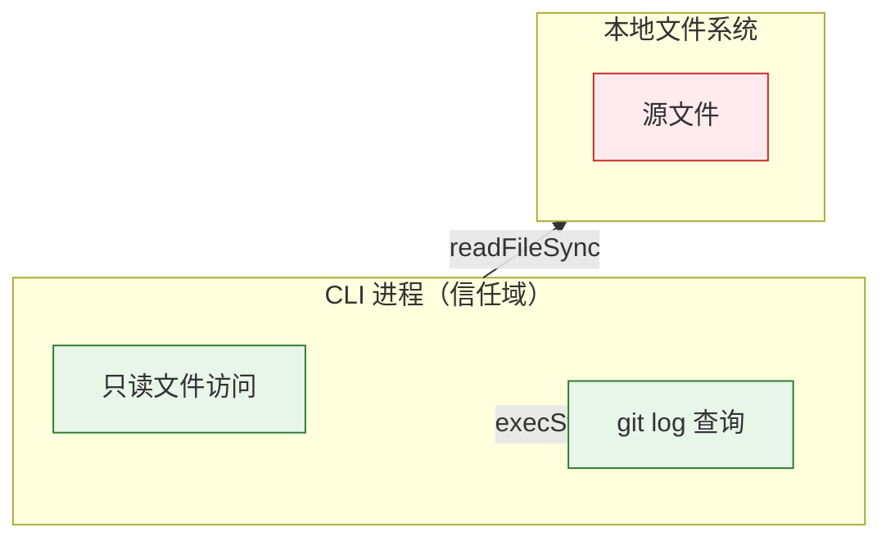

> | v1.0.0 | 2026-05-22 | deepseek-v4-pro | ⏱️ — | 📎 [CLAUDE.md](../../../CLAUDE.md) |

> **导航**: [← YrY-技术评审](./YrY-技术评审.md) · [→ YrY-实施报告](./YrY-实施报告.md)

> **审计独立性**: 本审计由 security agent 独立执行

[§0 基线溯源](#sec0-baseline) · [§1 资产识别](#sec1-assets) · [§2 STRIDE 威胁建模](#sec2-stride) · [§3 信任边界](#sec3-trust) · [§4 合规检查](#sec4-compliance)

# YrY-安全审计 · rui-recommend

## §0 基线溯源

| 来源 | 章节 | 本文档覆盖 |
|------|------|-----------|
| 故事任务 §2 FP7 | 安全信号检测 | §2 STRIDE |
| 技术评审 §3 | 安全信号检测实现 | §1 资产识别 |

### 主要价值

- 🔒 只读工具安全审计：不写文件、不修改源码
- 🛡️ 文件系统访问边界：仅读取项目源文件
- 📋 合规：无网络请求、无凭据操作

---

## §1 资产识别

| 资产 | 类型 | 敏感度 | 存储位置 |
|------|------|:--:|---------|
| 源码内容 | 数据 | 中 | 本地文件系统（只读） |
| 文件路径 | 元数据 | 低 | 扫描结果（内存） |
| Git 历史 | 元数据 | 低 | `git log` 输出（内存） |

---

## §2 STRIDE 威胁建模

### S — 伪装
无认证需求。工具为只读分析，无身份验证。

### T — 篡改
| 威胁 | 可能性 | 影响 | 缓解 |
|------|:--:|:--:|------|
| 源码被外部进程修改 | L | L | 工具仅瞬时读取，窗口极小 |

### I — 信息泄露
| 威胁 | 可能性 | 影响 | 缓解 |
|------|:--:|:--:|------|
| JSON 输出含敏感文件路径 | L | L | 输出为相对路径，非绝对路径 |

### D — 拒绝服务
| 威胁 | 可能性 | 影响 | 缓解 |
|------|:--:|:--:|------|
| 超大项目扫描耗时 | L | L | 扫描限于源文件扩展名，排除 node_modules |

### E — 权限提升
无。工具仅读取文件，不执行任何写入操作。

---

## §3 信任边界

---

## §4 合规检查

| # | 检查项 | 状态 | 证据 |
|---|--------|:--:|------|
| C1 | 密钥不落盘 | ✅ | 工具不写入任何文件 |
| C2 | 只读操作 | ✅ | 仅 readFileSync/readdir/stat |
| C3 | 路径安全 | ✅ | 相对路径输出 |
| C4 | 无网络请求 | ✅ | 无 fetch/HTTP 调用 |
| C5 | 依赖安全 | ✅ | 仅 Node.js 内置模块 |
| C6 | 错误信息安全 | ✅ | 异常仅输出到 stderr |

---

> | 日期 | 变更 | 触发 | 证据 |
> |------|------|------|------|
> | 2026-05-22 | 初始生成 | /rui doc --from-code rui-recommend-doc | skills/rui/recommend.mjs |
