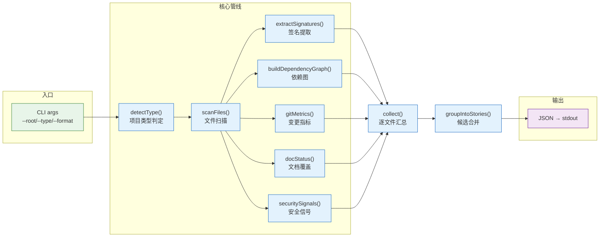
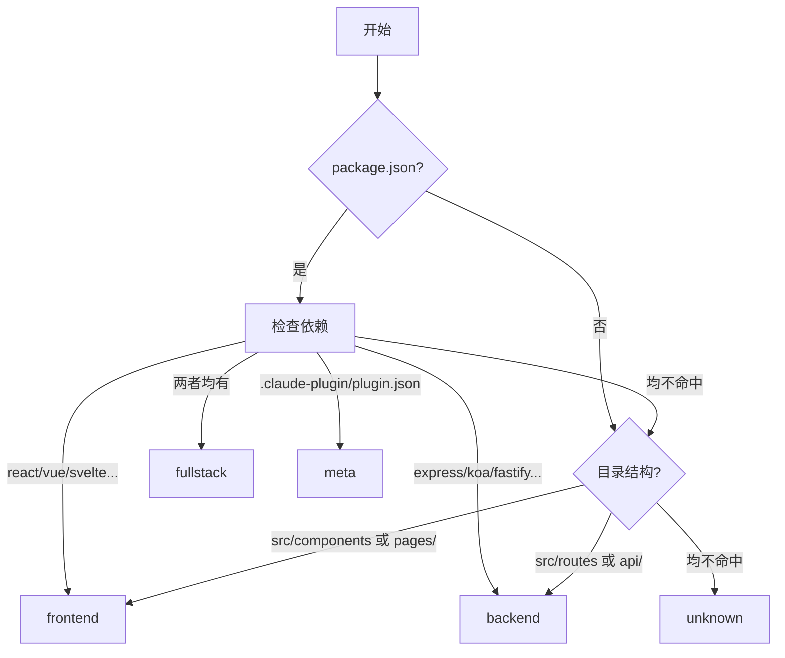

> | v1.0.0 | 2026-05-22 | deepseek-v4-pro | ⏱️ — | 📎 [CLAUDE.md](../../../CLAUDE.md) |

> **导航**: [← YrY-使用场景](./YrY-使用场景.md) · [→ YrY-测试设计](./YrY-测试设计.md) · [→ YrY-安全审计](./YrY-安全审计.md)

[§0 设计决策与任务规划](#sec0-design) · [§1 系统架构](#sec1-architecture) · [§2 依赖分析](#sec2-deps) · [§3 安全信号检测](#sec3-security-signals) · [§4 P0 检查清单](#sec4-p0-checklist)

# YrY-技术评审 · rui-recommend

<a id="sec0-design"></a>
## §0 设计决策与任务规划

### 效果示意



### 基线溯源

| 来源 | 章节 | 本文档覆盖 |
|------|------|-----------|
| 故事任务 §2 FP1 | 项目类型检测 | §1.1 类型判定 |
| 故事任务 §2 FP4 | 依赖图构建 | §2 依赖分析 |
| 故事任务 §2 FP7 | 安全信号检测 | §3 安全检测 |

---

<a id="sec1-architecture"></a>
## §1 系统架构

### 1.1 项目类型判定

> 证据: `skills/rui/recommend.mjs:167-191`



### 1.2 模块职责

| 函数 | 行号 | 职责 |
|------|------|------|
| `detectType()` | 167-191 | 项目类型判定 |
| `scanFiles()` | 215-240 | 递归扫描源文件 |
| `extractSignatures()` | 243-388 | 提取组件/接口签名 |
| `buildDependencyGraph()` | 390-440 | 构建导入依赖图 |
| `gitMetrics()` | 442-487 | 采集 git 变更指标 |
| `docStatus()` | 460-480 | 检查文档覆盖状态 |
| `securitySignals()` | 493-506 | 安全关键词扫描 |
| `collect()` | 509-537 | 逐文件汇总指标 |
| `groupIntoStories()` | 540-620 | 关联文件合并为候选 |

---

<a id="sec2-deps"></a>
## §2 依赖分析

> 证据: `skills/rui/recommend.mjs:390-440`

```
import 语句解析 → 构建 { importer → [importees] } 映射
→ 反转得到 { file → [importers] } 即 importedBy
→ Hub(≥3) / Mid(1-2) / Leaf(0)
```

| 角色 | importedByCount | 推荐优先级 |
|------|:--:|:--:|
| Hub | ≥ 3 | P0（无文档影响面大） |
| Mid | 1-2 | P1 |
| Leaf | 0 | P1/P2 |

---

<a id="sec3-security-signals"></a>
## §3 安全信号检测

> 证据: `skills/rui/recommend.mjs:493-506`

| 信号 | 正则 | 含义 |
|------|------|------|
| hasUserInput | `readline\|prompt\|stdin\|input\|form\|req\.body\|...` | 处理用户输入 |
| hasAuth | `auth\|token\|session\|login\|password\|...` | 涉及认证 |
| hasApiCall | `fetch\|axios\|http\.request\|curl\|api\.\|...` | 调用外部 API |

---

<a id="sec4-p0-checklist"></a>
## §4 P0 检查清单

| # | 检查项 | 状态 |
|---|--------|:--:|
| 1 | 效果示意 mermaid 图 | ✅ |
| 2 | 基线溯源表 | ✅ |
| 3 | 主要价值 ≥ 4 | ✅ |
| 4 | 回溯链完整 | ✅ |

---

> | 日期 | 变更 | 触发 | 证据 |
> |------|------|------|------|
> | 2026-05-22 | 初始生成 | /rui doc --from-code rui-recommend-doc | skills/rui/recommend.mjs |
